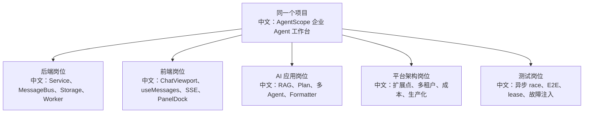

# 按岗位拆分的回答策略

> 适合面试表达的关键词：后端、前端、AI 应用、平台工程、架构、测试、运维、岗位匹配。

---

## 1. 为什么要按岗位拆

同一套 AgentScope 源码，不同岗位关注点完全不同：

```text
后端面试官关心并发、状态一致性、API 契约、Redis、Worker。
前端面试官关心 SSE、状态机、组件拆分、交互恢复、E2E。
AI 应用面试官关心 RAG、Plan、多 Agent、模型适配、成本。
架构面试官关心扩展点、生产化、权限、容量、事故复盘。
```

面试时不要把所有内容一股脑倒出来，要先判断岗位，然后换“主叙事”。

---

## 2. 岗位回答地图



中文解释：

```text
项目不变，突出重点变。你要让面试官听到他关心的信号。
```

---

## 3. 后端开发岗位

### 主线

```text
FastAPI API 契约
-> Service 层编排
-> MessageBus 队列/日志/锁
-> Storage 状态持久化
-> asyncio 取消和后台 worker
```

重点讲：

```text
interrupt 202 + 幂等
session run lease
Redis Pub/Sub / queue / log
IndexWorker lease + heartbeat
Storage record/index/message upsert
finally + shield 保证状态一致
```

一句话项目：

```text
我重点分析的是 Agent 运行平台的后端一致性：如何在多进程和异步取消场景下保证 session 状态、消息流和后台任务不乱。
```

适合引用文档：

```text
20_ChatService运行态与分布式锁.md
29_RAG异步索引Worker与文档状态机.md
31_消息总线键设计与Redis数据结构.md
46_Storage模型与持久化边界.md
49_测试补齐路线与pytest实战清单.md
```

---

## 4. 前端开发岗位

### 主线

```text
URL 选择态
-> ChatViewport 工作台
-> useMessages 合成历史和 SSE
-> MessageBubble 渲染内容块
-> TextInput 控制 send/stop/upload
-> PanelDock / TeamSidebar 展示 Agent 运行态
```

重点讲：

```text
URL 恢复 agent/session/member
SSE 流式事件合成 UI phase
Stop 按钮状态
ConfirmCard HITL
Plan / Permission / Knowledge 面板
工具调用和音频流渲染
Playwright E2E mock SSE
```

一句话项目：

```text
我把 AgentScope Web UI 理解成一个异步 Agent 工作台，前端难点不是聊天框，而是把后端运行态稳定投影成可恢复、可切换、可干预的界面。
```

适合引用文档：

```text
32_前端Chat状态机逐事件回放.md
44_前端组件地图与交互状态细节.md
54_前端E2E测试与Playwright路线.md
```

---

## 5. AI 应用开发岗位

### 主线

```text
用户意图
-> Plan 拆解
-> RAG 检索
-> Tool 调用
-> 多 Agent 分工
-> Formatter 适配模型
-> HITL 控制风险
```

重点讲：

```text
Plan 不是静态 TODO，而是 Agent 通过工具维护任务图。
RAG 不只是向量库，而是 parse/chunk/embedding/retrieve/inject。
多 Agent 通过模板、session、MessageBus 协作。
Formatter 隔离模型协议差异。
HITL 让高风险工具调用可控。
```

一句话项目：

```text
我关注的是如何把 LLM 从问答模型变成可执行任务的 Agent 系统：通过 Plan 管复杂任务，通过 RAG 补知识，通过 Tool 接业务系统，通过 HITL 管风险，通过 Formatter 接多模型。
```

适合引用文档：

```text
24_Plan意图识别与任务图更新机制.md
25_多Agent编排与AgentInvite实现细节.md
34_RAG解析器与分块策略逐源码分析.md
39_模型Formatter与多模型协议适配.md
57_向量检索评估与召回质量优化.md
```

---

## 6. 平台 / 架构岗位

### 主线

```text
create_app 装配
-> 可替换 Storage / MessageBus / Workspace / RAG 组件
-> ResourceAccessPolicy 多租户权限
-> 成本治理和限流
-> 部署形态和事故复盘
```

重点讲：

```text
依赖注入和生命周期管理
扩展点而不是硬改源码
owner-scoped storage + ResourceAccessPolicy
SSE 长连接和 worker 容量
模型成本、RAG 成本、多 Agent 成本
生产事故排查路径
```

一句话项目：

```text
我把 AgentScope 当成一个可嵌入的 Agent 平台来看，重点分析它如何通过 create_app 和抽象接口支持企业级二次开发、权限治理、成本治理和生产部署。
```

适合引用文档：

```text
33_部署形态与生产化清单.md
50_性能瓶颈与容量规划.md
51_二次开发扩展点总览.md
52_生产事故复盘模板.md
55_企业权限与多租户改造方案.md
56_模型成本治理与限流策略.md
```

---

## 7. 测试 / 质量岗位

### 主线

```text
单元测试
-> 服务层状态机
-> 并发和消息测试
-> E2E mock SSE
-> 故障注入
```

重点讲：

```text
asyncio.Event 控制 race
CancelledError 和 finally
duplicate trigger / duplicate document task
lease lost 后停止副作用
SSE start/delta/end 顺序
HITL resume 不丢
上传 pending 到 ready/error
```

一句话项目：

```text
我会围绕异步 Agent 系统真实风险补测试：取消、重复投递、租约、断线恢复、权限确认和后台 worker 崩溃，而不是只测 API happy path。
```

适合引用文档：

```text
38_故障演练与补测清单.md
49_测试补齐路线与pytest实战清单.md
54_前端E2E测试与Playwright路线.md
```

---

## 8. 面试时怎么切换话术

```text
如果对方问“你项目最大难点是什么”：
后端：异步取消和状态一致性。
前端：SSE 事件投影和可恢复工作台。
AI 应用：Plan/RAG/Tool/多 Agent 的协同。
架构：企业扩展点、权限、成本和生产化。
测试：异步 race 和故障恢复测试。
```

最终提醒：

```text
先听岗位，再选主线。你不是背 58 份文档，而是从里面挑最适合当前岗位的 5 个亮点。
```

