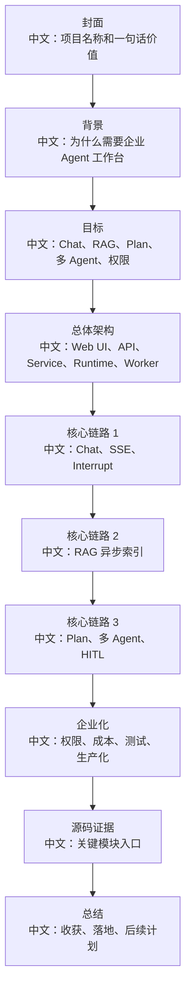
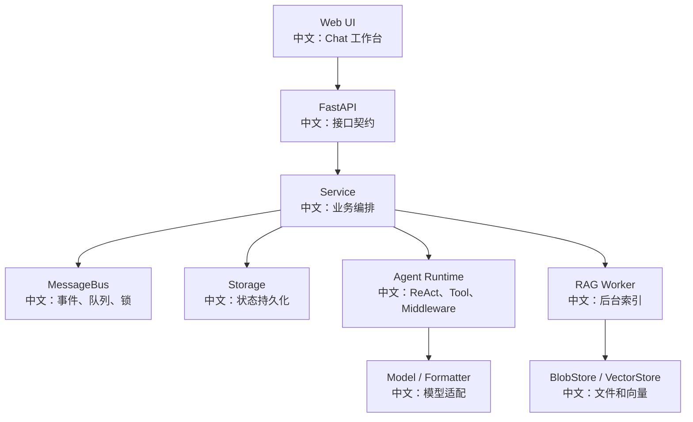

# 项目答辩 PPT 大纲

> 适合面试表达的关键词：项目答辩、PPT、架构讲解、技术亮点、难点、结果、追问。

---

## 1. 使用场景

这份大纲适合：

```text
1. 面试前准备 5-10 分钟项目介绍。
2. 技术分享或答辩。
3. 把源码学习整理成作品集。
4. 让 AI 帮你生成 PPT。
```

建议控制在 10-12 页，不要太长。

---

## 2. PPT 总结构



---

## 3. 第 1 页：封面

标题：

```text
基于 AgentScope 的企业级多 Agent 知识工作台
```

副标题：

```text
从源码驱动学习到可落地的 Agent 平台方案
```

讲稿：

```text
这个项目不是简单调用 LLM API，而是围绕 AgentScope 源码拆解一个完整 Agent 工作台：流式 Chat、RAG、多 Agent、Plan、权限、成本治理和生产化。
```

---

## 4. 第 2 页：背景和问题

内容：

```text
企业知识分散：文档、代码、业务系统、历史经验。
普通聊天助手无法执行任务：只能回答，不能规划、调用工具、协作。
高风险操作需要控制：工具调用、文件写入、命令执行、凭证使用。
生产环境需要可恢复：中断、断线、worker 崩溃、队列积压。
```

讲稿：

```text
我把需求抽象成一个企业 Agent 工作台，而不是单一聊天机器人。
```

---

## 5. 第 3 页：目标能力

表格：

| 能力 | 说明 |
|---|---|
| Chat | 流式输出、历史回放、Stop |
| RAG | 文档上传、异步索引、向量检索 |
| Plan | 复杂任务拆解和状态面板 |
| 多 Agent | leader/worker 分工协作 |
| HITL | 高风险工具调用确认 |
| 权限 | 资源共享、credential 脱敏 |
| 成本 | token budget、限流、fallback |
| 测试 | 异步 race、SSE、lease、E2E |

---

## 6. 第 4 页：总体架构



讲稿：

```text
我重点关注的是每个产品动作如何穿过这张图，而不是孤立看某个函数。
```

---

## 7. 第 5 页：核心链路 Chat / Interrupt

内容：

```text
POST /chat 触发 run。
GET /sessions/{sid}/stream 订阅 SSE。
POST /sessions/{sid}/interrupt 返回 202。
running 走 cancel，parked 走 resume interrupt。
finally 清理状态，SSE 收尾。
```

亮点：

```text
202 Accepted、幂等、协作式取消、Redis Pub/Sub、session lock、finally 清理。
```

---

## 8. 第 6 页：核心链路 RAG

内容：

```text
上传文件 -> BlobStore -> document pending -> index task -> worker lease -> parse/chunk/embedding/vector write -> ready/error。
```

亮点：

```text
上传和索引解耦、BlobStore 与 Storage 分离、lease + heartbeat、分块策略、向量检索评估。
```

---

## 9. 第 7 页：核心链路 Plan / 多 Agent / HITL

内容：

```text
Plan：TaskCreate/TaskUpdate 工具维护任务图。
多 Agent：leader 用模板创建 worker，TeamSay 回报。
HITL：ConfirmCard -> resume trigger -> parked session 恢复。
```

亮点：

```text
Agent 状态可视化、跨 session 协作、权限确认和恢复语义。
```

---

## 10. 第 8 页：企业化能力

内容：

```text
ResourceAccessPolicy：跨 owner 资源共享。
CredentialView：shared credential 脱敏。
Budget Middleware：reply 级 token budget。
E2E：Playwright mock SSE。
生产化：容量、监控、事故复盘。
```

---

## 11. 第 9 页：源码证据

| 模块 | 源码入口 |
|---|---|
| Web UI | `examples/web_ui/frontend/src/pages/chat/` |
| ChatService | `src/agentscope/app/_service/_chat.py` |
| MessageBus | `src/agentscope/app/message_bus/` |
| Storage | `src/agentscope/app/storage/` |
| RAG Worker | `src/agentscope/app/_service/_index_worker.py` |
| Access Policy | `src/agentscope/app/access/_policy.py` |
| Budget | `src/agentscope/middleware/_budget.py` |

讲稿：

```text
我的学习方式是每个结论都回到源码证据，避免只停留在文档层面。
```

---

## 12. 第 10 页：总结

三句话：

```text
1. 我掌握了 AgentScope 从前端工作台到后端运行时的端到端链路。
2. 我能把源码细节翻译成系统设计：异步取消、事件回放、分布式锁、RAG worker、HITL 恢复。
3. 我能基于这些扩展企业能力：多租户、权限、成本治理、测试和生产化。
```

---

## 13. AI 生成 PPT 提示词

```text
请基于本文档生成一份 10 页中文技术答辩 PPT，主题是“基于 AgentScope 的企业级多 Agent 知识工作台”。要求：
1. 每页有标题、3-5 个要点和讲稿。
2. 保留架构图和核心链路图，图中英文术语下面必须有中文说明。
3. 风格偏技术面试答辩，不要营销化。
4. 强调源码证据、系统设计权衡和面试可讲亮点。
5. 输出为 Markdown 幻灯片大纲。
```

