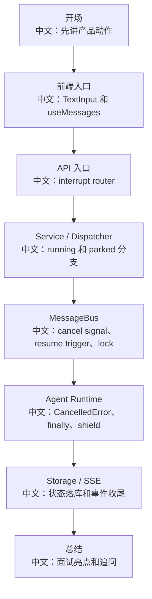

# 源码走读直播讲稿

> 适合面试表达的关键词：源码走读、讲稿、直播、演示顺序、从用户动作到源码、白板讲解。

---

## 1. 走读目标

这份讲稿适合你录视频、技术分享，或者面试时现场讲源码。

目标不是把文件逐行读完，而是：

```text
用一个用户动作串起前端、API、Service、MessageBus、Agent Runtime、Storage 和前端回流。
```

推荐主题：

```text
用户点击 Stop 后，AgentScope 到底发生了什么？
```

因为这个主题能覆盖 API 设计、并发取消、跨进程通信、状态清理和前端状态机。

---

## 2. 直播结构



---

## 3. 开场 2 分钟

讲稿：

```text
今天不按文件树读源码，而是按一个产品动作读：用户点击 Stop。这个动作看起来只是按钮，但背后覆盖了 HTTP 202、幂等、asyncio 协作式取消、跨进程 Pub/Sub、session lock、HITL parked resume、finally 清理和 SSE 状态收尾。
```

白板写：

```text
UI Stop
-> interrupt API
-> cancel / resume
-> Agent cleanup
-> SSE reply_end
```

---

## 4. 前端入口 5 分钟

要打开的文件：

```text
examples/web_ui/frontend/src/components/chat/TextInput.tsx
examples/web_ui/frontend/src/hooks/useMessages.ts
examples/web_ui/frontend/src/components/chat/ChatContent.tsx
```

讲稿：

```text
先看前端。Stop 按钮不是一个单独状态，而是由 phase 决定：idle 时是发送，streaming 时是 Stop，interrupting 时 Stop disabled。这样避免用户重复点击造成多次 interrupt。
```

观察点：

```text
TextInput：按钮状态。
useMessages：调用 interrupt API。
ChatContent：消息区和输入区如何组合。
```

面试表达：

```text
前端没有猜后端状态，而是通过 SSE 和 API 结果把 phase 投影出来。
```

---

## 5. API 入口 5 分钟

要打开的文件：

```text
src/agentscope/app/_router/_session.py
src/agentscope/app/_router/_schema/_session.py
```

讲稿：

```text
接着看后端 API。interrupt 返回 202 Accepted，而不是 200 done。这个选择很关键，因为取消是异步协作过程，HTTP 返回只说明命令已接受，不代表 Agent 已经完成清理。
```

观察点：

```text
路径：POST /sessions/{sid}/interrupt
状态码：202
语义：running、parked、idle 都要可处理
幂等：重复点击不应该破坏状态
```

---

## 6. Service / Dispatcher 10 分钟

要打开的文件：

```text
src/agentscope/app/_service/_session.py
src/agentscope/app/_manager/_cancel_dispatcher.py
src/agentscope/app/_manager/_chat_run_registry.py
src/agentscope/app/_manager/_wakeup_dispatcher.py
```

讲稿：

```text
这里是核心分叉。running session 有本地或远程正在执行的 asyncio task，需要通过 CancelDispatcher 广播取消；parked session 没有运行中的 task，它在等用户确认或外部执行结果，所以要通过 resume trigger 注入 UserInterruptEvent，让 Agent 恢复后自己收尾。
```

白板写：

```text
running：cancel task
parked：enqueue resume interrupt
idle：no-op
```

追问提示：

```text
为什么 wake trigger 忙时可以丢，但 resume trigger 不能丢？
因为 wake 只是提醒 session drain inbox，而 resume 携带用户确认结果。
```

---

## 7. MessageBus 8 分钟

要打开的文件：

```text
src/agentscope/app/message_bus/_base.py
src/agentscope/app/message_bus/_redis_message_bus.py
src/agentscope/app/message_bus/_keys.py
```

讲稿：

```text
MessageBus 在这里不是普通消息队列，它同时承担 pub/sub、queue、event log 和 distributed lock。interrupt 需要跨进程广播，stream 需要事件日志和实时订阅，session run 需要锁保证同一 session 不并发运行。
```

重点：

```text
Pub/Sub：跨进程通知。
Queue：wakeup/resume/index task。
Log：SSE replay。
Lock：session run lease。
```

---

## 8. Agent Runtime 8 分钟

要打开的文件：

```text
src/agentscope/agent/_agent.py
src/agentscope/app/_service/_chat.py
```

讲稿：

```text
Python asyncio 的取消是协作式的。Task.cancel 不是杀线程，而是在 await 点抛 CancelledError。Agent 需要在合适位置传播取消，同时保证关键状态持久化不被打断，这也是 shield 和 finally 的价值。
```

中文解释：

```text
finally：无论成功、异常、取消都要清理。
shield：保护关键持久化，避免取消打断落库。
```

---

## 9. SSE 收尾 5 分钟

要打开的文件：

```text
src/agentscope/app/_router/_session.py
examples/web_ui/frontend/src/api/session.ts
examples/web_ui/frontend/src/hooks/useMessages.ts
```

讲稿：

```text
最后回到前端。后端清理完会发布 reply_end 或状态更新，前端收到事件后把 phase 从 streaming/interrupting 变回 idle。这样用户看到的是完整闭环。
```

---

## 10. 总结 3 分钟

```text
一个 Stop API 背后包含：
1. API 语义：202、幂等、no-op。
2. 并发语义：Task.cancel、CancelledError、finally、shield。
3. 分布式语义：Pub/Sub、queue、lock、resume trigger。
4. 产品语义：前端 phase、Stop disabled、SSE 收尾。
5. 测试语义：running、parked、idle、重复点击、断线恢复。
```

收尾话术：

```text
这就是源码驱动学习的价值：一个按钮能挖出 API 设计、并发编程、分布式系统、前端状态机和工程测试。
```

