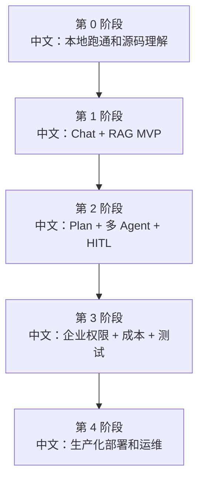

# 二次开发任务清单与里程碑

> 适合面试表达的关键词：二次开发、里程碑、任务拆解、企业落地、MVP、测试、上线、风险控制。

---

## 1. 目标

如果要把 AgentScope 落地成一个企业内部 Agent 工作台，可以分 5 个阶段：

```text
第 0 阶段：源码理解和本地跑通。
第 1 阶段：MVP Chat + RAG。
第 2 阶段：Plan + 多 Agent + HITL。
第 3 阶段：企业权限 + 成本治理 + E2E 测试。
第 4 阶段：生产化部署 + 监控 + 事故恢复。
```

这份文档可以直接给 AI 或团队当任务拆解。

---

## 2. 路线图



---

## 3. 第 0 阶段：源码理解和本地跑通

目标：

```text
能在本地跑起后端和 Web UI，理解核心目录和主链路。
```

任务：

```text
1. 跑通 examples/web_ui。
2. 创建 agent、session，发送一条 chat。
3. 观察 SSE stream。
4. 上传一个知识库文档。
5. 触发一次 Stop。
6. 阅读 00 总纲、01 总索引、48 端到端题集。
```

验收：

```text
能用 5 分钟讲清 Web UI -> API -> ChatService -> MessageBus -> Agent Runtime -> SSE。
```

---

## 4. 第 1 阶段：Chat + RAG MVP

目标：

```text
做一个可用的企业知识问答 MVP。
```

任务：

```text
1. 配置基础模型 credential。
2. 配置 embedding 模型和 vector store。
3. 接入 BlobStore，至少支持 local，生产建议 S3/MinIO。
4. 知识库上传后显示 pending/ready/error。
5. Chat 中支持选择知识库和 top_k / score_threshold。
6. 补 RAG 上传、索引、检索的基本测试。
```

验收：

```text
用户可以上传文档，等待索引完成后，在 Chat 中基于文档回答问题，并能看到引用来源或证据片段。
```

风险：

```text
大文件解析慢。
embedding provider 限流。
chunk 粒度影响召回。
向量维度不一致。
```

---

## 5. 第 2 阶段：Plan + 多 Agent + HITL

目标：

```text
让 Agent 从问答升级为可拆解任务、可协作、可确认风险操作。
```

任务：

```text
1. 开启 Plan 相关工具和面板。
2. 定义 SubAgentTemplate，例如 researcher、coder、reviewer。
3. 验证 AgentCreate 和 TeamSay 链路。
4. 对高风险工具启用 Permission / HITL。
5. 前端展示 ConfirmCard 和 TeamSidebar。
6. 补 HITL resume 和多 Agent 通信测试。
```

验收：

```text
用户给一个复杂任务，leader 能创建计划、分配 worker、等待 worker 回报，并在高风险工具调用前请求用户确认。
```

风险：

```text
worker 过多导致成本暴涨。
任务拆分不稳定。
HITL parked session 恢复失败。
Team 消息路由混乱。
```

---

## 6. 第 3 阶段：企业权限 + 成本 + 测试

目标：

```text
让 MVP 具备企业使用的安全边界和质量保障。
```

任务：

```text
1. 实现 ResourceAccessPolicy，接入组织/项目共享。
2. credential view 脱敏，运行时可信路径使用密钥。
3. 增加 ReplyBudgetControlMiddleware。
4. 限制 RAG top_k、工具输出、worker 数、schedule 数。
5. 设计 Playwright E2E，mock SSE。
6. 补异步 race、lease、interrupt、HITL、RAG worker 测试。
```

验收：

```text
不同用户只能看到自有和被共享的资源；超预算任务能自动收尾；核心用户流程有 E2E 覆盖。
```

风险：

```text
前端隐藏编辑按钮但后端未校验。
shared credential 泄露。
成本归因不清。
E2E flaky。
```

---

## 7. 第 4 阶段：生产化部署和运维

目标：

```text
支持多人使用，有监控、告警、恢复和容量规划。
```

任务：

```text
1. Redis 高可用配置。
2. API 与 IndexWorker 分离部署。
3. BlobStore 使用 S3/MinIO。
4. VectorStore 使用 Qdrant/Milvus/MongoDB 等生产后端。
5. 增加指标：SSE 连接、running session、queue backlog、index error、模型 token。
6. 制定事故恢复手册：Stop 无效、pending 卡住、resume 丢失、schedule 不触发。
```

验收：

```text
系统能承受预期并发，有清晰告警，有手动和自动恢复策略。
```

风险：

```text
Redis 是 Storage/Bus/Lock 多重依赖。
SSE 长连接数过高。
Worker 队列积压。
向量库查询 p95 上升。
模型供应商限流。
```

---

## 8. 任务优先级

| 优先级 | 任务 |
|---|---|
| P0 | 本地跑通、Chat、SSE、Stop、基础 RAG |
| P1 | IndexWorker 监控、HITL、Plan、多 Agent、权限脱敏 |
| P2 | 企业共享、成本治理、Playwright E2E、事故手册 |
| P3 | RAG 评估、rerank、长期记忆、更多模型和工具生态 |

---

## 9. 给 AI 执行的提示词

```text
你是一个熟悉 AgentScope 的高级工程师。请基于 docs/API源码驱动学习/interview/63_二次开发任务清单与里程碑.md 执行二次开发规划。

要求：
1. 先阅读 00_总纲与智能体执行协议.md、01_面试高频亮点总索引.md、48_端到端面试演练题集.md。
2. 按第 0 到第 4 阶段拆分任务，不要跳阶段。
3. 每个任务必须给出源码入口、改动文件、测试方式、验收标准和风险。
4. 所有说明使用中文。
5. 流程图中英文术语下面必须带中文说明。
6. 不要凭空编造项目已有功能，先搜索源码再判断。
```

---

## 10. 面试表达

```text
如果我要把 AgentScope 落地到企业，我会先做 Chat + RAG MVP，再补 Plan、多 Agent 和 HITL，随后做 ResourceAccessPolicy、成本治理和 E2E，最后把 API、Worker、Redis、BlobStore、VectorStore 拆成生产化部署，并补监控和事故恢复。这个路线能先交付业务价值，再逐步补齐企业级安全和可靠性。
```

