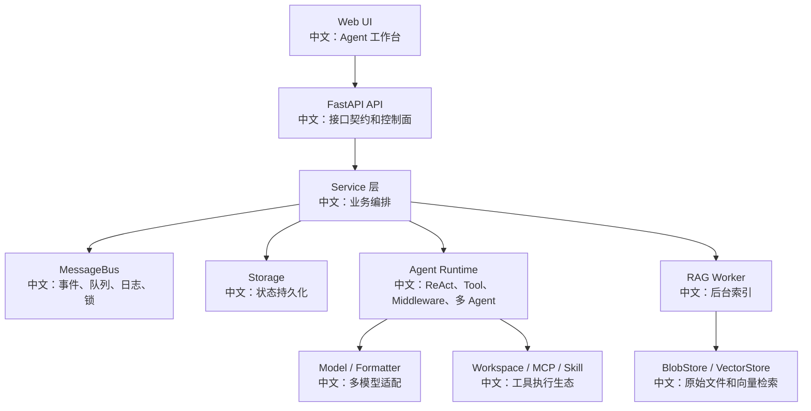

# 项目 README 作品集版

> 适合面试表达的关键词：作品集、README、项目展示、源码学习成果、架构亮点。

---

## AgentScope 企业级多 Agent 知识工作台方案

这是一个基于 AgentScope 源码拆解和二次开发规划的学习型项目。目标不是简单调用 LLM API，而是从源码视角理解并设计一个企业级 Agent 工作台。

---

## 项目目标

```text
构建一个支持流式 Chat、RAG 知识库、多 Agent 协作、Plan 任务管理、HITL 权限确认、定时任务、成本治理和生产化监控的企业 Agent 平台方案。
```

---

## 核心能力

| 能力 | 说明 |
|---|---|
| 流式 Chat | SSE 事件流、历史回放、Stop/Interrupt |
| RAG 知识库 | 上传、异步索引、解析、分块、embedding、向量检索 |
| Plan | Agent 通过任务工具维护任务图 |
| 多 Agent | leader/worker 协作、TeamSay 消息路由 |
| HITL | 高风险工具调用确认和 parked session 恢复 |
| 权限 | ResourceAccessPolicy、READ/EDIT、credential 脱敏 |
| 成本治理 | token budget、fallback/retry 限制、RAG 参数控制 |
| 测试 | 异步 race、SSE mock、worker lease、E2E |
| 生产化 | Redis、BlobStore、VectorStore、Worker、监控和事故复盘 |

---

## 架构图



---

## 重点源码入口

| 模块 | 入口 |
|---|---|
| Web UI | `examples/web_ui/frontend/src/pages/chat/` |
| Chat Service | `src/agentscope/app/_service/_chat.py` |
| Session API | `src/agentscope/app/_router/_session.py` |
| MessageBus | `src/agentscope/app/message_bus/` |
| Storage | `src/agentscope/app/storage/` |
| RAG Worker | `src/agentscope/app/_service/_index_worker.py` |
| BlobStore | `src/agentscope/app/rag/blob_store/` |
| VectorStore | `src/agentscope/rag/_vdb/_vector_store.py` |
| Access Policy | `src/agentscope/app/access/_policy.py` |
| Budget Middleware | `src/agentscope/middleware/_budget.py` |

---

## 技术亮点

### 1. Stop / Interrupt 优雅终止

```text
HTTP 202 + 幂等设计 + running/parked/idle 三态 + asyncio 协作式取消 + finally 清理 + SSE 收尾。
```

### 2. RAG 异步索引

```text
上传和索引解耦。BlobStore 保存原始 bytes，IndexWorker 后台完成 parse、chunk、embedding、vector write，并通过 lease + heartbeat 防止重复处理。
```

### 3. 多 Agent 协作

```text
leader 通过模板创建 worker，worker 有独立 session/state/permission，通过 TeamSay 和 MessageBus 协作。
```

### 4. 企业权限

```text
默认 owner-isolated，跨用户共享通过 ResourceAccessPolicy，READ/EDIT 分离，credential view 脱敏。
```

### 5. 成本治理

```text
ReplyBudgetControlMiddleware 基于 ModelCallEndEvent 统计 token，超预算后注入 HintBlock 并禁止继续调用工具。
```

---

## 文档结构

| 文档 | 说明 |
|---|---|
| `00_总纲与智能体执行协议.md` | 总入口和 AI 执行协议 |
| `01_面试高频亮点总索引.md` | 所有专题索引 |
| `48_端到端面试演练题集.md` | 白板题训练 |
| `58_真实项目落地方案与简历包装.md` | 项目包装 |
| `59_面试一小时速记版.md` | 临场复习 |
| `63_二次开发任务清单与里程碑.md` | 落地路线 |

---

## 面试表达

```text
我基于 AgentScope 做了一套源码驱动的企业 Agent 工作台方案拆解，覆盖 Web UI、HTTP API、Service、MessageBus、Agent Runtime、Storage、RAG Worker 和模型适配。重点研究了 Stop 优雅终止、RAG 异步索引、Plan 任务图、多 Agent 协作、HITL 恢复、企业权限、成本治理和生产化测试。
```

---

## 声明

```text
这是源码学习和方案设计项目，不夸大为独立实现 AgentScope 框架。重点价值在于源码理解、系统设计、二次开发规划和面试表达沉淀。
```

