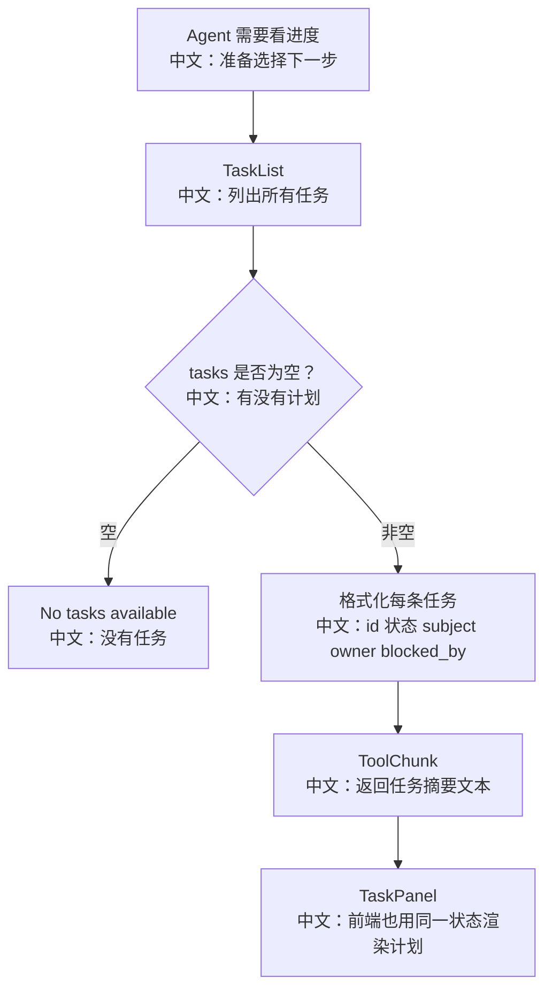

# 任务列表

## 工具

```text
TaskList
```

中文说明：列出当前 AgentState 中所有任务摘要，帮助 Agent 找到下一步应该处理的任务。

## 流程图



## 源码链路

| 层级 | 文件 | 中文说明 |
|---|---|---|
| 工具 | `src/agentscope/tool/_task/_list_task.py` | `TaskList.call` |
| 前端 | `examples/web_ui/frontend/src/components/panel/TaskPanel.tsx` | 可视化展示任务列表 |
| Toolkit | `src/agentscope/app/_service/_toolkit.py` | 默认注入 TaskList |

## 关键代码步骤

```text
if len(tasks) == 0
中文：没有计划时返回 No tasks available。

owner = f"({task.owner})"
中文：如果任务被某个 Agent 领取，列表里展示 owner。

blocked = "[blocked by ...]"
中文：被阻塞任务会标注依赖，提醒 Agent 先处理前置任务。
```

## 和前端的关系

`TaskList` 是给 LLM 看的文本摘要，`TaskPanel` 是给用户看的 UI 投影。两者读取的是同一个 `tasks_context`，只是展示形态不同。

## 面试亮点

1. 计划状态只维护一份，工具和 UI 都从 `AgentState` 读取。
2. 任务列表不负责改状态，属于只读工具，但 `_TaskToolBase` 里统一允许调用。
3. `TaskPanel` 会折叠前面连续完成的任务，避免长计划刷屏。

## 60 秒讲法

`TaskList` 用来让 Agent 查看当前计划概览。它从 `AgentState.tasks_context.tasks` 中读取任务，并输出 id、状态、subject、owner 和 blocked_by。它不修改状态，主要帮助 Agent 在完成一个任务后选择下一个未阻塞任务。
