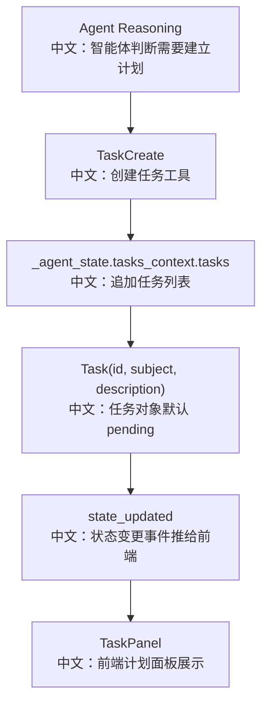

# 创建任务

## 工具

```text
TaskCreate
```

中文说明：让 Agent 在当前 `AgentState.tasks_context` 中创建一条结构化任务，默认状态为 `pending`。

## 先记住什么

`TaskCreate` 不是 HTTP API，也不是数据库任务表。它是 Agent Runtime 内部工具：

```text
LLM 调用 TaskCreate
中文：模型决定需要拆计划。

TaskCreate.call(_agent_state, ...)
中文：工具直接修改当前 AgentState。

StateChangeMiddleware
中文：检测 tasks_context 变化并推 state_updated。

TaskPanel
中文：前端只读展示计划。
```

## 流程图



## 源码链路

| 层级 | 文件 | 中文说明 |
|---|---|---|
| 工具 | `src/agentscope/tool/_task/_create_task.py` | `TaskCreate.call` |
| 基类 | `src/agentscope/tool/_task/_task_tool_base.py` | 任务工具权限和注入属性 |
| 状态模型 | `src/agentscope/state/_task.py` | `Task` 字段定义 |
| Toolkit | `src/agentscope/app/_service/_toolkit.py` | 默认注入 Task 工具 |
| 前端 | `examples/web_ui/frontend/src/components/panel/TaskPanel.tsx` | 计划状态展示 |
| 渲染器 | `examples/web_ui/frontend/src/components/chat/tool-renderers/TaskCreateRenderer.tsx` | 工具调用卡片展示 |

## 关键代码步骤

```text
max_numeric = 0
中文：遍历已有任务 id，找最大数字 id。

next_id = str(max_numeric + 1)
中文：新任务使用顺序数字 id，便于对话中引用。

Task(id=next_id, subject=subject, description=description, metadata=...)
中文：构造任务对象，默认 state=pending。

_agent_state.tasks_context.tasks.append(task)
中文：直接写入当前 AgentState，而不是写数据库表。
```

## 设计亮点

1. 计划和 Agent 推理上下文绑定，刷新、恢复、HITL 后仍能随 session state 继续。
2. id 使用顺序数字，更适合 LLM 和用户在自然语言中引用。
3. metadata 给未来扩展留口，比如优先级、标签、来源等。

## 边界与坑

1. `_agent_state` 必须是 `AgentState`，否则抛 `DeveloperOrientedException`。
2. 非数字历史 id 会被忽略，兼容旧数据或外部注入任务。
3. 创建任务只会追加，不会自动建立依赖关系；依赖由 `TaskUpdate` 补。

## 测试证据

`tests/task_tool_test.py` 覆盖单任务创建、多任务创建、metadata 创建，以及返回 `ToolChunk` 内容。

## 60 秒讲法

`TaskCreate` 是 Plan 模式的入口工具。Agent 觉得任务复杂时，会调用它把一个任务追加到 `AgentState.tasks_context.tasks`，任务默认是 `pending`。状态变化之后，后端通过 `state_updated` 事件把新计划推给前端，`TaskPanel` 只读展示。这种设计让计划成为 Agent 状态的一部分，而不是独立任务系统。
