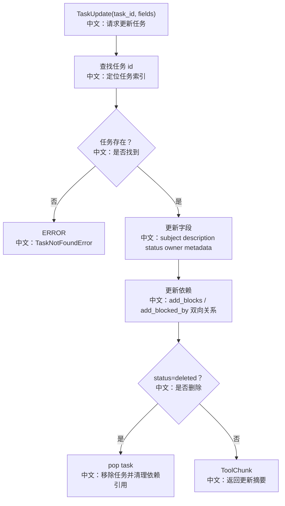

# 更新任务

## 工具

```text
TaskUpdate
```

中文说明：更新任务标题、描述、状态、负责人、metadata 和依赖关系，也可以删除任务。

## 先记住什么

`TaskUpdate` 是 Plan 模式里最重要的工具，因为它让计划从“创建列表”变成“可推进的状态机”：

```text
pending
中文：待处理。

in_progress
中文：正在处理。

completed
中文：已经完成。

deleted
中文：从 tasks_context 中永久移除。
```

## 流程图



## 源码链路

| 层级 | 文件 | 中文说明 |
|---|---|---|
| 工具 | `src/agentscope/tool/_task/_update_task.py` | `TaskUpdate.call` |
| 依赖更新 | `src/agentscope/tool/_task/_update_task.py` | `_update_block_relation` |
| 状态模型 | `src/agentscope/state/_task.py` | `Task.blocks / blocked_by` |
| 测试 | `tests/task_tool_test.py` | 状态更新、删除、依赖更新 |

## 关键代码步骤

```text
task_id 查找 index
中文：先定位任务；找不到就返回 ERROR ToolChunk。

add_blocks
中文：表示当前任务完成前，哪些任务不能开始。

add_blocked_by
中文：表示当前任务被哪些任务阻塞。

_update_block_relation(block_id, blocked_by_id)
中文：双向维护 blocks 和 blocked_by，避免只写一边。

status == "deleted"
中文：直接从 tasks 列表移除，并从其他任务依赖中删除该 id。

metadata key = null
中文：删除对应 metadata；非空则合并更新。
```

## 设计亮点

1. PATCH 风格的工具参数：只传要改的字段。
2. 依赖关系双向维护，便于列表和详情从不同视角展示。
3. `completed` 后提示调用 `TaskList`，引导 Agent 查找下一步。

## 边界与坑

1. `add_blocks` 和 `add_blocked_by` 只接受已存在任务 id，不存在的 id 会被忽略。
2. 没有环检测，复杂依赖需要 Agent 自己保持清晰。
3. `deleted` 会永久移除任务，不是标记为隐藏状态。

## 60 秒讲法

`TaskUpdate` 负责推进计划状态。它根据 `task_id` 找到任务后，可以更新内容、状态、owner、metadata，也能维护任务依赖。依赖通过 `blocks` 和 `blocked_by` 双向写入，删除任务时会清理所有引用。这个工具让 Plan 从静态列表变成可执行、可追踪的状态机。
