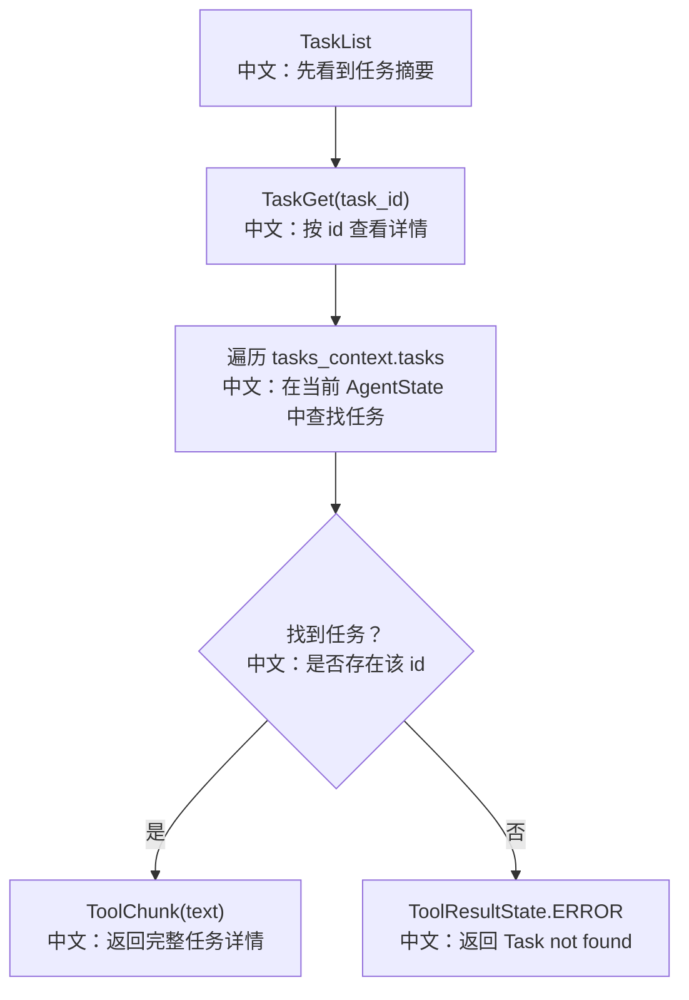

# 查看任务

## 工具

```text
TaskGet
```

中文说明：按任务 id 查看一条任务的完整详情，包括描述、状态、负责人、阻塞关系和 metadata。

## 流程图



## 源码链路

| 层级 | 文件 | 中文说明 |
|---|---|---|
| 工具 | `src/agentscope/tool/_task/_get_task.py` | `TaskGet.call` |
| 状态 | `src/agentscope/state/_task.py` | `Task` 模型 |
| 测试 | `tests/task_tool_test.py` | TaskGet 成功和失败场景 |

## 关键代码步骤

```text
for t in _agent_state.tasks_context.tasks
中文：从当前 AgentState 里线性查找任务。

if t.id == task_id
中文：找到目标任务后组装文本输出。

Blocked by / Blocks
中文：如果有依赖关系，会展示阻塞来源和被阻塞任务。
```

## 面试亮点

`TaskGet` 的存在说明 Plan 不只是“进度条”，而是一个可被 LLM 反复读取、更新、建立依赖的结构化状态。它让 Agent 在开始某个任务前能重新读取最新要求，避免基于过期记忆行动。

## 60 秒讲法

`TaskGet` 根据 `task_id` 从 `AgentState.tasks_context` 读取一条任务详情。如果任务存在，它返回 subject、description、status、owner、blocks、blocked_by 和 metadata；不存在则返回错误态 `ToolChunk`。它主要服务于长任务中的“先读最新任务，再执行”的工作流。
