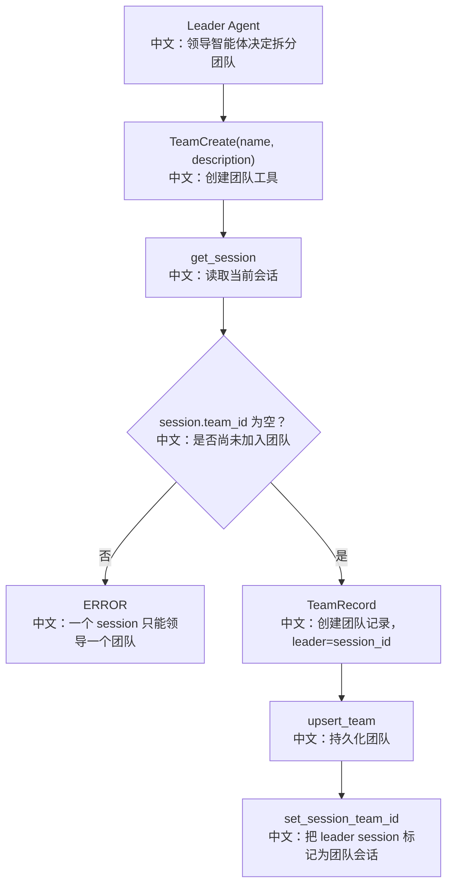

# 创建团队

## 工具

```text
TeamCreate
```

中文说明：由当前 session 创建一个团队，并把当前 session 标记为 leader session。

## 先记住什么

Team 不是进程内对象，而是持久化记录：

```text
TeamRecord.session_id
中文：记录 leader session。

SessionRecord.team_id
中文：把 leader session 挂到 team 上。

TeamData.members
中文：记录 worker 成员，后续由 AgentCreate 或 AgentInvite 写入。
```

## 流程图



## 源码链路

| 层级 | 文件 | 中文说明 |
|---|---|---|
| 工具 | `src/agentscope/app/_tool/_team_create.py` | `TeamCreate.__call__` |
| 基类 | `src/agentscope/app/_tool/_team_tool_base.py` | 注入 storage/message_bus/workspace_manager |
| 数据模型 | `src/agentscope/app/storage/_model/_team.py` | `TeamRecord`、`TeamData` |
| Toolkit | `src/agentscope/app/_service/_toolkit.py` | 非 worker 会话挂载 leader 工具 |
| 前端 | `examples/web_ui/frontend/src/components/team/TeamSidebar.tsx` | 团队创建后展示 leader/member 结构 |

## 关键代码步骤

```text
session = storage.get_session(...)
中文：确认当前 session 存在。

if session.team_id is not None
中文：防止同一个 session 同时领导多个团队。

TeamRecord(user_id, session_id=self._session_id, data=TeamData(...))
中文：team 的 leader 是 session 级别，不是 agent 级别。

storage.set_session_team_id(..., team.id)
中文：把 leader session 和 team 关联。
```

## 面试亮点

1. leader 是 session，而不是 AgentRecord。一个 Agent 可以有多个 session，不同 session 可以有不同运行上下文。
2. 工具运行时再检查 precondition，即使工具被挂到非 team session 也不会写坏状态。
3. team 的 description 会成为成员系统提示词的一部分，让所有成员共享团队目标。

## 测试证据

`tests/service_team_tools_test.py::TestTeamCreate` 覆盖创建成功和重复创建失败。

## 60 秒讲法

`TeamCreate` 会创建 `TeamRecord`，并把当前 session 写到 `TeamRecord.session_id` 作为 leader。然后它调用 `set_session_team_id` 把当前 session 标记为属于这个 team。团队关系是 session 级的，这样同一个 Agent 的不同会话可以有不同团队上下文。
