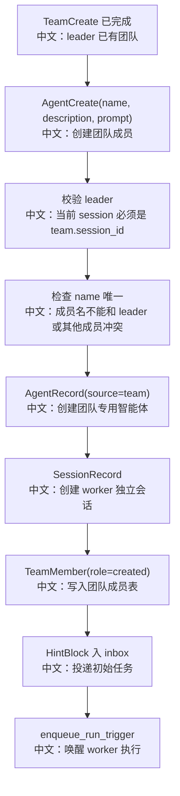

# 创建团队成员

## 工具

```text
AgentCreate
```

中文说明：在当前 leader 所属团队中创建一个新的 worker Agent 和 worker Session，并立即投递初始任务。

## 先记住什么

`AgentCreate` 是“创建新子智能体”，不是复用已有智能体：

```text
AgentRecord(source="team")
中文：新建团队专用 worker agent，普通 Agent 列表里会隐藏。

SessionRecord(team_id=team.id)
中文：为 worker 创建独立会话。

HintBlock + inbox + wakeup
中文：把初始任务投递给 worker 并唤醒运行。
```

## 流程图



## 源码链路

| 层级 | 文件 | 中文说明 |
|---|---|---|
| 工具 | `src/agentscope/app/_tool/_agent_create.py` | `AgentCreate.__call__` |
| 模板 | `src/agentscope/app/_tool/_agent_create.py` | `SubAgentTemplate`、默认 worker prompt |
| 权限合并 | `src/agentscope/app/_tool/_agent_create.py` | `_merge_leader_permissions` |
| 数据模型 | `src/agentscope/app/storage/_model/_team.py` | `TeamMember(role="created")` |
| 通信 | `src/agentscope/app/_bus_ops.py` | `enqueue_run_trigger` 唤醒 |

## 关键代码步骤

```text
team.session_id == self._session_id
中文：只有 leader session 可以创建成员。

if "@" in name
中文：拒绝 @，避免和 AgentInvite 的 <name>@<handle> 路由格式冲突。

AgentRecord(source="team")
中文：worker 是团队临时资产，删除团队时会被删除。

SessionConfig(workspace_id=leader.workspace_id, chat_model_config=leader.model)
中文：worker 默认继承 leader 的 workspace 和模型配置。

TeamMember(role="created")
中文：标记该成员由 AgentCreate 创建，TeamDelete 时整 Agent 删除。

queue_push(inbox(worker_session.id), HintBlock)
中文：初始 prompt 不是普通函数调用，而是写入 worker inbox。
```

## 设计亮点

1. 每个 worker 是独立 agent/session，所以有独立上下文、状态、消息流和中断能力。
2. `SubAgentTemplate` 可以定制 worker 的系统提示词、权限上下文和任务上下文。
3. 权限继承不是无脑复制，`_merge_leader_permissions` 按模板 flag 合并 leader 的权限模式、规则和工作目录。

## 边界与坑

1. 非 leader 调用会返回 ERROR。
2. 成员名必须团队内唯一，包括 leader 名。
3. 创建后 worker 会立即运行，所以 leader 不应该马上再用 `TeamSay` 重复下发同一任务。

## 测试证据

`tests/service_team_tools_test.py::TestAgentCreate` 覆盖 worker 创建、初始 inbox/wakeup、非 leader 拒绝、成员名冲突、模板权限继承等场景。

## 60 秒讲法

`AgentCreate` 在 team 里创建一个全新的 worker。它会校验当前 session 是 leader，然后创建 `source="team"` 的 `AgentRecord` 和独立 `SessionRecord`，把成员写入 `TeamMember(role="created")`，最后通过 MessageBus inbox 投递初始任务并唤醒 worker。删除 team 时，这类成员会连 AgentRecord 一起删除。
