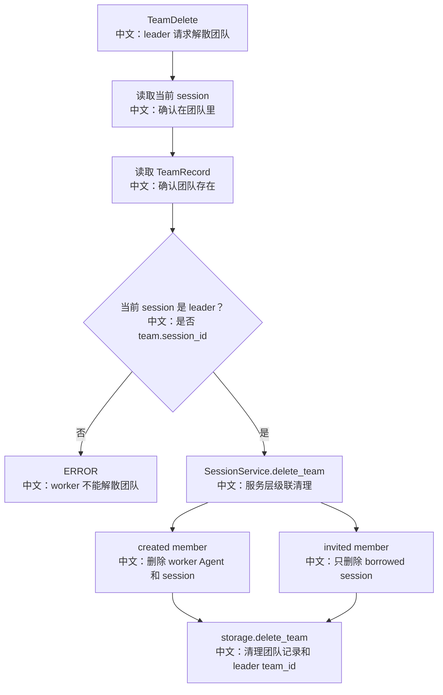

# 删除团队

## 工具

```text
TeamDelete
```

中文说明：解散当前 leader session 所领导的团队，清理成员、会话、MessageBus 状态，并保留 leader session。

## 流程图



## 源码链路

| 层级 | 文件 | 中文说明 |
|---|---|---|
| 工具 | `src/agentscope/app/_tool/_team_delete.py` | `TeamDelete.__call__` |
| 服务 | `src/agentscope/app/_service/_session.py` | `SessionService.delete_team` |
| 存储 | `src/agentscope/app/storage/_redis_storage.py` | `delete_team` 角色感知清理 |
| 数据模型 | `src/agentscope/app/storage/_model/_team.py` | `TeamMember.role` |

## 关键代码步骤

```text
team.session_id != self._session_id
中文：只有 leader session 能删除团队。

SessionService.delete_team(user_id, team.id)
中文：先处理取消运行和 bus purge，因为 storage 不能操作 MessageBus。

role == "created"
中文：AgentCreate 创建的 worker 随团队删除，调用 delete_agent。

role == "invited"
中文：AgentInvite 借来的 Agent 只删 borrowed session，保留原 AgentRecord。

storage.delete_team
中文：最终清理 TeamRecord、team index，并清空 leader session 的 team_id。
```

## 设计亮点

1. 删除是角色感知的：created 和 invited 生命周期不同。
2. 服务层负责 cancel/bus purge，存储层负责记录和索引清理，职责分开。
3. 清理逻辑尽量幂等：服务层和存储层可能重复走成员列表，但重复删除应是 no-op。

## 边界与坑

1. worker 调用 TeamDelete 会被拒绝。
2. TeamDelete 不删除 leader session，只让它脱离团队。
3. invited Agent 的其他 session 和 AgentRecord 必须保留，否则会破坏用户资产。

## 测试证据

`tests/service_team_tools_test.py` 覆盖解散团队、worker 拒绝、created 成员删除、invited 成员保留。

## 60 秒讲法

`TeamDelete` 只能由 leader session 调用。它通过 `SessionService.delete_team` 级联清理成员：`created` 成员是团队临时 worker，会删除整个 Agent；`invited` 成员是借来的已有 Agent，只删除 team-scoped session。最后存储层清理 TeamRecord，并把 leader session 的 `team_id` 清空。
