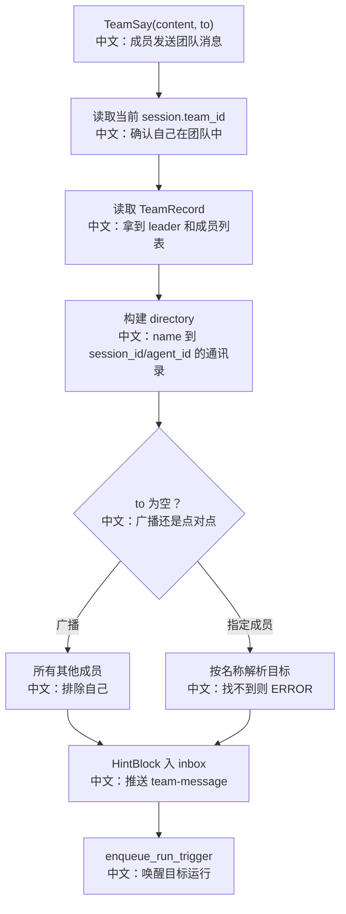

# 团队发言

## 工具

```text
TeamSay
```

中文说明：在团队成员之间发送消息，可以发给指定成员，也可以广播给除自己之外的所有成员。

## 先记住什么

`TeamSay` 是多 Agent 通信的核心：

```text
不是直接调用另一个 Agent。
中文：不会同步进入对方 Python 对象。

是写入目标 session inbox。
中文：消息通过 MessageBus 进入对方会话。

再 enqueue_run_trigger。
中文：唤醒目标 session 异步运行。
```

## 流程图



## 源码链路

| 层级 | 文件 | 中文说明 |
|---|---|---|
| 工具 | `src/agentscope/app/_tool/_team_say.py` | `TeamSay.__call__` |
| 通信 | `src/agentscope/app/message_bus` | `MessageBusKeys.inbox` |
| 唤醒 | `src/agentscope/app/_bus_ops.py` | `enqueue_run_trigger` |
| 成员迁移 | `src/agentscope/app/storage/_utils.py` | `_ensure_team_members` |
| 前端 | `examples/web_ui/frontend/src/components/team/TeamSidebar.tsx` | 团队成员导航 |

## 关键代码步骤

```text
directory[leader_name] = (leader_session.id, leader_session.agent_id)
中文：leader 也在通讯录里。

for member in members
中文：遍历 TeamMember，读取成员 AgentRecord。

if member.role == "invited"
中文：展示名使用 "<name>@<handle>"，避免和 created 成员重名。

to is None
中文：广播给除自己之外所有成员。

HintBlock(hint="<team-message from=...>")
中文：对方看到的是团队消息提示块，而不是普通用户直接输入。

queue_push(inbox(sid), payload)
中文：写入目标 session inbox。
```

## 设计亮点

1. 通信是持久化队列 + 唤醒，不依赖同进程内存对象。
2. leader 和 worker 看到的工具描述不同：leader 被提醒不要轮询，worker 被提醒完成后必须汇报。
3. 路由按展示名而不是 agent_id，方便 LLM 自然调用；invited 成员用 `name@handle` 解决冲突。

## 边界与坑

1. 不在团队里调用会 ERROR。
2. 不能给自己发消息。
3. 指定成员名不存在会返回已知成员列表。
4. TeamSay 是并发安全工具，但仍依赖 session 运行锁保证目标会话串行处理。

## 测试证据

`tests/service_team_tools_test.py` 覆盖广播、点对点发送、无 team 拒绝、未知成员拒绝、invited 成员路由到 borrowed session 等。

## 60 秒讲法

`TeamSay` 是团队通信总线。它从 storage 读取 team，构建成员名到 `(session_id, agent_id)` 的通讯录，然后把 `<team-message>` 包成 `HintBlock` 写入目标 session 的 inbox，并通过 `enqueue_run_trigger` 唤醒目标运行。这样多 Agent 通信可跨进程、可恢复、可观察。
