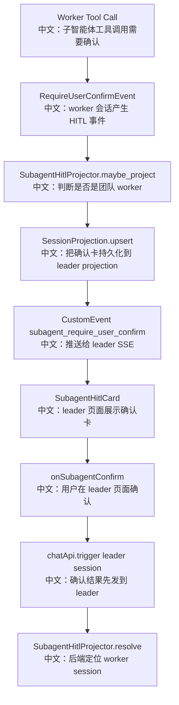

# 子智能体人工确认投影器

## 组件

```text
SubagentHitlProjector
```

中文说明：当团队 worker session 触发 HITL 确认时，把确认卡投影到 leader session 的事件流，让用户不用切到 worker 页面也能确认。

## 先记住什么

这是多 Agent 产品体验里的关键设计：

```text
真实等待点在 worker session。
中文：worker 自己的 tool call 进入 ASKING。

展示卡片投影到 leader session。
中文：leader UI 能看到子智能体确认请求。

用户确认仍发给 leader front door。
中文：后端通过 projection resolve 找到 worker session。
```

## 流程图



## 源码链路

| 层级 | 文件 | 中文说明 |
|---|---|---|
| 投影器 | `src/agentscope/app/_service/_projectors/_subagent_hitl.py` | `SubagentHitlProjector` |
| 投影存储 | `src/agentscope/app/_service/_session_projection.py` | `SessionProjection` |
| 事件调用 | `src/agentscope/app/_service/_chat.py` | ChatService 调用 projectors |
| 前端 Hook | `examples/web_ui/frontend/src/hooks/useMessages.ts` | 接收投影事件并确认 |
| 前端组件 | `examples/web_ui/frontend/src/components/chat/SubagentHitlCard.tsx` | 展示子智能体确认卡 |

## 关键代码步骤

```text
if not session_record.team_id
中文：非团队 session 不投影。

team.session_id == session_record.id
中文：leader 自己的 HITL 不投影，因为 leader UI 本来就能看到。

RequireUserConfirmEvent / RequireExternalExecutionEvent
中文：这些事件会生成 pending card。

projection.upsert(leader_sid, "subagent_hitl", entry_id, payload)
中文：把卡片写入 leader session 的 projection registry。

projection.publish(leader_sid, "subagent_require_user_confirm", payload)
中文：通过 leader session 的 SSE 实时推给前端。

ReplyEndEvent / UserConfirmResultEvent
中文：确认完成或回复结束时删除投影卡，并推 clear 事件。
```

## 设计亮点

1. 权威状态仍在 worker session，projection 只是 UI 镜像。
2. 投影没有 TTL，因为用户可能很久之后才确认；过期清理由 reconcile-on-read 兜底。
3. `SessionProjection` 是通用机制，HITL 只是一个 strategy，未来可复用到进度、错误、外部执行等跨 session UI。
4. ChatService 捕获 projector 异常，投影失败不应该拖垮 worker 的实际运行。

## 和 Web UI 的关系

```text
useMessages 收到 subagent_require_user_confirm
中文：把 payload 放入 subagentHitl state。

ChatViewport footerSlot
中文：在聊天底部渲染 SubagentHitlCard。

SubagentHitlCard
中文：复用 ConfirmCard，展示是哪位 worker 请求确认。

onSubagentConfirm
中文：确认结果 POST 到 leader session，由后端转发给 worker。
```

## 边界与坑

1. leader 自己的 HITL 不走投影，避免重复显示。
2. worker run 结束时用 `ReplyEndEvent` 清理卡片，因为 resume continuation 不一定重新通过 stream 发布结果事件。
3. 删除 leader 或 worker session 时，需要 purge/drop projection，避免残留确认卡。

## 测试证据

`tests/service_subagent_hitl_projector_test.py` 覆盖 worker HITL 投影、leader 不投影、确认结果清理、reply end 清理、projection 存储等场景。

## 60 秒讲法

`SubagentHitlProjector` 解决的是多 Agent 下用户只看 leader 页面却要处理 worker HITL 的问题。worker 触发确认时，真实 ASKING 状态仍在 worker session；投影器把一张确认卡写到 leader session 的 projection registry，并通过 `subagent_require_user_confirm` 事件推给 leader UI。用户确认时先 POST 到 leader，后端再根据 projection 找到对应 worker session 转发结果。
