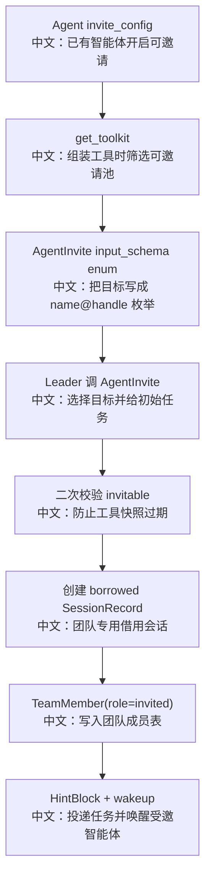

# 邀请智能体

## 工具

```text
AgentInvite
```

中文说明：把一个已有的、允许被邀请的用户智能体借入当前团队，为它创建一个团队专用 session。

## 先记住什么

`AgentInvite` 和 `AgentCreate` 的区别是面试重点：

```text
AgentCreate
中文：创建新的团队 worker，AgentRecord 是 source=team，团队删除时一起删除。

AgentInvite
中文：复用已有用户 AgentRecord，只创建 team-scoped SessionRecord，团队删除时保留原 Agent。
```

## 流程图



## 源码链路

| 层级 | 文件 | 中文说明 |
|---|---|---|
| 工具 | `src/agentscope/app/_tool/_agent_invite.py` | `AgentInvite.__call__` |
| Agent 配置 | `src/agentscope/app/storage/_model/_agent.py` | `InviteConfig` |
| Toolkit 装配 | `src/agentscope/app/_service/_toolkit.py` | 根据可见且 invitable 的 Agent 注入 AgentInvite |
| Team 数据 | `src/agentscope/app/storage/_model/_team.py` | `TeamMember(role="invited")` |
| TeamSay 路由 | `src/agentscope/app/_tool/_team_say.py` | invited 成员用 `name@handle` 路由 |

## 关键代码步骤

```text
visible_agents = resource_access_service.list_resource(..., AGENT)
中文：可邀请池来自当前用户可见 Agent，包括未来可扩展的共享 Agent。

invitable=True and invite_description 非空
中文：只有明确允许邀请且有说明的 Agent 才进入工具枚举。

target = "<name>@<agent_id[:8]>"
中文：工具 schema 用 name+短 handle 避免名称冲突。

fresh = storage.get_agent(...)
中文：调用时重新读取 Agent，防止用户刚刚关闭邀请。

upsert_session(agent_id=invited.id)
中文：不创建新 AgentRecord，只给已有 Agent 新建团队会话。

AgentState()
中文：borrowed session 使用新的权限上下文和任务上下文，避免跨 workspace 污染。
```

## 设计亮点

1. 复用用户已有专长 Agent，避免每个团队都临时创建重复角色。
2. AgentRecord 和 team-scoped SessionRecord 分离，保证主会话与团队会话互不污染。
3. 权限上下文故意重置，不继承 leader，也不继承被邀请 Agent 的主 session，避免错误复用文件路径和用户确认。
4. 工具 schema 中的目标枚举来自可邀请池快照，但调用时二次校验，处理竞态。

## 边界与坑

1. 没有可邀请 Agent 时，不挂载 `AgentInvite`，避免空 enum 破坏工具 schema。
2. 同一个 team 不能重复邀请同一个 Agent。
3. 借用成员的展示名是 `name@handle`，TeamSay 也按这个名字路由。
4. TeamDelete 只删除 borrowed session，不删除原始 AgentRecord。

## 测试证据

`tests/service_team_tools_test.py` 覆盖邀请成功、格式错误、未知 handle、关闭邀请后的 stale snapshot、非 leader 拒绝、重复邀请、TeamDelete 保留 invited Agent 等。

## 60 秒讲法

`AgentInvite` 是把已有 Agent 借进团队。它不会创建新的 AgentRecord，而是在目标 Agent 上创建一个 team-scoped SessionRecord，并写入 `TeamMember(role="invited")`。团队删除时只删这个借用 session，保留原 Agent 和主会话。权限上下文会重新开始，这是为了避免把 leader workspace 的文件权限和确认规则带到受邀 Agent 的环境里。
