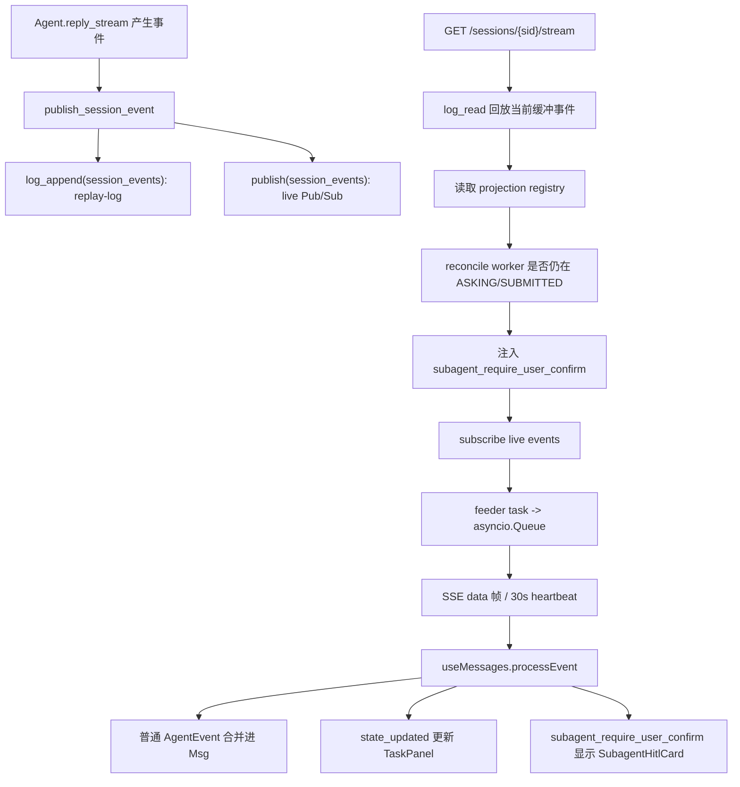

# 专题二：Stream 与事件系统（面试友好版）

> 这版是阅读样板：先帮你抓住“能讲出去的亮点”，再回到源码证据。目标不是把每一行代码都铺开，而是让你能在 30 秒、3 分钟、15 分钟三个层次都讲清楚。

---

## 0. 这篇先记住什么

如果只背 3 个点，就背这 3 个：

1. **SSE 不是单纯长连接，而是 replay-log + live Pub/Sub 的组合。**  
   前端刷新或晚连接时，先读 replay-log 补已有事件，再接 live 订阅继续收增量。

2. **HITL 投影卡不放 replay-log，而放持久 projection registry。**  
   因为 replay-log 会按 run 被 trim，leader 自己的消息历史里也没有 worker 的确认卡；所以 worker parked 时，leader 刷新必须从 projection 重新注入卡片。

3. **当前实现有一个可以主动讲的改进点。**  
   `log_read` 之后到 `subscribe` 真正建立之前存在竞态窗口。生产级优化可以在订阅建立后用 last replay id 二次补读，或者把 subscribe-ready 和 replay cursor 合并成更严格的协议。

---

## 1. 一句话讲清楚

`GET /sessions/{sid}/stream` 是 AgentScope 的事件回流通道：后端把 Agent 运行事件同时写入 replay-log 和 live Pub/Sub，SSE 端点先回放已有事件，再订阅实时事件；同时对多 Agent 的 HITL 确认卡做 projection 注入，让 leader 页面刷新后仍能看到 worker 正在等待的确认。

面试开场可以这样说：

> 我会把它理解成一个“可重连的实时事件投递层”。普通流式 token 走 replay-log + Pub/Sub，跨 session 的 HITL 卡走持久 projection。这个设计把实时性、刷新恢复、多 Agent UI 投影拆开处理，边界比较清楚。

---

## 2. 产品画面

用户在 Web UI 里看到的是一个连续聊天界面，但后端其实有很多事件类型：

- 模型正在输出文本，前端要逐字/逐段渲染；
- 工具调用开始、参数增量、工具结果结束，都要合并进同一条 assistant 消息；
- Plan 更新不是普通消息，而是 `state_updated` 这类 `CustomEvent`，要推到右侧任务面板；
- 多 Agent 场景下，worker 要用户确认工具调用，但确认卡要显示在 leader 页面；
- 页面刷新后，不能只靠当前 live 连接，否则刷新瞬间之前的事件会丢。

所以这个接口解决的不是“怎么推 token”这么简单，而是：

```text
Agent runtime event
  → 后端事件总线
  → 可回放 + 实时推送
  → 前端按事件类型分发
  → 聊天气泡 / Plan 面板 / Team HITL 卡分别更新
```

---

## 3. 主流程图



---

## 4. 核心设计拆解

### 4.1 为什么不是只用 Pub/Sub

Pub/Sub 的问题是“只给当前在线订阅者”。如果前端刷新页面，新的 SSE 连接建立之前已经产生的事件就收不到。

所以 AgentScope 用了双写：

```text
publish_session_event
  ├─ log_append: 给晚到/重连的客户端回放
  └─ publish: 给当前在线客户端实时推送
```

这个设计的关键词是：**实时性靠 Pub/Sub，恢复靠 replay-log。**

### 4.2 为什么 HITL 卡不进 replay-log

多 Agent 里有一个特殊场景：worker 卡在工具确认上，但用户看的是 leader 页面。

如果把这个确认卡只放 replay-log，会有两个问题：

- replay-log 是当前 run 的事件缓冲，run 结束后会被 trim，不适合长期挂起；
- worker 的 HITL 卡不是 leader 自己的消息历史，leader 刷新后不能从普通 Msg 历史里恢复。

所以源码在 SSE 端点里单独从 `SessionProjection` 读取 projected HITL entry，再调用 `_worker_still_asking` 去 worker session 的真实状态里核对。

这个设计可以总结成：

> projection 是 UI 镜像，不是权威状态；worker session 的 `state.context` 才是 SSOT。每次读取 projection 都要 reconcile，避免确认卡消失或残留。

### 4.3 为什么要 feeder task + queue

SSE 主循环既要等 live event，也要定期发 heartbeat。如果直接对 async generator 做 `wait_for(__anext__())`，超时取消可能让 generator 卡在 running 状态，后续不好 `aclose()`。

所以实现拆成两层：

- feeder task 专门读 `message_bus.subscribe(...)`；
- 主循环从 `asyncio.Queue` 读事件；
- 30 秒读不到就发 `:\n\n` 心跳。

这是一个很工程化的细节，面试时可以讲成：**用 queue 解耦订阅生命周期和 SSE 输出节奏。**

---

## 5. 源码证据

后端主入口：

- `src/agentscope/app/_router/_session.py`
- 函数：`stream_session_events`
- 核心区间：`_sse_generator`

关键步骤：

```text
1. log_read(MessageBusKeys.session_events(session_id))
2. projection.list(session_id, SubagentHitlProjector.KIND)
3. _worker_still_asking(...) 做 reconcile
4. message_bus.subscribe(MessageBusKeys.session_events(session_id))
5. asyncio.wait_for(queue.get(), timeout=_HEARTBEAT_INTERVAL_SECS)
```

前端消费：

- `examples/web_ui/frontend/src/hooks/useMessages.ts`
- `processEvent`

关键分发：

```text
CustomEvent("team_updated")                 -> onTeamUpdated()
CustomEvent("state_updated")                -> onStateUpdated(value)
CustomEvent("subagent_require_user_confirm")-> setSubagentHitl(...)
ReplyStartEvent                             -> 新建 AssistantMsg + phase=streaming
ReplyEndEvent                               -> phase=idle
其它 AgentEvent                              -> appendEvent(currentReply)
```

---

## 6. 边界与坑

### 6.1 replay-log 不是长期历史

replay-log 是为了补“当前运行期间或近期连接切换”的事件，不是消息数据库。长期历史要看 storage 里的 messages 和 session state。

这一点很重要，因为如果面试官问“页面隔很久再回来怎么办”，不能回答“靠 replay-log 保证所有历史”。更准确是：

> 历史消息靠 storage 恢复，正在发生的增量靠 replay-log + live SSE 衔接。

### 6.2 当前 read -> subscribe 有竞态窗口

当前 SSE 端点顺序是：

```text
log_read replay
projection 注入 HITL 卡
subscribe live
```

这意味着：如果某个事件刚好发生在 `log_read` 之后、`subscribe` 建立之前，它已经不会出现在这次 replay 结果里，也可能赶不上当前 live subscription。

这不是文档要回避的问题，反而是亮点：

> 能看出这个窗口，说明你不是只会复述源码，而是在做系统设计审查。

可改进方案：

```text
方案 A：log_read 后记录 last_entry_id，subscribe ready 后再 log_read(since=last_entry_id) 补一次。
方案 B：先建立 subscription，确认 ready 后再读 replay，并用 _entry_id 去重。
方案 C：让 SSE 协议支持 cursor，由客户端带 Last-Event-ID 或服务端维护严格 cursor。
```

### 6.3 10 秒 interrupt timer 不是事件恢复机制

前端 interrupt 的 10 秒 timer 只是防止 UI 卡在 `interrupting`，不是补事件、不是数据一致性保障。

更准确的表述：

> ReplyEndEvent 正常到达时驱动 phase 回 idle；如果终止事件丢失，前端 timer 只做 UI 兜底，避免按钮状态卡死。

---

## 7. 面试问答

### Q1：为什么用 SSE，不用 WebSocket？

SSE 是 server-to-client 单向流，正好匹配 Agent 事件回流；它基于 HTTP，部署和代理穿透更简单。用户输入、确认、中断这些 client-to-server 行为已经有 REST API，所以不一定需要 WebSocket 的全双工复杂度。

### Q2：replay-log 和 Pub/Sub 分别解决什么？

Pub/Sub 解决实时性，只给当前在线订阅者；replay-log 解决晚到订阅和短暂重连，让客户端先补已经产生的事件，再接 live。

### Q3：HITL 确认卡为什么单独用 projection？

因为 worker 的确认卡要显示在 leader 页面，但它不是 leader 的消息历史；同时 replay-log 会被 trim，不适合长期保存 pending 卡。projection 是 leader UI 的持久镜像，读取时再回 worker session 校验是否仍在等待。

### Q4：这个实现有没有可靠性问题？

有一个细节要注意：当前是先 replay 再 subscribe，中间有竞态窗口。可以通过 subscribe ready 后二次补读 replay，或用 cursor/Last-Event-ID 机制修复。这个问题不是架构方向错，而是衔接协议可以更严谨。

### Q5：前端如何区分普通消息和 UI 状态事件？

`useMessages.processEvent` 先判断 `event.type === CUSTOM`。`state_updated` 给 Plan/Permission 面板，`team_updated` 触发 team refetch，`subagent_require_user_confirm` 更新 leader 页面底部的确认卡；普通 AgentEvent 才会 append 到当前 assistant 消息。

---

## 8. 白板版 60 秒讲法

```text
我会把 AgentScope 的 stream 设计拆成三层：

第一层是事件生产：Agent.reply_stream 产出的事件通过 publish_session_event 双写，
一份进 replay-log，一份进 live Pub/Sub。

第二层是 SSE 拼接：GET /sessions/{sid}/stream 先 log_read 回放，再注入
多 Agent 的 HITL projection，最后 subscribe live，并用 30 秒 heartbeat 保活。

第三层是前端分发：useMessages 根据事件类型处理。普通事件合并成 assistant Msg，
CustomEvent 则更新 Team、Plan、Subagent HITL 卡。

这个设计的亮点是把实时推送、刷新恢复、跨 session UI 投影分开建模。
但我也会补一句：当前 read replay 到 subscribe live 之间有竞态窗口，
生产级可以用 last_entry_id 二次补读或 cursor 协议修掉。
```

---

## 9. 记忆卡片

| 关键词 | 你要记住的表达 |
|---|---|
| replay-log | 给晚到/重连的 SSE 客户端补事件，不是长期历史 |
| Pub/Sub | 给当前在线连接实时推事件，无历史 |
| projection | leader UI 的 HITL 镜像，权威状态仍在 worker session |
| reconcile-on-read | 每次注入卡片前重新确认 worker 是否仍在 ASKING/SUBMITTED |
| heartbeat | 30 秒 `:\n\n` 防代理静默断连 |
| feeder queue | 解耦 subscribe generator 和 SSE 输出循环 |
| 改进点 | read replay -> subscribe live 有竞态窗口，可二次补读 |

---

## 10. 这篇的学习任务

读源码时按这个顺序走：

1. 先读 `publish_session_event`，确认事件为什么会双写。
2. 再读 `stream_session_events._sse_generator`，画出 replay / projection / live 三段。
3. 再读 `useMessages.processEvent`，确认 `CustomEvent` 为什么不进 Msg。
4. 最后专门思考 read -> subscribe 的竞态窗口，写出你自己的修复方案。

读完以后你应该能回答：

- 为什么这个接口能支撑刷新恢复？
- 为什么 HITL 卡不应该存在普通消息历史？
- 如果让你增强可靠性，你会改哪里？
