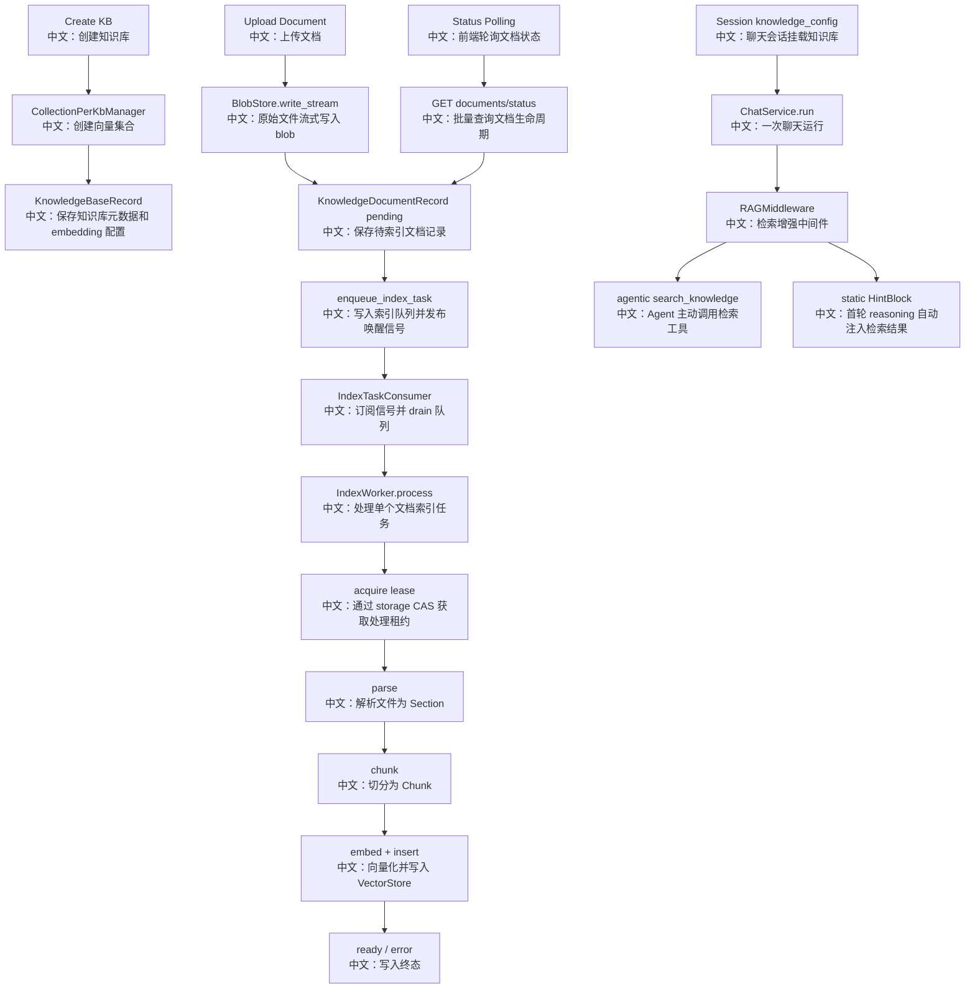

# 专题六：知识库与检索增强生成

> 这一篇要把 RAG 当成一套完整工程链路来读：知识库创建决定 embedding 维度和向量集合，文档上传只完成字节落盘和任务入队，异步 worker 负责解析、切块、向量化和写入，Web UI 通过状态轮询展示进度，ChatService 在运行时把知识库装配成 `RAGMiddleware`。

---

## 0. 这篇先记住什么

如果只背 5 个点，就背这 5 个：

1. **上传接口不做重活。**  
   `POST /knowledge_bases/{id}/documents` 只写 BlobStore、创建 `pending` 文档记录、推送索引任务，然后返回 `201`。

2. **索引是异步 worker pipeline。**  
   `IndexWorker` 按 `pending -> parsing -> chunking -> indexing -> ready/error` 推进状态，前端通过 status polling 看进度。

3. **lease 是跨进程去重的核心。**  
   多个 worker 或 sweeper 重复投递同一个 document 没关系，真正处理前要先通过 storage CAS 拿 lease。

4. **BlobStore、Storage、VectorStore 分别解决不同问题。**  
   BlobStore 存原始文件，Storage 存知识库和文档生命周期，VectorStore 存 chunk 向量和相似度检索结果。

5. **RAG 运行时不是上传接口直接触发，而是在 ChatService 装配。**  
   Session 的 `knowledge_config` 决定挂哪些知识库，ChatService 解析为 `KnowledgeBase` handle，再加入 `RAGMiddleware`。

---

## 1. 一句话讲清楚

AgentScope 的知识库系统把 RAG 拆成两条链路：**离线索引链路**负责把文件可靠地变成向量库里的 chunk，**在线检索链路**负责在聊天运行时把知识库变成 Agent 可用的搜索工具或自动注入上下文。

面试开场可以这样说：

> 我会把它分成“上传索引”和“运行时检索”两部分。上传时 API 只负责落 blob、建 pending 记录、入队，worker 用 lease 抢占任务并完成 parse、chunk、embed、insert。运行时 ChatService 根据 Session 的 knowledge_config 解析知识库，挂上 RAGMiddleware，agentic 模式给 Agent 一个 search_knowledge 工具，static 模式在首轮 reasoning 自动检索并注入 HintBlock。

---

## 2. 产品场景

用户在 Web UI 里的体验可以拆成三段：

```text
第一段：创建知识库
  中文：选择 embedding credential、model、dimension，后端创建向量集合和知识库记录。

第二段：上传文档
  中文：浏览器用 XHR 上传文件，前端展示字节级上传进度；后端返回 document_id 后，进度切换到索引状态。

第三段：聊天挂载知识库
  中文：用户在聊天页 Knowledge 面板勾选知识库，Session 保存 knowledge_config；下一次 Chat run 装配 RAGMiddleware。
```

所以不要把 RAG 理解成“一个 search API”。完整产品链路是：

```text
知识库资源管理
  -> 文档上传和异步索引
  -> 前端状态轮询
  -> Session 级知识库挂载
  -> ChatService 运行时装配
  -> Agent 检索或自动注入
```

---

## 3. 主流程图



---

## 4. 源码链路

### 4.1 Router：HTTP 层保持薄

核心文件：

- `src/agentscope/app/_router/_knowledge_base.py`
- `src/agentscope/app/_router/_schema/_knowledge_base.py`

Router 主要做三件事：

```text
1. 定义端点和请求响应模型。
   中文：比如 CreateKnowledgeBaseRequest、KnowledgeDocumentView、SearchKnowledgeBaseResponse。

2. 从 Depends 注入 user_id、KnowledgeBaseService、KnowledgeBaseManager、parser registry。
   中文：权限、服务、索引能力都通过依赖注入进入。

3. 把请求转给 service 或 manager。
   中文：业务编排不写在 router 里，router 只做 DTO 转换。
```

### 4.2 创建知识库：embedding 维度和 collection 固定

核心文件：

- `src/agentscope/app/rag/knowledge_base_manager/_collection_per_kb.py`

关键步骤：

```text
1. 创建 KnowledgeBaseRecord。
   中文：记录 name、description、embedding_model_config、collection_name。

2. collection_name = "kb_<record.id>"。
   中文：每个知识库一个独立向量集合。

3. vector_store.create_collection(name, dimensions)。
   中文：向量集合维度由创建时选择的 embedding model 决定。

4. storage.upsert_knowledge_base(user_id, record)。
   中文：知识库元数据进入 storage。

5. 如果 storage 写失败，补偿删除刚创建的向量集合。
   中文：避免向量库遗留孤儿 collection。
```

这里的面试点是：**embedding model 配置创建后不能随便改，因为改模型或维度会让已有向量全部失效。**

### 4.3 上传文档：同步请求只做登记

核心文件：

- `src/agentscope/app/_service/_knowledge_base.py`
- `src/agentscope/app/rag/blob_store/_local.py`
- `src/agentscope/app/_bus_ops.py`

`KnowledgeBaseService.register_document` 的关键步骤：

```text
1. _require_edit(user_id, knowledge_base_id)
   中文：上传文档是写操作，必须有 edit 权限。

2. blob_store.write_stream(key, stream)
   中文：把 UploadFile.file 流式写入 BlobStore，避免整个文件常驻请求内存。

3. 创建 KnowledgeDocumentRecord，默认 status = pending。
   中文：pending 表示 bytes 已落地，等待 worker 处理。

4. storage.upsert_knowledge_document(owner_id, record)
   中文：文档生命周期状态进入 storage。

5. enqueue_index_task(bus, owner_id, knowledge_base_id, document_id)
   中文：先 queue_push，再 publish signal，唤醒消费者。
```

如果 storage 写失败，会 best-effort 删除刚写的 blob，避免孤儿文件。

### 4.4 索引消费者：signal + durable queue

核心文件：

- `src/agentscope/app/_service/_index_task_consumer.py`
- `src/agentscope/app/message_bus/_keys.py`

关键设计：

```text
1. 生产者调用 queue_push(index_tasks_queue)。
   中文：任务进入持久队列。

2. 生产者再 publish(index_tasks_signal)。
   中文：唤醒当前在线的 consumer。

3. IndexTaskConsumer 订阅 signal。
   中文：收到信号后 drain 队列。

4. 对每个 entry create_task(worker.process(...))。
   中文：consumer 不阻塞在慢索引上，worker 自己用 semaphore 控并发。
```

这和聊天 wakeup dispatcher 的设计很像：**队列保证不丢任务，signal 保证尽快处理。**

### 4.5 IndexWorker：lease 保护的异步索引 pipeline

核心文件：

- `src/agentscope/app/_service/_index_worker.py`
- `src/agentscope/app/storage/_base.py`
- `src/agentscope/app/storage/_model/_knowledge_document.py`

文档生命周期：

```text
pending
  中文：上传完成，等待 worker。

parsing
  中文：worker 正在解析文件 bytes。

chunking
  中文：解析后的 Section 正在切块。

indexing
  中文：chunk 正在 embedding 并写入 VectorStore。

ready
  中文：索引完成，可以检索。

error
  中文：索引失败，error 字段保存脱敏错误信息。
```

worker 处理步骤：

```text
1. acquire_knowledge_document_lease(...)
   中文：通过 storage CAS 获取文档处理权，拿不到说明别的 worker 正在处理。

2. 创建 pipeline_task 和 heartbeat_task。
   中文：pipeline 做索引，heartbeat 定期续租。

3. parsing 阶段读取 blob 并调用 parser。
   中文：根据 content_type 或文件名推断 media type。

4. chunking 阶段调用 chunker.chunk(sections)。
   中文：把解析结果切成适合 embedding 的块。

5. indexing 阶段 get_knowledge 并 insert_document。
   中文：构建 KnowledgeBase runtime，把 chunk 写进向量库。

6. 成功标记 ready，失败标记 error，finally 释放 lease。
   中文：终态和租约清理都在 worker 里完成。
```

### 4.6 Sweeper：崩溃恢复

核心文件：

- `src/agentscope/app/_service/_index_sweeper.py`

Sweeper 找两类卡住的文档：

```text
expired lease
  中文：非终态文档有 processing_node，但 lease_expires_at 已经过期，说明 worker 可能挂了。

orphan pending
  中文：pending 太久还没被 worker 拾取，可能是 upload 后进程在入队或消费前失败。
```

找到后重新 `enqueue_index_task`。重复入队是安全的，因为真正处理前还要拿 lease。

### 4.7 运行时装配：ChatService + RAGMiddleware

核心文件：

- `src/agentscope/app/_service/_chat.py`
- `src/agentscope/middleware/_rag.py`

ChatService 的 RAG 装配步骤：

```text
1. 读取 session_record.config.knowledge_config。
   中文：Session 决定挂载哪些知识库，以及 RAG 参数。

2. 对每个 kb_id 调 access.resolve_knowledge_base。
   中文：支持自己拥有的知识库，也支持共享知识库。

3. knowledge_base_manager.get_knowledge(owner_id, kb_id)。
   中文：拿到带 embedding model、vector store、collection 的 KnowledgeBase runtime。

4. middlewares.append(RAGMiddleware(...))。
   中文：RAG 作为 Agent middleware 参与运行。
```

RAGMiddleware 有两种模式：

```text
agentic
  中文：暴露 search_knowledge 工具，让 Agent 自己决定是否检索。

static
  中文：在每次 reply 的第一轮 reasoning 自动检索，把结果作为 HintBlock 注入上下文。
```

---

## 5. 设计亮点

### 5.1 上传进度和索引进度分离

前端 `uploadDocumentXhr` 用 XHR 是为了拿到 byte-level upload progress。上传成功后，服务端返回 `document_id` 和 `pending`，之后进度来自 `GET /documents/status`。

这意味着：

```text
uploading
  中文：浏览器到后端的文件传输进度。

pending / parsing / chunking / indexing
  中文：后端异步索引进度。
```

这是很好的产品细节，用户不会误以为“文件传完就已经可检索”。

### 5.2 队列 + signal 兼顾可靠和实时

只用 Pub/Sub 会丢离线任务，只用队列可能响应慢。这里用：

```text
queue_push
  中文：任务持久化，worker 稍后能 drain。

publish signal
  中文：在线 worker 立刻醒来处理。
```

### 5.3 lease 让重复投递变安全

upload、sweeper、多个 worker 都可能让同一个 document 被重复投递。系统没有追求“队列里绝对只有一条任务”，而是在处理前用 storage CAS lease 保证同一时间只有一个 worker 真正索引。

这是典型分布式系统 trade-off：

```text
允许 at-least-once dispatch
  中文：任务可以重复投递。

依赖 lease 做 exactly-one-active-worker
  中文：同一时刻只有一个 worker 有处理权。
```

### 5.4 RAGMiddleware 支持异构知识库

每个 `KnowledgeBase` handle 自己带 embedding model 和 collection，`RAGMiddleware` 可以 fan-out 搜多个知识库，即使它们来自不同 embedding 配置。合并时按 score 排序，这里也带来一个边界：不同 embedding 模型的 raw score 不一定严格可比。

---

## 6. 边界与坑

### 6.1 文档列表来自 storage，不来自 vector store

`list_documents` 读的是 storage 中的 `KnowledgeDocumentRecord`。这是对的，因为 pending、parsing、error 这些状态在 vector store 里没有表示。

### 6.2 删除文档的顺序有取舍

`delete_document` 的顺序是：

```text
1. knowledge.delete_document(document_id)
   中文：先删向量库里的 chunks。

2. storage.delete_knowledge_document(...)
   中文：再删文档记录。

3. blob_store.delete(blob_uri)
   中文：最后清理原始文件。
```

如果第一步失败，用户还能重试，记录和 blob 还在。如果后两步失败，可能留下少量孤儿数据，需要后续清理。

### 6.3 static RAG 注入默认不持久

`RAGMiddleware` static 模式会注入 HintBlock，但默认 `persist_hint=False`，reasoning 后会把 hint 从上下文移除。这样可以减少上下文污染，但 UI 仍可通过 HintBlockEvent 展示匹配片段。

### 6.4 不同 embedding score 不一定可直接比较

`_search_across` 会并发搜索多个知识库，然后按 raw score 合并排序。对于不同 embedding 模型，分数尺度可能不同。生产级可以考虑 rank fusion，比如 RRF。

### 6.5 worker 取消不是 HTTP 取消

用户取消浏览器上传只能在上传阶段 abort XHR。服务端已经返回 document_id 后，索引由 worker 接管，前端取消按钮不再中断 worker。要停止后续可见影响，应走删除文档接口。

---

## 7. 面试问答

### Q1：为什么文档上传不直接在请求里解析和向量化？

因为解析、切块、embedding 和写向量库可能很慢，也容易受大文件、CPU、第三方 parser、embedding API 限流影响。同步做会拖长 HTTP 请求、放大超时和重试问题。AgentScope 把上传和索引解耦：请求只落 blob、建 pending 记录、入队，worker 异步处理。

### Q2：BlobStore、Storage、VectorStore 分别存什么？

BlobStore 存原始文件 bytes；Storage 存知识库元数据和文档生命周期，包括 status、error、chunk_count、lease；VectorStore 存已经 embedding 的 chunks，用于相似度检索。

### Q3：为什么需要 lease？

因为索引任务是 at-least-once 投递，upload 和 sweeper 都可能重复入队，多 worker 也可能同时看到任务。lease 用 storage CAS 保证只有一个 worker 能处理该文档。worker 还会 heartbeat 续租，丢失 lease 时会取消 pipeline，避免重复写向量库。

### Q4：前端为什么要轮询 status？

索引是后端异步任务，上传请求返回时文档通常还是 `pending`。前端通过 `GET /documents/status?ids=...` 批量轮询非终态文档，把 `parsing/chunking/indexing/ready/error` 展示出来。

### Q5：RAGMiddleware 的 agentic 和 static 有什么区别？

agentic 模式给 Agent 一个 `search_knowledge` 工具，由 Agent 判断何时检索；static 模式在每次 reply 的第一轮 reasoning 自动用用户输入检索，并把结果作为 HintBlock 注入上下文。agentic 更灵活，static 更稳定但可能增加无用检索。

### Q6：如果一个知识库被删除或共享权限被撤销，Chat run 会怎样？

ChatService 装配时会逐个解析 `knowledge_config` 里的 kb_id。如果某个知识库解析失败，会记录日志并跳过，剩余知识库仍可继续装配，避免整个聊天因为一个失效 KB 失败。

---

## 8. 60 秒讲法

```text
AgentScope 的 RAG 可以拆成离线索引和在线检索两条链路。

创建知识库时，CollectionPerKbManager 会按 embedding model 的维度创建一个向量集合，并把 embedding_model_config 固定到 KnowledgeBaseRecord 里。
上传文档时，HTTP 请求只把文件流式写入 BlobStore，创建 pending 的 KnowledgeDocumentRecord，然后 enqueue_index_task，返回 document_id。

真正的索引由 IndexTaskConsumer 和 IndexWorker 完成。consumer 监听 signal 并 drain 持久队列，worker 先用 storage CAS 拿 lease，再把文档推进 parsing、chunking、indexing、ready 或 error。heartbeat 负责续租，sweeper 负责把 expired lease 或 orphan pending 重新入队。

前端把上传和索引分成两段进度：XHR 显示上传字节进度，返回 document_id 后用 status polling 显示 pending/parsing/chunking/indexing。

运行时，ChatService 读取 Session 的 knowledge_config，解析每个知识库为 KnowledgeBase handle，再挂上 RAGMiddleware。agentic 模式暴露 search_knowledge 工具，static 模式自动检索并注入 HintBlock。
这套设计的亮点是解耦、可恢复、可横向扩 worker，并且把 RAG 作为 middleware 接到 Agent loop 里。
```

---

## 9. 学习任务

按这个顺序读源码：

1. 先读 `_knowledge_base.py` router，列出所有 `/knowledge_bases` 端点。
2. 再读 `KnowledgeBaseService.register_document`，画出上传后端流程。
3. 再读 `_bus_ops.enqueue_index_task` 和 `IndexTaskConsumer`，理解 queue + signal。
4. 再读 `IndexWorker.process` 和 `_run_pipeline`，画出 lease、heartbeat、状态机。
5. 再读 `IndexSweeper`，理解崩溃恢复。
6. 再读 `UploadContext` 和 `useDocumentStatusPolling`，理解前端状态如何合并。
7. 最后读 `ChatService` 的 RAG 装配和 `RAGMiddleware` 的 agentic/static 模式。

读完后你应该能回答：

- 为什么上传和索引要异步解耦？
- 文档状态机每个状态代表什么？
- lease 如何避免多 worker 重复写向量库？
- 前端如何区分上传进度和索引进度？
- RAGMiddleware 如何进入一次 Chat run？
- agentic RAG 和 static RAG 的产品取舍是什么？
