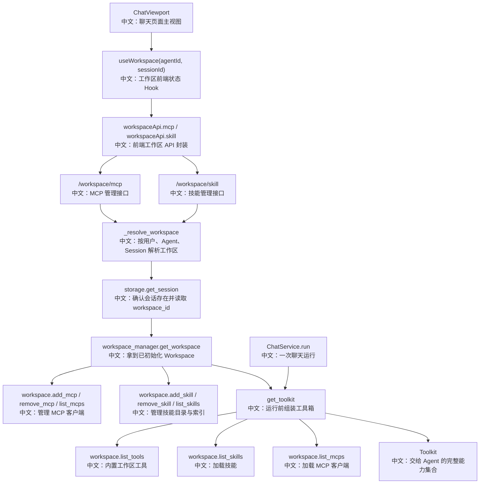

# 专题七：工作区、模型上下文协议与技能

> 这篇的目标不是把 Workspace 当成普通配置页看，而是把它讲成一条产品能力链路：用户在 Web UI 给某个会话配置 MCP 和 Skill，后端把它们绑定到 Session 对应的 Workspace，下一次 Agent 运行时再由 `get_toolkit` 装配成可调用能力。

---

## 0. 这篇先记住什么

如果只记 4 个点，就记这 4 个：

1. **Workspace 是一次会话背后的“工具工作台”。**  
   它提供内置文件工具、MCP 客户端、Skill 列表和工作目录说明，不只是一个文件夹。

2. **前端不直接传 `workspace_id`，而是传 `agent_id + session_id`。**  
   后端先从 storage 取 Session，再使用 `session_record.config.workspace_id` 解析 Workspace，这样避免客户端随意操作别的工作区。

3. **MCP 和 Skill 的配置入口在 `/workspace/*`，真正进入 Agent Runtime 在 `get_toolkit`。**  
   配置接口只是“登记能力”；一次聊天开始时，`get_toolkit` 才把 `workspace.list_tools()`、`workspace.list_skills()`、`workspace.list_mcps()` 组装进 `Toolkit`。

4. **UI 做了体验层校验，后端行为还要看 Workspace 实现。**  
   例如 `useWorkspace.addMcps` 会阻止重名 MCP；但 `LocalWorkspace.add_mcp` 当前主要负责连接和持久化，不在本层做重名拦截。面试时要能区分“产品前端防护”和“后端强一致约束”。

---

## 1. 一句话讲清楚

Workspace / MCP / Skill 这组接口解决的是 **Agent 能力扩展如何被用户配置、持久化、展示健康状态，并在下一次运行时装配进工具系统** 的问题。Web UI 负责面板展示和用户操作，FastAPI router 负责把请求定位到正确 Session Workspace，Workspace 实现负责持久化、连接、复制和扫描，`get_toolkit` 负责在聊天运行前把这些能力交给 Agent。

面试开场可以这样说：

> 我会把它理解为 AgentScope 的“工具能力装配层”。用户在 MCP/Skill 面板做配置，后端按 session 绑定 workspace；MCP 负责外部工具协议接入，Skill 负责可复用提示词/流程能力；真正运行时，`get_toolkit` 把 workspace 内置工具、MCP、Skill、Plan、Schedule、Team 工具统一装成一个 `Toolkit`。

---

## 2. 产品场景

在 Web UI 里，用户不是只和一个模型聊天，而是在给一个 Agent 配“能力背包”：

- 打开右侧面板里的 MCP，可以新增、删除 MCP server，并看到是否 healthy、暴露了哪些 tools。
- 打开 Skill 面板，可以从本地路径导入 Skill，也可以删除已经导入的 Skill。
- MCP 和 Skill 都挂在当前 `(agentId, sessionId)` 对应的 Workspace 上。
- 用户点击发送消息后，后端创建一次 Chat run，运行前会解析 Session 的 Workspace，并调用 `get_toolkit`。
- Agent 拿到的不是“裸模型”，而是带有文件工具、计划工具、团队工具、后台任务工具、MCP 工具和 Skill 的完整工具箱。

所以这批接口的业务价值是：

```text
用户配置能力
  -> 后端绑定到会话工作区
  -> Workspace 持久化或扫描能力
  -> Chat run 前统一装配 Toolkit
  -> Agent 在 reasoning-acting 循环里使用这些能力
```

---

## 3. 主流程图



---

## 4. 源码链路

### 4.1 前端入口：面板和 Hook

核心文件：

- `examples/web_ui/frontend/src/pages/chat/ChatViewport.tsx`
- `examples/web_ui/frontend/src/hooks/useWorkspace.ts`
- `examples/web_ui/frontend/src/api/workspace.ts`
- `examples/web_ui/frontend/src/components/panel/McpPanel.tsx`
- `examples/web_ui/frontend/src/components/panel/SkillPanel.tsx`

关键步骤：

```text
1. ChatViewport 拿到当前 agentId 和 sessionId。
   中文：工作区操作必须落到一个具体 Agent 会话上。

2. ChatViewport 调用 useWorkspace(agentId, sessionId)。
   中文：前端统一维护 mcps、skills、loading、error、add/remove/refetch。

3. PanelDock 打开 mcp 或 skill 面板。
   中文：McpPanel / SkillPanel 只负责展示和触发操作，不直接知道后端细节。

4. useWorkspace 调用 workspaceApi。
   中文：所有请求都带 agent_id 和 session_id 查询参数。
```

这层的设计亮点是：UI 面板、状态 Hook、API client 分层清楚。组件只关心“展示什么”和“点击后调用什么”；重复校验、refetch、错误状态放在 Hook 里。

### 4.2 后端入口：Workspace Router

核心文件：

- `src/agentscope/app/_router/_workspace.py`

接口分两组：

```text
GET    /workspace/mcp
POST   /workspace/mcp
DELETE /workspace/mcp/{mcp_name}

GET    /workspace/skill
POST   /workspace/skill
DELETE /workspace/skill/{skill_name}
```

共同前置步骤是 `_resolve_workspace`：

```text
1. storage.get_session(user_id, agent_id, session_id)
   中文：先确认这个用户、这个 Agent 下确实存在这个 Session。

2. 如果 session 不存在，返回 404。
   中文：工作区接口的权限边界先落在 Session 可见性上。

3. workspace_manager.get_workspace(user_id, agent_id, session_id, session_record.config.workspace_id)
   中文：使用 Session 里持久化的 workspace_id，而不是信任客户端传 workspace_id。
```

这块可以讲成一个安全设计点：**客户端只声明“我要操作哪个 Session 的 Workspace”，真正 Workspace 归属由后端 SessionRecord 决定。**

### 4.3 Workspace 隔离策略

核心文件：

- `src/agentscope/app/workspace_manager/_base.py`

`WorkspaceManagerBase.assign_workspace_id` 支持三种粒度：

```text
PER_SESSION
  中文：每个 Session 一个独立 workspace，隔离最强，但复用最弱。

PER_AGENT
  中文：同一用户同一 Agent 共享 workspace，是默认倾向，适合让同一个 Agent 积累工具和文件上下文。

PER_USER
  中文：同一用户共享 workspace，复用最大，但隔离最弱。
```

这里的面试考点是 trade-off：

| 隔离策略 | 优点 | 代价 |
|---|---|---|
| per-session | 会话之间互不污染 | Skill/MCP/文件复用弱 |
| per-agent | 同一个 Agent 能积累稳定工作区 | 同 Agent 多会话之间要注意共享影响 |
| per-user | 用户级能力共享方便 | 权限、冲突、清理压力更大 |

### 4.4 LocalWorkspace：持久化与本地实现

核心文件：

- `src/agentscope/workspace/_local_workspace.py`
- `src/agentscope/workspace/_base.py`

MCP 的本地实现重点：

```text
add_mcp(mcp_client)
  -> 如果是 stateful 且未连接，先 connect
  -> 追加到 self._mcps
  -> 保存到 .mcp

remove_mcp(name)
  -> 找到同名 MCP
  -> 如果是 stateful 且已连接，先 close
  -> 从 self._mcps 删除
  -> 保存到 .mcp
```

Skill 的本地实现重点：

```text
add_skill(skill_path)
  -> 校验 skill_path/SKILL.md 是否存在
  -> 解析 frontmatter，要求 name 和 description
  -> 计算 SKILL.md 的 SHA-256 hash
  -> 相同 hash 视为已存在，直接跳过
  -> 如果技能名冲突，追加 (1)、(2) 这类后缀
  -> 拷贝到 workspace/skills
  -> 写入 .skills 索引

list_skills()
  -> 读取 workspace/skills/.skills
  -> 如果目录 mtime 变化，reconcile 一次
  -> 返回带 agent-facing name 的 Skill 列表
```

这里最值得讲的是：**Skill 的去重不是只看名字，而是看 `SKILL.md` 内容 hash；名字冲突可以通过后缀解决。**

### 4.5 Runtime 装配：get_toolkit

核心文件：

- `src/agentscope/app/_service/_toolkit.py`

关键步骤：

```text
1. tools = await workspace.list_tools()
   中文：加入 Bash、Read、Write、Grep 等工作区内置工具。

2. tools += [TaskCreate(), TaskList(), TaskGet(), TaskUpdate()]
   中文：加入 Plan / Task 工具。

3. tools += await background_task_manager.list_tools(...)
   中文：加入后台任务控制工具。

4. 如果 session 配了模型，则加入 schedule_tools。
   中文：定时任务需要模型配置，才能在未来触发新的聊天运行。

5. 根据 team_role 加入 TeamCreate / AgentCreate / TeamSay / TeamDelete / AgentInvite 或 worker 版 TeamSay。
   中文：多 Agent 工具不是静态给所有人，leader 和 worker 能力不同。

6. return Toolkit(tools=tools, skills_or_loaders=await workspace.list_skills(), mcps=await workspace.list_mcps())
   中文：MCP 和 Skill 在这里进入 Agent 的完整工具箱。
```

所以要特别注意：`POST /workspace/mcp` 或 `POST /workspace/skill` 只是改变 Workspace 配置；它们是否被当前正在跑的 Agent 立即看到，取决于那次 run 的 Toolkit 是否已经装配完成。更稳妥的说法是：**这些配置会影响后续 Toolkit 装配，通常影响下一次聊天运行。**

---

## 5. 设计亮点

### 5.1 Session 绑定 Workspace，而不是客户端直接操作 Workspace

后端通过 `_resolve_workspace` 读取 `SessionRecord.config.workspace_id`，这让 Workspace 成为 Session 配置的一部分。面试时可以这样讲：

> 前端只传 agent_id 和 session_id，后端自己查 workspace_id。这样 API 表面更贴近产品语义，也减少了用户伪造 workspace_id 操作其他工作区的风险。

### 5.2 MCP 列表接口顺便做健康检查

`GET /workspace/mcp` 不只是返回配置，它会对每个 client 调 `client.list_tools()`：

```text
成功：is_healthy = true，并返回 tools 列表。
失败：is_healthy = false，不让单个 MCP 拖垮整个列表接口。
```

这是一种“局部失败隔离”：某个 MCP 挂了，UI 还能展示其他 MCP，并把这个 MCP 标成 unhealthy。

### 5.3 Skill 本地实现有内容去重和名称冲突处理

`LocalWorkspace.add_skill` 用 `SKILL.md` hash 做重复判断，同内容直接跳过；名字冲突时给 agent-facing name 加后缀。这比简单“同名报错”更适合真实用户导入场景。

### 5.4 Workspace 是 Toolkit 的能力来源之一

`get_toolkit` 把 Workspace、Plan、Schedule、Team、Middleware 等来源汇合成 `Toolkit`。这说明 AgentScope 的工具能力不是散落在各处，而是在运行前有一个集中装配点。

---

## 6. 边界与坑

### 6.1 前端重复校验不是后端强约束

`useWorkspace.addMcps` 会检查：

```text
1. 新增 MCP 是否和当前列表重名。
2. 本次批量新增内部是否有重名。
```

但 `LocalWorkspace.add_mcp` 当前主要做连接、追加、保存。也就是说，如果绕过 UI 直接调 API，MCP 重名策略要看后端实现是否额外约束。面试里不要说“系统全链路保证 MCP name 唯一”，更准确是：

> UI 层做了重名保护；后端不同 Workspace 实现的重复策略可能不同，生产级可以在 `add_mcp` 或 storage 层补强唯一约束。

### 6.2 删除接口在 LocalWorkspace 里偏 no-op

`LocalWorkspace.remove_mcp` 和 `LocalWorkspace.remove_skill` 找不到目标时会记录 warning 并返回，不会抛错。接口层返回 204，体验上接近幂等删除。

但基础类或其他 Workspace 实现可能有不同异常行为，所以文档里要讲“当前 LocalWorkspace 行为”，不要泛化成所有后端。

### 6.3 MCP 健康检查会触发远端 list_tools

`GET /workspace/mcp` 为了展示 tools 和 health，会调用每个 MCP 的 `list_tools()`。这有两个影响：

- 列表接口不再是纯粹读内存配置，它可能触发网络或子进程交互。
- 如果 MCP 数量很多或某些 MCP 响应慢，列表接口延迟会被放大。

可优化方向：

```text
1. 给 list_tools 增加超时。
2. 缓存最近一次健康检查结果。
3. 把健康检查异步化，列表先返回配置，再后台刷新状态。
```

### 6.4 Skill 路径是后端本地路径

`POST /workspace/skill` 的 body 是 `{"skill_path": "..."}`。在桌面或本地部署里这很自然，但在远程服务里要注意：

```text
前端输入的路径必须是服务端能访问的路径。
```

如果 Web UI 和后端不在同一台机器，可能需要改成上传压缩包、从仓库安装、或从受控目录选择。

### 6.5 正在运行的 Chat 不一定热更新

MCP/Skill 被加入 Workspace 后，已经组装完成的 `Toolkit` 不一定重新读取它们。更准确的产品语义是：

```text
配置变更影响后续 run；
当前 run 是否生效取决于运行时是否重新装配 Toolkit。
```

---

## 7. 面试问答

### Q1：Workspace 在 AgentScope 里解决什么问题？

Workspace 是 Agent 的工作环境和能力容器。它不只保存文件，还负责暴露内置文件工具、MCP 客户端、Skill 列表和 workspace instructions。运行时 `get_toolkit` 会从 Workspace 读取这些能力，和 Plan、Team、Schedule 工具一起装配给 Agent。

### Q2：为什么 Workspace 接口不直接传 `workspace_id`？

因为产品语义是“操作当前 Session 的工作区”，而不是“任意操作某个 workspace”。后端通过 `user_id + agent_id + session_id` 查 Session，再使用 `session_record.config.workspace_id` 解析 Workspace。这样权限边界更清楚，也减少客户端伪造 workspace_id 的风险。

### Q3：MCP 和 Skill 有什么区别？

MCP 是工具协议接入，通常代表外部 server 暴露的一组 tools；Skill 是可复用的能力说明和流程材料，来自 `SKILL.md`。前者更像“可调用工具接口”，后者更像“Agent 应该掌握的一套方法和上下文”。在 `Toolkit` 里，MCP 进入 `mcps`，Skill 进入 `skills_or_loaders`。

### Q4：为什么 `GET /workspace/mcp` 要调用 `list_tools()`？

因为 UI 需要展示 MCP 是否可用、暴露了哪些工具。后端把配置列表和健康探测合在一起返回，某个 MCP 失败时只标记 `is_healthy=false`，不让整个列表失败。缺点是列表接口会受到 MCP 响应时间影响，可以用超时、缓存、异步刷新优化。

### Q5：添加 Skill 时如何处理重复？

在 `LocalWorkspace` 里，会读取 `SKILL.md`，要求 frontmatter 里有 `name` 和 `description`，然后计算 `SKILL.md` 内容 hash。相同 hash 直接跳过，名字冲突则给 agent-facing name 增加数字后缀，并写入 `.skills` 索引。

### Q6：MCP/Skill 配置后马上对当前对话生效吗？

更稳妥的回答是：它们会影响后续 Toolkit 装配，通常对下一次 run 生效。因为一次 Chat run 启动时会调用 `get_toolkit` 组装 `Toolkit`，已经在运行中的 Agent 不一定重新读取 Workspace。

### Q7：这里有哪些可以主动讲的改进点？

可以讲 4 个：

```text
1. 后端补强 MCP name 唯一约束，避免绕过 UI 产生重复。
2. MCP list_tools 增加超时和缓存，避免列表接口被慢 MCP 拖住。
3. Skill 导入从本地路径扩展到上传包或仓库安装，适配远程部署。
4. 明确配置变更的生效时机，例如提示“下次运行生效”或支持运行时刷新 Toolkit。
```

---

## 8. 60 秒讲法

```text
AgentScope 的 Workspace / MCP / Skill 可以理解成 Agent 的工具能力装配链路。

前端在 ChatViewport 里用 useWorkspace 管理 MCP 和 Skill 面板，用户新增或删除能力时，请求会带上 agent_id 和 session_id。
后端 Workspace router 不信任客户端传 workspace_id，而是先从 storage 查 Session，再用 session_record.config.workspace_id 解析 Workspace。

MCP 这边，列表接口会调用 client.list_tools 做健康检查，成功就返回 tools 和 is_healthy=true，失败只标记当前 MCP unhealthy。
Skill 这边，LocalWorkspace 会校验 SKILL.md 的 name 和 description，用内容 hash 去重，名字冲突时自动加后缀，并写入 .skills 索引。

真正关键的是运行时装配：一次 Chat run 前，get_toolkit 会读取 workspace.list_tools、workspace.list_skills、workspace.list_mcps，再把 Plan、Schedule、Team、Middleware 工具一起合成 Toolkit。
所以这不是简单 CRUD，而是“用户配置能力 -> Workspace 持久化 -> Toolkit 装配 -> Agent 使用能力”的完整产品闭环。
我也会补一句边界：UI 做了 MCP 重名防护，但后端实现还可以补强唯一约束；MCP 健康检查也需要考虑超时和缓存。
```

---

## 9. 学习任务

按这个顺序读源码：

1. 先读 `ChatViewport.tsx` 里 `useWorkspace` 和 `PanelDock` 怎么把 MCP/Skill 面板挂到聊天页。
2. 再读 `useWorkspace.ts`，理解 `refetch`、`addMcps`、`removeMcp`、`addSkill`、`removeSkill` 的前端状态流。
3. 再读 `_workspace.py`，重点看 `_resolve_workspace`，理解为什么接口只收 `agent_id + session_id`。
4. 再读 `_local_workspace.py`，画出 MCP 的 `.mcp` 持久化和 Skill 的 `.skills` 索引。
5. 最后读 `_toolkit.py`，确认这些配置如何进入真正的 Agent 工具箱。

读完后你应该能回答：

- Workspace 和 Session 是怎么绑定的？
- MCP 为什么既是配置又要健康检查？
- Skill 为什么要有 `SKILL.md`、hash 和 `.skills` 索引？
- 这些能力什么时候进入 Agent Runtime？
- 如果让你增强生产可用性，你会补哪些约束和缓存？
