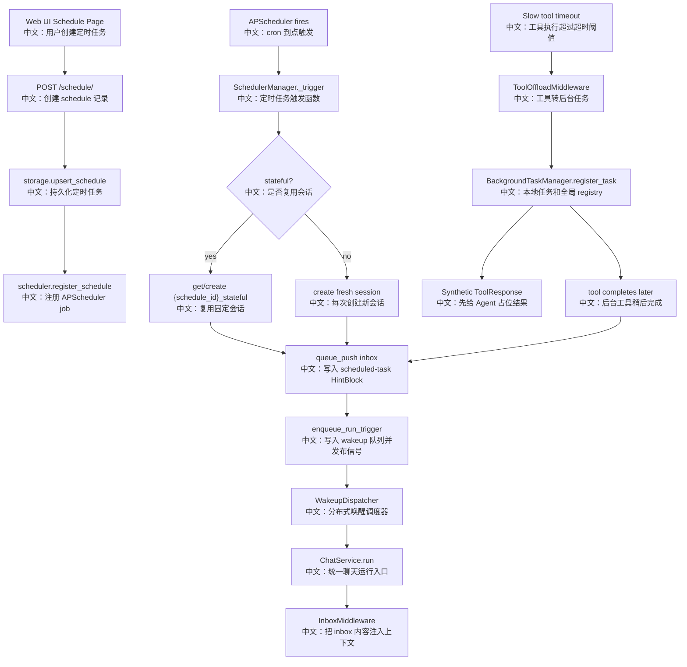

# 专题八：定时任务与后台任务

> 这一篇要把 Schedule 和 Background Task 放在一起看：它们都不是“用户立刻点击发送”的普通聊天，而是系统在未来某个时刻、或工具完成后，把一段系统消息放进 session inbox，再通过 wakeup 机制触发 Agent 继续运行。

---

## 0. 这篇先记住什么

如果只背 5 个点，就背这 5 个：

1. **Schedule 到点后不直接调用 ChatService。**  
   `SchedulerManager` 把 `<scheduled-task>` HintBlock 推进 session inbox，然后 `enqueue_run_trigger` 唤醒通用 `WakeupDispatcher`。

2. **定时任务有 stateful 和 non-stateful 两种会话模式。**  
   stateful 固定复用 `{schedule_id}_stateful` session；non-stateful 每次触发都创建新 session。

3. **Schedule 能从 UI 创建，也能从 Agent 工具创建。**  
   Web UI 调 `/schedule/*`；Agent Runtime 里会通过 `ScheduleCreate/View/Delete/List` 工具管理定时任务。

4. **后台工具 offload 也走 inbox + wakeup。**  
   工具超过超时时间后，`ToolOffloadMiddleware` 不取消原工具，而是注册后台任务，先返回占位结果；后台完成后把真实结果塞回 inbox。

5. **删除 schedule 是级联删除，不只是删 APScheduler job。**  
   `DELETE /schedule/{id}` 会通过 `SessionService.delete_schedule` 删除该 schedule 生成的 sessions，并清理相关 bus 状态。

---

## 1. 一句话讲清楚

AgentScope 的 Schedule 和 Background Task 都是在解决 **非当前用户回合的异步触发如何安全回到 Agent 会话**：Schedule 是 cron 到点触发，Background Task 是长工具完成触发；二者最终都把 HintBlock 放进 inbox，再通过 wakeup 让统一的 ChatService 运行链路接管。

面试开场可以这样说：

> 我会把 Schedule 理解成“未来自动注入系统任务并唤醒 Agent”的机制。APScheduler 只负责按 cron 触发，真正执行仍复用 inbox + wakeup + ChatService.run。后台工具 offload 也一样，超时工具继续在后台跑，完成后把结果作为 HintBlock 推进 inbox，再唤醒 session。这样团队消息、定时任务、后台工具结果都复用一套异步输入通道。

---

## 2. 产品场景

用户看到的是两个产品能力：

```text
定时任务
  中文：用户在 Schedule 页面配置 Agent、模型、cron、时区、权限模式和是否复用上下文。

后台工具
  中文：Agent 调用慢工具时，系统先让本轮推理继续，不让模型一直等待；工具完成后再自动通知 Agent。
```

它们共同解决的问题是：

```text
异步事件发生了
  -> 事件不是用户当前输入
  -> 需要进入某个 session 的上下文
  -> 需要触发 Agent 再跑一轮
  -> 不能依赖当前 HTTP 请求仍然存在
```

所以二者都复用：

```text
MessageBus.inbox
  中文：存放系统/外部异步输入。

Wakeup queue + WakeupDispatcher
  中文：让任意进程拾取并启动 ChatService.run。

InboxMiddleware
  中文：Chat run 内把 inbox 内容注入 Agent context。
```

---

## 3. 主流程图



---

## 4. 源码链路

### 4.1 Schedule Router：资源管理入口

核心文件：

- `src/agentscope/app/_router/_schedule.py`
- `src/agentscope/app/_router/_schema/_schedule.py`
- `examples/web_ui/frontend/src/api/schedule.ts`
- `examples/web_ui/frontend/src/hooks/useSchedules.ts`

HTTP 端点：

```text
GET    /schedule/
POST   /schedule/
PATCH  /schedule/{schedule_id}
DELETE /schedule/{schedule_id}
GET    /schedule/{schedule_id}/sessions
```

Router 负责资源 CRUD，真正触发逻辑在 `SchedulerManager`。

### 4.2 创建 Schedule：存储 + 注册 job

创建接口关键步骤：

```text
1. access.resolve_agent(user_id, body.agent_id)
   中文：确认要定时运行的 Agent 对用户可见。

2. access.get_resource(user_id, CREDENTIAL, body.chat_model_config.credential_id)
   中文：提前验证模型凭证可见，避免第一次触发才失败。

3. 构造 ScheduleRecord。
   中文：保存 cron_expression、timezone、chat_model_config、permission_mode、stateful 等。

4. storage.upsert_schedule(user_id, record)
   中文：先持久化 schedule。

5. 如果 enabled，则 scheduler.register_schedule(record)
   中文：把任务注册进 APScheduler。
```

这里的重点是：**schedule record 是持久事实，APScheduler job 是进程内运行态。**

### 4.3 SchedulerManager：启动恢复和 cron 注册

核心文件：

- `src/agentscope/app/_manager/_scheduler/_scheduler_manager.py`
- `src/agentscope/app/_lifespan.py`

生命周期：

```text
1. app lifespan 创建 SchedulerManager。
   中文：和 storage、message_bus、BackgroundTaskManager 一起作为应用级资源启动。

2. __aenter__ 启动 AsyncIOScheduler。
   中文：进程内 cron 调度器开始工作。

3. storage.list_all_schedules()
   中文：服务重启后读取所有持久化 schedule。

4. restore(records)
   中文：只把 enabled schedule 重新注册为 APScheduler job。
```

注册 job：

```text
1. 解析 5-field cron_expression。
   中文：只接受标准 5 段 cron。

2. 构造 CronTrigger。
   中文：带 timezone、started_at、ended_at。

3. add_job(trigger, id=record.id, misfire_grace_time=300)
   中文：job id 和 schedule id 一致，方便更新/删除。
```

### 4.4 到点触发：inbox + wakeup

`SchedulerManager._build_trigger` 是核心。

关键步骤：

```text
1. 如果 record.data.enabled 为 false，直接跳过。
   中文：即使 job 被误触发，记录状态仍是最后防线。

2. stateful=true 时，查找 session_id = "{schedule_id}_stateful"。
   中文：找到就复用，找不到才创建。

3. stateful=false 时，每次 upsert_session 创建新 session。
   中文：每次执行互不污染上下文。

4. 创建 AgentState，并设置 permission_context.mode。
   中文：定时任务没有人在场确认，默认 permission_mode 是 dont_ask。

5. 创建 HintBlock，内容包在 <scheduled-task>...</scheduled-task>。
   中文：让模型知道这不是普通用户输入，而是系统定时触发。

6. message_bus.queue_push(MessageBusKeys.inbox(session.id), hint)
   中文：把系统任务写入 session inbox。

7. enqueue_run_trigger(...)
   中文：写 wakeup queue 并发布 wakeup signal。
```

这里不要说“Scheduler 直接跑 Agent”。更准确是：**Scheduler 只投递任务和唤醒，真正跑 Agent 的仍是 WakeupDispatcher + ChatService.run。**

### 4.5 Schedule 工具：Agent 也能管理定时任务

核心文件：

- `src/agentscope/app/_manager/_scheduler/_tools/_schedule_create.py`
- `src/agentscope/app/_manager/_scheduler/_tools/_schedule_view.py`
- `src/agentscope/app/_manager/_scheduler/_tools/_schedule_delete.py`
- `src/agentscope/app/_manager/_scheduler/_tools/_schedule_list.py`
- `src/agentscope/app/_service/_toolkit.py`

`get_toolkit` 里只有当 session 有 `chat_model_config` 时才加入 schedule 工具：

```text
if session_record.config.chat_model_config is not None:
    tool_groups.append(schedule_tools)
```

原因是 ScheduleCreate 需要把当前 session 的模型配置保存到新的 ScheduleRecord 上，否则未来触发时不知道用哪个模型跑。

Agent 工具和 HTTP API 的关系：

```text
HTTP API
  中文：用户从 Web UI 手动管理 schedule。

ScheduleCreate / ScheduleView / ScheduleDelete / ScheduleList
  中文：Agent 在对话中自己创建、查看、删除、列出 schedule。
```

这是同一业务能力的双入口。

### 4.6 后台工具 offload

核心文件：

- `src/agentscope/app/middleware/_tool_offload_middleware.py`
- `src/agentscope/app/_manager/_background_task_manager.py`
- `src/agentscope/app/_manager/_cancel_dispatcher.py`
- `src/agentscope/app/_service/_toolkit.py`

触发条件：

```text
工具执行超过 timeout_secs，默认 10 秒。
```

不会 offload 的工具：

```text
is_state_injected=True
  中文：工具拿到 live agent.state，后台并发跑可能改坏状态。

is_external_tool=True
  中文：外部工具本来就等待人或外部系统结果，不适合再 offload。
```

offload 流程：

```text
1. 把 next_handler 放进 drain_task 继续运行。
   中文：真实工具任务不取消。

2. BackgroundTaskManager.register_task。
   中文：写本地 task cache，也写全局 bg_tasks registry。

3. 给 Agent 返回 synthetic ToolResponse。
   中文：提醒工具已在后台运行，不要 sleep/poll。

4. 后台任务完成后构造 HintBlock。
   中文：保留工具输出文本和多模态 blocks。

5. queue_push inbox + enqueue_run_trigger。
   中文：结果回到同一个异步输入通道。
```

### 4.7 ToolStop 与取消

`ToolStop` 来自 `BackgroundTaskManager.list_tools(session_id)`，每次 `get_toolkit` 都会加入。

取消路径：

```text
本进程本 session 任务
  中文：直接找到 local task，调用 asyncio_task.cancel()。

全局 registry 存在但不在本进程
  中文：publish task_cancel_channel，让拥有任务的进程取消。

不存在
  中文：返回 TaskNotFoundError。
```

`CancelDispatcher` 同时订阅：

```text
session_cancel_channel
  中文：取消某个 session 的 chat run 和所有本地后台任务。

task_cancel_channel
  中文：取消指定 task_id 的本地后台任务。

session_interrupt_channel
  中文：只 interrupt chat run，不取消后台任务。
```

这里能和 interrupt 文档呼应：**interrupt 不等于删除/取消 session，interrupt 不会取消 background task；session cancel 才会取消后台任务。**

---

## 5. 设计亮点

### 5.1 Schedule 复用 wakeup，而不是直接依赖 ChatService

Scheduler 到点后只写 inbox 和 wakeup queue，这让它和 ChatService 解耦。好处：

```text
1. 任意进程都可以通过 WakeupDispatcher 接手执行。
2. 和 team message、background tool result 使用同一条异步输入通道。
3. Scheduler trigger 本身很轻，不需要长期持有聊天运行逻辑。
```

### 5.2 stateful / non-stateful 明确区分上下文复用

```text
stateful=true
  中文：适合“每天持续跟踪一个任务”，上下文会积累。

stateful=false
  中文：适合“每次独立生成报告”，每次都有新 session。
```

### 5.3 持久 schedule + 进程内 job

ScheduleRecord 在 storage，APScheduler job 在内存。服务重启后 `SchedulerManager.__aenter__` 会从 storage restore enabled jobs。

### 5.4 后台工具结果作为 HintBlock 回流

长工具不会阻塞当前 reasoning loop；完成后以系统通知形式进入 inbox，再唤醒 Agent。这和“把后台结果硬塞进当前 generator”相比更适合跨进程和断连场景。

---

## 6. 边界与坑

### 6.1 Web UI 创建 one-off cron 目前主要靠 cron 表达式模拟

前端 `CreateScheduleDialog` 的 once 模式会构造：

```text
minute hour day month *
```

如果没有配 `ended_at`，这种 cron 可能每年同一天触发一次，不是严格一次性。源码里 `ScheduleCreate` 工具支持 `started_at` / `ended_at`，HTTP schema 当前没有暴露这两个字段。面试里可以把它讲成一个产品改进点：**一次性任务最好设置 end_date，或后端支持真正 one-shot trigger。**

### 6.2 update schedule 总是先 remove 再 register

`PATCH /schedule/{id}` 会：

```text
1. storage.upsert_schedule(updated_record)
2. scheduler.remove_schedule(schedule_id)
3. 如果 enabled，再 register_schedule(updated_record)
```

如果 register 失败，storage 已经保存了新 record，但内存 job 没注册成功。生产级可以考虑先 validate cron，再写 storage，或失败时回滚/禁用。

### 6.3 Schedule trigger 捕获异常但不改变 record 状态

`_trigger` 内部 catch 并 log，避免 APScheduler 因异常停掉 job。但失败不会自动写入 schedule execution status。目前执行历史是 session 列表，不是细粒度 run result 表。

### 6.4 后台任务 registry 有 TTL

`BackgroundTaskManager.register_task` 会写 `bg_tasks(session_id)` registry，并带 TTL。TTL 防止僵尸 registry 长期存在，但也意味着特别长的后台任务如果没有续 TTL，远程 ToolStop 可能找不到 registry。需要结合实际 TTL 和任务时长评估。

### 6.5 ToolStop 取消后没有结果回流

后台任务被取消时 `_deliver_when_done` 会跳过 delivery。也就是说 Agent 不会收到一个“已取消”的后台结果 HintBlock，ToolStop 自己的 ToolChunk 是取消反馈。

---

## 7. 面试问答

### Q1：Schedule 到点后为什么不直接调用 ChatService.run？

因为直接调用会把 scheduler 和 chat runtime 紧耦合，也不利于多进程。当前设计是把 scheduled-task HintBlock 写进 inbox，再 enqueue wakeup，由 WakeupDispatcher 统一启动 ChatService.run。这和 team message、background tool result 是同一条通道。

### Q2：stateful schedule 和 non-stateful schedule 有什么区别？

stateful schedule 使用固定 session id `{schedule_id}_stateful`，每次触发复用上下文；non-stateful 每次触发都创建一个新 session。前者适合连续跟踪，后者适合独立执行。

### Q3：ScheduleRecord 和 APScheduler job 的关系是什么？

ScheduleRecord 是持久化事实，存在 storage；APScheduler job 是当前进程内的运行态。创建/更新时会注册 job，服务启动时会从 storage restore enabled schedule。

### Q4：后台工具为什么超时后不直接取消？

因为工具可能只是耗时长，不代表失败。取消会浪费已经执行的工作。offload 让工具继续跑，当前 Agent 先拿到占位结果继续推理，完成后再通过 inbox + wakeup 把真实结果送回来。

### Q5：ToolStop 如何跨进程取消后台任务？

如果 task 在本进程并属于同一 session，直接 cancel；如果本地没有但全局 registry 里有，就 publish `task_cancel_channel`，所有进程的 CancelDispatcher 都会收到，拥有该 task 的进程自选并取消。

### Q6：删除 schedule 会删除执行历史吗？

会通过 `SessionService.delete_schedule` 删除该 schedule 生成的 sessions，并清理这些 sessions 的 bus 状态；然后删除 schedule record，并移除 APScheduler job。

---

## 8. 60 秒讲法

```text
AgentScope 的 Schedule 不是直接在 cron 回调里跑 Agent，而是复用异步输入系统。
用户从 Web UI 或 Agent 的 ScheduleCreate 工具创建 schedule，后端把 ScheduleRecord 写入 storage，并把 enabled 的任务注册到 APScheduler。
服务重启时 SchedulerManager 会读取所有持久化 schedule，把 enabled 的重新注册。

到点后，SchedulerManager 根据 stateful 决定复用固定 session 还是创建新 session，然后构造 <scheduled-task> HintBlock，写进该 session 的 inbox，并 enqueue_run_trigger。
WakeupDispatcher 收到 wakeup 后再调用 ChatService.run，InboxMiddleware 把 scheduled-task 注入上下文。

后台工具 offload 也走同一条路：工具超过 10 秒后继续后台运行，Agent 先收到占位 ToolResponse；工具完成后结果变成 HintBlock 进入 inbox，再 wakeup。
这套设计的亮点是把定时触发、团队消息、后台工具结果统一成 inbox + wakeup + ChatService.run，天然适合多进程。
```

---

## 9. 学习任务

按这个顺序读源码：

1. 先读 `_router/_schedule.py`，理解 5 个 HTTP 端点。
2. 再读 `SchedulerManager.register_schedule`，看 cron 如何变成 APScheduler job。
3. 再读 `_build_trigger`，重点画 stateful/non-stateful session 创建和 inbox + wakeup。
4. 再读 schedule tools，理解 Agent 如何创建和管理 schedule。
5. 再读 `ToolOffloadMiddleware.on_acting`，理解长工具如何转后台。
6. 再读 `BackgroundTaskManager` 和 `CancelDispatcher`，理解 ToolStop、本地取消、跨进程取消。
7. 最后读 Web UI 的 schedule 页面和 drawer，看执行历史如何通过 `/schedule/{id}/sessions` 展示。
