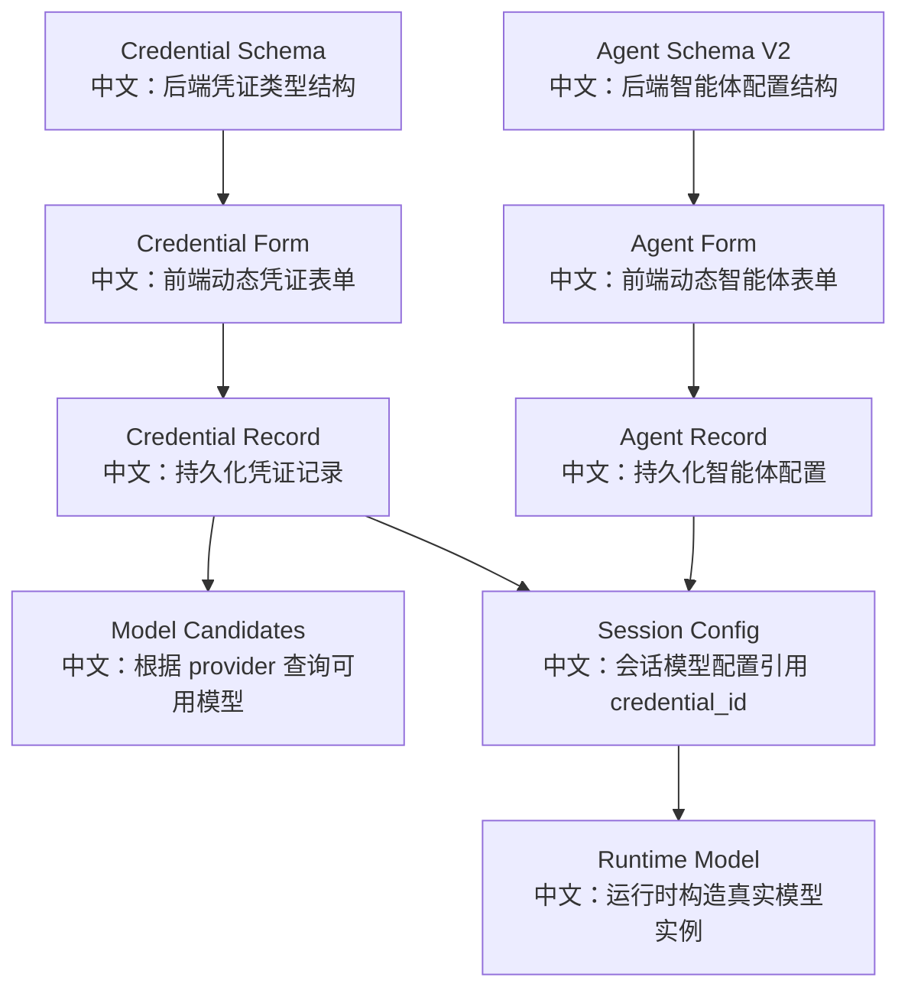
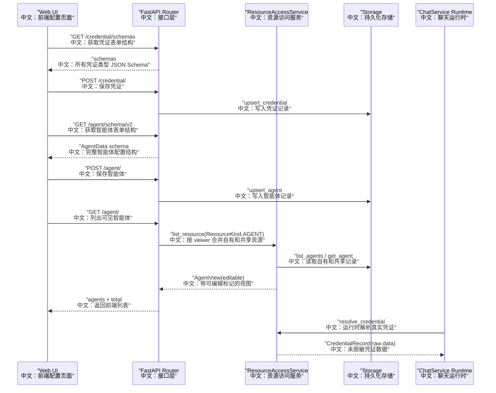

# 09_智能体与凭证资源管理

## 先记住什么

这一组接口表面上是 Agent 和 Credential 的 CRUD，真正要记住的是：

```text
Credential 是模型调用的密钥边界。
Agent 是可运行智能体的配置边界。
ResourceAccessService 是多人共享、脱敏展示、运行时解析的权限边界。
```

面试时不要只说“这里有增删改查”。更好的说法是：

> AgentScope 把 Agent 配置和 Credential 凭证独立建模。UI 通过 schema 动态渲染表单，列表接口返回 viewer 视角下的 `editable` 投影；共享凭证在 UI 中脱敏，但运行时通过 `resolve_credential` 获取原始凭证，从而同时满足协作共享和密钥安全。

## 产品场景

用户在 Web UI 里会做四件事：

1. 创建一个凭证，比如 OpenAI、DashScope 或其他 provider。
2. 通过凭证类型拉取可用模型列表。
3. 创建一个 Agent，配置名称、系统提示词、上下文压缩、ReAct 参数和邀请能力。
4. 创建 Session 时选择 Agent、模型、凭证，运行时再把这些配置装配成真实 `ChatModelBase`。

这一组能力把“产品配置页”和“Agent 运行时”连起来：



## 主流程图



## 源码链路

| 层级 | 源码 | 中文说明 |
|---|---|---|
| 路由 | `src/agentscope/app/_router/_agent.py` | Agent schema、列表、创建、更新、删除 |
| 路由 | `src/agentscope/app/_router/_credential.py` | Credential schema、列表、创建、更新、删除 |
| DTO | `src/agentscope/app/_router/_schema/_agent.py` | Agent 请求响应结构 |
| DTO | `src/agentscope/app/_router/_schema/_credential.py` | Credential 请求响应结构 |
| 数据模型 | `src/agentscope/app/storage/_model/_agent.py` | `AgentData`、`InviteConfig`、`AgentRecord` |
| 权限服务 | `src/agentscope/app/_service/_access.py` | viewer 视角投影、共享资源、编辑权限、凭证脱敏 |
| 运行时 | `src/agentscope/app/_service/_model.py` | 根据 `credential_id` 构造 chat model |
| 前端 API | `examples/web_ui/frontend/src/api/agent.ts` | Agent 前端请求封装 |
| 前端 API | `examples/web_ui/frontend/src/api/credential.ts` | Credential 前端请求封装 |
| 前端表单 | `examples/web_ui/frontend/src/components/form/AgentFormFields.tsx` | 后端 schema 驱动 Agent 表单 |
| 前端弹窗 | `examples/web_ui/frontend/src/components/dialog/CreateCredentialDialog.tsx` | 后端 schema 驱动 Credential 表单 |

## 关键代码链路

### 1. Credential schema 到动态表单

```text
GET /credential/schemas
中文：前端先拿所有凭证类型的 JSON Schema。

CredentialFactory.list_schemas()
中文：后端从已注册的 Credential 类型生成 schema。

CreateCredentialDialog
中文：前端根据 schema 渲染不同 provider 的输入项。

POST /credential/
中文：提交 { data }，由 CredentialFactory.from_dict 转成具体凭证类。
```

这个设计的亮点是：新增一个 Credential 类型时，前端不用手写新表单，只要后端工厂能暴露 schema。

### 2. Agent schema v2 到四段表单

```text
GET /agent/schema/v2
中文：返回完整 AgentData JSON Schema。

_flatten_json_schema(AgentData.model_json_schema())
中文：把 Pydantic 的引用结构展平成前端可直接消费的 schema。

AgentFormFields.sliceSchema
中文：前端按 identity、context_config、react_config、invite_config 切成四段。

POST /agent/
中文：保存 AgentData，并触发 Pydantic 校验。
```

`InviteConfig` 是这条链路里最值得注意的点：`invitable=True` 时必须有非空 `invite_description`。这个校验放在 Pydantic 模型里，所以创建和更新都会返回一致的 `422`。

### 3. 列表展示与运行时解析分离

```text
GET /credential/
中文：UI 列出当前用户可见凭证。

ResourceAccessService.list_resource
中文：合并自有资源和共享资源，返回 CredentialView。

_build_view
中文：如果不是 owner，只保留 data.type 和 data.name，避免泄露密钥。

get_model / get_tts_model
中文：运行时通过 resolve_credential 获取原始凭证，用于真实 provider 调用。
```

这就是“展示安全”和“运行能力”的分离。UI 看到的是脱敏视图，受信任的运行时拿到的是原始记录。

## 设计亮点

| 亮点 | 中文解释 | 面试表达 |
|---|---|---|
| Schema-driven UI | 后端 Pydantic schema 驱动前端表单 | 后端模型是单一事实来源，减少前后端字段漂移 |
| viewer-relative view | 同一资源对不同 viewer 返回不同 `editable` | 资源列表不是纯数据库记录，而是权限投影 |
| 凭证脱敏 | 共享凭证列表只暴露 `type/name` | 协作共享不能牺牲密钥安全 |
| 运行时 raw resolve | `resolve_credential` 返回未脱敏记录 | 运行路径和展示路径分开建模 |
| AgentInvite 配置化 | `invite_config` 进入 Agent schema | 多 Agent 协作能力从配置态进入工具态 |
| team agent 隔离 | `source == "team"` 不进入普通 Agent 列表 | 团队临时 worker 不污染用户资产列表 |

## 边界与坑

1. `PATCH /agent/{agent_id}` 使用 `body.model_dump(exclude_none=True)`，只更新出现的字段。
2. `AgentData.model_validate({**existing, **updates})` 是关键，因为 `model_copy(update=...)` 会跳过 validator。
3. 共享资源如果只有 READ 权限，`resolve_for_edit` 会返回 `403`，而不是静默失败。
4. 不可见资源返回 `404`，避免暴露资源是否存在。
5. 删除 Agent 不是简单删记录，会通过 `SessionService.delete_agent` 级联删除相关 session、team worker 和 bus 状态。
6. 凭证列表可以脱敏，但模型能力查询仍然按 provider 类型拉取候选模型；不要把它理解成已经验证了密钥一定可用。

## 和 Web UI 的对应关系

| 用户动作 | 前端文件 | 后端接口 | 中文说明 |
|---|---|---|---|
| 打开创建凭证弹窗 | `CreateCredentialDialog.tsx` | `GET /credential/schemas` | 获取 provider 表单结构 |
| 保存凭证 | `useCredentials.ts` | `POST /credential/` | 保存密钥配置 |
| 打开创建 Agent 弹窗 | `AgentDialog.tsx` | `GET /agent/schema/v2` | 获取 Agent 配置结构 |
| 填写邀请能力 | `AgentFormFields.tsx` | `POST /agent/` | 保存 `invite_config` |
| 编辑共享资源 | `useAgents.ts` / `useCredentials.ts` | `PATCH` | 由 `editable` 决定能否修改 |
| 创建 Session | Session 相关表单 | `POST /sessions/` | 引用 `agent_id` 和 `credential_id` |

## 面试问答

**问：为什么 Credential 要独立建模，不能直接写在 Session 里？**

答：因为凭证是安全资产，生命周期和 Session 不同。独立建模后，一个凭证可以被多个 Session、Knowledge Base、TTS 配置复用，也可以单独做共享、脱敏、编辑权限和运行时解析。

**问：为什么列表接口返回 `editable`？**

答：因为资源权限是 viewer 相关的，同一个 Agent 对 owner 是可编辑的，对只读共享用户是不可编辑的。后端直接返回 `editable` 可以减少前端重复判断，也避免前端猜权限。

**问：共享凭证怎么避免泄露密钥？**

答：`ResourceAccessService._build_view` 在构造 `CredentialView` 时，如果当前 viewer 不是 owner，就只保留 `data.type` 和 `data.name`。真正调用模型时，受信任的 runtime 走 `resolve_credential` 拿原始记录。

**问：`Agent schema v2` 相比旧 schema 有什么好处？**

答：旧接口把 identity、context、react 手工拆开，新增字段需要改路由。v2 直接返回完整 `AgentData` schema，前端按嵌套对象自动分组，所以新增 `invite_config` 这种配置时不需要重写后端接口。

## 60 秒讲法

AgentScope 的 Agent 和 Credential 管理不是简单 CRUD。Credential 是密钥边界，Agent 是运行配置边界，`ResourceAccessService` 是协作权限边界。前端通过 `/credential/schemas` 和 `/agent/schema/v2` 动态渲染表单，后端 Pydantic 模型成为单一事实来源。列表接口返回 viewer 视角的 `editable`，共享凭证在 UI 层脱敏，但运行时通过 `resolve_credential` 获取原始凭证来构造模型。这个设计同时解决了配置复用、多人共享、密钥安全和运行时装配问题。
