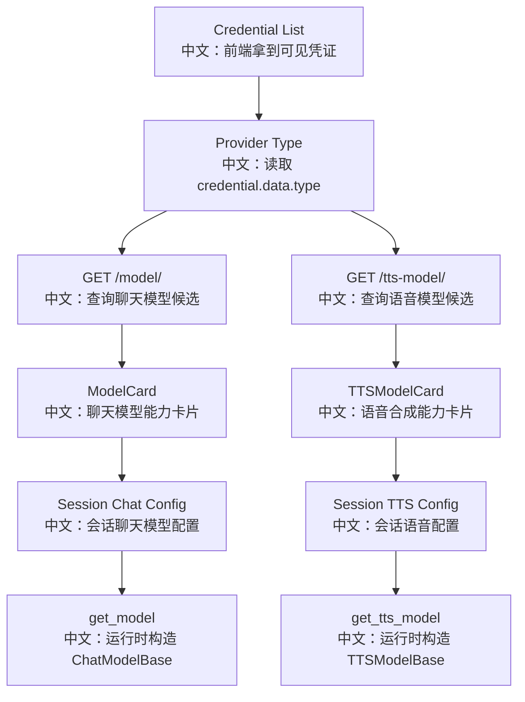
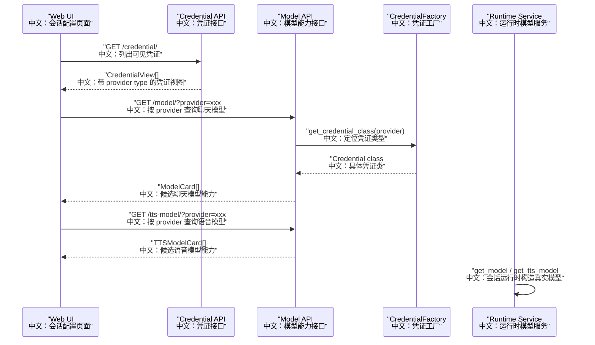

# 10_模型与语音合成能力发现

## 先记住什么

模型接口不是“查数据库里的模型列表”，而是：

```text
根据 credential provider 找到具体 Credential 类，
再从这个 Credential 类关联的模型类中读取可用能力卡片。
```

一句话面试表达：

> AgentScope 的模型发现是 provider 驱动的。前端先列出可见 Credential，再按 `credential.data.type` 调 `/model/` 或 `/tts-model/` 获取候选模型卡片；运行时则根据 `credential_id + model + parameters` 构造真实的 ChatModel 或 TTSModel。

## 产品场景

用户创建 Session 时，需要选择：

1. 使用哪个凭证。
2. 使用哪个聊天模型。
3. 是否启用 fallback 模型。
4. 是否启用 TTS 模型。
5. 模型支持哪些输入输出类型、上下文长度、是否废弃。

这些信息来自 `ModelCard` 和 `TTSModelCard`，不是前端写死。



## 主流程图



## 源码链路

| 层级 | 源码 | 中文说明 |
|---|---|---|
| 聊天模型路由 | `src/agentscope/app/_router/_model.py` | `GET /model/` 按 provider 返回 `ModelCard` |
| TTS 路由 | `src/agentscope/app/_router/_tts_model.py` | `GET /tts-model/` 按 provider 返回 `TTSModelCard` |
| DTO | `src/agentscope/app/_router/_schema/_model.py` | `ListModelsRequest/Response` |
| DTO | `src/agentscope/app/_router/_schema/_tts_model.py` | `ListTTSModelsRequest/Response` |
| 运行时 | `src/agentscope/app/_service/_model.py` | 根据 `ChatModelConfig` 构造 `ChatModelBase` |
| 运行时 | `src/agentscope/app/_service/_tts_model.py` | 根据 `TTSModelConfig` 构造 `TTSModelBase` |
| 前端 API | `examples/web_ui/frontend/src/api/model.ts` | 封装 `/model/` 和 `/tts-model/` |
| 前端 Hook | `examples/web_ui/frontend/src/hooks/useAvailableModels.ts` | 按凭证分组查询聊天模型 |
| 前端 Hook | `examples/web_ui/frontend/src/hooks/useAvailableTTSModels.ts` | 按凭证分组查询 TTS 模型 |
| 前端类型 | `examples/web_ui/frontend/src/api/types.ts` | `ModelCard`、`TTSModelCard`、模型配置结构 |

## 关键代码链路

### 1. 聊天模型能力发现

```text
useAvailableModels
中文：先调用 credentialApi.list 获取所有可见凭证。

credential.data.type
中文：读取 provider 类型，比如 openai 或 dashscope。

modelApi.list(type)
中文：请求 GET /model/?provider=type。

CredentialFactory.get_credential_class(provider)
中文：后端按 provider 找到凭证类。

credential_cls.get_chat_model_class().list_models()
中文：从凭证类关联的聊天模型类读取 ModelCard。
```

### 2. TTS 能力发现

```text
useAvailableTTSModels
中文：遍历可见凭证，按 provider 查询 TTS 模型。

ttsModelApi.list(type)
中文：请求 GET /tts-model/?provider=type。

credential_cls.list_tts_models()
中文：从凭证类暴露的 TTS 模型类聚合候选模型。

models.length > 0
中文：前端只保留真正有 TTS 能力的 provider 分组。
```

### 3. 运行时模型构造

```text
ChatModelConfig
中文：包含 type、credential_id、model、parameters。

get_model(user_id, config, access)
中文：运行时入口，根据配置构造聊天模型。

access.resolve_credential(user_id, config.credential_id)
中文：解析自有或共享凭证，返回未脱敏记录。

CredentialFactory.from_dict(credential_record.data)
中文：把持久化 data 还原成具体 Credential 实例。

model_cls.Parameters(**config.parameters)
中文：把前端参数转换成模型参数对象。

model_cls(credential, model, parameters)
中文：返回真实 ChatModelBase 实例。
```

TTS 的链路类似，只是多了一步 `_resolve_tts_class`，它会根据模型名在多个 TTS class 中选择一个支持该模型的 class。

## ModelCard 和 TTSModelCard

| 字段 | 中文说明 | 面试价值 |
|---|---|---|
| `name` | provider 真实模型名 | 运行时传给模型类 |
| `label` | UI 展示名称 | 前端不用硬编码显示文案 |
| `status` | active/deprecated/sunset | 可做废弃提示和迁移策略 |
| `input_types` | 支持的输入类型 | 决定是否支持文本、图片、音频 |
| `output_types` | 支持的输出类型 | 决定结果渲染方式 |
| `context_size` | 上下文窗口 | 影响上下文压缩和提示词管理 |
| `realtime` | TTS 是否实时 | 影响语音播放体验和交互模式 |

## 设计亮点

1. **provider 驱动能力发现**：前端不用维护全量模型列表，后端由 credential class 统一暴露。
2. **能力卡片而不是字符串列表**：`ModelCard` 携带输入输出、上下文、状态等信息，为 UI 和运行策略留扩展空间。
3. **列表发现和运行构造分离**：`GET /model/` 只做候选能力发现，`get_model` 才做真实 credential 解析和模型实例化。
4. **共享凭证可参与运行**：只要 `ResourceAccessService` 能解析该 credential，Session 就可以用共享凭证构造模型。
5. **TTS 非强制能力**：前端会跳过不支持 TTS 的 provider，后端在运行时也会对不支持 TTS 的 provider 返回 `400`。

## 边界与坑

1. `GET /model/?provider=xxx` 如果 provider 不存在，返回 `404`。
2. 模型列表来自代码里的模型类注册，不代表用户的 API key 一定有权限调用该模型。
3. `CredentialView` 的共享凭证可能已经脱敏，但仍保留 `type/name`，所以前端可以展示和分组。
4. `get_tts_model` 如果 provider 没有 TTS class，会返回 `400`。
5. `_resolve_tts_class` 找不到精确模型名时会退回第一个 TTS class，这个行为要在排查模型配置问题时记住。
6. `parameters` 是字典，但运行时会被转换成模型类自己的 `Parameters`，所以参数校验最终发生在模型类。

## 面试问答

**问：为什么模型列表接口只传 provider，不传 credential_id？**

答：因为这里做的是能力发现，不是验证某个密钥是否能调用。provider 类型决定候选模型集合，而真实调用时才需要 `credential_id` 去拿密钥。

**问：为什么不把模型列表写死在前端？**

答：模型能力属于 provider SDK 和后端模型类，写在前端会导致同步成本高。后端统一返回 `ModelCard`，可以携带上下文长度、输入输出类型、废弃状态等能力信息。

**问：`GET /model/` 和 `get_model` 的区别是什么？**

答：前者是配置阶段的候选模型发现，后者是运行阶段的真实模型实例化。前者按 provider 查能力，后者按 `credential_id + model + parameters` 构造 `ChatModelBase`。

**问：TTS 为什么单独做接口？**

答：TTS 的模型类型、能力字段、实时性和输出形态都和 chat model 不同。单独接口可以让前端只在 provider 支持 TTS 时显示语音配置。

## 60 秒讲法

AgentScope 的模型能力发现是 provider 驱动的。前端先列出可见 Credential，然后按 `credential.data.type` 调 `/model/` 和 `/tts-model/` 获取 `ModelCard` 或 `TTSModelCard`。这些卡片不只是模型名，还包含输入输出类型、上下文窗口、废弃状态和实时能力。真正运行时，`get_model` 和 `get_tts_model` 再通过 `ResourceAccessService.resolve_credential` 拿原始凭证，把 `credential_id + model + parameters` 装配成真实模型实例。这样配置发现、权限安全和运行构造就被清楚地分开了。
