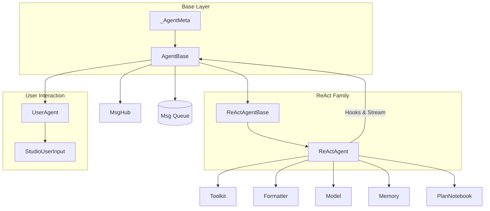

# SOP：src/agentscope/agent 模块

## 一、功能定义（Scope/非目标）
### 1. 设计思路和逻辑
- 提供可组合的 Agent 抽象，负责“接收消息 → 推理 → 工具调用/汇总 → 输出”这一核心循环，同时保持与具体业务逻辑解耦。
- 通过通用 Hook、消息广播、流式输出和中断控制，让上层可在不修改 Agent 内核的情况下插入自定义观测或 UI 行为。
- 允许在主循环前后挂接 Memory、RAG、Plan、Toolkit 等模块，使 Agent 成为多组件编排的中心。

### 2. 架构设计

### 3. 核心组件逻辑
- **AgentBase**  
  - 统一入口：`reply`（生成响应）、`observe`（被动监听）、`print`（面向 UI 的块输出）、`interrupt`（取消当前任务并调用 `handle_interrupt`）。  
  - Hook 系统：支持类级和实例级前/后置 Hook；`_AgentMeta` 在类创建阶段织入 Hook 包装。  
  - 流式输出：`print` 将文本/思考/图像/音频块写入 `_stream_prefix` 缓存；可选消息队列供管线聚合。  
  - 广播：`_subscribers` 管理 MsgHub 订阅，`_broadcast_to_subscribers` 将生成的回复推送给其他 Agent 的 `observe`。  
  - 中断：`_reply_task` 追踪当前 `reply`，`interrupt` 取消任务并触发自定义处理。

- **ReActAgentBase / ReActAgent**  
  - 预处理：在每轮 `reply` 前通过短期 memory 记录输入，按需从长期 memory/RAG 检索补充提示。  
  - 推理阶段 (`_reasoning`)：使用 Formatter 构造对话，调用 Model 获取思考文本、工具调用、结构化输出片段。  
  - 执行阶段 (`_acting`)：按顺序或并行（`parallel_tool_calls=True`）执行工具；若工具返回 `response_msg`，立即收束循环。  
  - 总结阶段 (`_summarizing`)：当没有有效回复时生成补充答案。  
  - 结构化输出：`generate_response` 注册为完成函数；初始化阶段若提供 `structured_model` 会调用 `Toolkit.set_extended_model(finish_function_name, structured_model)`。当 LLM 调用完成函数工具时，Toolkit 使用该模型校验并把校验后的 `response` 写入 `ToolResponse.metadata["response_msg"]`，`ReActAgent.generate_response` 再将其写入最终 `Msg.metadata` 并作为回复正文。  
  - 计划协作：注入 `PlanNotebook` 时，会创建 `plan_related` 工具组并利用 meta tool 控制启停。

- **UserAgent 与 StudioUserInput**  
  - `UserAgent` 实现最简单的 `reply`/`observe`，用于命令终端或 Studio。  
  - `StudioUserInput` 以长轮询/重试方式从 Studio 拉取输入；`UserAgent.override_class_input_method` 可切换交互来源。

### 4. 关键设计模式
- **模板方法**：`AgentBase` 定义统一接口，`ReActAgent` 覆写推理/执行/总结细节。  
- **策略模式**：Hook 注册、Plan 工具启停、结构化输出模型选择都以策略形式注入。  
- **观察者模式**：MsgHub 订阅者、Hook 链、Plan 变化触发都体现事件广播。  
- **装饰器元编程**：`_AgentMeta` 在类定义阶段织入 Hook 调用逻辑，避免运行时手动包装。

### 5. 其他组件的交互
- **Formatter & Model**：`ReActAgent` 依赖 Formatter 生成 prompt，调用 Model 获得文本/工具调用/结构化输出块，并将流式片段交给 `print`。  
- **Toolkit**：推理阶段获取工具 schema；执行阶段调用 `Toolkit.call_tool_function`，支持同步/异步/生成器工具。  
- **Memory/RAG/Plan**：短期/长期 memory 记录对话；`PlanNotebook` 提供计划相关工具；RAG 通过 `_retrieve_from_knowledge` 注入文档。  
- **Pipeline**：`set_msg_queue_enabled` 与 `print` 结合，让 `pipeline.stream_printing_messages` 聚合多 Agent 输出。  
- **Session**：继承 `StateModule`，可通过 `JSONSession` 保存 Agent 状态（例如 memory、工具配置）。

## 二、文件/类/函数/成员变量映射到 src 路径
- `src/agentscope/agent/_agent_base.py`  
  - `AgentBase`：Hook 注册/清理、消息队列、广播、`reply/observe/print/interrupt` 抽象；内部状态 `_reply_task`、`_stream_prefix`、`_subscribers`。  
  - `deprecated` decorator from `typing_extensions` 用于标记即将下线的属性。
- `src/agentscope/agent/_agent_meta.py`  
  - `_AgentMeta`：元类，在类创建时包裹 Hook，确保 `pre_*` 与 `post_*` 自动触发。
- `src/agentscope/agent/_react_agent_base.py`  
  - `ReActAgentBase`：整合 Toolkit/Formatter/Model/Memories 的公共逻辑，定义工具注册、Hint 打印等共享行为。
- `src/agentscope/agent/_react_agent.py`  
  - `ReActAgent`：完整 ReAct 循环、结构化输出、并行工具、计划/RAG/长期记忆集成等；关键方法 `_reasoning`、`_acting`、`_summarizing`、`generate_response`。  
  - 内部使用 `_json_schema`、`Toolkit.set_extended_model` 等配置结构化输出。
- `src/agentscope/agent/_user_agent.py`  
  - `UserAgent`：面向命令行/Studio 的用户代理，实现最小 `reply` 与 `observe`。
- `src/agentscope/agent/_user_input.py`  
  - `StudioUserInput`：基于 HTTP 轮询获取用户输入，处理重试与异常。
- `src/agentscope/agent/__init__.py`  
  - 导出 `AgentBase`、`ReActAgent`、`UserAgent`、`StudioUserInput`。
- `src/agentscope/agent/CLAUDE.md`  
  - 记录调用链、Hook 入口，文档更新时需同步。

## 三、关键数据结构与对外接口（含类型/返回约束）
- `AgentBase`
  - `async reply(*args, **kwargs) -> Msg`：生成回复，必须返回 `Msg`。  
  - `async observe(msg: Msg | list[Msg] | None) -> None`：只接收消息，不返回。  
  - `async print(msg: Msg, last: bool = True) -> None`：处理分块输出；当 `last` 为真清空缓存。  
  - Hook API：`register_class_hook`/`register_instance_hook`/`remove_*`/`clear_*`（详见源码签名）。  
  - 队列：`set_msg_queue_enabled(enabled: bool, queue: Queue | None = None) -> None`。
- `ReActAgent`
  - 初始化参数：`name: str`、`sys_prompt: str`、`model: ChatModelBase`、`formatter: FormatterBase`、`toolkit: Toolkit | None`、`memory: MemoryBase | None`、`long_term_memory: LongTermMemoryBase | None`、`long_term_memory_mode: Literal["agent_control","static_control","both"]`、`plan_notebook: PlanNotebook | None`、`parallel_tool_calls: bool`、`max_iters: int`、`enable_meta_tool: bool`、`print_hint_msg: bool`。  
  - 关键方法：`async __call__`（别名 `reply`）、`_reasoning`、`_acting`、`_summarizing`、`generate_response`、`_retrieve_from_long_term_memory`、`_retrieve_from_knowledge`。  
  - 结构化输出：`finish_function_name = "generate_response"`；`Toolkit.set_extended_model` 强制结构化工具。  
  - 并发：当 `parallel_tool_calls` 为真，`asyncio.gather` 并行工具调用，捕获异常后向上传递。
- `UserAgent`
  - 继承 `AgentBase`，`reply` 读取标准输入或自定义输入源，`observe` 将消息缓存到历史，`print` 输出到终端或 Studio。
- `StudioUserInput`
  - 调用方式：实例化后传入 `UserAgent.override_class_input_method`；方法 `__call__` 异步轮询 Studio，返回用户 `Msg`。
- Hook 类型
  - `AgentHookTypes` 在 `src/agentscope/types/_hook.py` 定义，`pre_reply`/`post_reply`/`pre_print`/`post_print`/`pre_observe`/`post_observe`。
- 消息结构
  - 代理处理的 `Msg` 来自 `src/agentscope/message/_message_base.py`，支持文本、多媒体、工具调用等块；Agent 负责将输出块写入 `print`。

## 四、与其他模块交互（调用链与责任边界）
- **推理-执行链路**：  
  `Formatter.format` → `ChatModelBase.__call__`（输出文本/工具） → `Toolkit.call_tool_function`（执行工具并返回 `ToolResponse`） → `ReActAgent.generate_response`（结构化输出） → `AgentBase.print`/`MsgHub.broadcast`。  
  Agent 对 LLM/工具异常不做吞并，抛给上层或交由 Hook 处理。
- **Memory & RAG**：若提供 `memory`，在 `reply` 前后调用 `memory.add`；`long_term_memory` 依 `long_term_memory_mode` 控制自动/手动记录；`knowledge` 列表在 `_retrieve_from_knowledge` 中被调用。  
- **Plan 工具**：一旦 `PlanNotebook` 存在，ReActAgent 会在 Toolkit 中注册计划工具组以及元工具；Plan 提示可通过 `print_hint_msg` 输出。  
- **Pipeline**：`pipeline.stream_printing_messages` 启动时调用 `set_msg_queue_enabled(True, queue)`；完成后传递 `[END]` 信号关闭。  
- **Session & Persistence**：继承 `StateModule`，`AgentBase` 的属性可通过 `JSONSession` 保存；若新增状态需调用 `register_state`。  
- **责任边界**：Agent 不持久化业务数据，不负责具体工具实现；Hook 中应避免阻塞操作，必要时改为异步。

## 五、测试文件
- 绑定文件：`tests/react_agent_test.py`、`tests/user_input_test.py`
- 覆盖点：ReAct 主循环、并行工具与完成函数、中断流程、打印与队列、Studio 用户输入覆写。
