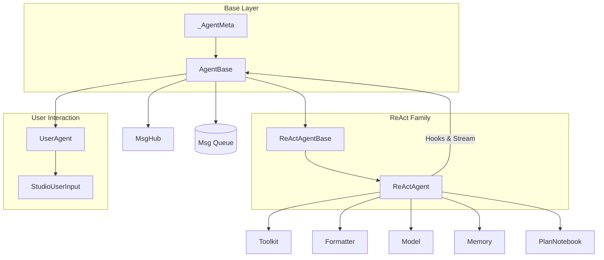

# SOP：src/agentscope/agent 模块

---

## 一、功能定义

### 1. 设计思路与逻辑

- 提供可组合的 Agent 抽象，负责"接收消息 → 推理 → 工具调用/汇总 → 输出"这一核心循环，同时保持与具体业务逻辑解耦。
- 通过通用 Hook、消息广播、流式输出和中断控制，让上层可在不修改 Agent 内核的情况下插入自定义观测或 UI 行为。
- 允许在主循环前后挂接 Memory、RAG、Plan、Toolkit 等模块，使 Agent 成为多组件编排的中心。

### 2. 架构设计

### 3. 核心组件逻辑

#### AgentBase

- **统一入口**：`reply`（生成响应）、`observe`（被动监听）、`print`（面向 UI 的块输出）、`interrupt`（取消当前任务并调用 `handle_interrupt`）。
- **Hook 系统**：支持类级和实例级前/后置 Hook；`_AgentMeta` 在类创建阶段织入 Hook 包装。
- **流式输出**：`print` 将文本/思考/图像/音频块写入 `_stream_prefix` 缓存；可选消息队列供管线聚合。
- **广播**：`_subscribers` 管理 MsgHub 订阅，`_broadcast_to_subscribers` 将生成的回复推送给其他 Agent 的 `observe`。
- **中断**：`_reply_task` 追踪当前 `reply`，`interrupt` 取消任务并触发自定义处理。

#### ReActAgentBase / ReActAgent

- **预处理**：在每轮 `reply` 前通过短期 memory 记录输入，按需从长期 memory/RAG 检索补充提示。
- **推理阶段**（`_reasoning`）：使用 Formatter 构造对话，调用 Model 获取思考文本、工具调用、结构化输出片段。
- **执行阶段**（`_acting`）：按顺序或并行（`parallel_tool_calls=True`）执行工具；若工具返回 `response_msg`，立即收束循环。
- **总结阶段**（`_summarizing`）：当没有有效回复时生成补充答案。
- **结构化输出**：`generate_response` 注册为完成函数；初始化阶段若提供 `structured_model` 会调用 `Toolkit.set_extended_model(finish_function_name, structured_model)`。当 LLM 调用完成函数工具时，Toolkit 使用该模型校验并把校验后的 `response` 写入 `ToolResponse.metadata["response_msg"]`，`ReActAgent.generate_response` 再将其写入最终 `Msg.metadata` 并作为回复正文。
- **计划协作**：注入 `PlanNotebook` 时，会创建 `plan_related` 工具组并利用 meta tool 控制启停。

#### UserAgent 与 StudioUserInput

- `UserAgent` 实现最简单的 `reply`/`observe`，用于命令终端或 Studio。
- `StudioUserInput` 以长轮询/重试方式从 Studio 拉取输入；`UserAgent.override_class_input_method` 可切换交互来源。

#### 子模块文档（SubAgent 已分拆）

SubAgent（子 Agent）相关内容已迁移至独立文档：`docs/agent/subagent/SOP.md`。本文件仅聚焦主 Agent。

### 5. 关键设计模式

- **模板方法**：`AgentBase` 定义统一接口，`ReActAgent` 覆写推理/执行/总结细节。
- **策略模式**：Hook 注册、Plan 工具启停、结构化输出模型选择都以策略形式注入。
- **观察者模式**：MsgHub 订阅者、Hook 链、Plan 变化触发都体现事件广播。
- **装饰器元编程**：`_AgentMeta` 在类定义阶段织入 Hook 调用逻辑，避免运行时手动包装。

### 6. 其他组件的交互

- **Formatter & Model**：`ReActAgent` 依赖 Formatter 生成 prompt，调用 Model 获得文本/工具调用/结构化输出块，并将流式片段交给 `print`。
- **Toolkit**：推理阶段获取工具 schema；执行阶段调用 `Toolkit.call_tool_function`，支持同步/异步/生成器工具。
- **Memory/RAG/Plan**：短期/长期 memory 记录对话；`PlanNotebook` 提供计划相关工具；RAG 通过 `_retrieve_from_knowledge` 注入文档。
- **Pipeline**：`set_msg_queue_enabled` 与 `print` 结合，让 `pipeline.stream_printing_messages` 聚合多 Agent 输出。
- **Session**：继承 `StateModule`，可通过 `JSONSession` 保存 Agent 状态（例如 memory、工具配置）。

## 二、文件/类/函数/成员变量映射

### 核心文件结构

#### `src/agentscope/agent/_agent_base.py`

- **`AgentBase`**：Hook 注册/清理、消息队列、广播、`reply/observe/print/interrupt` 抽象；内部状态 `_reply_task`、`_stream_prefix`、`_subscribers`。
- **`deprecated` decorator**：来自 `typing_extensions`，用于标记即将下线的属性。

#### `src/agentscope/agent/_agent_meta.py`

- **`_AgentMeta`**：元类，在类创建时包裹 Hook，确保 `pre_*` 与 `post_*` 自动触发。

#### `src/agentscope/agent/_react_agent_base.py`

- **`ReActAgentBase`**：整合 Toolkit/Formatter/Model/Memories 的公共逻辑，定义工具注册、Hint 打印等共享行为。

#### `src/agentscope/agent/_react_agent.py`

- **`ReActAgent`**：完整 ReAct 循环、结构化输出、并行工具、计划/RAG/长期记忆集成等；关键方法 `_reasoning`、`_acting`、`_summarizing`、`generate_response`。
- 内部使用 `_json_schema`、`Toolkit.set_extended_model` 等配置结构化输出。

#### `src/agentscope/agent/_user_agent.py`

- **`UserAgent`**：面向命令行/Studio 的用户代理，实现最小 `reply` 与 `observe`。

#### `src/agentscope/agent/_user_input.py`

- **`StudioUserInput`**：基于 HTTP 轮询获取用户输入，处理重试与异常。

#### `src/agentscope/agent/__init__.py`

- 导出 `AgentBase`、`ReActAgent`、`UserAgent`、`StudioUserInput`。

## 三、关键数据结构与对外接口（含类型/返回约束）

- `AgentBase`
  - 接口：`async reply(*args, **kwargs) -> Msg`、`async observe(msg) -> None`、`async print(msg, last=True) -> None`、`interrupt()`。
  - 行为：统一消息处理与广播；`print` 负责分块输出与缓冲；Hook 在前/后置阶段触发。
- `ReActAgent`
  - 接口：`async __call__(msg, ...) -> Msg`（别名 `reply`）、`generate_response(...)`（完成函数）。
  - 行为：`_reasoning → _acting → _summarizing` 循环；并行工具（`parallel_tool_calls=True`）；结构化输出通过 `Toolkit.set_extended_model` 绑定。
- `UserAgent`
  - 接口：最小 `reply/observe`；用于 CLI/Studio。
- `StudioUserInput`
  - 接口：`async __call__(...) -> Msg`；长轮询、重试与异常处理。

返回约束
- 所有方法返回/传递的消息均为 `Msg`；工具执行结果为 `ToolResponse`，业务数据仅写入 `content`（`metadata` 为保留域）。

异常语义
- 运行期异常由调用方决定封装或抛出；结构化输出校验失败由 Toolkit 折叠为文本错误块返回。

## 四、与其他模块交互（调用链与责任边界）

- 典型调用链
  - Memory 记录输入 → Formatter 组装对话 → Model 生成文本/工具调用/结构化 → Toolkit 执行工具并返回 `ToolResponse` → 汇总/收束输出。
  - 工具路径：`ReActAgent._acting` → `Toolkit.call_tool_function` → 工具 `ToolResponse.content`（业务数据）/`metadata`（保留域）。
- 责任边界
  - Agent：决策与编排；不直接做外部 I/O，统一经工具与服务。
  - Toolkit：工具注册/分组/JSON‑Schema 暴露与执行；`preset_kwargs` 不出现在 Schema。
  - Formatter/Model：仅负责对话构造与 LLM 交互；不写文件与外部资源。
  - Memory/Session：短期对话/状态持久；不存放业务产物。
  - Host 短期记忆：子代理可通过包装器“只读快照 + 压缩（DelegationContext）”访问，不得写回 Host 的短期 memory；如何将快照映射到子代理短期记忆由子代理实现决定（默认 synthetic user + delegation_context，或仅使用HostAgent调用的InputModel）。
  - MsgHub：子代理不可读写 Host 的 MsgHub；与 Host 仅通过 `ToolResponse` 交换。
  - SubAgent：见 `docs/agent/subagent/SOP.md`（独立骨架与测试）。

## 五、测试文件
- 绑定文件：`tests/react_agent_test.py`、`tests/user_input_test.py`
- 覆盖点：ReAct 主循环、并行工具与完成函数、中断流程、打印与队列、Studio 用户输入覆写。
