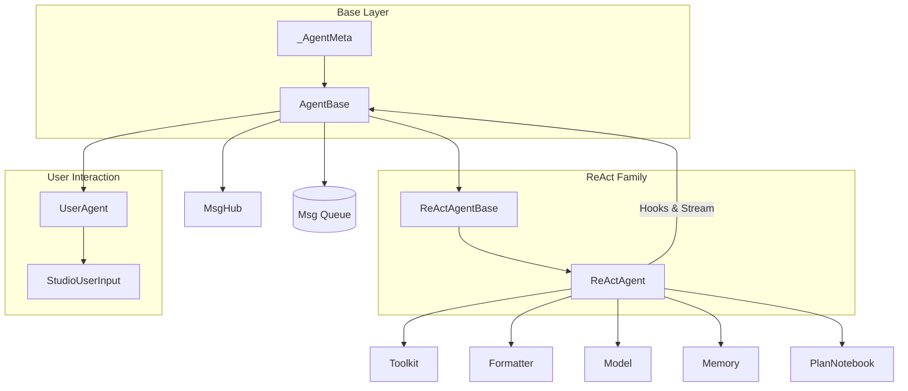

# SOP：src/agentscope/agent 模块

---

## 一、功能定义

### 1. 设计思路与逻辑

- 提供可组合的 Agent 抽象，负责"接收消息 → 推理 → 工具调用/汇总 → 输出"这一核心循环，同时保持与具体业务逻辑解耦。
- 通过通用 Hook、消息广播、流式输出和中断控制，让上层可在不修改 Agent 内核的情况下插入自定义观测或 UI 行为。
- 允许在主循环前后挂接 Memory、RAG、Plan、Toolkit 等模块，使 Agent 成为多组件编排的中心。

### 2. 架构设计

### 3. 核心组件逻辑

#### AgentBase

- **统一入口**：`reply`（生成响应）、`observe`（被动监听）、`print`（面向 UI 的块输出）、`interrupt`（取消当前任务并调用 `handle_interrupt`）。
- **Hook 系统**：支持类级和实例级前/后置 Hook；`_AgentMeta` 在类创建阶段织入 Hook 包装。
- **流式输出**：`print` 将文本/思考/图像/音频块写入 `_stream_prefix` 缓存；可选消息队列供管线聚合。
- **广播**：`_subscribers` 管理 MsgHub 订阅，`_broadcast_to_subscribers` 将生成的回复推送给其他 Agent 的 `observe`。
- **中断**：`_reply_task` 追踪当前 `reply`，`interrupt` 取消任务并触发自定义处理。

#### ReActAgentBase / ReActAgent

- **预处理**：在每轮 `reply` 前通过短期 memory 记录输入，按需从长期 memory/RAG 检索补充提示。
- **推理阶段**（`_reasoning`）：使用 Formatter 构造对话，调用 Model 获取思考文本、工具调用、结构化输出片段。
- **执行阶段**（`_acting`）：按顺序或并行（`parallel_tool_calls=True`）执行工具；若工具返回 `response_msg`，立即收束循环。
- **总结阶段**（`_summarizing`）：当没有有效回复时生成补充答案。
- **结构化输出**：`generate_response` 注册为完成函数；初始化阶段若提供 `structured_model` 会调用 `Toolkit.set_extended_model(finish_function_name, structured_model)`。当 LLM 调用完成函数工具时，Toolkit 使用该模型校验并把校验后的 `response` 写入 `ToolResponse.metadata["response_msg"]`，`ReActAgent.generate_response` 再将其写入最终 `Msg.metadata` 并作为回复正文。
- **计划协作**：注入 `PlanNotebook` 时，会创建 `plan_related` 工具组并利用 meta tool 控制启停。

#### UserAgent 与 StudioUserInput

- `UserAgent` 实现最简单的 `reply`/`observe`，用于命令终端或 Studio。
- `StudioUserInput` 以长轮询/重试方式从 Studio 拉取输入；`UserAgent.override_class_input_method` 可切换交互来源。

### 4. 子 Agent（SubAgentBase）骨架原则

- **定位**：`SubAgentBase` 仅提供“agent-as-tool”骨架，专注接口、资源注入与异常封装；任何业务流程、领域推理或特定工具编排都必须由外部示例/扩展包实现，禁止进入框架主干。
- **调用路径**：固定为 `ReActAgent._acting`（或其他 Host）识别子代理工具 → `make_subagent_tool` 生成的包装函数 → `SubAgentBase.export_agent` → `SubAgentBase.delegate` → 返回单个 `ToolResponse`。骨架必须确保该链路对 Host 保持透明。
- **上下文封装**：Host 在调度前调用 `_pre_context_compress(parent_context, task)` 生成 `delegation_context`，仅携带任务摘要与必要引用；子代理在 `delegate` 内部自行解包并写入独立短期 memory。
- **资源注入**：骨架复制“堆资源”（日志、Tracing、文件系统、Session、长期记忆、安全限制），其余均按最小权限初始化新实例，从而保证并行子代理互不污染。
- **健康检查与异常**：`export_agent` 必须执行 `healthcheck()`；`delegate` 统一将失败折叠为 `ToolResponse(metadata={"unavailable": True, ...})`，防止内部堆栈泄漏。
- **流式输出约束**：子代理执行期间不得向父级 MsgHub/print 输出中间片段，骨架统一在内部缓冲并最终返回。

#### 4.1 资源继承矩阵

| 资源 | 是否继承 | Skeleton 行为 |
| --- | --- | --- |
| Logger / 全局 `_config` | 是 | 复制引用，沿用同一日志策略与配置 |
| Tracing Provider / span pipeline | 是 | 子代理开辟子 span，但挂载在父级 span 之下 |
| FileSystem 句柄 | 是 | 共享底层实现，骨架负责限制命名空间（如 `/workspace/subagents/<name>/`） |
| Session/StateModule 管理器 | 是 | 继承管理器实例，骨架自动加子代理前缀避免键冲突 |
| Long-term Memory（RAG/知识库） | 是 | 获得同一长记忆句柄，具体读写策略由业务层定义 |
| 安全限制（budget、禁用工具等） | 是 | 骨架直接复制限制并在调用前校验 |
| Toolkit | 否（自建） | 由骨架根据 `tools_allowlist` 初始化，默认空列表 |
| 短期 Memory | 否（自建） | `delegate` 根据 `delegation_context` 重建，调用结束后可选择清理 |
| MsgHub / 流式输出队列 | 否 | 默认禁用，防止子代理广播 |
| Hook 注册链 | 否 | 子代理拥有独立 Hook，不继承父级挂载 |
| `_reply_task` 等运行状态 | 否 | 新实例独立维护执行状态 |

#### 4.2 注册与工具封装（`make_subagent_tool`）

- `SubAgentSpec`（骨架层定义）  
  - `name: str`：唯一标识，同时决定默认工具名后缀。  
  - `description: str`：供 LLM 选择的任务描述，需精确指向职责。  
  - `tools_allowlist: list[str] | None`：限制子代理内部可见的工具组/函数；不传则构造空 ToolKit，留给业务层扩展。  
  - `model_override: ChatModelBase | None`：可选模型替换；骨架仅保存引用，不内置推理逻辑。  
  - `tags: list[str] | None`：元数据供 Host 做选择或审计。  
  - `healthcheck: Callable[[], Awaitable[bool]] | None`：用于 spec 级外部自检；骨架在 `export_agent` 结束后统一合并为最终可执行判断。
- `make_subagent_tool(cls, spec, *, tool_name) -> tuple[ToolFunction, dict]`：  
  1. 在注册阶段调用 `cls.export_agent(...)` 做一次性健康检查（失败则跳过注册并记录）；  
  2. 返回符合 `Toolkit.register_tool_function` 协议的可调用对象；运行时每次调用都会重新实例化子代理，保证短期状态隔离；  
  3. 通过 `preset_kwargs` 隐藏权限、上下文构造逻辑，Host 仅暴露必要的用户参数给 LLM。

#### 4.3 `SubAgentBase` 接口与生命周期

- `@classmethod export_agent(cls, *, permissions: PermissionBundle, parent_context: ContextBundle, task: str, ephemeral_memory: bool = True) -> SubAgentBase`  
  - 复制堆资源 → 运行 `healthcheck()` → 返回全新子代理实例。骨架不得在此阶段做任何业务推理，只能完成依赖注入与安全校验。
- `@classmethod _pre_context_compress(cls, parent_context: ContextBundle, task: str) -> dict`  
  - 默认实现产出 `delegation_context`：`task_summary`、`recent_events<=4`、`long_term_refs`、`workspace_pointers`、`safety_flags`。Host 可覆写或扩展。骨架负责保证结构稳定。
- `async delegate(task_summary: str, context_bundle: dict, **kwargs) -> ToolResponse`  
  - 将上下文写入短期 memory → 调用 `await self.reply(...)`（仍由子类实现具体行为）→ 聚合所有输出为单个 `ToolResponse`。异常统一包装，`metadata["unavailable"]=True`。
- `def load_delegation_context(metadata: dict) -> None`  
  - 默认策略：把 `delegation_context` 写入 memory/state。骨架允许子类覆写，但必须保持幂等。
- `async def healthcheck(self) -> bool`  
  - 缺省返回 `True`；骨架仅定义调用点与日志约定。
- 生命周期约束：`ephemeral_memory=True` 时 `delegate` 完成后清理短期 memory，并释放与工具注册绑定的临时资源。

#### 4.4 文档示例与非目标

- 所有演示性的子代理（如 Web 检索、HTTP 抓取）必须放在 `docs/examples` 或 `examples/` 中呈现，框架层不内置任何业务实现。
- 首版仅支持单层委派（主 → 子），不包含自动扩散、路由优选或跨子代理协作调度。
- 互不共享上下文窗口；子代理不得直接回写主代理状态，唯一出口是 `ToolResponse`。
- Skeleton 不提供并发池/复用优化，必要时由上层在调用方自行缓存实例。

### 5. 关键设计模式

- **模板方法**：`AgentBase` 定义统一接口，`ReActAgent` 覆写推理/执行/总结细节。
- **策略模式**：Hook 注册、Plan 工具启停、结构化输出模型选择都以策略形式注入。
- **观察者模式**：MsgHub 订阅者、Hook 链、Plan 变化触发都体现事件广播。
- **装饰器元编程**：`_AgentMeta` 在类定义阶段织入 Hook 调用逻辑，避免运行时手动包装。

### 6. 其他组件的交互

- **Formatter & Model**：`ReActAgent` 依赖 Formatter 生成 prompt，调用 Model 获得文本/工具调用/结构化输出块，并将流式片段交给 `print`。
- **Toolkit**：推理阶段获取工具 schema；执行阶段调用 `Toolkit.call_tool_function`，支持同步/异步/生成器工具。
- **Memory/RAG/Plan**：短期/长期 memory 记录对话；`PlanNotebook` 提供计划相关工具；RAG 通过 `_retrieve_from_knowledge` 注入文档。
- **Pipeline**：`set_msg_queue_enabled` 与 `print` 结合，让 `pipeline.stream_printing_messages` 聚合多 Agent 输出。
- **Session**：继承 `StateModule`，可通过 `JSONSession` 保存 Agent 状态（例如 memory、工具配置）。

## 二、文件/类/函数/成员变量映射

### 核心文件结构

#### `src/agentscope/agent/_agent_base.py`

- **`AgentBase`**：Hook 注册/清理、消息队列、广播、`reply/observe/print/interrupt` 抽象；内部状态 `_reply_task`、`_stream_prefix`、`_subscribers`。
- **`deprecated` decorator**：来自 `typing_extensions`，用于标记即将下线的属性。

#### `src/agentscope/agent/_agent_meta.py`

- **`_AgentMeta`**：元类，在类创建时包裹 Hook，确保 `pre_*` 与 `post_*` 自动触发。

#### `src/agentscope/agent/_react_agent_base.py`

- **`ReActAgentBase`**：整合 Toolkit/Formatter/Model/Memories 的公共逻辑，定义工具注册、Hint 打印等共享行为。

#### `src/agentscope/agent/_react_agent.py`

- **`ReActAgent`**：完整 ReAct 循环、结构化输出、并行工具、计划/RAG/长期记忆集成等；关键方法 `_reasoning`、`_acting`、`_summarizing`、`generate_response`。
- 内部使用 `_json_schema`、`Toolkit.set_extended_model` 等配置结构化输出。

#### `src/agentscope/agent/_user_agent.py`

- **`UserAgent`**：面向命令行/Studio 的用户代理，实现最小 `reply` 与 `observe`。

#### `src/agentscope/agent/_user_input.py`

- **`StudioUserInput`**：基于 HTTP 轮询获取用户输入，处理重试与异常。

#### `src/agentscope/agent/__init__.py`

- 导出 `AgentBase`、`ReActAgent`、`UserAgent`、`StudioUserInput`。

#### `src/agentscope/agent/CLAUDE.md`

- 记录调用链、Hook 入口，文档更新时需同步。

### 子 Agent（SubAgentBase 骨架）新增/更新

#### 拟新增文件（文档先行，代码后续实现）

- `src/agentscope/agent/_subagent_base.py`：
  - 定义 `class SubAgentBase(AgentBase)`：用于“被当作工具调用”的轻量代理基类，固化不变量：仅接受封装上下文、仅产出 `ToolResponse`、最小权限白名单、默认关闭广播/队列外泄。
  - 骨架不提供任何领域 `reply` 实现；仓库内不会内置业务化子类，所有业务示例放在 `examples/` 或文档中。
- 提供 `@classmethod export_agent(cls, *, permissions: PermissionBundle, parent_context: ContextBundle, task: str, delegation_context: DelegationContext | None, run_healthcheck: bool = False) -> SubAgentBase`：复制共享句柄；当 `run_healthcheck=True` 时执行一次健康检查；上下文压缩由主代理在进入子代理前调用 `_pre_context_compress` 并通过 `delegation_context` 传入，骨架不再重复计算。
  - `_pre_context_compress(parent_context: ContextBundle, task: str) -> dict`：默认实现按 `delegation_context` 结构提取摘要，允许子类覆盖。
  - 核心统一入口：`async delegate(task_summary: str, context_bundle: dict, **kwargs) -> ToolResponse`，内部负责调用 `reply` 并聚合为最终 `ToolResponse`，且把 `delegation_context` 写入自身 `memory`（便于可追溯调试）。
- `src/agentscope/agent/_subagent_tool.py`（或工厂同名文件）：
  - `make_subagent_tool(cls: type[SubAgentBase], spec: SubAgentSpec, *, tool_name: str) -> tuple[ToolFunction, dict]` 接受子代理类；注册阶段调用 `cls.export_agent(...)` 进行一次性健康检查，失败则跳过注册；运行时每次工具调用都会重新执行 `export_agent` 创建新实例后再调用 `delegate(...)`。

#### 复用/约束

- 工具注册仍走 `Toolkit.register_tool_function`，其 `func_description` 承载“任务匹配”提示；预置 `preset_kwargs` 隐藏子代理引用与隔离策略。
- 流程与链路追踪继续复用 `trace_toolkit`，并在 `ToolResponse.metadata` 增补 `{ "subagent": name, "supervisor": agent_name }`。
- 与 `AgentBase` 的平衡：不在 `AgentBase` 增加子代理分支；`SubAgentBase` 仅继承共享堆（Logger、Tracing、FileSystem、Session/StateModule、LongTermMemory、安全限制），短期内存/Toolkit/运行状态/Hook 均独立构建，默认关闭广播（MsgHub）和对外流式输出。
- 禁止继承列表：`SubAgentBase` 不得继承/复用主代理的 `MsgHub`、主代理 `toolkit` 实例、主代理短期 `memory` 对象、主代理 Hook 注册链；如需访问主代理资源，仅允许使用共享堆中列举的句柄。

## 三、关键数据结构与对外接口（含类型/返回约束）
- `AgentBase`
  - `async reply(*args, **kwargs) -> Msg`：生成回复，必须返回 `Msg`。  
  - `async observe(msg: Msg | list[Msg] | None) -> None`：只接收消息，不返回。  
  - `async print(msg: Msg, last: bool = True) -> None`：处理分块输出；当 `last` 为真清空缓存。  
  - Hook API：`register_class_hook`/`register_instance_hook`/`remove_*`/`clear_*`（详见源码签名）。  
  - 队列：`set_msg_queue_enabled(enabled: bool, queue: Queue | None = None) -> None`。
- `ReActAgent`
  - 初始化参数：`name: str`、`sys_prompt: str`、`model: ChatModelBase`、`formatter: FormatterBase`、`toolkit: Toolkit | None`、`memory: MemoryBase | None`、`long_term_memory: LongTermMemoryBase | None`、`long_term_memory_mode: Literal["agent_control","static_control","both"]`、`plan_notebook: PlanNotebook | None`、`parallel_tool_calls: bool`、`max_iters: int`、`enable_meta_tool: bool`、`print_hint_msg: bool`。  
  - 关键方法：`async __call__`（别名 `reply`）、`_reasoning`、`_acting`、`_summarizing`、`generate_response`、`_retrieve_from_long_term_memory`、`_retrieve_from_knowledge`。  
  - 结构化输出：`finish_function_name = "generate_response"`；`Toolkit.set_extended_model` 强制结构化工具。  
  - 并发：当 `parallel_tool_calls` 为真，`asyncio.gather` 并行工具调用，捕获异常后向上传递。
- `UserAgent`
  - 继承 `AgentBase`，`reply` 读取标准输入或自定义输入源，`observe` 将消息缓存到历史，`print` 输出到终端或 Studio。
- `StudioUserInput`
  - 调用方式：实例化后传入 `UserAgent.override_class_input_method`；方法 `__call__` 异步轮询 Studio，返回用户 `Msg`。
- Hook 类型
  - `AgentHookTypes` 在 `src/agentscope/types/_hook.py` 定义，`pre_reply`/`post_reply`/`pre_print`/`post_print`/`pre_observe`/`post_observe`。
- 消息结构
  - 代理处理的 `Msg` 来自 `src/agentscope/message/_message_base.py`，支持文本、多媒体、工具调用等块；Agent 负责将输出块写入 `print`。

### 子 Agent（SubAgentBase）接口草案
- `SubAgentSpec`（拟）  
  - 字段：
    - `name: str`（唯一名，亦用于工具名后缀）
    - `description: str`（任务匹配提示，要求尽可能具体）
    - `tools_allowlist: list[str] | None`（工具组/函数白名单，最小权限）
    - `model_override: ChatModelBase | None`（可选模型覆盖；缺省继承子代理现有设置）
    - `tags: list[str] | None`（匹配提示用）
    - `healthcheck: Callable[[], Awaitable[bool]] | None`（可选外部健康检查，失败时沿用普通 Agent 日志与 Tracing 语义；缺省由子代理实例自检）
  - 不变量：  
    - 任何一次子代理调用不得修改主代理内部状态；只允许通过 `ToolResponse` 回传结果。  
    - 工具白名单只增不减时需要重新注册；动态切换需走 `Toolkit.update_tool_groups` 或重建工具。
- `PermissionBundle`（拟）
  - `logger: logging.Logger`（与主代理保持一致，统一日志输出）
  - `trace_provider: opentelemetry.trace.Tracer | None`（复用 OpenTelemetry pipeline，保持同一 span 链路）
  - `filesystem: FileSystemBase | None`（共享文件系统句柄，骨架限制写入命名空间）
  - `session: SessionBase | None`（共享状态持久化入口，命名空间隔离）
  - `long_term_memory: LongTermMemoryBase | None`（共享长期记忆句柄）
  - `safety_limits: dict[str, JSONSerializableObject]`（预算、禁用工具等约束）
  - `supervisor_name: str`（当前主代理标识，写入 `ToolResponse.metadata`）
- `ContextBundle`（拟）
  - `conversation: list[Msg]`（主代理短期消息序列，用于 `_pre_context_compress` 生成摘要）
  - `recent_tool_results: list[Msg]`（最近工具执行结果，便于过滤噪声）
  - `long_term_refs: list[dict[str, JSONSerializableObject]]`（来自共享长记忆/RAG 的引用）
  - `workspace: FileSystemBase | None`（用于生成可共享的 artifact 路径）
- `DelegationContext`（拟）
  - 标准字段：`task_summary`、`recent_events`、`long_term_refs`、`workspace_pointers`、`safety_flags`
  - 由 `_pre_context_compress` 输出，写入最新 user `Msg.metadata["delegation_context"]`，供 `delegate` 复原短期 memory。
- 工具函数签名（拟）  
  - `async invoke_subagent(query: str, context: dict[str, JSONSerializableObject] | None = None) -> ToolResponse`（在注册时可根据 `tool_name` 重命名）  
    - 行为：构造 `Msg("user", query, "user", metadata=context)`，转换为 `delegation_context` 后调用 `SubAgentBase.delegate(...)`；收束其输出为单个 `ToolResponse`（`is_last=True`），不透出中间流式块。异常时返回“静默失败”响应（文本提示 + `metadata={"unavailable": true}`），并写入日志/Tracing。

#### SubAgentBase 接口与生命周期（新增）
- `class SubAgentBase(AgentBase)`：
  - `reply`/`observe` 仍需子类实现或覆写，骨架仅提供委派入口与资源注入，不内置业务逻辑。
  - `@classmethod export_agent(cls, *, permissions: PermissionBundle, parent_context: ContextBundle, task: str, delegation_context: DelegationContext | None, run_healthcheck: bool = False, tools_allowlist: list[str] | None = None, model_override: ChatModelBase | None = None, host_toolkit: Toolkit | None = None, ephemeral_memory: bool = True) -> SubAgentBase`：创建全新子代理实例并注入共享句柄；当 `run_healthcheck=True` 时执行一次健康检查，否则跳过；上下文压缩产物由 Host 通过 `delegation_context` 传入。
  - `@classmethod _pre_context_compress(cls, parent_context: ContextBundle, task: str) -> dict`：默认实现按 `delegation_context` 五段结构返回摘要，至少包含 `task_summary`、`recent_events`、`long_term_refs`、`workspace_pointers`、`safety_flags`；供主代理在进入子代理之前调用；子类可覆盖以引入更复杂压缩策略。
  - `async delegate(task_summary: str, delegation_context: DelegationContext | None, **kwargs) -> ToolResponse`：统一代理入口，供主代理 `_acting` 使用。实现要求：① 调用 `load_delegation_context` 把摘要写入短期 `memory`；② 运行自身 `reply` 循环并折叠为单个 `ToolResponse`；③ 禁止广播/写父级队列；④ 异常（超时、最大迭代等）返回 `ToolResponse(is_last=True, metadata={"unavailable": True, "error": ...})` 并记录日志、Tracing。
  - `def load_delegation_context(metadata: dict) -> None`：将封装上下文落入本地短期 `memory`（或专用 state）以维持可观测与可追溯。
  - `async def healthcheck() -> bool`：默认实现返回 `True`；仅在注册阶段显式请求时调用，失败即不允许该子代理注册。
  - 权限注入：通过 `permissions: PermissionBundle` 一次性复制必要句柄；文件系统句柄会裁剪到 `/workspace/subagents/<name>/` 命名空间，Toolkit 按 `tools_allowlist` 克隆最小权限工具集；`ephemeral_memory=True` 时调用完成后重置短期 memory；Hook 链默认独立于父 Agent。

## 四、与其他模块交互（调用链与责任边界）
- **推理-执行链路**：  
  `Formatter.format` → `ChatModelBase.__call__`（输出文本/工具） → `Toolkit.call_tool_function`（执行工具并返回 `ToolResponse`） → `ReActAgent.generate_response`（结构化输出） → `AgentBase.print`/`MsgHub.broadcast`。  
  Agent 对 LLM/工具异常不做吞并，抛给上层或交由 Hook 处理。
- **Memory & RAG**：若提供 `memory`，在 `reply` 前后调用 `memory.add`；`long_term_memory` 依 `long_term_memory_mode` 控制自动/手动记录；`knowledge` 列表在 `_retrieve_from_knowledge` 中被调用。  
- **Plan 工具**：一旦 `PlanNotebook` 存在，ReActAgent 会在 Toolkit 中注册计划工具组以及元工具；Plan 提示可通过 `print_hint_msg` 输出。  
- **Pipeline**：`pipeline.stream_printing_messages` 启动时调用 `set_msg_queue_enabled(True, queue)`；完成后传递 `[END]` 信号关闭。  
- **Session & Persistence**：继承 `StateModule`，`AgentBase` 的属性可通过 `JSONSession` 保存；若新增状态需调用 `register_state`。  
- **责任边界**：Agent 不持久化业务数据，不负责具体工具实现；Hook 中应避免阻塞操作，必要时改为异步。

### 子 Agent（SubAgentBase）交互与链路
- 调用链（显式统一）：  
`ReActAgent._reasoning → Toolkit.get_json_schemas()（含子代理工具） → Model 选择 tool_use → Toolkit.call_tool_function(<subagent_tool_name>) → SubAgentBase.export_agent(...) → 子代理实例.delegate(...) → ToolResponse（聚合后返回） → ReActAgent.generate_response/print`
- 生命周期（单次调用）：  
  1. Toolkit 注册阶段：调用 `SubAgentBase.export_agent(...)` 进行健康检查，通过后生成工具描述并注册；若抛出 `SubAgentUnavailable`，该子代理不被注册。  
  2. 主代理 `_acting`：识别工具 → 再次调用 `SubAgentBase.export_agent(...)` 构建实际实例。  
  3. 子代理执行：`delegate` 写入短期 memory → 运行 `reply` → 返回 `ToolResponse`。  
  4. 资源回收：若 `ephemeral_memory=True`，调用结束后清空短期 memory；实例可直接销毁或交由对象池复用。
- 隔离策略：  
  - `memory`：子代理持有独立短期 `MemoryBase` 实例；初始化由 `delegation_context` 填充，调用结束后可按需清理；长期记忆允许共享主代理的 `LongTermMemoryBase` 句柄（通过 `PermissionBundle` 注入），以便统一读写长久知识。  
  - `memory 入参`：主代理在 `_acting` 进入子代理分支前必须按上述 `delegation_context` 结构完成压缩与标注，禁止直接拷贝完整对话历史。  
  - `toolkit`：按 `tools_allowlist`/组名创建或裁剪；主代理不可直接调用子代理工具。  
  - `model`：若 `model_override` 提供，则以覆盖模型执行本次调用；否则沿用子代理默认。  
  - `权限句柄复制`：子代理作为 `AgentBase` 子类需从主代理复制必须的权限句柄（如 FileSystem、Tracing、Session/StateModule 引用）；复制后仍遵循子代理自身白名单策略，禁止继承/访问 MsgHub（防止广播泄漏）、主代理 `toolkit` 内部状态、主代理 `memory` 对象本体。
  - 文件系统（可选）：子代理写入 `/workspace/subagents/<name>/` 命名空间；避免 `/internal` 暴露给子代理工具。
- 健康检查与故障语义：  
  - 注册阶段通过 `export_agent` 执行一次性 `healthcheck()`；失败则取消该子代理工具注册（记录 warning 与 tracing），后续不再尝试调用。  
  - 运行期异常（超时/最大迭代等）不向上抛出，统一由 `delegate` 返回标记 `metadata.unavailable=True` 的 `ToolResponse`，主代理可继续后续推理或改选其他工具。

#### 与 AgentBase 的平衡（新增）
- `AgentBase` 保持通用与无分支：不混入子代理特化分支。
- `SubAgentBase` 自持 Hook/State 链（不继承父级注册项），默认关闭广播（MsgHub）与对外流式输出，避免泄漏中间态。
- Session/StateModule：共享管理器但使用以子代理名称为前缀的 namespace 序列化，防止覆盖主代理状态。
- 兼容性：保留 `reply/observe/print` 以支持在必要时直接作为独立 Agent 运行；但“被当作工具调用”时统一经 `delegate(...)` 入口。
- 业务逻辑：骨架不内置任何领域处理流程，`SubAgentBase` 子类必须在示例或业务仓库中自行实现。

## 五、测试文件
- 绑定文件：`tests/react_agent_test.py`、`tests/user_input_test.py`
- 覆盖点：ReAct 主循环、并行工具与完成函数、中断流程、打印与队列、Studio 用户输入覆写。

### 子 Agent（SubAgentBase）测试计划（证明义务）
- 注册与 Schema：使用最小 Mock 子类注册两个子代理工具，断言 `Toolkit.get_json_schemas()` 含正确函数名与描述；当提供 `tools_allowlist` 时，`reset_equipped_tools` 不影响子代理内部白名单。
- 自动匹配：构造假模型输出 `tool_use(name="agent_search", arguments={...})`，验证最终 `ToolResponse` 聚合、且不出现子代理流式块；Mock 子类仅返回固定响应，确认骨架行为。
- 显式调用：在提示中强制 LLM 选择特定工具（如 `agent_search`），验证路由到目标子代理，而不引入实际领域逻辑。
- 隔离不变量：子代理 `memory.size()` 递增，主代理内存不变；主代理 `toolkit` 中不可见子代理内部工具。
- 健康检查与静默失败：强制健康检查失败时应直接拒绝注册该子代理工具；运行期模拟异常（超时等）则需返回 `metadata.unavailable=True` 且不中断主代理循环。
- 并行调用：当主代理并行执行多个子代理工具，验证互不干扰、结果顺序与 `gather` 行为一致。
- 上下文压缩：构造包含长历史的输入，确认传入子代理的上下文仅为摘要而非完整文本（可通过注入链路记录长度或关键字）。
- 权限复制：模拟主代理具备文件系统/Tracing 句柄，断言子代理实例持有同句柄引用并遵循各自白名单。
- SubAgentBase 契约：`delegate(...)` 必须返回 `ToolResponse(is_last=True)`；`load_delegation_context(...)` 将上下文写入短期 `memory`；`export_agent` 在注册期调用 `healthcheck()`，若失败应终止注册（不生成工具）。

## 附录(SubAgent核心思想)
### 1. SubAgent 的角色定位

- 继承：SubAgent 仍是 AgentBase 的子类，天然拥有 Agent 的全部能力；它跟主 Agent 的关系就像“线程之于进程”。
    - 共享父 Agent 的“堆”——文件系统句柄、Tracing、Session/StateModule、长期记忆等全局资源；
    - 拥有自己的“栈”——短期记忆、上下文、工具集、运行状态等。
- 生命周期：SubAgent 不是常驻实例，每次调用前通过 `SubAgentBase.export_agent(cls)` 构建一个全新实例：
    1. 父 Agent 传入自己的共享句柄（文件系统、长记忆等）和安全标记；
    2. Host 在进入子代理之前调用 `_pre_context_compress` 生成摘要，并写入“最新的 user 消息”的 metadata；`export_agent` 不执行压缩。
    3. 仅在初始化的时候调用 `healthcheck()` 分辨该 SubAgent 是否需要启动，若失败则不注册（后续不再尝试）。
### 2. 共享资源 vs 独立资源

| 资源 | 处理方式 | 说明 |
| --- | --- | --- |
| Logger、Tracing Provider、全局 _config | 直接继承引用 | 维持统一日志/链路 |
| FileSystem 句柄 | 继承引用 | “堆”共享，但路径隔离 |
| Session/StateModule Manager | 继承引用，在不同 namespace 下保存 | 便于统一持久化 |
| Long-term Memory（RAG/知识库） | 继承引用，可自由读写 | 所有代理共享同一知识库 |
| 安全限制（budget、禁用工具等） | 可以继承，本身自己还有一套Tools | 子代理可以继承父级 |
| Toolkit | 自建（基于 allowlist） | 防止过度权限 |
| 短期 Memory | 自建；初始内容来自 _pre_context_compress | 每次调用都是不同实例 |
| MsgHub / 广播 / 流式输出 | 默认关闭 | 禁止泄漏中间过程 |
| 运行状态（_reply_task 等） | 子代理自己维护 | 栈变量各自独立 |
| Hook | 不继承 | 二者分别独立

### 3. 上下文压缩与短期记忆

- 新增 _pre_context_compress(parent_context: ContextBundle,task:str) -> SubAgent：根据传入的`task`任务目标，负责把父 Agent
的对话历史、工具结果等压缩成必需信息。默认
  处理：
    - 摘要当前任务（task_summary）；
    - 列出与任务相关的最近若干条事件（recent_events，默认 ≤4 条）；
    - 提供可继续检索的长期记忆引用（long_term_refs，含 id 和简短说明）；
    - 列出可访问的 artifact／workspace 路径；
    - 携带安全限制（safety_flags）。
- 子代理实例化后，在 load_delegation_context 中把这些信息写入自己的短期 memory，构成本轮任务的“栈帧”。

### 4. 调用与异常语义

- 主 Agent _acting 在识别到 SubAgent 工具名时，调用 SubAgentBase.export_agent(...) → delegate(...)。
- delegate(...) 内部步骤：
    1. 通过主代理预生成的 `delegation_context`（进入子代理前 `_pre_context_compress`）+ `load_delegation_context` 初始化短期记忆；
    2. 自己的 Toolkit 运行 reply（可能多轮）；
    3. 将最终结果折叠成单个 ToolResponse(is_last=True) 返回给主 Agent。
- 异常处理：无论是运行时异常、超时、超过最大迭代次数，都不抛到主 Agent；而是返回一条带错误说明的 ToolResponse，例如：

  ToolResponse(
      content=[TextBlock(type="text", text="[subagent_timeout] agent_search 超时，请稍后再试")],
      metadata={"unavailable": True, "error": "timeout"},
      is_last=True,
  )

  同时通过 _logging.logger 记录 warning，并由 Tracing 标记异常 span。

### 5. 生命周期与资源回收

1. 主 Agent 根据需要调用 SubAgentBase.export_agent（可能使用池化/缓存策略，但每次任务至少保证短期 memory 是干净的）。
2. 构造阶段执行健康检查；失败则直接返回静默失败结果（或不注册该工具）。
3. 进入 delegate 执行任务；若开启 ephemeral_memory=True，任务结束后清空短期 memory，以免下一次调用带污染。
4. 返回 ToolResponse 给主 Agent；子代理实例可随即丢弃或放入对象池。

### 6. 实战示例：双子代理委派月地距离估算

#### 6.1 场景设定
- 主体：`ResearchSupervisor` 继承自 `ReActAgent`，自身 `toolkit` 为空，仅根据 `_acting` 匹配到子代理工具。
- 子代理 A：`WebSearchSubAgent`（allowlist=`["search_web"]`），专职从外部检索 Eliud Kipchoge 的马拉松配速与“Moon perigee”出处。
- 子代理 B：`HttpFetchSubAgent`（allowlist=`["http_request"]`），对网页发起请求，用于抓取维基百科月球页面的最近近地点（perigee）。
- 注册流程：两名子代理在启动阶段执行 `export_agent(...)` → `healthcheck()`；任一失败即放弃注册，后续不再尝试调用。
- 继承关系：二者共享父代理的 Logger、Tracing、FileSystem 句柄、Session/StateModule 管理器与 Long-term Memory；短期 memory/Hook/工具列表保持独立，MsgHub 默认关闭。

#### 6.2 “规范→不变量→测试→示例→代码”链路
| 规范 | 不变量 | 测试建议 | 示例验证 | 代码锚点 |
| --- | --- | --- | --- | --- |
| 子代理以工具形态暴露，调用路径必须是 `_acting` → `export_agent` → `delegate` | 主体 `toolkit` 为空，所有工具调用均通过子代理 `ToolResponse` 返回 | `tests/agent/test_subagent_tool.py::test_host_without_direct_tools` | 步骤 2/4 中，`ResearchSupervisor` 仅触发子代理工具 | `src/agentscope/agent/_subagent_tool.py` |
| 共享“堆”资源，但短期 memory 与 Hook 独立 | `delegation_context` 写入子代理短期 memory，长记忆指针引用同一 RAG | `tests/agent/test_subagent_memory_isolation.py::test_subagent_memory_isolation` | 步骤 1/3 中（Host 预先 `_pre_context_compress` 并写入“最新的 user 消息”）短期 memory 每轮重建 | `src/agentscope/agent/_react_agent.py::_acting` |
| 工具白名单与 Schema 传递 | 子代理仅能看到 allowlist 工具，Host JSON Schema 含子代理条目 | `tests/agent/test_subagent_allowlist_schema.py::test_subagent_allowlist_schema` | 文档步骤 2 | `src/agentscope/agent/_subagent_base.py::_hydrate_toolkit` |
| 文件系统命名空间隔离 | 子代理写入限定在 `/workspace/subagents/<name>/` | `tests/agent/test_subagent_fs_namespace.py::test_subagent_filesystem_namespace` | 文档步骤 2/3 | `src/agentscope/agent/_subagent_base.py::__init__` |
| 并行调用互不污染 | 并行 gather 时短期 memory 与顺序可控 | `tests/agent/test_subagent_parallel.py::test_subagent_parallel_calls` | 文档步骤 2/4 | `src/agentscope/agent/_subagent_tool.py::_invoke_subagent` |
| 异常需封装成 `ToolResponse(metadata.unavailable=True)` | 超时/工具缺失不得泄漏堆栈 | `tests/agent/test_subagent_error_propagation.py::test_subagent_error_propagation` | 文档步骤 5 | `src/agentscope/agent/_subagent_base.py::delegate` |

#### 6.3 委派执行步骤
1. **任务接收**：`ResearchSupervisor.reply` 收到用户问题“若 Kipchoge 维持世界纪录配速，跑完月地最小距离需多少千小时（四舍五入到 1000 小时）？”。主代理在进入子代理之前调用 `_pre_context_compress` 生成摘要，并将 `delegation_context` 写入“最新的 user 消息”的 metadata 传入子代理。
2. **匹配子代理 A（搜索）**：`_acting` 识别 `agent_web_search` 工具描述“需要检索公开来源”并调用 `WebSearchSubAgent.delegate(...)`。子代理利用 `search_web` 工具返回：Kipchoge 2018 年柏林马拉松成绩为 2 小时 1 分 9 秒；月球最近近地点在维基百科页面的 363300 公里条目。
3. **匹配子代理 B（HTTP 抓取）**：根据第 2 步返回的 URL，`ResearchSupervisor` 调用 `HttpFetchSubAgent.delegate(...)`。子代理通过 `http_request` 抓取并解析页面，确认“Minimum perigee distance = 363300 km”，同时返回上下文引用路径。
4. **主代理计算**：父代理在自身推理栈内（无额外工具）完成换算：先计算 Kipchoge 平均速度 `42.195 km ÷ (2 + 1/60 + 9/3600) h ≈ 20.897 km/h`，再求 `363300 km ÷ 20.897 km/h ≈ 17377 h`，最终按要求四舍五入至最近的 1000 小时得到 **17000 小时**。
5. **异常分支**：若任一子代理在步骤 2 或 3 内超时或达到最大迭代次数，`delegate` 返回 `ToolResponse(metadata={"unavailable": True, "error": "timeout"})`，主代理记录 warning 并决定重试或解释失败原因，符合“异常不抛回父代理”约束。
6. **生命周期结束**：因 `ephemeral_memory=True`，两名子代理在 `delegate` 完成后清空短期 memory；共享长记忆（含检索到的 perigee 引用）则保留在父代理命名空间，供后续任务复用。

> 该示例在不编写代码的情况下验证了：① 子代理以工具形态被调用；② 共享资源/独立资源划分在真实场景中成立；③ `_pre_context_compress`、错误封装、生命周期回收等关键不变量可通过后续测试落地。
