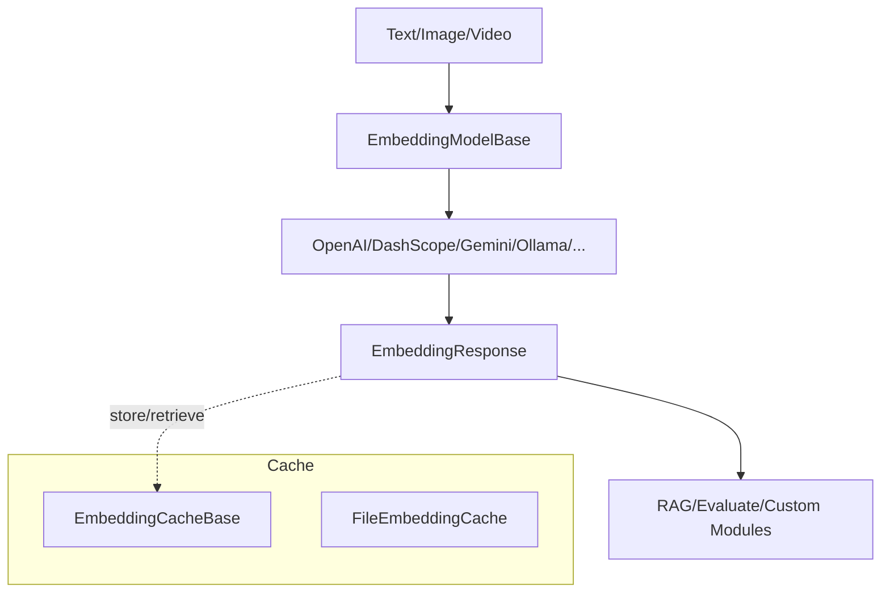

# SOP：src/agentscope/embedding 模块

## 一、功能定义（Scope/非目标）
### 1. 设计思路和逻辑
- 统一多家提供方的文本/多模态嵌入接口，输出一致的 `EmbeddingResponse` 与 `EmbeddingUsage`，方便 RAG、评测等模块复用。
- 提供可选缓存机制（文件缓存等）以减少重复请求；支持跟踪调用耗时与 token 使用。
- 不实现复杂的批量切分、重试或速率控制，这些能力由调用方或上游调度器负责。

### 2. 架构设计

### 3. 核心组件逻辑
- **EmbeddingModelBase**：定义基础属性 `model_name`、`dimensions`、`supported_modalities`，以及异步 `__call__` 接口。具体模型实现负责调用 SDK 并组装 `EmbeddingResponse`。
- **具体模型实现**：
  - `OpenAITextEmbedding`、`DashScopeEmbedding`、`DashScopeMultimodalEmbedding`、`GeminiEmbedding`、`OllamaEmbedding` 等，分别适配对应服务。
  - 每个实现处理请求参数、响应解析、用量统计（若提供）以及异常向上抛。
- **EmbeddingResponse / EmbeddingUsage**：返回向量列表、唯一 id、时间戳、来源（API/缓存）以及用量信息（耗时、token 数等）。
- **缓存机制**：
  - `EmbeddingCacheBase` 定义 `store/retrieve/remove/clear` 接口；
  - `FileEmbeddingCache` 根据标识符生成哈希文件名，使用 `.npy` 存储向量，并支持容量/数量限制。
- **Tracing**：模型实现可配合 `trace_embedding` 装饰器记录调用信息。

### 4. 关键设计模式
- **适配器模式**：不同模型服务实现共同的 `EmbeddingModelBase` 接口。
- **策略模式**：缓存实现与调用方可自定义（文件缓存、内存缓存等）。
- **数据传输对象**：`EmbeddingResponse`、`EmbeddingUsage` 用于标准化响应结构。

### 5. 其他组件的交互
- **RAG/KnowledgeBase**：通过注入 `EmbeddingModelBase` 实现文档向量化与检索。
- **Evaluate**：可使用嵌入评估解决方案相似度等指标。
- **Tracing 模块**：`trace_embedding` 可记录向量生成调用。
- **责任边界**：模块不处理大文档切片、不控制速率限制；这些由调用方或 RAG 流程负责。

## 二、文件/类/函数/成员变量映射到 src 路径
- `src/agentscope/embedding/_embedding_base.py`
  - `EmbeddingModelBase`：基础属性与抽象 `__call__`。
- `src/agentscope/embedding/_embedding_response.py` / `_embedding_usage.py`
  - `EmbeddingResponse`、`EmbeddingUsage` 数据结构。
- `src/agentscope/embedding/_openai_embedding.py`
  - `OpenAITextEmbedding`：调用 OpenAI Embeddings API。
- `src/agentscope/embedding/_dashscope_embedding.py`、`_dashscope_multimodal_embedding.py`
  - 针对 DashScope 的文本/多模态嵌入。
- `src/agentscope/embedding/_gemini_embedding.py`
  - Google Gemini 嵌入实现。
- `src/agentscope/embedding/_ollama_embedding.py`
  - 本地 Ollama 模型嵌入。
- `src/agentscope/embedding/_cache_base.py`、`_file_cache.py`
  - 缓存抽象与文件缓存实现。
- `src/agentscope/embedding/__init__.py`
  - 导出所有模型与缓存；

## 三、关键数据结构与对外接口（含类型/返回约束）
- `EmbeddingModelBase.__call__(*args, **kwargs) -> EmbeddingResponse`
  - 参数因提供方差异，可包含文本、图像、音频等；返回 `EmbeddingResponse`。
  - 异常：SDK/网络错误直接抛出。
- `EmbeddingResponse`
  - `embeddings: list[Embedding]`（`Embedding` 为 `list[float]`）
  - `usage: EmbeddingUsage | None`、`source: Literal["api","cache"]`、`created_at`、`id`。
- `EmbeddingUsage`
  - `time: float`、`tokens: int | None`、`type="embedding"`。
- `EmbeddingCacheBase` 接口
  - `store(embeddings, identifier, overwrite=False)`
  - `retrieve(identifier) -> list[Embedding] | None`
  - `remove(identifier)`、`clear()`
  - `identifier` 必须 JSON 可序列化。
- `FileEmbeddingCache(cache_dir="./.cache/embeddings", max_file_number=None, max_cache_size=None)`
  - 使用 `.npy` 文件存储；若超出限制按时间顺序淘汰。

## 四、与其他模块交互（调用链与责任边界）
- **RAG 工作流**：文档 → Reader → `EmbeddingModelBase` → 向量存储；结果 `EmbeddingResponse` 可缓存以减少重复调用。
- **缓存策略**：调用方可在使用前查询缓存，命中时跳过 API 调用，写 `source="cache"`；未命中再调用模型。
- **Tracing & Logging**：嵌入模型可结合 `trace_embedding`；缓存删除或淘汰时通过 logger 输出信息。
- **责任边界**：不负责分词、chunk 切分和嵌入后聚合；也不处理速率限制，SDK 抛出的异常需调用方处理。

## 五、测试文件
- 绑定文件：`tests/embedding_cache_test.py`
- 覆盖点：缓存读写、重复请求命中策略.
