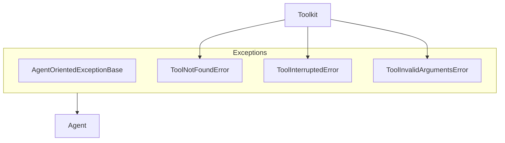

# SOP：src/agentscope/exception 模块

## 一、功能定义（Scope/非目标）
### 1. 设计思路和逻辑
- 定义面向 Agent 的异常基类与常用工具相关异常，确保运行时错误能被捕获并反馈给 LLM/用户，而不是以未处理异常形式终止流程。
- 异常类仅封装信息，不承担日志记录或错误恢复责任。

### 2. 架构设计

### 3. 核心组件逻辑
- `AgentOrientedExceptionBase(message: str)`：保存 message，并在 `__str__` 中统一格式 `ClassName: message`。
- `ToolNotFoundError`：在 Toolkit 找不到指定工具时抛出。
- `ToolInterruptedError`：用户主动中断工具执行（如 `interrupt()`）时使用。
- `ToolInvalidArgumentsError`：工具参数校验失败时抛出。

### 4. 关键设计模式
- **简单继承层次**：所有可向 Agent 暴露的异常继承统一基类，便于调用方捕获一类异常。
- **语义化命名**：子类以场景命名，提高可读性。

### 5. 其他组件的交互
- **Toolkit**：在工具注册/调用过程遇到找不到工具、参数不合法、用户中断等情况时抛出相应异常。
- **Agent/ReActAgent**：可以捕获 `AgentOrientedExceptionBase` 并将信息以 `ToolResponse` 或日志形式反馈给 LLM。
- **责任边界**：异常仅传递信息，不负责记录日志或重试。

## 二、文件/类/函数/成员变量映射到 src 路径
- `src/agentscope/exception/_exception_base.py`
  - `AgentOrientedExceptionBase`。
- `src/agentscope/exception/_tool.py`
  - `ToolNotFoundError`、`ToolInterruptedError`、`ToolInvalidArgumentsError`。
- `src/agentscope/exception/__init__.py`
  - 导出上述异常。

## 三、关键数据结构与对外接口（含类型/返回约束）
- `AgentOrientedExceptionBase(message: str)`
  - 属性：`message: str`；`__str__` 返回 `ClassName: message`。
- 子类（`ToolNotFoundError` 等）不新增字段，只在语义上区分错误类型。

## 四、与其他模块交互（调用链与责任边界）
- 当 Toolkit 发现问题 → 抛出对应异常 → Agent 捕获并决定如何反馈（比如生成错误 `ToolResponse` 或写日志）。
- 其他模块也可继承 `AgentOrientedExceptionBase` 定义自有异常，以便统一处理。

## 五、测试文件
- 绑定文件：间接：上层用例
- 覆盖点：在 Agent/Toolkit 错误用例中覆盖.
