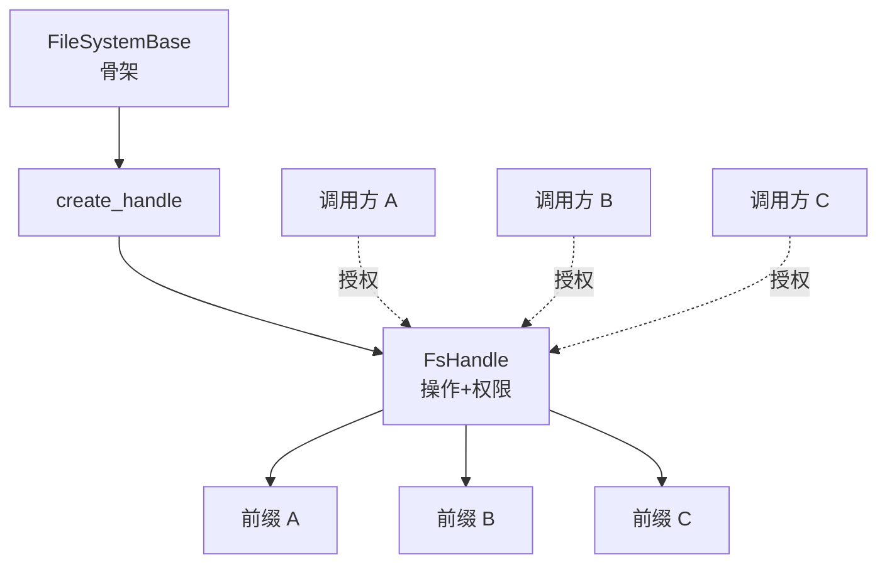
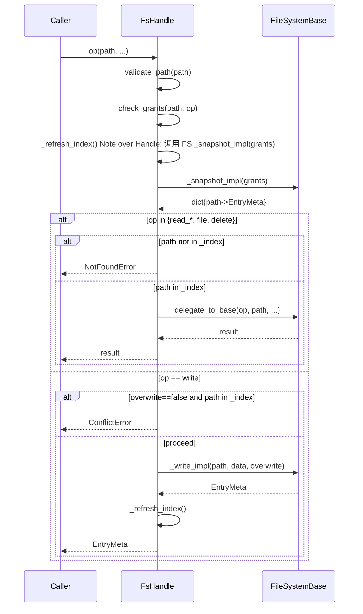
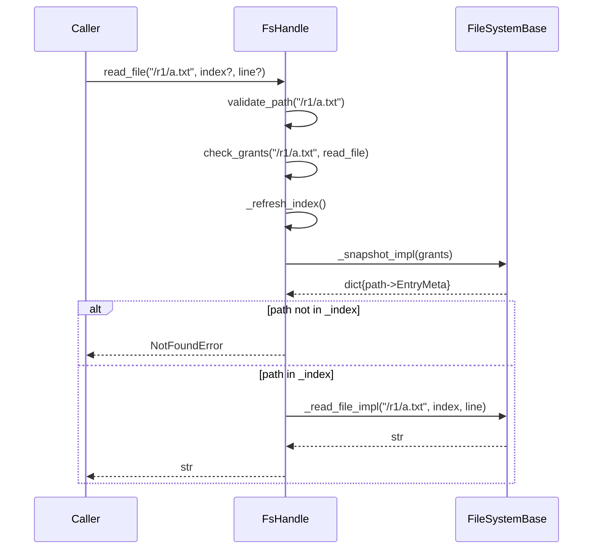
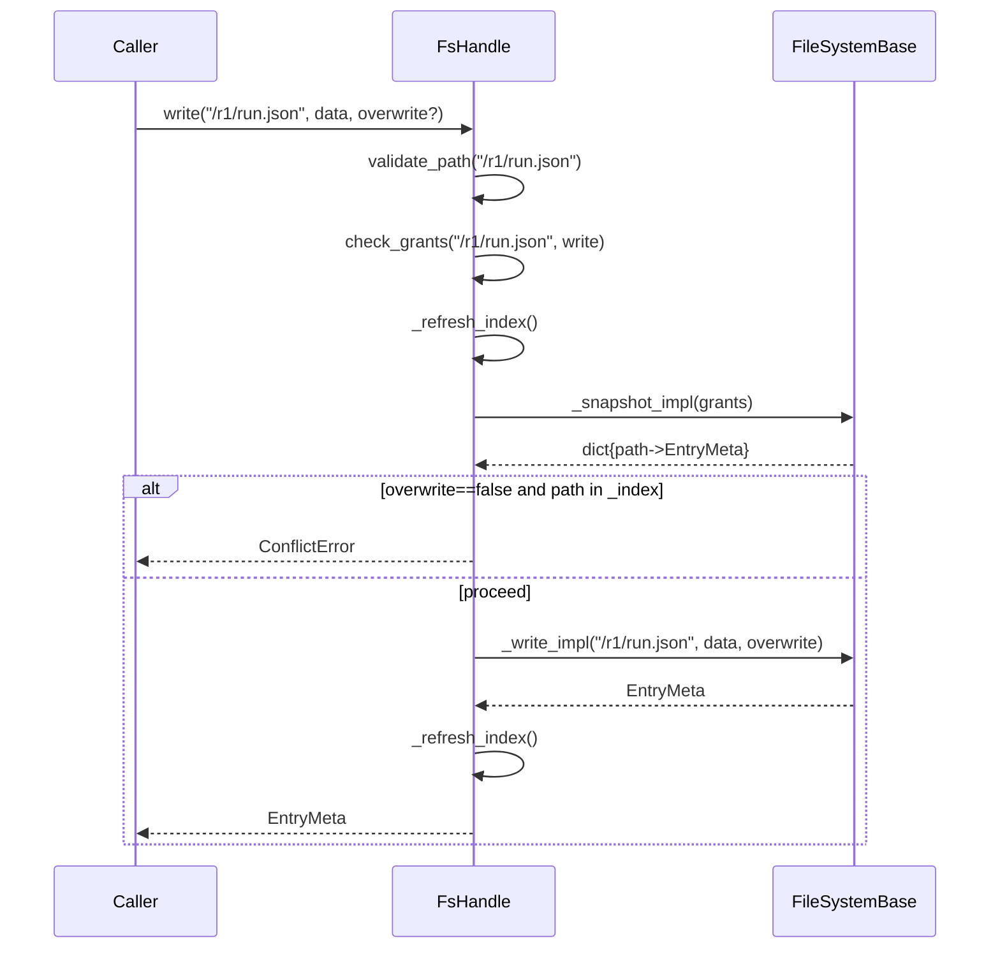
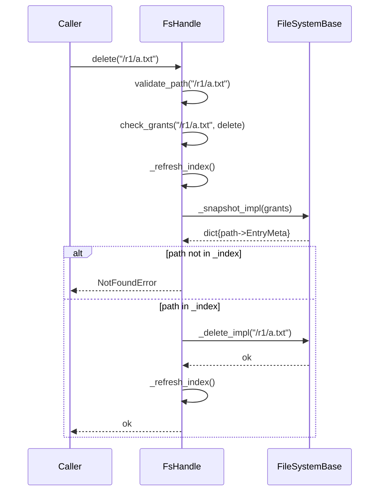
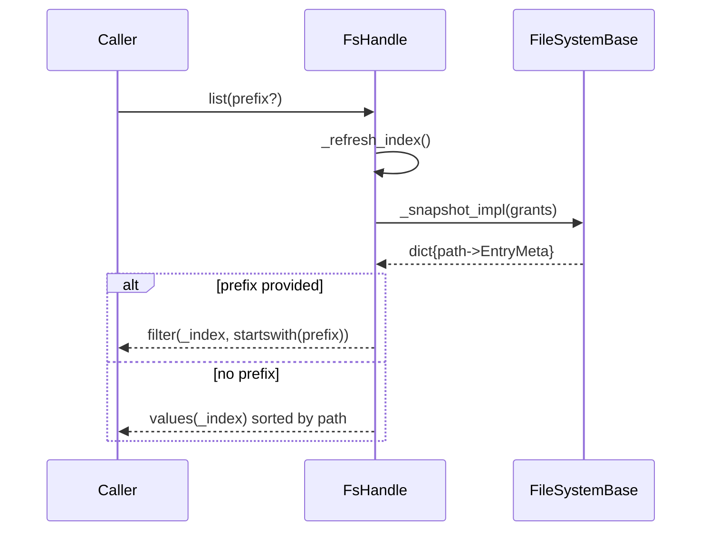

# SOP：src/agentscope/filesystem 模块

## 一、功能定义（Scope/非目标）

- 提供受控的“逻辑文件管理”骨架，所有调用方（框架内部逻辑、Agent、工具、插件等）均通过统一接口调用文件操作。
- 只定义抽象与权限模型；具体存储介质、持久化策略由上层产品实现，保持文档优先、代码可再生。
- 对外提供原子动作集：`list`、`file`、`read_binary`、`read_file`、`read_re`、`write`、`delete`；其中 `list` 为骨架必备动作用于暴露受控目录，其余由实现按需组合。
- 路径仅作语义隔离，不暴露 OS 文件路径，也不支持额外调用方式。

### 2) 非目标
- 不实现 POSIX/本地文件系统语义：无句柄、无挂载点、无流式读写。
- 不接受任何 OS 级别调用（如 `cat /path`），唯一入口是接口函数，例如 `handle.read_file("/workspace/a.md")`。
- 不支持相对路径、通配符、软链接、符号解析等；仅接收本模块定义的逻辑绝对路径。

## 二、文件/类/函数/成员变量映射到 src 路径
- 目录（骨架层，允许根据实现扩展）：`src/agentscope/filesystem/`
  - `_types.py`：基础类型、Grant、EntryMeta 等定义。
  - `_errors.py`：骨架使用的标准异常（`InvalidPathError` 等）。
  - `_base.py`：`class FileSystemBase(StateModule)`，暴露 `create_handle`、`_snapshot_impl`、读写钩子。
  - `_handle.py`：`class FsHandle`，封装授权、索引字典与对外 API。
  - `_memory.py`：可选内存实现（示例）。
  - `_builtin.py`：可选参考策略实现（例如三前缀布局）。
  - `__init__.py`：统一导出骨架符号。

> 具体实现可增加更多文件/模块；如有新模块或参考实现，需在此章节同步说明责任边界。

## 三、关键数据结构与对外接口（含类型/返回约束）

#### 1) 类型概览
- `Path = str`：逻辑绝对路径，必须以实现注册的任一前缀开头；严格区分大小写与空白，`"/a"` 与 `"/a "` 视为不同。
- `Operation = Literal["list", "file", "read_binary", "read_file", "read_re", "write", "delete"]`：骨架支持的原子动作集合。
- `Grant = TypedDict("Grant", {"prefix": Path, "ops": set[Operation]})`：授权条目，定义某前缀允许的动作集合。
- `EntryMeta = TypedDict("EntryMeta", {"path": Path, "size": int, "updated_at": datetime | str | None})`：文件元信息（可扩展字段）。

#### 2) FsHandle 对外 API
| 方法 | 返回值 | 主要错误 | 说明 |
| --- | --- | --- | --- |
| `list(prefix: Path | None = None)` | `list[EntryMeta]` | `AccessDeniedError` | 返回 `_snapshot_impl` 视图（可按 `prefix` 过滤）。 |
| `file(path: Path)` | `EntryMeta` | `InvalidPathError` / `AccessDeniedError` / `NotFoundError` | 返回单个路径的最新元信息。 |
| `read_binary(path: Path)` | `bytes` | `InvalidPathError` / `AccessDeniedError` / `NotFoundError` | 读取二进制内容。 |
| `read_file(path: Path, index: int | None = None, line: int | None = None)` | `str` | `InvalidPathError` / `InvalidArgumentError` / `AccessDeniedError` / `NotFoundError` | 返回文本；`index` 从 0 开始，`line > 0`。 |
| `read_re(path: Path, pattern: str, overlap: int | None = None)` | `list[str]` | `InvalidPathError` / `InvalidArgumentError` / `AccessDeniedError` / `NotFoundError` | 基于正则的窗口匹配；`overlap >= 0`。 |
| `write(path: Path, data: bytes | str, *, overwrite: bool = True)` | `EntryMeta` | `InvalidPathError` / `AccessDeniedError` / `ConflictError` | 写入内容；当 `overwrite=False` 且文件存在时抛冲突。 |
| `delete(path: Path)` | `None` | `InvalidPathError` / `AccessDeniedError` / `NotFoundError` | 删除逻辑文件。 |

> FsHandle 内部仅维护 `_filesystem`, `_grants`, `_index`; 每次操作都通过 `_snapshot_impl` 获取最新 `{path -> EntryMeta}` 字典，禁止依赖缓存。

#### 3) FileSystemBase 受保护钩子
- `_snapshot_impl(grants: Sequence[Grant]) -> dict[Path, EntryMeta]`
- `_read_binary_impl(path)` / `_read_file_impl(path, *, index, line)` / `_read_re_impl(path, pattern, overlap)`
- `_write_impl(path, data, overwrite)` / `_delete_impl(path)`

### 3) 架构设计


### 4) 核心组件逻辑
- 所有外部调用都必须通过 `FsHandle`，执行流程固定为：路径校验（纯字符串规则）→ 前缀识别 → 授权判定 → 委托 `FileSystemBase` 底层实现。
- `FileSystemBase` 仅负责真实 I/O 钩子与“受支持前缀”清单，不做任何路径清洗/规范化；`FsHandle` 负责路径校验、授权语义与错误映射。
- 前缀（roots）的语义与读写规则由上层实现/配置决定；本 SOP 不预设具体角色或规则。

### 5) 交互时序（刷新最新状态）

通用模板（FsHandle 内部逻辑）


读文件（read_file）


写文件（write）


删除（delete）


列出文件（list）


### 6) 数据与接口约定（统一命名）
- Base 提供：
  - `_snapshot_impl(grants: Sequence[Grant]) -> dict[Path, EntryMeta]`：按 grants 返回“当前可见全集”的字典视图（权威入口）。
  - `_read_binary_impl(path) -> bytes`、`_read_file_impl(path, *, index, line) -> str`、`_read_re_impl(path, pattern, overlap) -> list[str]`。
  - `_write_impl(path, data, overwrite) -> EntryMeta`、`_delete_impl(path) -> None`。
- FsHandle 仅通过 `_snapshot_impl` 判定存在性/获取元信息；除内容读取与变更外不直接调用其他查询钩子。

### 7) 一致性伪代码（关键片段，含受控索引）
```
def _refresh_index(self) -> None:
    # 以 Base 为唯一真实来源，按 grants 获取“当前可见全集”
    self._index = self._fs._snapshot_impl(self._grants)

def _ensure_allowed(self, path: str, op: Operation) -> str:
    if not validate_path(path):
        raise InvalidPathError(path)
    allowed = set().union(*(g["ops"] for g in self._grants if path.startswith(g["prefix"])) )
    if op not in allowed:
        raise AccessDeniedError(path, op)
    return path

def read_file(self, path: str, index: int|None=None, line: int|None=None) -> str:
    self._refresh_index()
    p = self._ensure_allowed(path, "read_file")
    if index is not None and index < 0: raise InvalidArgumentError("index")
    if line is not None and line <= 0: raise InvalidArgumentError("line")
    if path not in self._index: raise NotFoundError(path)
    return self._fs._read_file_impl(p, index=index, line=line)

def write(self, path: str, data: bytes|str, overwrite: bool=True) -> EntryMeta:
    self._refresh_index()
    p = self._ensure_allowed(path, "write")
    if not overwrite and path in self._index:
        raise ConflictError(p)
    meta = self._fs._write_impl(p, data, overwrite)
    self._refresh_index()
    return meta
```


### 8) 错误与安全
- `InvalidPathError`：路径不满足纯字符串规则（例如缺少合法前缀、包含不可打印控制字符、出现 `..` 等越权片段）。
- `InvalidArgumentError`：参数不合法（如 `index<0`、`line<=0`、`overlap<0` 等）。
- `AccessDeniedError`：`grants` 未覆盖目标动作/路径前缀（由授权配置导致）。
- `NotFoundError`：目标不存在，或按给定 `index/line` 读取越界；通常由 `_read_*_impl` / `_delete_impl` 抛出（严格字符串匹配）。
- `ConflictError`：`overwrite=False` 时目标已存在，或删除遇到竞态。
- 安全基线：`FsHandle` 负责路径校验与授权；`FileSystemBase` 仅接受原始 `Path` 且不得做任何序列化或变更（不修剪空白、不折叠大小写）。

## 四、与其他模块交互（调用链与责任边界）
- Memory/Session：`serialize() -> bytes` → 将快照写入被授权的可写前缀；恢复时通过 `read_binary` 或 `read_file` 按需读取。
- 日志与 Tracing：观测/审计组件可持有仅读权限的 grants，并使用 `read_file`、`read_re` 采集日志片段；是否允许写入取决于上层授权配置或实现。
- 工具/模块：统一通过各自句柄与授权条目工作；SOP 不固化任何特定角色，仅要求授权与接口调用保持一致。内置示例仅作为参考实现。
- 若需新增前缀或动作，应先更新本 SOP 的路径/动作规范，再调整实现与测试。

## 五、测试文件
- 绑定测试：`tests/filesystem/test_handle_permissions.py`、`tests/filesystem/test_path_validation.py`、`tests/filesystem/test_inmemory_backend.py`、`tests/filesystem/test_read_variants.py`（命名参考，可按需拆分）。
- 覆盖要点：
  - 不同句柄 × 路径前缀 × 动作的授权组合（含越权拒绝）。
  - 路径校验（纯字符串）：仅接受合法前缀；对 `..`、相对路径、通配符、控制字符抛 `InvalidPathError`；验证 `"/a"` 与 `"/a "` 不被自动裁剪，若后者无对应条目应返回 `NotFoundError` 而非被改写。
  - 若采用“只读前缀”约束（例如参考实现中的 `/userinput/`），应通过 grants 组合验证写/删被拒绝；覆盖 `overwrite=False` 的冲突、写后可读、删除语义。
  - `read_binary` 与 `read_file` 行段读取（含 `index/line` 越界与连续迭代），`read_re` 的重叠/非重叠匹配。
  - `file(path)` 返回的 `EntryMeta` 字段最小保障与一致性。
  - 句柄是唯一入口：模拟 OS 级访问或跳过句柄的尝试应全部失败。

## 参考实现：三前缀（只读/共享/内部）（可选，非规范）
- 目的：提供一个与骨架解耦的参考实现，用于说明如何用最小授权组合验证本模块边界与能力。此实现不具备规范约束力，项目可自由替换或扩展。

- 根前缀（示例）：
  - `/internal/`：建议仅授予受信调用者的 `list/read/write`，用于运行日志、调试、审计落盘。
  - `/userinput/`：只读前缀；通过 grants 不授予 `write/delete` 实现只读。
  - `/workspace/`：共享工作区；通常授予生产者/消费者 `list/read/write/delete`。

- 授权配置（示例伪代码）：
```
fs = ExampleFS(roots={"/internal/", "/userinput/", "/workspace/"})

handle_a = fs.create_handle(grants=[
  {"prefix": "/internal/",  "ops": {"list","read","write"}},
])

handle_b = fs.create_handle(grants=[
  {"prefix": "/userinput/", "ops": {"list","read"}},
  {"prefix": "/workspace/", "ops": {"list","read","write","delete"}},
])

```
```

- 典型流程（仅示例）：
  - 审计落盘：`handle_a.write("/internal/logs/2025-10-12/run-1.log", bytes)`
  - 数据加载：`handle_b.read_file("/userinput/corpus.txt", index=0, line=100)`
  - 产物写入：`handle_b.write("/workspace/out.json", "{}")`

- 验证要点：
  - 严格字符串路径：`"/workspace/a"` 与 `"/workspace/a "` 不同；后一种若不存在则 `NotFoundError`。
  - 只读约束生效：对 `"/userinput/..."` 的 `write/delete` 抛 `AccessDeniedError`（由 grants 组合导致）。
  - 授权变更可即时生效：调整 grants 后，刷新索引即可反映新权限视图。

> 注：以上仅为“参考实现”，用于帮助理解与验证骨架；不得将其视为仓库级规范或唯一方案。
