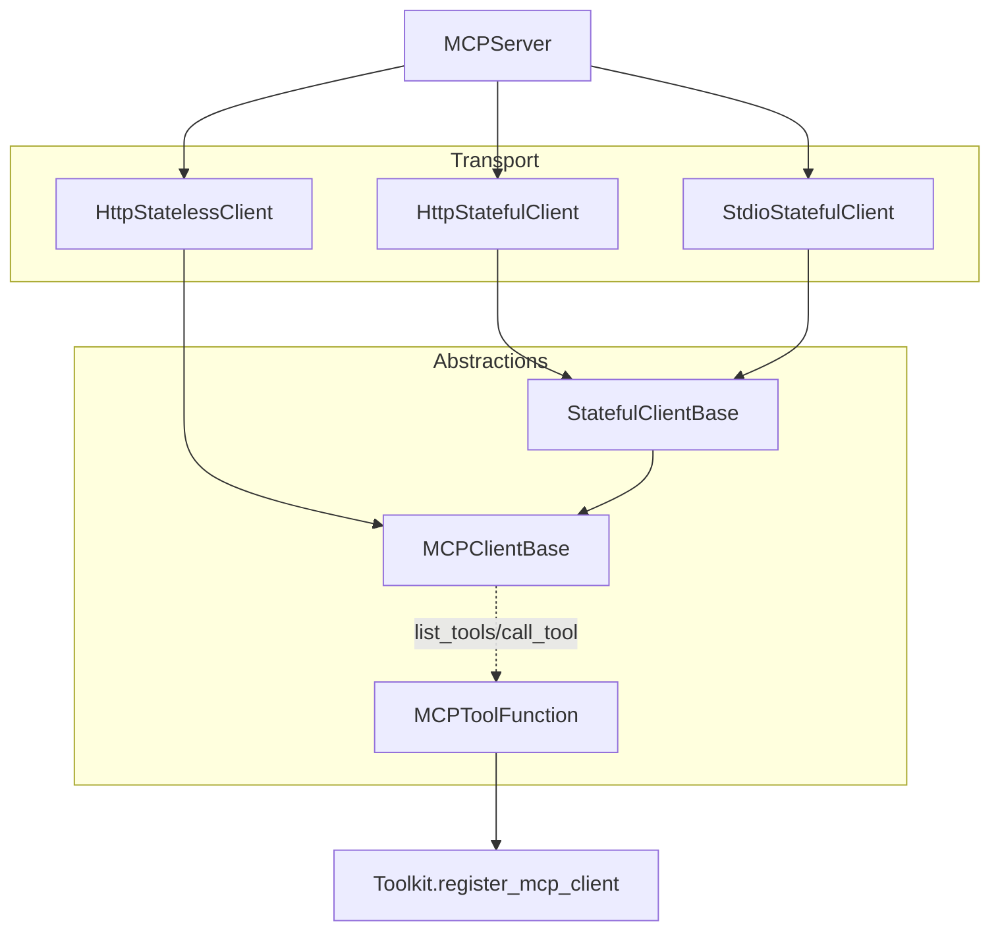

# SOP：src/agentscope/mcp 模块

## 一、功能定义（Scope/非目标）
### 1. 设计思路和逻辑
- 对 MCP（Model Context Protocol）服务器进行客户端适配，查询可用工具、调用远端工具并将其封装为本地 `ToolFunction`，便于 `Toolkit` 与 ReActAgent 统一使用。
- 支持多种传输方案（SSE、Streamable HTTP、StdIO、持久会话），并将 MCP 返回的内容块转换为 AgentScope 的消息块。
- 不负责远端工具的业务语义、鉴权或重试策略；网络异常直接抛回调用方。

### 2. 架构设计

### 3. 核心组件逻辑
- **MCPClientBase**：定义 `get_callable_function`、`_convert_mcp_content_to_as_blocks`；负责将 MCP `Text/Image/Audio` 内容转换为 AgentScope `TextBlock/ImageBlock/AudioBlock`。
- **HttpStatelessClient**：基于 MCP streamable HTTP 或 SSE 传输；每次调用新建 session；`list_tools` 缓存远端工具列表；`get_callable_function` 创建 `MCPToolFunction`。
- **HttpStatefulClient / StatefulClientBase**：保持长连接会话，适合需要共享上下文的 MCP 服务器；负责生命周期管理与 session 初始化。
- **StdioStatefulClient**：通过 StdIO 与 MCP 服务器通信（通常用于本地进程）。
- **MCPToolFunction**：包装远端工具为可 await 的本地函数；支持可选 `wrap_tool_result`，将返回值转换为 `ToolResponse`，否则返回原始 `mcp.types.CallToolResult`；内部在需要时建立 `ClientSession`、调用 `session.call_tool` 并关闭。
- **Schema 转换**：`_extract_json_schema_from_mcp_tool`（位于 `_utils._common`）从 MCP Tool 描述生成 JSON schema 供 Toolkit 使用。
- **注册流程**：`Toolkit.register_mcp_client` 调用客户端的 `list_tools` 与 `get_callable_function`，为每个 MCP 工具注册 `RegisteredToolFunction`。

### 4. 关键设计模式
- **适配器模式**：MCP 客户端与 `MCPToolFunction` 将远端工具 API 适配为本地可调用函数及 JSON schema。
- **策略模式**：不同客户端实现不同传输/会话策略（无状态、有状态、StdIO）。
- **资源管理**：通过异步上下文管理器确保 session/连接在调用后正确关闭。

### 5. 其他组件的交互
- **Toolkit**：`register_mcp_client`/`remove_mcp_servers` 使用 MCP 客户端注册或移除工具；`ToolResponse` 结果可直接被 Agent 消费。
- **Agent**：调用 MCP 工具与调用本地工具无差别；结构化输出、流式工具等依赖远端实现。
- **日志与错误**：客户端对不支持的内容类型或工具缺失会使用 `logger.warning` 提示；网络错误抛出，调用方可决定重试策略。
- **责任边界**：模块不负责鉴权票据刷新、并发限流、工具权限控制；需要调用方在创建客户端时提供必要 headers 或封装。

## 二、文件/类/函数/成员变量映射到 src 路径
- `src/agentscope/mcp/_client_base.py`
  - `MCPClientBase`：基础接口；`_convert_mcp_content_to_as_blocks`。
- `src/agentscope/mcp/_stateful_client_base.py`
  - `StatefulClientBase`：扩展 `MCPClientBase`，维护长连接；定义 `start_session`、`close_session` 等抽象方法。
- `src/agentscope/mcp/_http_stateless_client.py`
  - `HttpStatelessClient`：支持 `transport="streamable_http"` 或 `"sse"`；方法 `get_client`、`list_tools`、`get_callable_function`。
- `src/agentscope/mcp/_http_stateful_client.py`
  - `HttpStatefulClient`：在构造时建立持久会话，适合需要上下文的远端工具。
- `src/agentscope/mcp/_stdio_stateful_client.py`
  - `StdioStatefulClient`：通过标准输入输出与 MCP 服务通信。
- `src/agentscope/mcp/_mcp_function.py`
  - `MCPToolFunction`：包装远端工具调用；支持 `wrap_tool_result` 开关。
- `src/agentscope/mcp/__init__.py`
  - 导出客户端类与 `MCPToolFunction`。
- `src/agentscope/mcp/CLAUDE.md`
  - 记录常见注册流程与注意事项。

## 三、关键数据结构与对外接口（含类型/返回约束）
- `MCPClientBase.get_callable_function(func_name: str, wrap_tool_result: bool = True) -> Callable[..., Awaitable[ToolResponse | mcp.types.CallToolResult]]`
  - 参数：`func_name` 为远端工具名称；`wrap_tool_result` 控制返回 `ToolResponse` 还是原始结果。
  - 异常：找不到工具时抛 `ValueError`；网络失败抛对应异常。
- `HttpStatelessClient(name, transport, url, headers=None, timeout=30, sse_read_timeout=300, **client_kwargs)`
  - `list_tools() -> list[mcp.types.Tool]`；缓存 `_tools`。
- `StatefulClientBase` 额外接口：`start_session`、`close_session`、`reset_session` 等（视实现）。
- `MCPToolFunction.__call__(**kwargs) -> ToolResponse | CallToolResult`
  - 执行流程：如果 `client_gen` 提供上下文，会在其中创建 `ClientSession`；否则使用已有 session。
  - 当 `wrap_tool_result=True` 时，将 `CallToolResult.content` 转换成 AgentScope 块并打包为 `ToolResponse`。

## 四、与其他模块交互（调用链与责任边界）
- **注册**：`Toolkit.register_mcp_client(client, group_name, ...)` → `client.list_tools()` → 为每个工具创建 `MCPToolFunction` → 注册进 Toolkit。
- **调用**：Agent 触发工具调用 → Toolkit 调用 `MCPToolFunction` → 客户端建立/复用会话 → `session.call_tool` 与远端交互 → 结果转换为 `ToolResponse` → Agent 处理输出。
- **内容转换**：`_convert_mcp_content_to_as_blocks` 支持文本、base64 图像/音频；未知类型会被记录并跳过。
- **责任边界**：模块不保证远端可用性；会话失败、超时、鉴权问题等需要调用方处理（可在客户端参数配置 headers、超时）。

## 五、测试文件
- 绑定文件：`tests/mcp_sse_client_test.py`、`tests/mcp_streamable_http_client_test.py`
- 覆盖点：内容块转换、函数包装、错误路径.
