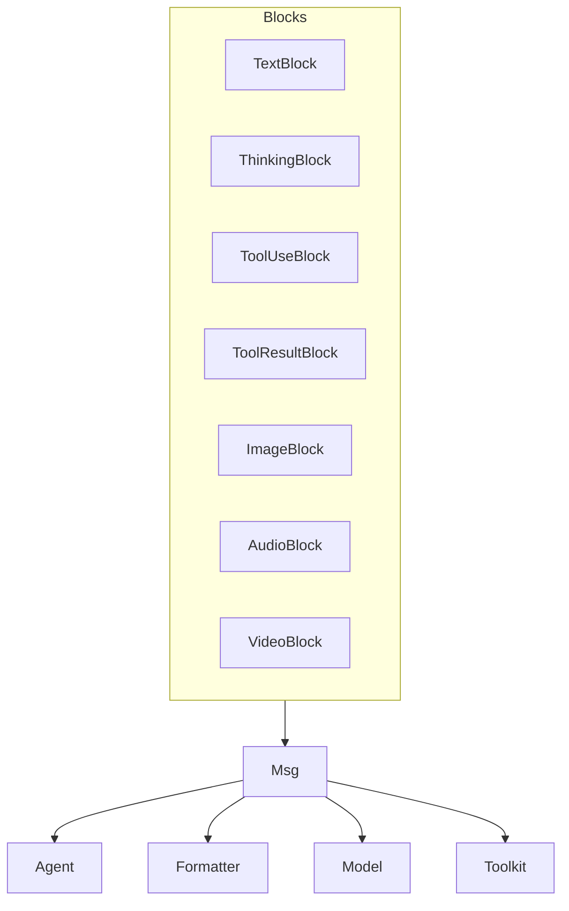

# SOP：src/agentscope/message 模块

## 一、功能定义（Scope/非目标）
### 1. 设计思路和逻辑
- 提供统一的消息数据结构 `Msg` 及配套内容块 TypedDict，使 Agent、Formatter、Model、Toolkit 在文本、多模态和工具调用场景中共享同一协议。
- 设计目标是“结构清晰、易序列化、便于扩展”；消息对象提供常用的序列化、过滤、文本抽取等辅助方法。
- 模块本身不处理业务逻辑、不负责消息持久化，仅提供数据表示。

### 2. 架构设计

### 3. 核心组件逻辑
- **Msg**
  - 构造参数：`name`、`content`（字符串或内容块序列）、`role` (`"user"|"assistant"|"system"`)、`metadata`、`timestamp`、`invocation_id`。
  - 自动生成 `id`（使用 `shortuuid`）与默认 `timestamp`。
  - 关键方法：
    - `to_dict()` / `from_dict()`：序列化与反序列化。
    - `get_text_content()`：合并文本块；当 `content` 是字符串时直接返回。
    - `get_content_blocks(block_type: Literal[...]) -> list[...]`：按类型筛选内容块。
    - `has_content_blocks(block_type)`：快速判断某种类型存在与否。
  - `metadata` 用于存放结构化输出、推理补充信息等。
- **内容块 TypedDict**（定义于 `_message_block.py`）
  - `TextBlock`：`{"type": "text", "text": str}`。
  - `ThinkingBlock`：`{"type": "thinking", "text": str}`，供模型内部思考显示。
  - `ToolUseBlock`：`{"type": "tool_use", "name": str, "id": str, "input": dict}`。
  - `ToolResultBlock`：`{"type": "tool_result", "name": str, "id": str, "output": str | list[ContentBlock]}`。
  - `ImageBlock` / `AudioBlock` / `VideoBlock`：包含 `source`（`URLSource` 或 `Base64Source`）等字段，用于多模态内容。
  - 支持扩展字段（例如 `mime_type`、`duration`），调用方若新增字段需保持向后兼容。

### 4. 关键设计模式
- **数据传输对象**：`Msg` 与 TypedDict 块充当 DTO，简化跨模块数据传递。
- **工厂/辅助方法**：`from_dict` 提供反序列化工厂，保证消息一致性。
- **类型提示**：大量 TypedDict 与 Literal 保证编辑器和静态检查工具可捕捉错误。

### 5. 其他组件的交互
- **Agent**：生成/消费 `Msg`；利用 `get_content_blocks` 判断工具调用、思考块等。
- **Formatter**：读取 `Msg` 内容转为模型请求；在 `ToolResultBlock` 中写入工具返回。
- **Toolkit**：工具执行结果使用 `ToolResultBlock` 反馈；结构化输出可写入 `metadata`。
- **Plan/RAG**：可在 `metadata` 或新增块中注入提示信息。
- **责任边界**：消息模块不进行任何网络 I/O；多模态资源需由调用方管理存储或访问。

## 二、文件/类/函数/成员变量映射到 src 路径
- `src/agentscope/message/_message_base.py`
  - `Msg` 类以及辅助方法；依赖 `shortuuid`、`datetime` 等。
- `src/agentscope/message/_message_block.py`
  - TypedDict 定义：`TextBlock`、`ThinkingBlock`、`ToolUseBlock`、`ToolResultBlock`、`ImageBlock`、`AudioBlock`、`VideoBlock`、`ContentBlock` 等。
- `src/agentscope/message/__init__.py`
  - 导出 `Msg` 与所有内容块。
- `src/agentscope/message/CLAUDE.md`
  - 记录调用链与示例。

## 三、关键数据结构与对外接口（含类型/返回约束）
- `Msg.__init__(name: str, content: str | Sequence[ContentBlock], role: Literal["user","assistant","system"], metadata: dict | None = None, timestamp: str | None = None, invocation_id: str | None = None)`
  - `content` 可以是纯文本或块列表；若为文本，内部保留字符串（`get_content_blocks` 返回空列表）。
  - `metadata` 任意 JSON 可序列化对象；推荐用于结构化输出、调试信息。
- `Msg.to_dict() -> dict` / `Msg.from_dict(json_data: dict) -> Msg`：用于持久化或跨进程传输。
- `Msg.get_content_blocks(block_type: Literal[..., None] = None)`：返回指定类型或全部块；对未知类型返回空列表。
- TypedDict 结构（部分字段）：
  - `ToolUseBlock`: `{"type":"tool_use","name":str,"id":str,"input":dict}`。
  - `ToolResultBlock`: `{"type":"tool_result","name":str,"id":str,"output":str | list[ContentBlock],"is_error": bool | None}`（具体字段见源码）。
  - `URLSource` / `Base64Source` 用于多模态数据来源。
- 所有块均遵循 Pydantic/Type hints 约束，调用方需按类型填写。

## 四、与其他模块交互（调用链与责任边界）
- **消息流**：用户输入或上游模块生成 `Msg` → Agent/Formatter/Model/Toolkit 按需读取或写入块 → 最终输出再通过 `Msg` 传递给下游（UI、日志等）。
- **工具调用**：模型返回 `ToolUseBlock` → Agent 调用 Toolkit → Toolkit 生成 `ToolResultBlock` → Agent 写入 `Msg`。
- **多模态**：Image/Audio/Video 块在 Formatter/Model 中被转换为 API 支持的 payload（例如 base64、URL）。
- **责任边界**：消息模块不验证块内容与模型兼容性；调用方负责在 Formatter/Toolkit 层执行必要校验或转换。

## 五、测试文件
- 绑定文件：间接：Agent/Formatter/Model 测试
- 覆盖点：Msg/块结构在上下游模块测试中覆盖.
