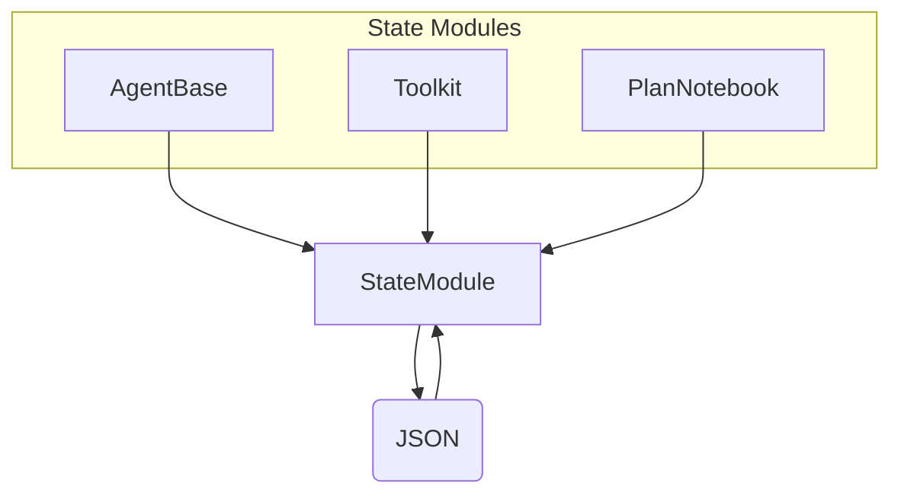

# SOP：src/agentscope/module 模块

## 一、功能定义（Scope/非目标）
### 1. 设计思路和逻辑
- 为需要持久化状态的组件提供统一的基类 `StateModule`，支持嵌套结构、定制序列化与反序列化。
- 通过 `register_state` 记录需要保存的属性，结合 `Session` 模块实现跨会话保存与恢复。
- 不实现具体业务逻辑或外部存储，只定义状态生命周期。

### 2. 架构设计

### 3. 核心组件逻辑
- `StateModule.__setattr__`：当属性值是 `StateModule`，会自动加入 `_module_dict`，实现嵌套状态树。
- `register_state(attr_name, custom_to_json=None, custom_from_json=None)`：记录普通属性，支持自定义序列化/反序列化函数；在未提供 `custom_to_json` 时确保属性原生可 JSON 序列化。
- `state_dict()`：递归遍历 `_module_dict` 与 `_attribute_dict`，生成嵌套字典；若注册了自定义序列化函数则使用。
- `load_state_dict(state_dict: dict, strict: bool = True)`：将状态恢复到对象；当 `strict=True` 时缺少字段抛错。
- `__delattr__`：删除属性时从记录字典中移除，防止脏数据。
- 支持嵌套结构：子模块的 `state_dict` 会合并到父模块的结果中。

### 4. 关键设计模式
- **组合模式**：复杂组件通过包含多个 `StateModule` 构建层级状态。
- **模板方法**：`state_dict/load_state_dict` 定义序列化流程，可通过自定义函数实现特定转换。
- **注册表**：`_module_dict`、`_attribute_dict` 分别记录嵌套模块与普通属性。

### 5. 其他组件的交互
- **Session 模块**：`JSONSession` 调用 `state_dict`/`load_state_dict` 持久化整个状态树。
- **Agent/Toolkit/Plan/Memory**：均继承 `StateModule` 以保存内部状态（记忆内容、工具配置、计划等）。
- **责任边界**：不处理文件读写或版本迁移；调用方负责定义需要注册的字段。

## 二、文件/类/函数/成员变量映射到 src 路径
- `src/agentscope/module/_state_module.py`
  - `StateModule` 类：`__init__` 初始化 `_module_dict`、`_attribute_dict`；重载属性访问与注册方法。
- `src/agentscope/module/__init__.py`
  - 导出 `StateModule`。

## 三、关键数据结构与对外接口（含类型/返回约束）
- `register_state(attr_name: str, custom_to_json: Callable | None = None, custom_from_json: Callable | None = None) -> None`
  - 若 `custom_to_json` 为 `None`，属性必须原生可 JSON 序列化，否则抛 `TypeError`。
  - `custom_from_json` 用于自定义反序列化（例如对象恢复）。
- `state_dict() -> dict`：返回嵌套状态字典。
- `load_state_dict(state_dict: dict, strict: bool = True) -> None`：当 `strict=True` 丢失字段会抛 `KeyError`。
- `_module_dict`、`_attribute_dict`：内部 `OrderedDict`，记录子模块和注册属性。

## 四、与其他模块交互（调用链与责任边界）
- **保存流程**：组件在构造/初始化时调用 `register_state` → `JSONSession.save_session_state` 收集状态 → 写入 JSON。
- **恢复流程**：`JSONSession.load_session_state` 读取 JSON → 调用 `load_state_dict` → 自动恢复嵌套结构。
- **责任边界**：若组件未注册属性，状态不会被保存；版本变更需调用方处理迁移逻辑。

## 五、测试文件
- 绑定文件：间接：session_test
- 覆盖点：StateModule 持久化在会话测试中覆盖.
