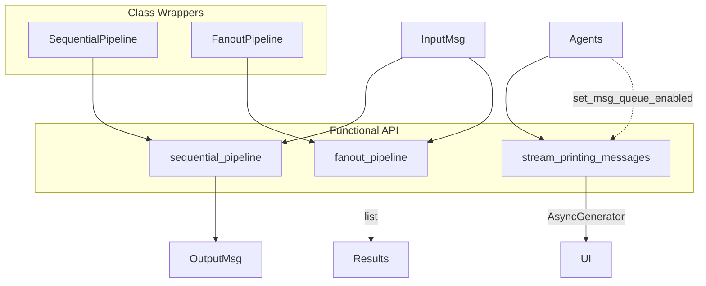

# SOP：src/agentscope/pipeline 模块

## 一、功能定义（Scope/非目标）
### 1. 设计思路和逻辑
- 提供最小化的 Agent 编排原语：顺序执行、扇出（并行/串行）以及流式打印聚合，让上层可以快速组合多 Agent 协作流程。
- 聚焦控制流与消息搬运，不嵌入业务策略或异常恢复逻辑；遇到错误按 asyncio 语义向上冒泡。

### 2. 架构设计

### 3. 核心组件逻辑
- `sequential_pipeline(agents, msg)`：按顺序 `await agent(msg)`，上一个结果作为下一个输入；返回最终 `Msg | list[Msg] | None`。
- `fanout_pipeline(agents, msg, enable_gather=True, **kwargs)`：对输入 `msg` 深拷贝后分发给每个 Agent；`enable_gather=True` 时使用 `asyncio.create_task` 并发执行并通过 `asyncio.gather` 汇总；否则串行执行；返回 `list[Msg]`。
- `stream_printing_messages(agents, coroutine_task, end_signal="[END]")`：
  1. 为所有 Agent 启用共享 `asyncio.Queue`（通过 `set_msg_queue_enabled`）；
  2. 启动待执行任务 `coroutine_task`；
  3. 不断从队列获取 `(Msg, bool)`，直到收到 `end_signal`；
  4. 适用于 UI/日志实时展示 Agent 的 `print` 输出。
- `SequentialPipeline`、`FanoutPipeline` 类：简单包装函数式接口，方便复用同一 Agent 列表。

### 4. 关键设计模式
- **组合模式**：通过函数组合多个 Agent，实现串行与并行的组装。
- **异步并发**：利用 asyncio Task 和 Queue 管理并发执行和流式输出。
- **装饰式包装**：类接口（`SequentialPipeline`/`FanoutPipeline`）将函数式接口对象化，便于在更复杂系统中复用。

### 5. 其他组件的交互
- **Agent**：需要实现可调用接口（`AgentBase.__call__`/`reply`）并支持 `set_msg_queue_enabled`；流式打印通过 `AgentBase.print` 推送到队列。
- **MsgHub/Toolkit**：可与管线协同实现广播或工具调用，但管线本身不介入业务逻辑。
- **UI/日志系统**：`stream_printing_messages` 提供异步生成器，调用方可消费生成 `(Msg, is_last_chunk)` 更新界面。
- **责任边界**：异常与取消由调用者处理；管线不重试、不回滚。

## 二、文件/类/函数/成员变量映射到 src 路径
- `src/agentscope/pipeline/_functional.py`
  - `async sequential_pipeline(agents: list[AgentBase], msg: Msg | list[Msg] | None) -> Msg | list[Msg] | None`
  - `async fanout_pipeline(agents: list[AgentBase], msg: Msg | list[Msg] | None, enable_gather: bool = True, **kwargs) -> list[Msg]`
  - `async stream_printing_messages(agents: list[AgentBase], coroutine_task: Coroutine, end_signal: str = "[END]") -> AsyncGenerator[tuple[Msg, bool], None]`
  - 依赖 `asyncio`, `deepcopy`, `AgentBase`, `Msg`。
- `src/agentscope/pipeline/_class.py`
  - `SequentialPipeline`：封装 Agent 列表，`__call__` 调用 `sequential_pipeline`。
  - `FanoutPipeline`：封装 Agent 列表与默认 `enable_gather`，`__call__` 调用 `fanout_pipeline`。
- `src/agentscope/pipeline/__init__.py`
  - 导出函数式与类式接口。
- `src/agentscope/pipeline/CLAUDE.md`
  - 记录使用范式、注意事项。

## 三、关键数据结构与对外接口（含类型/返回约束）
- `sequential_pipeline`
  - 参数：`agents` 必须实现可调用；`msg` 可为 `Msg`、`list[Msg]` 或 `None`。
  - 返回：与最后一个 Agent 的返回类型一致；若 Agent 返回 `None`，管线终止并返回 `None`。
  - 异常：任一 Agent 抛出的异常向上冒泡；调用方可在外部包装 try/except。
- `fanout_pipeline`
  - 参数：同上；`enable_gather=True` 表示并发执行；`**kwargs` 透传给 Agent。
  - 返回：按 Agent 顺序的 `list[Msg]`。
  - 异常：并发模式下 `asyncio.gather` 会在第一个错误时取消其他任务（默认行为）；调用方可传 `return_exceptions=True`（如自定义 wrapper）。
- `stream_printing_messages`
  - 参数：`agents` 列表、`coroutine_task`（通常是一个管线或 Agent 调用的 `asyncio.Task`）、`end_signal`。
  - 返回：异步生成器，yield `(Msg, bool)`；`bool` 指示该消息块是否是对应 `Msg.id` 的最后一段。
  - 要求：调用前需确保 Agent 使用 `AgentBase.print` 输出；函数内部会在任务完成时推送 `end_signal`。
- `SequentialPipeline.__call__(msg)` / `FanoutPipeline.__call__(msg, **kwargs)`：简单包装，返回值同各自函数。

## 四、与其他模块交互（调用链与责任边界）
- **顺序编排场景**：如“规划 → 执行 → 审核”，三个 Agent 组成列表传给 `sequential_pipeline`。
- **扇出场景**：同一输入广播给多个专家 Agent，通过 `fanout_pipeline` 并发执行并收集结果。
- **实时输出场景**：结合 `stream_printing_messages` 把多个 Agent 的 `print` 输出聚合到一个终端或 WebSocket 流。
- **与 MsgHub 协作**：在扇出场景中，可结合 MsgHub 实现“一个 Agent 输出作为其他 Agent 的观察输入”。
- **责任边界**：管线不管理 Agent 生命周期也不更改消息；上层应在执行前准备好 Agent、在执行后关闭资源。

## 五、变更流程（与 AGENTS.md 对齐）
- **文档先行**：新增管线原语或调整并发策略前，先更新本 SOP 与 `src/agentscope/pipeline/CLAUDE.md`；PR 说明调度策略、异常传播和兼容性。
- **todo 规划**：在 `todo.md` 列出验证项，例如：
  1. 含多个 Agent 的顺序与扇出编排示例（成功/失败/取消）。
  2. `enable_gather` 对异常传播的影响。
  3. `stream_printing_messages` 在多 Agent 输出下的行为（包含 `[END]` 信号）。
- **验收要求**：通过 `tests/pipeline_test.py`，并执行 `pytest`、`ruff check src`。如增加新原语，需补充测试与示例。
- **回滚预案**：若调整执行策略（例如 gather 行为），需提供回滚方式或兼容开关，并在 PR 记录。
- **知识同步**：更新示例脚本、教程以及 `CLAUDE.md`，确保团队了解新的编排方式。
