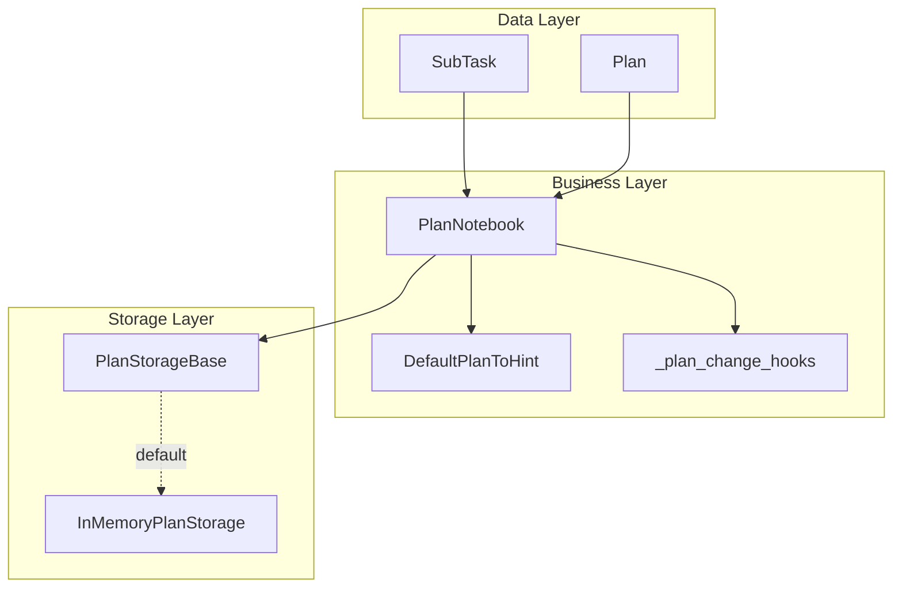

# SOP：src/agentscope/plan 模块

## 一、功能定义（Scope/非目标）
### 1. 设计思路和逻辑
- 将复杂、多步骤的任务拆分成可验证的子任务序列，由 LLM 先构建计划再逐项执行，降低“遗忘步骤”风险。
- 通过显式的 `<system-hint>` 提示和一组工具函数，建立“计划 → 执行 → 复盘”的闭环；提示信息随计划状态即时更新。
- 保持计划数据结构与执行流程解耦：计划模块只维护状态与建议，实际业务执行交由其他工具。

### 2. 架构设计

模块采用三层架构模式，基于 `StateModule` 的可序列化特性：

### 3. 核心组件逻辑

---

#### **计划创建**
- `create_plan` 接收子任务列表，校验后设置为当前计划；若已有计划则替换，并记录提示说明。

#### **执行推进**
- `update_subtask_state`/`finish_subtask` 负责状态机推进，确保顺序执行与"仅一个 in_progress"；
- `finish_subtask` 自动激活下一项。

#### **动态调整**
- `revise_current_plan` 支持增删改子任务，保持原子性并触发 Hook 通知。

#### **历史追踪**
- 完成或中断的计划保存至存储层；
- `view_historical_plans`/`recover_historical_plan` 实现审计与回滚。

#### **提示生成**
- `get_current_hint` 依据计划阶段输出不同提示（无计划、起始、执行、收尾），由 Agent 注入系统提示。

---

### 4. 关键设计模式

---

#### **状态机模式**
- `SubTask` 和 `Plan` 都以枚举状态驱动流程（`todo → in_progress → done/abandoned`），约束操作顺序。

#### **策略模式**
- `plan_to_hint` 可替换默认提示策略，以适配不同的提示风格或语言。

#### **观察者模式**
- `_plan_change_hooks` 提供订阅机制，让 UI/日志组件在计划变化时即时获知。

#### **组合模式**
- `Plan` 聚合 `SubTask`，通过序列化保持嵌套结构一致。

---

### 5. 其他组件的交互

---

#### **Agent 交互**
- ReActAgent 在 `_reasoning` 前调用 `get_current_hint`，在启用 `plan_related` 组后可调用计划工具；
- 工具执行成功后，业务层触发 Hook，Agent 可更新 UI/日志。

#### **Toolkit 集成**
- `PlanNotebook.list_tools()` 返回的工具函数由 `Toolkit.register_tool_function` 管理；
- 遵循统一的 `ToolResponse` 协议。

#### **Session 持久化**
- 继承自 `StateModule`，`current_plan` 通过自定义 `to_json/from_json` 序列化；
- `JSONSession` 可直接持久化完整计划状态。

#### **存储后端扩展**
- 默认内存实现仅在进程内有效；
- 若扩展数据库，需要实现 `PlanStorageBase` 接口并确保 `Plan.model_dump()` 可被持久化。

#### **日志/监控**
- 异常路径（如非法索引）统一返回 `ToolResponse` 文本说明；
- 上层可决定是否用 `agentscope._logging.logger` 记录。

---

## 二、文件/类/函数/成员变量映射到 src 路径
- `src/agentscope/plan/_plan_model.py`
  - `SubTask`：定义子任务字段与状态迁移；方法 `finish`、`to_markdown`、`to_oneline_markdown`。
  - `Plan`：包含有序 `subtasks`、整体状态、时间戳；方法 `finish`、`to_markdown`。
- `src/agentscope/plan/_plan_notebook.py`
  - `DefaultPlanToHint`：根据 `Plan` 阶段输出提示文本。
  - `PlanNotebook`：核心业务类，属性 `current_plan`、`plan_to_hint`、`storage`、`_plan_change_hooks`；公开工具函数、Hook 注册与提示接口。
  - 关键私有方法：`_validate_current_plan`、`_trigger_plan_change_hooks`。
- `src/agentscope/plan/_storage_base.py`
  - `PlanStorageBase`：异步抽象接口 `add_plan`、`delete_plan`、`get_plans`、`get_plan`。
- `src/agentscope/plan/_in_memory_storage.py`
  - `InMemoryPlanStorage`：`OrderedDict` 持久化，`add_plan(..., override=True)` 控制覆盖。
- `src/agentscope/plan/__init__.py`
  - 暴露 `PlanNotebook`、`Plan`、`SubTask`、`PlanStorageBase` 等公共符号。

## 三、关键数据结构与对外接口（含类型/返回约束）
- `SubTask` (Pydantic BaseModel)
  - 主要字段：`name: str` (≤10 词)、`description: str`、`expected_outcome: str`、`state: Literal["todo","in_progress","done","abandoned"]`、`outcome: str | None`、`created_at: str`、`finished_at: str | None`。
  - 方法：`finish(outcome: str) -> None`、`to_markdown(detailed: bool=False) -> str`、`to_oneline_markdown() -> str`。
- `Plan` (Pydantic BaseModel)
  - 字段：`id: str`、`name/description/expected_outcome`、`subtasks: list[SubTask]`、`state`、`outcome`、`created_at`、`finished_at`。
  - 方法：`finish(state: Literal["done","abandoned"], outcome: str) -> None`、`to_markdown(detailed: bool=False) -> str`。
- `PlanNotebook`
  - 构造函数：`PlanNotebook(max_subtasks: int | None = None, plan_to_hint: Callable[[Plan | None], str | None] | None = None, storage: PlanStorageBase | None = None)`.
  - 工具函数（`async` → `ToolResponse`，`ToolResponse.content` 默认 `TextBlock`）：
    - `create_plan(...)` - 支持同步/异步调用，不返回生成器，不支持取消
    - `revise_current_plan(subtask_idx: int, action: Literal["add","revise","delete"], subtask: SubTask | None = None)` - 同步执行，原子性操作
    - `update_subtask_state(subtask_idx: int, state: Literal["todo","in_progress","abandoned"])` - 状态机推进，即时生效
    - `finish_subtask(subtask_idx: int, subtask_outcome: str)` - 自动激活下一项，无流式返回
    - `view_subtasks(subtask_idx: list[int])` - 快照式查询，支持批量索引
    - `finish_plan(state: Literal["done","abandoned"], outcome: str)` - 最终状态变更，触发历史保存
    - `view_historical_plans()` - 存储层查询，异步读取，结果一次性返回
    - `recover_historical_plan(plan_id: str)` - 原子性恢复，替换当前计划
    - `list_tools() -> list[Callable[..., Coroutine[Any, Any, ToolResponse]]]` - 反射调用，同步返回
  - 提示与 Hook：`get_current_hint() -> Msg | None`、`register_plan_change_hook(hook_name: str, hook: Callable[[PlanNotebook, Plan], None]) -> None`、`remove_plan_change_hook(...) -> None`。
  - 状态序列化：`current_plan` 通过 `register_state` 注册自定义 JSON 序列化。
- `PlanStorageBase`
  - 接口签名：`add_plan(plan: Plan) -> None`、`delete_plan(plan_id: str) -> None`、`get_plans() -> list[Plan]`、`get_plan(plan_id: str) -> Plan | None`。
  - 默认实现 `InMemoryPlanStorage`：同签名，内部使用 `OrderedDict`；`add_plan` 的 `override` 控制是否允许覆盖。
- 返回/异常约定
  - **工具函数异常处理**：所有工具函数输入非法时（如无效索引、错误状态枚举、空子任务列表）返回包含详细错误文本的 `ToolResponse`，不抛出异常
  - **存储层异常**：`PlanStorageBase` 实现可能遇到的异常场景：
    - `ConnectionError`：数据库连接失败（外部存储实现）
    - `TimeoutError`：存储操作超时（远程存储）
    - `SerializationError`：`Plan.model_dump()` JSON 序列化失败
    - `KeyError`：计划 ID 不存在或重复
  - **内部异常**：仅有 `_validate_current_plan` 在未初始化计划时抛 `ValueError`（由调用方捕获）
  - **并发安全**：状态机操作通过互斥锁保证原子性；并发冲突时返回包含操作失败原因的 `ToolResponse`
  - `ToolResponse.metadata` 可选传递补充信息（例如 `{"success": false, "error_code": "INVALID_INDEX"}`），当前实现主要使用文本反馈
  - 一致性说明：`update_subtask_state` 的类型注解与实现已统一为 `"abandoned"`；若后续新增状态，请同步本文件与测试。

## 四、与其他模块交互（调用链与责任边界）
- **与 Agent**：ReActAgent 在初始化时可注入 `PlanNotebook`；当 LLM 激活 `plan_related` 工具组后，核心调用顺序通常为 `create_plan → update_subtask_state("in_progress") → [执行其他业务工具] → finish_subtask → ... → finish_plan`。提示使用 `<system-hint>` 包装，由 Agent 或前端展示。
- **与 Toolkit**：计划工具通过 `Toolkit.register_tool_function` 注入，遵守统一 JSON Schema；Agent 元工具 `reset_equipped_tools` 控制启停。
- **与 Session/StateModule**：`current_plan` 的注册使得 `JSONSession.save_session_state/load_session_state` 能跨会话保存计划。
- **与存储层**：默认内存实现只在单进程有效；若替换为外部数据库，需要保证异步接口与 JSON 序列化一致，并在 SOP 中说明扩展点。
- **与日志/监控**：计划变更可通过 Hook 通知 UI 或监控；异常路径返回文本说明，若需要追踪应在调用方使用 `logger`。
- **责任边界**：模块仅维护计划结构与建议，不执行实际业务操作，也不负责计划执行结果验证；顺序与唯一进行中约束由本模块保证。

## 五、测试文件
- 绑定文件：`tests/plan_test.py`
- 覆盖点：
  - 模型渲染：`SubTask.to_markdown` / `Plan.to_markdown`（test_plan_model）。
  - 工具注册：`PlanNotebook.list_tools` 顺序与内容（test_plan_subtasks）。
  - 视图与校验：`view_subtasks` 非法/合法索引提示（test_plan_subtasks）。
  - 修订操作：`revise_current_plan` add/delete/revise 分支（test_plan_subtasks）。
  - 状态约束：`update_subtask_state` 顺序检查与唯一 in_progress 校验（test_plan_subtasks）。
  - 完成与激活：`finish_subtask` 置 done 并自动激活下一项（test_plan_subtasks）。
  - 会话持久化：`state_dict/load_state_dict` 对 `current_plan` 的序列化/反序列化（test_serialization）。
- 补测建议：
  - 统一 `abandoned` 术语后补充类型注解一致性与错误路径测试。
  - 若实现“计划状态由子任务聚合推导”，新增聚合/边界测试；`max_subtasks` 限制若启用，补充越界与提示用例。
