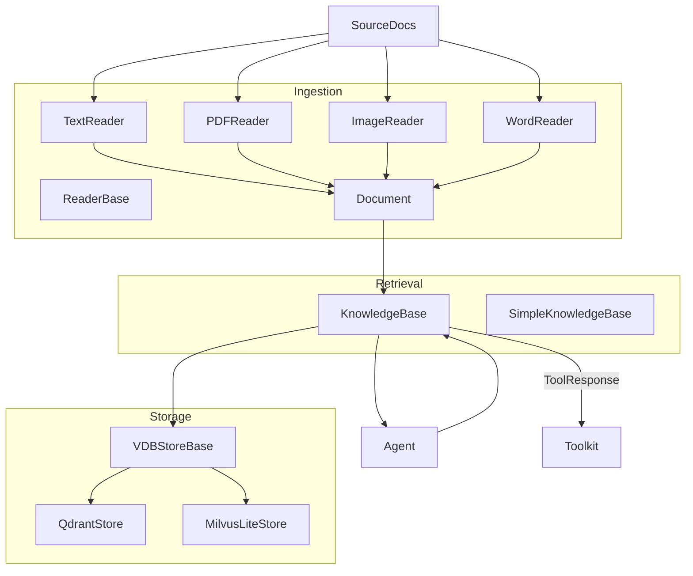

# SOP：src/agentscope/rag 模块

## 一、功能定义（Scope/非目标）
### 1. 设计思路和逻辑
- 为 Agent 提供从外部文档构建知识库、进行向量检索、向对话注入辅助信息的统一框架。  
- 组合 Reader（碎片化文档）、Embedding/向量存储（索引）、KnowledgeBase（检索协调）三个环节，实现“读 → 编码 → 存 → 取”的完整链路。  
- 不负责 LLM 的提示模板或回答整合，仅返回原始检索内容与评分。

### 2. 架构设计

### 3. 核心组件逻辑
- **Document/DocMetadata**：标准化文档块，包含 `content`（Text/Image/Video block）、`doc_id`、`chunk_id`、`total_chunks`、可选 `embedding` 与 `score`。  
- **ReaderBase 及实现**：  
  - `TextReader`：读取纯文本/Markdown，按行或规则切分为 `Document`。  
  - `PDFReader`：调用 `pypdf` 抽取文本，支持分页切分。  
  - `ImageReader`：用于 OCR 或图像嵌入前的包装（输出 `ImageBlock`）。  
  - `WordReader`：读取 `.docx` 文档（文本/表格/可选图片），输出 `Document`；默认 `include_image=False`，启用后会产生 `ImageBlock(Base64Source)` 并要求下游多模态 embedding。  
- **VDBStoreBase / QdrantStore / MilvusLiteStore**：定义 `add_documents`、`retrieve` 等向量库接口；`QdrantStore` 调用 Qdrant 客户端写入/查询；`MilvusLiteStore` 通过 `pymilvus`（MilvusClient）连接 Milvus Lite/Server。  
- **KnowledgeBase**：持有 `embedding_model` 与 `embedding_store`；`add_documents` 将 Document 嵌入后写入向量库；`retrieve` 基于查询向量检索；`retrieve_knowledge` 将结果封装为 `ToolResponse`。  
- **SimpleKnowledgeBase**（若存在）：快速实现，无需外部向量库，用内存向量集合完成检索。  
- **工具函数**：`retrieve_knowledge` 提供 Agent 工具化接口，返回包含得分与文本的 `TextBlock` 列表。

### 4. 关键设计模式
- **适配器**：不同 Reader 与 Store 实现统一接口；Embedding 模型也以 `EmbeddingModelBase` 适配。  
- **组合模式**：KnowledgeBase 组合 Reader 输出、Embedding 模型与向量存储形成完整流水线。  
- **策略模式**：检索参数（limit/score_threshold）作为策略注入，便于按场景调整。

### 5. 其他组件的交互
- **Agent/ReActAgent**：在 `_reasoning` 前调用 `knowledge.retrieve` 注入 `<retrieved_knowledge>` 提示；亦可通过 Toolkit 暴露 `retrieve_knowledge` 让 LLM 自主检索。  
- **Embedding 模块**：KnowledgeBase 依赖 `EmbeddingModelBase` 将 `Document` 生成向量。  
- **Toolkit**：`retrieve_knowledge` 返回 `ToolResponse`，可注册为工具供 Agent 使用。  
- **存储后端**：`QdrantStore` 需配置连接信息（host/port/api_key），兼容本地或云端 Qdrant；`MilvusLiteStore` 通过 `uri` 指向本地 `.db` 或远端 Milvus 服务（Milvus Lite 在 Windows 上不支持）。  
- **责任边界**：模块不负责答案生成、摘要或排序后的解释；仅提供检索结果与得分。

## 二、文件/类/函数/成员变量映射到 src 路径
- `src/agentscope/rag/_document.py`  
  - `DocMetadata`、`Document` 数据结构，包含内容块、唯一 id、embedding、score。  
- `src/agentscope/rag/_reader/_reader_base.py` 及子类  
  - `ReaderBase`：抽象 `read`/`split` 接口。  
  - `_text_reader.py`、`_pdf_reader.py`、`_image_reader.py`：实现不同格式的解析。  
  - `_word_reader.py`：`WordReader` 基于 `python-docx` 读取 `.docx`（文本/表格/可选图片）。  
- `src/agentscope/rag/_store/_store_base.py`  
  - `VDBStoreBase`：抽象 `init_store`、`add`、`search` 等接口。  
  - `_qdrant_store.py`：`QdrantStore` 基于 `qdrant-client` 实现 CRUD 与检索。  
  - `_milvuslite_store.py`：`MilvusLiteStore` 基于 `pymilvus[milvus_lite]` 实现写入/检索/删除（Windows 通过 marker 排除安装）。  
- `src/agentscope/rag/_knowledge_base.py`  
  - `KnowledgeBase`：抽象类，定义 `retrieve`、`add_documents`、`retrieve_knowledge`。  
- `src/agentscope/rag/_simple_knowledge.py`  
  - `SimpleKnowledgeBase`：轻量内存实现（如适用）。  
- `src/agentscope/rag/__init__.py`  
  - 导出 Reader/Store/KnowledgeBase；  
- `src/agentscope/rag/CLAUDE.md`  
  - 记录调用链、常用组合；更新 SOP 时需同步。

## 三、关键数据结构与对外接口（含类型/返回约束）
- `Document`  
  - `metadata: DocMetadata`、`id: str`、`embedding: Embedding | None`、`score: float | None`。  
  - `DocMetadata.content` 为 `TextBlock | ImageBlock | VideoBlock`；`doc_id`/`chunk_id` 标注来源。  
- `KnowledgeBase`  
  - `async add_documents(documents: list[Document], **kwargs) -> None`：写入前通常需要先调用 Embedding 模型生成向量；具体实现负责异常处理。  
  - `async retrieve(query: str, limit: int = 5, score_threshold: float | None = None, **kwargs) -> list[Document]`：返回带 `score` 的 Document 列表。  
  - `async retrieve_knowledge(...) -> ToolResponse`：工具化接口，返回 `TextBlock` 列表；若无结果输出提示文本。  
- `VDBStoreBase`  
  - 常用方法：`init_store`、`add_documents`、`retrieve`（命名随实现）；`QdrantStore` 需要映射集合/向量尺寸。  
- Reader 接口  
  - `async read(path_or_text: str, **kwargs) -> list[Document]`（实际签名视实现而定）  
  - 可能抛出 I/O 或格式解析异常。  
- Embedding 接口  
  - `EmbeddingModelBase.embed_documents([...]) -> list[Embedding]`；KnowledgeBase 负责调用并将结果写入 Document。

## 四、与其他模块交互（调用链与责任边界）
- **构建知识库**：外部脚本/Agent 读取文档 → 调用 Reader → 通过 KnowledgeBase.add_documents 嵌入并写入 Store。  
- **在线检索**：Agent 提供查询 → KnowledgeBase.retrieve → 返回 Document 列表；可进一步通过 `retrieve_knowledge` 作为工具响应。  
- **Plan/Memory**：检索结果常被写入 `<retrieved_knowledge>` 提示，与 Memory/Plan 协同请在 Agent 策略里处理。  
- **存储/资源管理**：`QdrantStore` 与外部向量库交互，需调用方提供连接配置并负责资源清理。  
- **责任边界**：模块不执行自动同步、定时更新或缓存失效；调用方需确保文档最新与向量库状态可用。

## 五、测试文件
- 绑定文件：`tests/rag_reader_test.py`、`tests/rag_store_test.py`、`tests/rag_knowledge_test.py`
- 覆盖点：Reader 解析、Store 写读与检索、Knowledge 聚合与排序.
