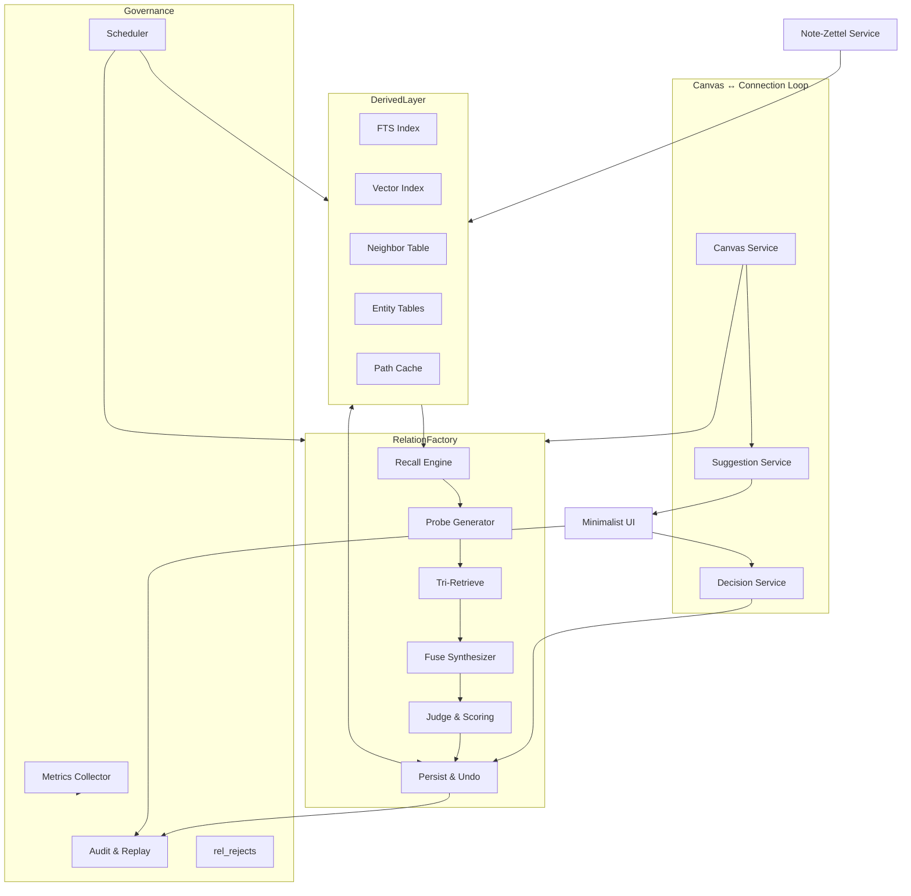
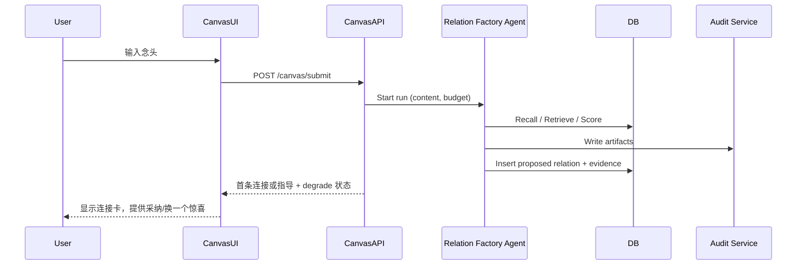
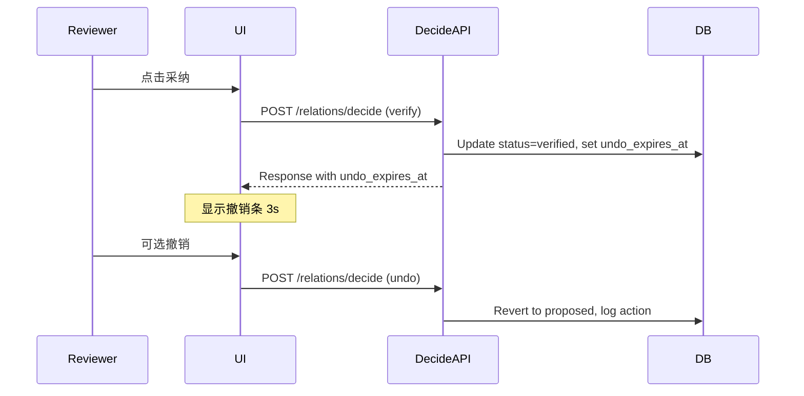

# Relation-Zettel System Architecture Design

<!-- Navigation Metadata -->
<!-- Document: design | Audience: architecture, backend, ai | Status: v1.1 -->

## Document Information
- **Feature Name**: Relation-Zettel Knowledge Graph Platform
- **Version**: 1.1
- **Date**: 2025-09-16
- **Author**: [TBD]
- **Reviewers**: [Lead Engineer], [AI Architect], [Product Design Lead]
- **Related Documents**: docs/relation_zettel_design/design-language.md, docs/relation_zettel_design/agentscope-integration.md, docs/relation_zettel_design/ui-ux.md, requirements/relation-zettel.md (draft), Agent.md, spec-process-guide/process/design-phase.md

## Overview
The Relation-Zettel platform transforms every relationship into a first-class, auditable claim with temporal boundaries, evidence hashes, and explainable scoring. The architecture now centers on a Canvas-first ingestion loop that delivers a single, trustworthy connection per interaction while maintaining deterministic rebuilds, replayable agent runs, and reversible write paths. A FastAPI backend, AgentScope-driven Relation Factory, and minimalist UI work together to honor the product’s Jobs-style design language: It Just Works, with beauty as function.

### Design Goals
- Preserve auditable, lifecycle-aware Relation-Zettel data with temporal validity and provenance.
- Support Canvas-driven single-focus experiences with sub-3s first-hit latency.
- Ensure derived indices (FTS, vectors, neighbors, paths) are rebuildable, deterministic, and decoupled from source notes.
- Provide transparent scoring, logging, experiential metrics (Aha rate, first-hit time, interruption rate), and cost controls.
- Guarantee reversibility: no Relation-Zettel is persisted without explicit user action, and all writes are traceable and undoable.
- Scale from single-node SQLite to distributed PostgreSQL deployments without architectural change.

### Key Design Decisions
- **Canvas-first ingestion loop**: introduce a Canvas Service that streams user input to the Relation Factory with minimal mediation, meeting “白纸→单连接” expectations.
- **Temporal validity baked into schema**: `event_time`, `valid_from`, `valid_to`, `valid_range` enable as-of queries and prevent stale claims from polluting the present.
- **Explainable scoring columns**: persist `bm25`, `cos`, `npmi`, `time_fresh`, `path2`, `novelty`, `score` for transparency and regression testing.
- **Deterministic artifacts**: every agent run writes step artifacts to `/tmp/factory/{run_id}`, hashed in `audit_runs` for replay.
- **Reversible persistence**: Relation writes require user verification; status transitions logged via `rel_audit`, with rejection blacklists enforced through `rel_rejects` and undo windows tracked.
- **Experiential observability**: instrument Aha rate, first-hit latency, interruption rate, and evidence-open rate alongside technical metrics.

## Architecture

### System Context
```mermaid
graph LR
    User[Creator / Reviewer]
    User --> CanvasUI[Canvas & Connection Card UI]
    CanvasUI -- submit --> CanvasAPI[/canvas/submit]
    CanvasAPI --> Factory[Relation Factory Agent]
    Factory --> DB[(SQLite / PostgreSQL)]
    CanvasUI -- fetch --> SuggestAPI[/relations/suggest]
    CanvasUI -- decide --> DecideAPI[/relations/decide]
    CanvasUI -- swap --> SwapAPI[/relations/swap]
    CanvasUI -- audit --> AuditAPI[/audit/:id]
    Ops[Ops & Metrics]
    Ops --> MetricsAPI[/metrics]
    Ops --> RebuildAPI[/rebuild/indexes]
```

### High-Level Architecture


### Technology Stack
| Layer | Technology | Rationale |
|-------|------------|-----------|
| Frontend | TypeScript + React (minimal SPA) | Enables Canvas-first interaction, rapid iteration, custom design tokens. |
| Backend | Python 3.11 + FastAPI | Async support for low-latency Canvas loop; integrates well with AgentScope and SQLAlchemy. |
| AI Orchestration | AgentScope ReActAgent + Pydantic structured outputs | Tool-driven, replayable pipeline with deterministic responses. |
| Database | SQLite (MVP) → PostgreSQL (scale) with sqlite-vss/pgvector | Portable single-node start, production-ready path with vector support. |
| Job Queue | APScheduler / RQ | Schedules rebuilds, retries, degrade fallbacks. |
| Observability | OpenTelemetry, Prometheus/Grafana | Captures experiential + technical metrics, supports alerting. |

## Components and Interfaces

### Canvas Service
**Purpose**: Accept user input from Canvas, trigger Relation Factory runs, and stream first candidate back.

**Responsibilities**
- Expose `POST /canvas/submit` with low-latency pipeline (<3s target).
- Manage correlation IDs for Canvas interactions.
- Coordinate degrade feedback when budgets exhausted.

**Interfaces**
- **Input**: Canvas UI payload (`content`, optional `note_id`, `as_of`).
- **Output**: Candidate relation or guidance to continue writing.
- **Dependencies**: Relation Factory, Suggestion Service, budget controller.

**Implementation Notes**
- Use async FastAPI endpoint with streaming response when possible.
- Cache last candidate for undo/redo window.

### Suggestion Service
**Purpose**: Provide single best Relation-Zettel per request.

**Responsibilities**
- Fetch candidate from `relations` with status `proposed` filtered by subject/time.
- Respect `rel_rejects` blacklist and `uniq_key` de-duplication.
- Surface degrade flag when heuristics used.

**Interfaces**
- **Input**: `/relations/suggest?subject=&as_of=`.
- **Output**: Candidate card payload with evidence, scores, temporal data.

**Implementation Notes**
- Always return at most one candidate; queue handled server-side.
- Precompute display payloads with evidence quotes + hashes.

### Decision Service
**Purpose**: Handle verify/reject/undo actions.

**Responsibilities**
- Expose `POST /relations/decide` with idempotent operations.
- Respect 3-second undo window; maintain change logs in `rel_audit`.
- When rejected, insert into `rel_rejects` with normalized `uniq_key`.

**Implementation Notes**
- Use background job to finalize status after undo window; explicit `undo` endpoint optional.
- Persist decision metadata for audit and metrics (acceptance rate, interruption).

### Relation Factory Service
**Purpose**: Orchestrate Recall→Probe→Tri-Retrieve→Fuse→Judge pipeline via AgentScope.

**Responsibilities**
- Accept context from Canvas Service (content, subject, predicate, as_of, budget).
- Run AgentScope tools with structured outputs; log artifacts and budget usage.
- Emit `relations` (status `proposed`), `rel_evidence`, `audit_runs`, `rel_audit` entries.

**Implementation Notes**
- Enforce degrade mode when budget exceeded; return `degraded=true` so UI can signal.
- Compute score components and persist columns.

### Audit & Governance Services
- **Audit Service**: Serve `/audit/:id`, manage artifact storage, maintain prompt/input hashes.
- **Metrics Collector**: Aggregate experiential metrics (Aha rate, first-hit latency, interruption rate, evidence-open rate) and technical metrics.
- **Blacklist Service**: Manage `rel_rejects`, enforce dedupe before agent runs.

## Data Models
(unchanged columns plus undo fields where needed.)
- Add `undo_expires_at timestamptz` to `relations` for active undo window tracking.
- Extend `rel_audit` with `action_source` (`canvas`, `review`, `api`).
- Add `experience_metrics(date, aha_rate, acceptance_rate, first_hit_ms, interruption_rate, evidence_open_rate)` table for trend tracking.

## API Specifications
- `POST /canvas/submit {content, note_id?, predicate?, as_of?, budget_cents?}` → `{run_id, candidate?, guidance?, budget_used, degraded}`
- `GET /relations/suggest?subject=&as_of=` → `{candidate, degraded}` (candidate optional)
- `POST /relations/decide {ops:[{id, action:"verify|reject|undo", reason?}]}` → `{ok, failed:[], undo_expires_at?}`
- `POST /relations/swap {id, subject, predicate?, as_of?}` → `{candidate, degraded}`
- `GET /audit/:id` → audit trail with evidence hashes, prompt/input hashes, cost breakdown
- `POST /rebuild/indexes {what:["fts","vec","neigh","path"], since?}`
- `GET /metrics` → Prometheus metrics including experiential gauges
- `GET /review/daily` → sequential list of pending review cards (one at a time).

All endpoints include correlation IDs, degrade flags, and respect `uniq_key` constraints.

## Workflow Diagrams

### Canvas Submission Loop


### Verification with Undo


## Security and Compliance
- JWT auth with scoped roles (`canvas`, `review`, `ops`).
- Rate limit `/canvas/submit` and `/swap` per user to prevent LLM abuse.
- Evidence hashes ensure quotes match stored text; mismatches auto-reject and log.
- TLS everywhere; secrets via Vault/Parameter Store.
- Audit logs immutable; sensitive content redacted before observability pipelines.

## Performance & Scalability
- **Canvas loop latency**: target <3s (p50) from submit to first candidate with warm cache.
- **Recall query**: <200ms on 10k notes; degrade to heuristic when budget/latency thresholds breached.
- Async FastAPI endpoints, SQL connection pooling, caching of neighbor lists (Redis optional).
- Horizontal scale via multiple API + Agent workers; utilize job queue for background rebuilds.
- Load shedding: degrade mode triggered when queue backlog or cost thresholds exceeded.

## Observability & Metrics
- **Experiential**: `relation_factory_aha_rate`, `relation_factory_first_hit_ms`, `relation_factory_interruption_rate`, `relation_factory_evidence_open_rate`, `relation_factory_acceptance_rate`.
- **Operational**: latency histograms, cost per run, degrade counts, queue depth, retry counts.
- **Logging**: structured logs with correlation IDs, prompt hashes, budget usage.
- **Alerts**: Aha rate <35%, first-hit p95 >4s, interruption rate >25%, cost per 1k chars >0.35 CNY, rebuild failures.
- Dashboards split between experience metrics (for product/design) and operational metrics (for ops).

## Testing Strategy
- **Unit**: SQLAlchemy models, Canvas API, scoring computations, undo logic.
- **Integration**: Canvas submit → candidate pipeline using fixtures and stub LLM.
- **Agent Replay**: Validate `/tmp/factory` artifacts can reproduce runs 100% deterministically.
- **End-to-End**: Cypress flow covering Canvas → connection → verify/undo → audit.
- **Performance**: Load tests simulating 20 concurrent canvas submissions.
- **Resilience**: Simulate degrade scenarios, rejection flows, blacklist hits.

## Deployment & Operations
- CI pipeline: lint → tests → build images → artifact publish.
- Deployment: Docker Compose (dev) / Helm (prod) with blue-green releases.
- Config: environment variables for budgets, latency thresholds, degrade toggles.
- Nightly tasks: snapshot `relations` & `rel_evidence`, rebuild experience metrics table, prune artifacts older than 7 days.
- Incident response: use `scripts/replay_run.py` for forensic replay; maintain runbook for degrade triggers.

## Migration & Compatibility
- Add new columns (`undo_expires_at`) with nullable defaults; backfill gradually.
- API versioning through `/v1/`; new endpoints (`/canvas/submit`, `/relations/swap`) introduced as additive.
- Provide change log for Obsidian plugin or other clients; ensure fallbacks for missing fields.

## Design Review Checklist
- [ ] Canvas-first loop represented in architecture diagrams and API contracts.
- [ ] Temporal validity, scoring columns, undo fields present in schema.
- [ ] Relation Factory artifacts and replay path documented and tested.
- [ ] Experiential metrics (Aha rate, first-hit time, interruption rate) instrumented.
- [ ] Reversible write path enforced (status transitions, undo window, blacklist).
- [ ] Security, rate limiting, and cost guardrails defined.
- [ ] Deployment and rebuild procedures support deterministic recovery.
- [ ] UI alignment: single candidate surfaces, degrade signaling, time awareness.

---
This architecture ensures every layer—from Canvas submission to governance—supports the Relation-Zettel promise:写一句，遇一个可信的连接，可回放、可验证、可撤销。
