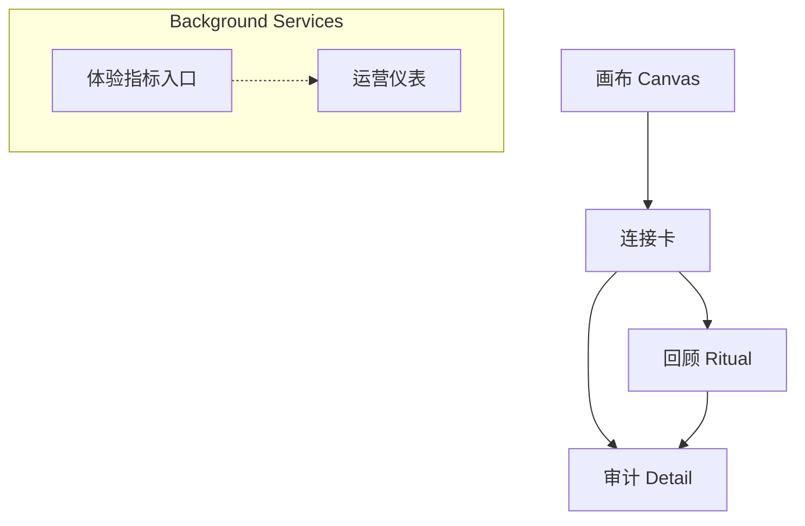

# Relation-Zettel Review UI / UX Design

<!-- Navigation Metadata -->
<!-- Document: design | Audience: product, frontend, design | Status: v1.1 -->

## Document Information
- **Feature Name**: Relation-Zettel Reviewer Console
- **Version**: 1.1
- **Date**: 2025-09-16
- **Author**: [TBD]
- **Reviewers**: [Product Design Lead], [Frontend Lead], [AI PM]
- **Related Documents**: docs/relation_zettel_design/design-language.md, docs/relation_zettel_design/system-architecture.md, docs/relation_zettel_design/agentscope-integration.md, spec-process-guide/process/design-phase.md

## Vision & Design Philosophy
We deliver an elegant, minimalist reviewer console inspired by Steve Jobs 的设计理念：聚焦、克制、尊重注意力。界面默认白纸与一个值得信赖的连接卡，确保用户在“写下一句 → 遇到一个连接”的节奏中保持流畅。所有信息均可验证、可回放，动效与视觉仅用于降低认知负荷。

### Experience Principles
- **Clarity First**：默认仅呈现关系类型徽章、单行 claim、两段证据、分项分数。
- **Confidence in Action**：采纳（Verify）与拒绝（Reject）是唯二主动作，提供键盘快捷键与即时反馈。
- **Temporal Awareness**：时间滑块默认“现在”，可回放历史有效性，并以不同语气提示“曾经成立”。
- **Single Focus**：主视区永远只出现一个连接卡；其他噪声隐藏在背景流程中。
- **Serendipity as a Feature**：一次只给一个惊喜，提供“换一个惊喜”操作无缝切换。
- **Accessible Elegance**：高对比度、精准排版、屏幕阅读器友好，动效遵循 180–280ms 温和节奏。

## Personas & Primary Scenarios
- **创作者/研究者（Reviewer）**：每日审阅 Relation-Zettel，快速判断是否采纳。
  - 场景：打开画布、输入念头、获得连接卡、采纳或换一个惊喜。
- **长期记录者（Researcher）**：探索某个笔记周边关系，查看证据与时间有效期。
  - 场景：检索笔记，回放历史关系，展开证据。
- **体验守护者（Ops Lead）**：监控体验指标与队列健康，但不影响主体验。
  - 场景：在独立的仪表入口查看指标、触发重建。

## 核心流程

### Canvas（画布）体验
- 进入即白纸与闪烁光标，无按钮墙。
- 用户输入念头或粘贴引文，微动效（湖面涟漪）表示系统正在倾听。
- 当连接准备就绪，画布淡出、连接卡淡入，光标保持待命以便继续写。
- 失败或无结果时文案引导“继续写两句，我们再找一次”。

### Connection Card（连接卡）体验
- 显示 predicate 徽章、置信度、单行 claim，以及“一句话解释 + 可展开证据”。
- 证据采用柔和高亮，可内联展开原文段落。
- 显示 `event_time` 与 `valid_range`，若仅在过去成立，提示“截至 YYYY-MM-DD 曾成立”。
- 提供两个主按钮：`采纳此连接`（可撤销 3 秒）与 `换一个惊喜`。
- 分项分数条展示 `bm25 | cos | npmi | novelty | time`，鼠标/键盘聚焦显示数值。

### Review Ritual（回顾）
- 独立入口（每日或按需），呈现 5–10 张已生成但未采纳的连接卡。
- 强调“再遇见”与补充证据，而非任务列表；一屏一次仅一张卡。
- 可从此处跳转至 audit detail 查看生成过程与证据来源。

## Information Architecture

- **Canvas**：默认落点；捕获输入、触发 Relation Factory。
- **Connection Card**：核心体验；一次呈现一条 Relation-Zettel。
- **Review**：轻量复盘模式；不干扰主流程。
- **Audit Detail**：按需展开证据、分数、提示链；从连接卡或回顾进入。
- **运营仪表**：与主体验隔离，仅供运维与研究使用。

## Key Screens

### Canvas Screen
- 顶部留白、中央输入框，placeholder：“写下一个念头、一段引文，或贴一个链接…”
- 输入中展示温和状态提示：“正在倾听你的思路…”
- Footer 提示体验指标（可隐藏），例如首条时间目标。

### Connection Card Screen
```
-------------------------------------------------
| Header: Logo · 当前时间 · 身份菜单            |
-------------------------------------------------
| 时间滑块（Now ◉──────────── Past）          |
-------------------------------------------------
| 连接卡                                       |
|  ├─ Predicate 徽章 + 置信度数值             |
|  ├─ Claim 单行                              |
|  ├─ Explain 一行                            |
|  ├─ Evidence 1（可展开原文）                |
|  ├─ Evidence 2（可展开原文）                |
|  ├─ 分项分数条（bm25/cos/npmi/time/novelty）|
|  └─ 时间提示（首次出现 / 有效期）           |
-------------------------------------------------
| 主动作： [采纳此连接 ✔]   [换一个惊喜 ✦]    |
| 次动作： [查看审计]（链接角标）             |
-------------------------------------------------
```
- 采纳后出现 3 秒撤销条：“已采纳。撤销？”
- 换一个惊喜即时替换卡片，不滚动、不弹窗。

### Review Ritual Screen
- 单列卡片序列，键盘左右键切换下一张。
- 顶部提示：“今日再遇见 5 张卡。一次一个。”
- 每张展示与连接卡一致信息，增加“补充证据”入口。

### Audit Detail Modal
- 分区：概览（claim、run_id、状态）、证据列表（含 quote_sha）、评分表、提示链（prompt_hash）、运行成本。
- 提供下载 run artifact（7 日内有效）。

## Visual Language
- **Typography**：`SF Pro Display` / `Inter`，权重 400/600，行距 1.4。标题轻盈，正文中性。
- **Color Palette**：背景 #F7F8FA；卡片 #FFFFFF；主色 #0B84FF；辅助文本 #1C1C1E；成功 #2DB47C；拒绝 #FF3B30；证据高亮 #FFF6D0。
- **Spacing**：8px 系统；卡片内边距 24px，段落间距 16px。
- **Iconography**：极简线性图标，仅用于 predicate 徽章与审计入口。
- **Motion**：淡入淡出 180–220ms；用户设定“减少动效”时切换为无动画。

## Interaction Rules
- 主视区永远只有一个连接卡；任何列表或队列都在后台处理。
- `换一个惊喜` 使用快捷键 `Shift+N`；采纳 `V`，拒绝 `X`，审计 `A`，时间滑块 `T`。
- 失败状态优先提示“继续写两句，我们再找一次”，并提供重试按钮。
- 所有写回操作需用户明示；默认不自动写回。
- 采纳操作允许 3 秒撤销；撤销后恢复原始状态。

## Copy & Tone
- 语气：克制、体贴、坚定。
- 占位符：`写下一个念头、一段引文，或贴一个链接…`
- 加载态：`正在倾听你的思路…`
- 连接标题：`我想给你看这个。`
- 解释句模板：`连接原因：它从另一个角度推进了你刚写的主题。`
- 无结果：`继续写两句，我们再找一次。`
- 历史提示：`此连接在 YYYY-MM-DD 前成立。`
- 按钮：`采纳此连接` / `换一个惊喜`

## Accessibility
- 遵循 WCAG 2.1 AA 字号和对比度。
- 所有核心操作可键盘完成；焦点环 2px 主色。
- 时间滑块支持键盘微调，提供语义化 aria-label。
- 提供“减少动效”设置；屏幕阅读器朗读 evidence 来源与 span。

## Analytics & Experience Metrics
- **Aha 率**：首次会话点击“继续写”或“采纳”的比例。
- **接受率**：采纳 Relation-Zettel 的比例。
- **首条时间**：输入到呈现首条连接的中位数。
- **打断率**：连接出现前离开的比例。
- **证据打开率**：展开证据的比例。
- 前端记录错误、API 延迟、degrade 标记，所有数据匿名化。

## Integration Points
- `POST /canvas/submit {note_id?, content}`：触发 Relation Factory，返回首条连接或提示继续写。
- `GET /relations/suggest?subject=&as_of=`：获取当前最佳 Relation-Zettel（一次一个）。
- `POST /relations/decide {ops:[{id, action:"verify|reject", reason?}]}`：采纳或拒绝，支持撤销。
- `POST /relations/swap {id}`：换一个惊喜，返回替代候选（仍单个）。
- `GET /audit/:id`：查看审计信息和证据。
- `GET /review/daily`：获取回顾 ritual 列表（一次仅呈现一个）。

## Usability Validation Plan
1. **原型测试**：使用高保真原型，邀请 5 位目标用户验证签名时刻。
2. **体验指标监测**：上线后持续追踪 Aha 率、首条时间与打断率。
3. **可用性评估**：进行键盘无障碍与屏幕阅读器测试。
4. **文案调优**：收集解释句反馈，维护词汇表。

## Implementation Notes
- 使用 design tokens 定义颜色、排版、间距，统一 Canvas、连接卡、回顾界面。
- 组件基于 headless primitives（如 Radix UI）定制，确保极简视觉。
- 数据获取使用 SWR/React Query，保持单卡渲染；避免预先加载多卡列表。
- 单元测试覆盖快捷键、撤销、时间滑块、可访问性。

## Checklist
- [ ] Canvas、连接卡、回顾三个核心界面已完成高保真原型。
- [ ] 文案与设计语言一致，已审核。
- [ ] 动效遵守 180–280ms 节奏，并支持减少动效。
- [ ] 体验指标埋点确认（Aha 率、首条时间、打断率、证据打开率）。
- [ ] 与后端确认 `/canvas/submit`、`/relations/swap`、撤销接口契约。
- [ ] 无障碍测试通过。

---
当用户持续体验到“写一句 → 遇到一个连接”的节奏时，即表明本设计实现了 Relation-Zettel 的顿悟承诺。
