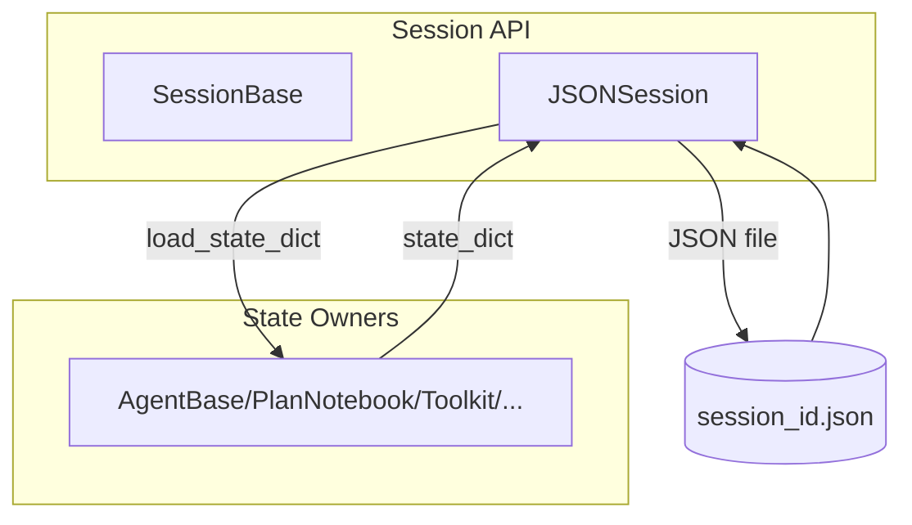

# SOP：src/agentscope/session 模块

## 一、功能定义（Scope/非目标）
### 1. 设计思路和逻辑
- 为包含多个 `StateModule` 的 Agent 会话提供统一的持久化/恢复接口，使开发者可以在任务中断或切换环境后恢复状态。
- 通过 `SessionBase` 抽象，让不同的存储后端（JSON、本地数据库、云存储）可插拔；默认实现专注于 JSON 文件。
- 不对状态内容做任何转换或校验，序列化规则完全由各 `StateModule` 定义。

### 2. 架构设计

### 3. 核心组件逻辑
- `SessionBase`：声明 `save_session_state` 与 `load_session_state` 两个异步接口；由具体实现决定存储介质。
- `JSONSession`：
  - `_get_save_path(session_id)` 构建 `<save_dir>/<session_id>.json` 并确保目录存在。
  - `save_session_state` 聚合 `state_module.state_dict()`，写入 UTF-8 JSON。
  - `load_session_state` 读取 JSON；对每个模块调用 `load_state_dict`；当文件缺失时，根据 `allow_not_exist` 决定跳过还是抛错。
  - 构造参数 `save_dir` 决定存储目录；`session_id` 构造参数已废弃，仅支持方法级传入。

### 4. 关键设计模式
- **模板方法**：`SessionBase` 作为抽象模板，派生类实现具体存储策略。
- **状态聚合**：依赖 `StateModule` 的 `state_dict/load_state_dict` 机制，保证层层嵌套对象可被序列化。
- **最小职责**：JSONSession 只负责文件 I/O，不参与状态差异对比或迁移。

### 5. 其他组件的交互
- **StateModule 实现者**：需要在构造函数中调用 `register_state` 或覆写 `state_dict`，确保属性可序列化。
- **Agent/Plan/Toolkit**：调用 `save_session_state("run-1", agent=agent, toolkit=tk, plan=plan)` 等方式存档；恢复时传入同名参数。
- **日志系统**：`JSONSession` 对成功/缺失文件情况使用 `logger.info` 提示；异常由调用方捕获并决定是否提示用户。
- **责任边界**：Session 模块不关心版本迁移、冲突解决、并发写入；外部需确保写入时的原子性与访问控制。

## 二、文件/类/函数/成员变量映射到 src 路径
- `src/agentscope/session/_session_base.py`
  - `SessionBase`：抽象类，定义 `save_session_state` / `load_session_state`。
- `src/agentscope/session/_json_session.py`
  - `JSONSession`：默认实现；构造参数 `save_dir`；方法 `_get_save_path`、`save_session_state`、`load_session_state`；使用 `logger` 输出提示。
- `src/agentscope/session/__init__.py`
  - 导出 `SessionBase`、`JSONSession`。
- `src/agentscope/session/CLAUDE.md`
  - 记录使用示例与调用链。

## 三、关键数据结构与对外接口（含类型/返回约束）
- `JSONSession(save_dir: str = "./")`
  - `async save_session_state(session_id: str, **state_modules_mapping: StateModule) -> None`：将每个模块的 `state_dict` 写入 JSON；不存在的目录会自动创建。
  - `async load_session_state(session_id: str, allow_not_exist: bool = True, **state_modules_mapping: StateModule) -> None`：读取 JSON 并调用对应模块的 `load_state_dict`；当文件缺失且 `allow_not_exist=False` 时抛 `ValueError`。
  - JSON 结构：`{module_name: state_dict, ...}`；具体字段由各模块决定。
  - I/O 异常（如权限问题）未捕获，调用方需处理。
- `SessionBase`：自定义存储后端时，需要实现上述两个方法，保证异步接口兼容。

## 四、与其他模块交互（调用链与责任边界）
- **保存流程**：
  `Agent/Toolkit/... register_state` → `JSONSession.save_session_state(session_id, ...)` → JSON 文件落盘。
- **恢复流程**：
  `JSONSession.load_session_state(session_id, modules...)` → 调用各模块 `load_state_dict` → 重建内存状态。
- **组合使用**：常与 Memory、Plan、Toolkit、Agent 等共同保存；调用方需保证传入的 key 与模块内部序列化使用的 key 对应。
- **责任边界**：Session 不做差异更新或锁控制；同一 `session_id` 重复写入会覆盖旧文件。

## 五、测试文件
- 绑定文件：`tests/session_test.py`
- 覆盖点：多模块状态聚合、允许不存在的加载策略、JSON 结构校验.
