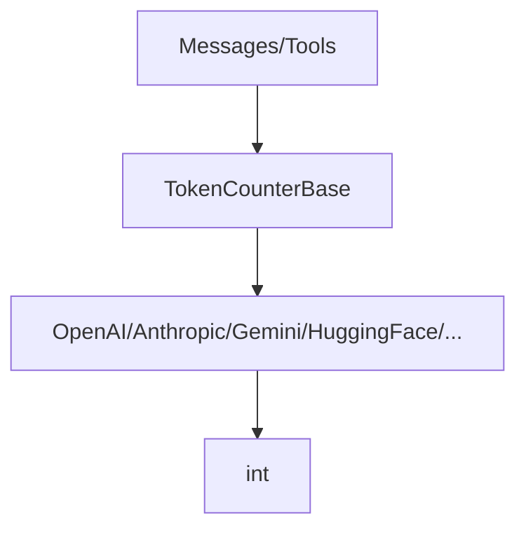

# SOP：src/agentscope/token 模块

## 一、功能定义（Scope/非目标）
### 1. 设计思路和逻辑
- 为不同模型提供方实现统一的 token 计数接口，支持对消息、工具 schema、多模态内容的预估，用于提示截断、费用估算或速率控制。
- 采用异步 `TokenCounterBase` 策略，便于 Formatter、Agent 在不同模型间切换时仍能获得一致的计数 API。
- 不提供通用的速率限制或费用换算，仅返回 token 数字（以及可能的辅助信息），其它逻辑交由调用方。

### 2. 架构设计

### 3. 核心组件逻辑
- **TokenCounterBase**：声明异步 `count(messages, **kwargs) -> int` 接口；`messages` 结构与 Formatter 输出保持一致。
- **OpenAITokenCounter**：使用 `tiktoken` 结合 OpenAI 官方指南，支持文本、多模态（图像/audio）、工具 schema 的计数；包含图像缩放、tile 计数等辅助函数。
- **AnthropicTokenCounter / GeminiTokenCounter / HuggingFaceTokenCounter**：依据各自文档或官方 SDK 提供估算逻辑，处理角色、工具、系统提示差异。
- **工具 schema 计数**：例如 OpenAI 计数器会为每个函数/参数名称/枚举等添加额外 token 消耗，用于估算工具调用成本。
- **多模态**：OpenAI/Gemini 计数器可处理 base64 或 URL 图像，计算分辨率带来的 token。
- **结果**：所有计数器返回整数 token 数；必要时可配合缓存（调用方实现）减少重复计算。

### 4. 关键设计模式
- **策略模式**：不同提供方的计数器实现 `TokenCounterBase`，调用方按需选择。
- **适配器**：将模型特定计数规则包装为统一接口。
- **辅助函数**：如 `_calculate_tokens_for_high_quality_image`、`_get_size_of_image_url` 支撑复杂规则。

### 5. 其他组件的交互
- **Formatter**：在格式化消息后调用计数器，判断是否需要截断或拆分。
- **Agent/Planner**：在生成计划或控制预算时使用计数结果。
- **提示优化工具**：可借助计数器衡量不同提示的 token 消耗。
- **责任边界**：计数结果基于当前实现的估算规则，与官方计费可能存在偏差；高精度计费以官方接口为准。

## 二、文件/类/函数/成员变量映射到 src 路径
- `src/agentscope/token/_token_base.py`
  - `TokenCounterBase`：定义统一接口。
- `src/agentscope/token/_openai_token_counter.py`
  - `OpenAITokenCounter`：最复杂实现，支持文本、多模态、工具 schema；依赖 `tiktoken` 与 `PIL`。
- `src/agentscope/token/_anthropic_token_counter.py`
  - `AnthropicTokenCounter`：基于 Claude API 的规则。
- `src/agentscope/token/_gemini_token_counter.py`
  - `GeminiTokenCounter`：适配 Google Gemini。
- `src/agentscope/token/_huggingface_token_counter.py`
  - `HuggingFaceTokenCounter`：兼容 Transformers 模型。
- `src/agentscope/token/__init__.py`
  - 导出所有计数器。

## 三、关键数据结构与对外接口（含类型/返回约束）
- `TokenCounterBase.count(messages: list[dict], **kwargs) -> int`
  - `messages`：通常为 Formatter 输出（每个元素包含 `role`、`content` 等）；某些实现可能需要额外参数（模型名称、工具 schema 等）。
  - 返回值：整数 token 数；如需成本估算可由调用方再转换。
- `OpenAITokenCounter` 额外参数：
  - `model_name: str`、`tools: list[dict] | None`、`encoding`（默认为 `tiktoken` 选择）。
  - 支持图像 URL/base64，内部通过 `_get_size_of_image_url` 请求网络或解析 base64。
- 其他计数器：接受相应模型名称或配置；具体参数详见源码。

## 四、与其他模块交互（调用链与责任边界）
- **消息生成 → 计数 → 截断**：Formatter 生成消息后，使用计数器估算长度；若超出模型限制，可回溯调整。
- **工具 schema 评估**：在注册工具时提前估算 JSON schema 消耗，帮助 Prompt 设计。
- **Plan/Memory 结合**：在注入 Memory/RAG/Plan 提示时，使用计数器评估额外 token 开销。
- **责任边界**：模块不缓存计数结果也不进行速率控制；网络调用（如获取图像尺寸）失败会抛异常，调用方应处理。

## 五、测试文件
- 绑定文件：`tests/token_openai_test.py`、`tests/token_anthropic_test.py`、`tests/token_huggingface_test.py`
- 覆盖点：不同提供方计数规则、边界用例.
