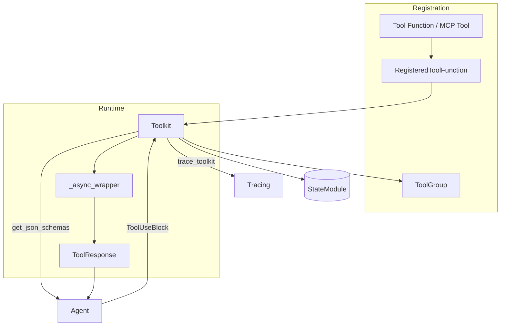

# SOP：src/agentscope/tool 模块

## 一、功能定义（Scope/非目标）
### 1. 设计思路和逻辑
- 为 Agent 提供统一的工具注册、分组、启停与调用框架，屏蔽同步/异步/生成器/MCP 等差异，输出统一的 `ToolResponse`。
- 将工具描述（JSON Schema）与执行逻辑解耦：注册阶段生成 schema、执行阶段产出内容块与元数据，便于 LLM 规划与 Agent 处理。
- 兼容内建函数、远程 MCP 工具、结构化完成函数，并支持后处理、预置参数、扩展模型等高级能力。

### 2. 架构设计

### 3. 核心组件逻辑
- **注册阶段**：`register_tool_function` 解析函数签名/Docstring 生成 Pydantic 模型，再转 JSON Schema；支持 `functools.partial`、`preset_kwargs`、`postprocess_func`；MCP 工具通过 `register_mcp_client/server` 批量注册。
  - 注意（SubAgent 专属）：注册由 `make_subagent_tool(...)` 生成的子代理工具时，必须使用其返回的 `json_schema`（即返回值中的字典字段 `register_kwargs["json_schema"]`）进行注册；切勿依赖包装器函数签名再次推导 Schema（包装器本身没有业务参数），否则会丢失由 `InputModel` 定义的 `{query}` 等字段。
- **分组与启停**：`create_tool_group`/`update_tool_groups`/`remove_tool_groups` 管理工具集合；`basic` 组常驻；`get_json_schemas` 根据激活分组返回 schema；`get_tool_group_notes` 提供提示文本。
- **调用阶段**：`call_tool_function` 根据 `ToolUseBlock` 查找工具、合并用户参数与 `preset_kwargs`，并通过 `_async_wrapper` 适配同步函数、协程、同步/异步生成器；流式工具逐块产生 `ToolResponse`，最后一个块 `is_last=True`。
- **结构化完成函数**：`Toolkit.set_extended_model`（在 Agent 中调用）将完成函数绑定 Pydantic 模型，使结构化输出与工具通道复用。
- **MCP 客户端**：`MCPClientBase` 派生类负责列出远程工具；`Toolkit.register_mcp_client` 将其转换为本地工具函数；支持状态化客户端（`StatefulClientBase`）。
- **状态持久化**：继承 `StateModule`，可保存启用的工具组或注册信息；默认 `state_dict` 包含工具/分组配置。

### 4. 关键设计模式
- **适配器模式**：`RegisteredToolFunction` 统一包装本地函数、partial 和 MCP 工具。  
- **策略模式**：postprocess 回调、扩展模型、自定义 `preset_kwargs` 让调用策略可配置。  
- **装饰器/切面**：`trace_toolkit` 为每次调用生成 OpenTelemetry span。  
- **生成器封装**：`_async_wrapper` 将同步/异步生成器统一包装成异步迭代器供 Agent 消费。

### 5. 其他组件的交互
- **Agent / ReActAgent**：行动阶段调用 `call_tool_function` 执行工具；`ToolResponse.metadata.response_msg` 可作为完成函数的最终答案。  
- **Toolkit JSON Schema → Model**：`get_json_schemas` 提供给模型（通过 Formatter）作为工具调用描述。  
- **PlanNotebook/Memory 等工具供给者**：通过 Toolkit 注册自己的函数或工具组，实现动态启停。  
- **Tracing & Logging**：`trace_toolkit` 记录输入、输出、异常；内部对不可恢复的错误直接抛出，由 Agent 决定是否转为文本。  
- **Session**：作为 `StateModule`，可随 Agent 会话持久化工具状态（例如激活组）。

## 二、文件/类/函数/成员变量映射到 src 路径
- `src/agentscope/tool/_toolkit.py`  
  - `Toolkit`：主类；管理 `tools: dict[str, RegisteredToolFunction]` 与 `groups: dict[str, ToolGroup]`；核心方法 `register_tool_function`、`call_tool_function`、`create_tool_group`、`update_tool_groups`、`remove_tool_groups`、`register_mcp_client`、`remove_mcp_servers`、`get_json_schemas`、`get_tool_group_notes`。  
  - `ToolGroup` dataclass：`name`、`description`、`active`、`notes`。  
  - 依赖 `_async_wrapper` 系列函数、`_remove_title_field` 等工具。
- `src/agentscope/tool/_registered_tool_function.py`  
  - `RegisteredToolFunction`：存储原始函数、分组、schema、`preset_kwargs`、`postprocess_func`、`extended_model` 等信息。  
  - 提供 `call` 方法封装执行。
- `src/agentscope/tool/_response.py`  
  - `ToolResponse` dataclass：`content`（`TextBlock|ImageBlock|AudioBlock` 列表）、`metadata: dict | None`、`stream: bool`、`is_last: bool`、`is_interrupted: bool`、`id`。  
  - 默认 `id` 由 `_get_timestamp(True)` 生成。
- `src/agentscope/tool/_async_wrapper.py`  
  - `_async_generator_wrapper` / `_sync_generator_wrapper` / `_object_wrapper`：将不同类型函数统一为异步生成器或单次输出。  
  - `_object_wrapper` 在同步函数返回单个 `ToolResponse` 时使用。
- `src/agentscope/tool/_coding`、`_multi_modality`、`_text_file` 等目录  
  - `_text_file`：提供 `view_text_file` / `write_text_file` / `insert_text_file` 三个示例工具。【封存警示】这些函数直接调用宿主操作系统 `open()` / `os.path.exists()`，不会经过 `FileDomainService` 或逻辑命名空间校验，默认 Toolkit 不得随意注册。仅在确认需要访问 sandbox 之外的路径、并已完成风险评估与审计记录时，方可由开发者显式启用。
  - 示例工具集合，可参考其注册方式。  
- `src/agentscope/tool/__init__.py`  
  - 导出 `Toolkit`、常用工具函数、`execute_python_code` 等。  
- `src/agentscope/tool/CLAUDE.md`
  - 调用链与注册示例，需要与本 SOP 同步。

## 三、关键数据结构与对外接口（含类型/返回约束）
- `Toolkit.register_tool_function(`  
  `tool_func: ToolFunction, group_name: str | Literal["basic"] = "basic", preset_kwargs: dict[str, JSONSerializableObject] | None = None, func_description: str | None = None, json_schema: dict | None = None, include_long_description: bool = True, include_var_positional: bool = False, include_var_keyword: bool = False, postprocess_func: Callable[[ToolUseBlock, ToolResponse], ToolResponse | None] | None = None) -> None`  
  - 若未提供 `json_schema`，函数会使用 `inspect.signature` + docstring 生成 Pydantic 模型（忽略 `preset_kwargs`），再转换成 JSON Schema；`include_*` 参数控制 docstring长描述及 `*args/**kwargs` 是否写入 schema。  
  - `preset_kwargs` 不暴露给 LLM，调用时与用户参数合并。  
  - `postprocess_func` 若返回 `ToolResponse` 将替换原结果；返回 `None` 表示沿用原响应。  
  - 异常：`ValueError`（重复名称、删除 `basic` 组）、`TypeError`（`json_schema` 结构不合法）。
- `Toolkit.set_extended_model(finish_function_name: str, structured_model: type[BaseModel]) -> None`  
  - 将完成函数名称映射到 Pydantic 模型；在结构化输出场景下，Toolkit 会把模型 schema 注册为额外工具，并在 `call_tool_function` 中调用完成函数时使用 `structured_model.model_validate` 校验参数并注入至 `ToolResponse.metadata["response_msg"]`。  
  - 常在 `ReActAgent` 初始化时由 Agent 调用一次。
- `Toolkit.call_tool_function(tool_call: ToolUseBlock) -> AsyncGenerator[ToolResponse, None]`  
  - 查找 `tool_call["name"]` 对应的 `RegisteredToolFunction`，合并 `tool_call["input"]` 与 `preset_kwargs`，并根据函数类型选择同步/异步执行或包装为异步生成器。  
  - 每次 yield `ToolResponse`，其中 `stream` 由工具决定；若工具中途抛出异常，默认向上抛出。  
  - 结构化完成函数会根据 `set_extended_model` 设置将 `metadata["response_msg"]` 填充并标记 `is_last=True`。
- `Toolkit.get_json_schemas(group_names: list[str] | None = None) -> list[dict]`  
  - 返回当前激活组的 JSON Schema；Schema 会调用 `_remove_title_field` 去除 `title` 避免 LLM 偏置。
- `Toolkit.register_mcp_client(client: MCPClientBase, /, *, group_name: str = "basic", enable_funcs: list[str] | None = None, disable_funcs: list[str] | None = None, preset_kwargs_mapping: dict[str, dict[str, JSONSerializableObject]] | None = None, postprocess_func: Callable[[ToolUseBlock, ToolResponse], ToolResponse | None] | None = None, wrap_tool_result: bool = True) -> None`  
  - `enable_funcs`/`disable_funcs` 控制注册白名单/黑名单；`preset_kwargs_mapping` 设置 per-tool 预置参数；其余参数与本地工具注册一致。  
  - `wrap_tool_result=False` 时 Toolkit 将直接返回 MCP 原始 `CallToolResult`。
- `RegisteredToolFunction.call(*, arguments: dict[str, JSONSerializableObject], stream_print: bool | None = None) -> AsyncGenerator[ToolResponse, None]`  
  - 合并 `preset_kwargs` 后将参数传给原始函数；缓存 `extended_model`、`postprocess_func`、`group` 信息。  
  - 若工具是同步函数返回单个 `ToolResponse`，包装器会 yield 一次并设置 `is_last=True`。
- `ToolResponse`  
  - 字段：`content: list[TextBlock | ImageBlock | AudioBlock]`、`metadata: dict | None`、`stream: bool`、`is_last: bool`、`is_interrupted: bool`、`id: str`；默认 `id` 使用 `_get_timestamp(True)`，`stream=False`、`is_last=True`。  
  - 结构化完成函数使用 `metadata["response_msg"]` 填充原始文本（供 Agent 直接读取）。
- `ToolFunction`（`src/agentscope/types/_tool.py`）允许返回 `ToolResponse`、`Awaitable[ToolResponse]`、同步/异步生成器或返回生成器的协程；Toolkit 会统一包装。
- MCP 抽象：`MCPToolFunction.__call__(**kwargs) -> ToolResponse | mcp.types.CallToolResult`，由 MCP 客户端创建；`MCPClientBase.get_callable_function` 在 Toolkit 注册阶段被调用。

## 四、与其他模块交互（调用链与责任边界）
- **Agent ↔ Toolkit**：Agent 在行动阶段根据模型返回的 `ToolUseBlock` 调用 `Toolkit.call_tool_function`；返回的 `ToolResponse` 被 Agent 转成输出消息或结构化结果。  
- **Formatter/Model**：`Toolkit.get_json_schemas` 的结果被 Formatter 注入到模型请求中；模型调用工具后返回 `tool_use` 分片。  
- **Tracing**：`trace_toolkit` 装饰 `call_tool_function`，记录输入、输出和异常，帮助调试外部工具。  
- **MCP 模块**：`Toolkit.register_mcp_client` 依赖 MCP 客户端实现，以 RPC 方式访问远程工具。  
- **责任边界**：  
  - Toolkit 不定义业务含义，只保证执行流程与异常传递；  
  - 工具函数内部应自行处理重试、鉴权；  
  - 若工具抛异常，Toolkit 默认向上抛或生成错误块，由 Agent 决定是否展示。

## 五、测试文件
- 绑定文件：`tests/toolkit_test.py`、`tests/tool_test.py`、`tests/tool_openai_test.py`、`tests/tool_dashscope_test.py`
- 覆盖点：注册（函数/partial/MCP）、JSON Schema 生成与清洗、结构化完成函数扩展模型、postprocess 行为、同步/异步/流式统一封装、分组启停、异常路径与错误提示。

## 危险工具告示（Raw OS Text I/O）

- 模块：`src/agentscope/tool/_text_file/` 下的 `view_text_file`、`write_text_file`、`insert_text_file` 为“原始 OS 文件访问”工具，直接通过 `open/os.path` 读写宿主机路径，绕过 FileSystem 命名空间与授权（如 `/userinput/`、`/workspace/`）。
- 使用原则：默认不应注册到通用 Agent/子代理。仅在“明确需要访问沙箱外路径且完成风控/审计”的场景下按需启用。
- 运行期护栏：环境变量 `AGENTSCOPE_DANGEROUS_TEXT_IO`（默认 `warn`）。
  - `deny`：阻断调用，工具返回提示。
  - `warn`：记录 WARNING 并继续执行。
  - `allow`：允许执行（仍在 ToolResponse.metadata 标注 `dangerous_io`）。
- 推荐替代：优先使用 `agentscope.filesystem._tools` 提供的受控工具（`read_text_file`、`write_file`、`edit_file`、`delete_file`、`list_directory` 等），通过 `DiskFileSystem.create_handle(...) + FileDomainService` 注入并以 `preset_kwargs` 注册到 Toolkit。
