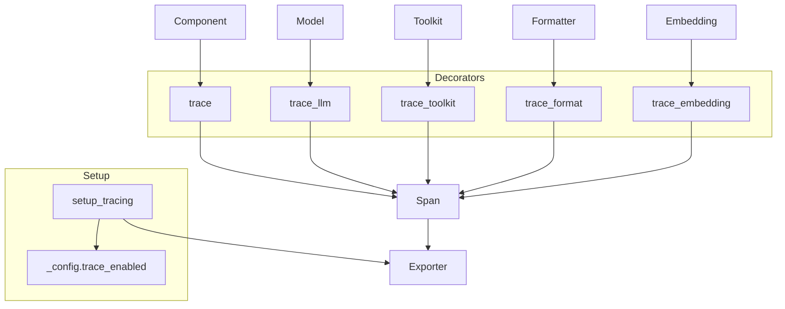

# SOP：src/agentscope/tracing 模块

## 一、功能定义（Scope/非目标）
### 1. 设计思路和逻辑
- 为 AgentScope 核心组件（Agent、Model、Toolkit、Formatter、Embedding）提供统一的 OpenTelemetry 追踪装饰器，记录输入、输出、异常与流式增量。
- 设计目标是“零侵入”：通过装饰器自动生成 Span，不改变被装饰函数的语义，也不引入额外重试或异常处理。
- 不负责后端采集配置，以 `setup_tracing` 提供最小入口，其余由调用者配置。

### 2. 架构设计

### 3. 核心组件逻辑
- **启用流程**：`setup_tracing(endpoint: str)` 配置 OTLP/HTTP 导出器，初始化 Tracer Provider，并将 `_config.trace_enabled` 设为 True；未调用时装饰器直接返回原函数。
- **通用装饰器 `trace(name)`**：
  - 入口：判断函数类型（同步、异步、生成器、异步生成器），创建 Span 并记录输入。
  - 返回生成器时使用 `_trace_async_generator_wrapper` / `_trace_sync_generator_wrapper` 包裹，确保每个增量都传播，同时在生成完毕时记录最后一个块为 OUTPUT。
  - 捕获异常时 `record_exception` 并设置 Span 状态为 ERROR，再重新抛出。
- **`trace_llm`**：专用于 `ChatModelBase` 实现，追加模型名称、工具信息、结构化输出等属性；在流式模式下逐块记录文本/思考/工具片段，并累计 `ChatUsage`。
- **`trace_toolkit`**：装饰 `Toolkit.call_tool_function`，记录工具名称、输入参数、`ToolResponse` 内容及流式分块。
- **`trace_format`**：记录 Formatter 输入的 `Msg` 与输出的 provider payload，便于调试格式化逻辑。
- **`trace_embedding`**：记录嵌入模型调用的输入数量、向量维度与耗时。
- 所有装饰器依赖 `_serialize_to_str` 将复杂对象安全地转为字符串属性。

### 4. 关键设计模式
- **装饰器模式**：所有追踪能力通过装饰器注入，无需修改原函数。
- **生成器包装**：对同步/异步生成器执行统一包装，保证流式信息在 Span 内完整记录。
- **特性检测**：通过 `inspect.iscoroutinefunction` 等判断函数类型，选择合适的包装策略。

### 5. 其他组件的交互
- **Agent/Model/Toolkit/Formatter/Embedding**：通过装饰器自动生成 Span；若未调用 `setup_tracing`，装饰器会快速返回原函数避免性能损耗。
- **配置模块 (`_config`)**：`trace_enabled` 控制是否记录，`run_id` 等信息会写入 Span 属性。
- **日志系统**：异常会在 span 中记录，同时透传给原调用者；模块自身不写日志，除非需要提示配置问题。
- **责任边界**：追踪层不改变函数返回值或异常流程；对外暴露的 Span 属性由业务层决定是否消费。

## 二、文件/类/函数/成员变量映射到 src 路径
- `src/agentscope/tracing/_setup.py`
  - `setup_tracing(endpoint: str, service_name: str | None = None, **kwargs)`：配置 OTLP/HTTP 导出器、资源属性，并设置 `_config.trace_enabled=True`。
- `src/agentscope/tracing/_trace.py`
  - `trace(name: str)`：通用装饰器。
  - `trace_llm(func)`：针对模型接口。
  - `trace_toolkit(func)`：包装 `Toolkit.call_tool_function`。
  - `trace_format(func)`：包装 `Formatter.format`。
  - `trace_embedding(func)`：包装嵌入模型调用。
  - 内部辅助：`_trace_async_generator_wrapper`、`_trace_sync_generator_wrapper`、`_check_tracing_enabled`。
- `src/agentscope/tracing/_attributes.py`
  - `_serialize_to_str`：安全序列化输入输出。
- `src/agentscope/tracing/_types.py`
  - `SpanKind`、`SpanAttributes`：枚举与常量，统一 span 字段命名。
- `src/agentscope/tracing/__init__.py`
  - 导出装饰器与 `setup_tracing`。

## 三、关键数据结构与对外接口（含类型/返回约束）
- `setup_tracing(endpoint: str, service_name: str | None = None, headers: dict | None = None, **kwargs) -> None`
  - 必须在导出前调用；若 endpoint 无效将抛出异常。
  - 副作用：配置 OpenTelemetry Tracer Provider，设 `_config.trace_enabled=True`。
- 装饰器接口：
  - `trace(name: str) -> Callable[[Callable], Callable]`
  - `trace_llm(func: Callable) -> Callable`
  - `trace_toolkit(func: Callable) -> Callable`
  - `trace_format(func: Callable) -> Callable`
  - `trace_embedding(func: Callable) -> Callable`
  - 返回的装饰器与原函数签名兼容；若未启用 tracing，直接调用原函数。
  - 生成器包装返回 `AsyncGenerator` 或 `Generator`，调用方可直接 `async for`/`for`。
- Span 属性：通过 `SpanAttributes.INPUT`、`OUTPUT`、`META`、`PROJECT_RUN_ID` 等记录数据；错误状态使用 `opentelemetry.trace.StatusCode.ERROR`。

## 四、与其他模块交互（调用链与责任边界）
- **设置阶段**：应用启动时调用 `setup_tracing`；若与 AgentScope Studio 集成，可复用 studio tracing endpoint。
- **运行阶段**：被装饰函数 → 创建 Span → 执行原逻辑 → 记录输出/异常 → Span 结束 → Exporter 将数据发送至后端。
- **禁用场景**：若 `_config.trace_enabled=False`（默认），装饰器退化为透明函数，避免性能影响。
- **责任边界**：追踪模块不修改原函数返回值、不吞异常、不提供导出重试；Exporter 失败会按 OpenTelemetry 的默认处理进行日志提示。

## 五、测试文件
- 绑定文件：`tests/tracer_test.py`
- 覆盖点：装饰器在同步/异步/生成器上的表现、异常记录、输出最后块.
