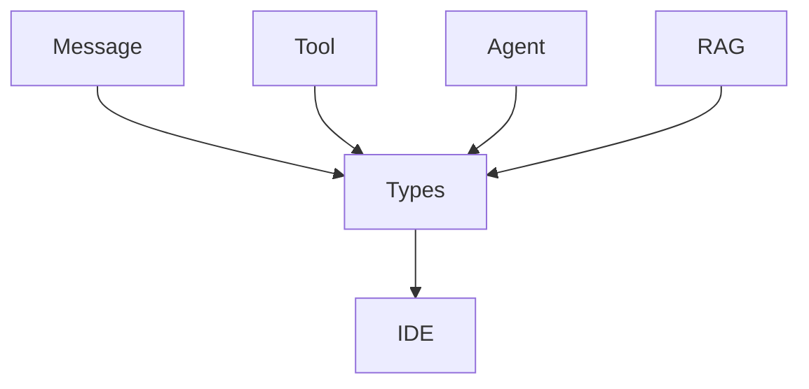

# SOP：src/agentscope/types 模块

## 一、功能定义（Scope/非目标）
### 1. 设计思路和逻辑
- 集中声明在各模块之间共享的类型别名、TypedDict 与协议，减少循环依赖并增强静态类型检查。
- 覆盖 JSON 可序列化对象、工具函数签名、Hook 名称、嵌入向量等基础类型，确保接口文档与实现一致。
- 模块仅包含类型声明，不引入运行时逻辑。

### 2. 架构设计

### 3. 核心组件逻辑
- `_json.py`：定义递归类型 `JSONPrimitive`、`JSONSerializableObject`，描述可序列化的 JSON 结构，用于 `register_state`、工具参数等。
- `_tool.py`：定义 `ToolFunction` 联合类型，兼容同步函数、异步函数、同步/异步生成器以及返回生成器的协程。
- `_hook.py`：声明 `AgentHookTypes`、`ReActAgentHookTypes`，列出允许注册的 Hook 名称。
- `_object.py`：定义 `Embedding = list[float]` 等基础别名。
- `__init__.py` 导出上述类型供其他模块引用；引用关系与使用场景由本 SOP 说明。

### 4. 关键设计模式
- **集中式类型定义**：通过单一模块暴露共享类型，避免在各模块重复声明。
- **静态检查友好**：联合类型与 Literal 提供 IDE 补全支持。

### 5. 其他组件的交互
- **Toolkit/Agent**：使用 `ToolFunction` 与 Hook 类型校验输入。
- **Session/StateModule**：依赖 `JSONSerializableObject` 约束序列化数据。
- **Embedding/RAG**：引用 `Embedding`、`JSONSerializableObject` 描述返回值。
- **责任边界**：模块不执行类型检查，这些类型主要服务于静态分析或文档说明。

## 二、文件/类/函数/成员变量映射到 src 路径
- `src/agentscope/types/_json.py`：`JSONPrimitive`、`JSONSerializableObject`。
- `src/agentscope/types/_tool.py`：`ToolFunction`。
- `src/agentscope/types/_hook.py`：`AgentHookTypes`、`ReActAgentHookTypes`。
- `src/agentscope/types/_object.py`：`Embedding`。
- `src/agentscope/types/__init__.py`：聚合导出。

## 三、关键数据结构与对外接口（含类型/返回约束）
- `JSONSerializableObject`：递归定义的可 JSON 序列化结构，可用于 `register_state`、工具参数、配置等。
- `ToolFunction`：`Callable[..., ToolResponse | Awaitable[...] | Generator[...] | AsyncGenerator[...] | Coroutine[..., ToolResponse]]`；保证 Toolkit 在输入类型上保持宽容。
- `AgentHookTypes` / `ReActAgentHookTypes`：限制 Hook 名称，防止注册未知 Hook。
- `Embedding`：`list[float]`，供嵌入模型和向量库协同使用。

## 四、与其他模块交互（调用链与责任边界）
- 模块不直接参与程序流程，但其类型被 Agent、Toolkit、Memory、Embedding、Session 等广泛引用，作为共有契约。
- 如果类型声明与实现不一致，应在对应模块更新实现或类型声明，保持一致性。

## 五、测试文件
- 绑定文件：间接：各模块测试
- 覆盖点：被引用的类型在使用模块测试中覆盖.
