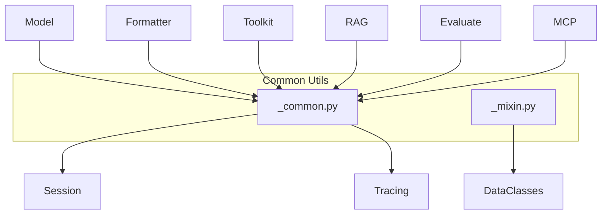

# SOP：src/agentscope/_utils 模块

## 一、功能定义（Scope/非目标）
### 1. 设计思路和逻辑
- 汇集跨模块复用的通用工具函数和混入类，覆盖 JSON 修复、异步函数调度、Schema 处理、多模态文件操作、时间戳与稳定 ID 生成等场景。
- 避免在各模块重复实现通用逻辑，保持函数无副作用或仅包含最小必要的 I/O。
- 不承载业务策略、复杂网络交互或缓存逻辑；遇到异常直接向上抛出。

### 2. 架构设计

### 3. 核心组件逻辑
- `_json_loads_with_repair`：使用 `json_repair` 修复残缺 JSON，失败时抛 `ValueError`，错误信息同时包含原始串与修复串。
- `_is_async_func` / `_execute_async_or_sync_func`：识别协程、异步生成器、`functools.partial` 等，统一执行并返回结果。
- `_get_bytes_from_web_url`、`_save_base64_data`：分别负责下载文本/二进制内容、将 base64 数据写入临时文件，内置重试与异常传播。
- `_extract_json_schema_from_mcp_tool`、`_remove_title_field`、`_create_tool_from_base_model`：生成并清洗 JSON Schema，供 Toolkit 与模型结构化输出使用。
- `_get_timestamp(add_random_suffix=False)`：生成毫秒级时间戳，可附随机后缀；`_map_text_to_uuid` 生成稳定 UUID。
- `DictMixin`：允许字典对象支持属性访问（用于 `ChatResponse`、`MetricResult` 等数据类）。

### 4. 关键设计模式
- **工具函数集合**：以纯函数形式提供通用能力。
- **混入模式**：`DictMixin` 扩展 dict 行为。
- **适配器**：schema 转换函数把外部描述转换为 AgentScope 统一格式。

### 5. 其他组件的交互
- 模型、Formatter、Toolkit、RAG、Evaluate、MCP、Tracing、Session 等模块均依赖这些函数完成 JSON 解析、Schema 生成、异步调度与多模态处理。
- 责任边界：网络 I/O 或文件写入失败由调用方负责重试或降级处理。

## 二、文件/类/函数/成员变量映射到 src 路径
- `src/agentscope/_utils/_common.py`
  - JSON：`_json_loads_with_repair`。
  - 异步：`_is_async_func`、`_execute_async_or_sync_func`.
  - 多模态 I/O：`_is_accessible_local_file`、`_get_bytes_from_web_url`、`_save_base64_data`。
  - Schema：`_extract_json_schema_from_mcp_tool`、`_remove_title_field`、`_create_tool_from_base_model`。
  - 时间/ID：`_get_timestamp`、`_map_text_to_uuid`。
- `src/agentscope/_utils/_mixin.py`
  - `DictMixin`：属性访问代理。
- `src/agentscope/_utils/__init__.py`
  - 暴露公共函数；

## 三、关键数据结构与对外接口（含类型/返回约束）
- `_json_loads_with_repair(json_str: str) -> dict | list | JSONPrimitive`。
- `_execute_async_or_sync_func(func: Callable, *args, **kwargs) -> Any`：根据 `func` 类型决定 `await` 或直接调用。
- `_get_bytes_from_web_url(url: str, max_retries: int = 3) -> str`：返回文本或 base64；失败抛异常。
- `_save_base64_data(media_type: str, base64_data: str) -> str`：写临时文件并返回路径。
- `_extract_json_schema_from_mcp_tool(tool)` 返回符合 JSON Schema Draft-07 的 dict；`_remove_title_field` 原地修改 schema。
- `_create_tool_from_base_model(structured_model: BaseModel, tool_name: str = "generate_structured_output") -> dict`：将 Pydantic 模型转为工具描述。
- `_get_timestamp(add_random_suffix: bool = False) -> str`；`_map_text_to_uuid(text: str) -> str`。
- `DictMixin`：继承 dict，重载 `__getattr__/__setattr__`。

## 四、与其他模块交互（调用链与责任边界）
- **模型结构化输出**：`_create_tool_from_base_model` → Formatter/Model → Toolkit。
- **MCP 集成**：`_extract_json_schema_from_mcp_tool` → Toolkit 注册远端工具。
- **多模态资源**：Formatter/Toolkit 使用 `_get_bytes_from_web_url`、`_save_base64_data` 处理图片/音频。
- **异步 Hook 执行**：Agent/Plan 使用 `_execute_async_or_sync_func` 调度同步或异步 Hook。
- 异常由调用方处理，工具函数不包含重试策略（除个别函数有限重试）。

## 五、测试文件
- 绑定文件：间接：Model/Formatter/Toolkit/RAG 测试
- 覆盖点：通用函数在调用路径中覆盖.
