# Permission Audit Agent Service Example

English | [中文](README_zh.md)

A runnable AgentScope service that proves `extra_agent_middlewares` can
observe permission decisions and user confirmations in a real service,
while reusing the existing `examples/web_ui` frontend unchanged.

## What it demonstrates

- Every permission decision (ASK/DENY/ALLOW) and mode transformation
  (BYPASS suppression, DONT_ASK conversion, allow-rule override,
  user-confirmed reuse) is emitted as a structured JSON record to the
  service console.
- User approvals and rejections are emitted as separate confirmation
  records, correlated with the decision records by `tool_call_id`.
- A side-effect-free demo tool (`PermissionAuditDemoTool`) lets you
  exercise ordinary and bypass-immune safety ASKs without running
  destructive commands.

## Run the service

### Prerequisites

Install AgentScope with service extras and start a Redis instance:

```bash
pip install agentscope[full]
redis-server                 # or: brew services start redis
```

Run the audit example service:

```bash
cd examples/permission_audit_service
python main.py
```

Then launch the existing Web UI (unchanged):

```bash
cd examples/web_ui
pnpm install
pnpm dev
```

Point the UI at `http://localhost:8000`. Permission interactions appear
in the UI as usual; structured audit records appear in the service
console (one JSON object per line via the `permission_audit` logger).

## Audit record fields

Decision record:

```json
{
  "event": "permission_decision",
  "observed_at": "2026-07-03T12:34:56.123456+00:00",
  "user_id": "user-1",
  "agent_id": "agent-1",
  "session_id": "session-1",
  "reply_id": "reply-1",
  "tool_call_id": "call-1",
  "tool_name": "PermissionAuditDemoTool",
  "mode": "bypass",
  "resolution": "bypass_ask_suppressed",
  "effective": {"behavior": "allow", "reason": "...", "bypass_immune": false},
  "candidate": {"behavior": "ask", "reason": "...", "bypass_immune": true}
}
```

`candidate` is `null` for direct decisions and `USER_CONFIRMED`.

Confirmation record:

```json
{
  "event": "permission_confirmation",
  "observed_at": "2026-07-03T12:35:10.123456+00:00",
  "user_id": "user-1",
  "agent_id": "agent-1",
  "session_id": "session-1",
  "reply_id": "reply-1",
  "tool_call_id": "call-1",
  "tool_name": "PermissionAuditDemoTool",
  "confirmed": false,
  "accepted_rule_count": 0
}
```

## Scenarios

Each scenario is triggered by asking the agent to invoke
`PermissionAuditDemoTool` with a `risk` parameter; the audit record
appears in the service console. The `mode` is the session's permission
mode.

1. **DEFAULT ASK** — In DEFAULT mode, invoke with `risk=ordinary`. The
   demo tool returns a plain ASK; the audit record shows
   `effective=ASK`, `candidate=null`, `resolution=DIRECT`. This is the
   baseline: a final ASK and its reason are now visible to middleware
   even without any mode conversion.

   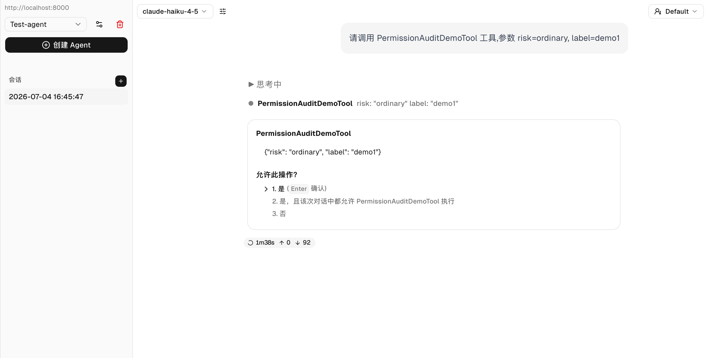
   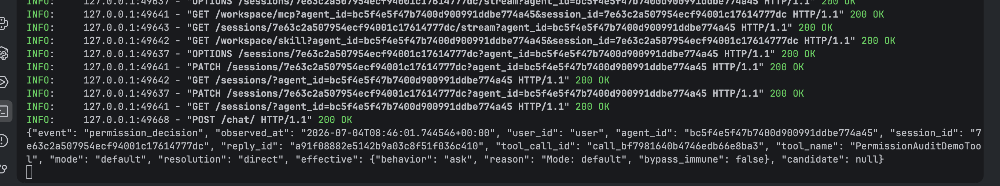

2. **User confirmation reuse** — Approve the pending call from scenario
   1 (optionally "remember" the rule). The console first receives a
   `permission_confirmation` record with `confirmed=true`, then a
   decision record with `effective=ALLOW`,
   `resolution=USER_CONFIRMED`. The two records correlate by
   `tool_call_id`: the confirmation states the user's choice, the later
   decision explains why the resumed call executes without re-evaluating
   the engine.

   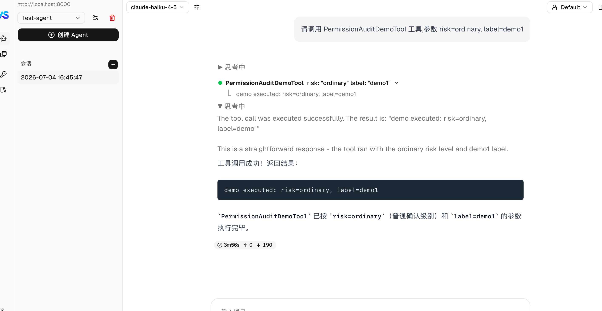
   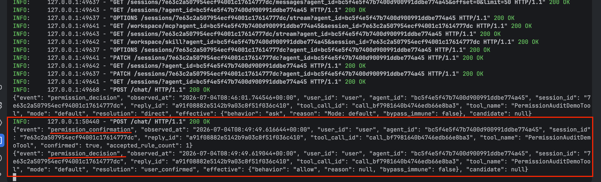

3. **User rejection** — Reject a pending call. The console receives a
   `permission_confirmation` record with `confirmed=false`; no later
   `USER_CONFIRMED` or tool-execution record appears. Rejection is
   distinguishable from an unanswered or interrupted ASK.

   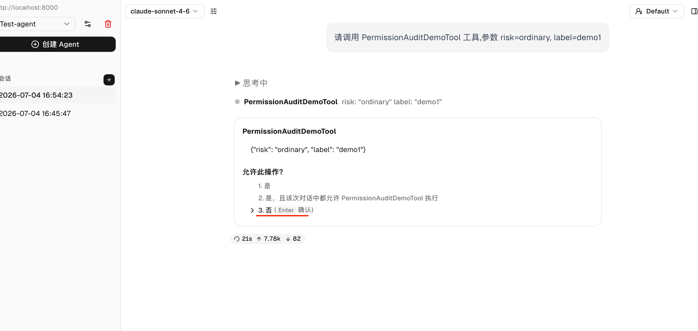
   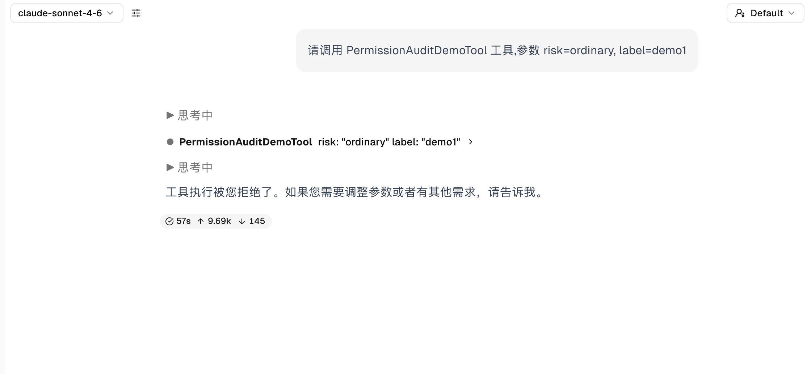
   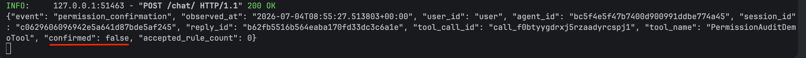

4. **BYPASS safety suppression** — Switch the session to BYPASS and
   invoke with `risk=safety`. The demo tool's bypass-immune safety ASK
   is suppressed into ALLOW. The record shows `candidate` = the safety
   ASK (`bypass_immune=true`), `effective=ALLOW`,
   `resolution=BYPASS_ASK_SUPPRESSED`. Without this hook the final
   ALLOW could be misread as a clean safety approval.

   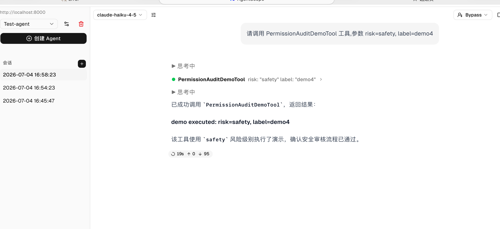
   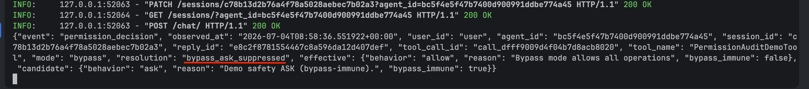

5. **DONT_ASK conversion** — Run unattended (DONT_ASK mode) with
   `risk=ordinary`. With no user available, the ASK is converted to
   DENY. The record shows `candidate=ASK`, `effective=DENY`,
   `resolution=ASK_CONVERTED_TO_DENY` — distinguishable from an
   explicit deny rule.

   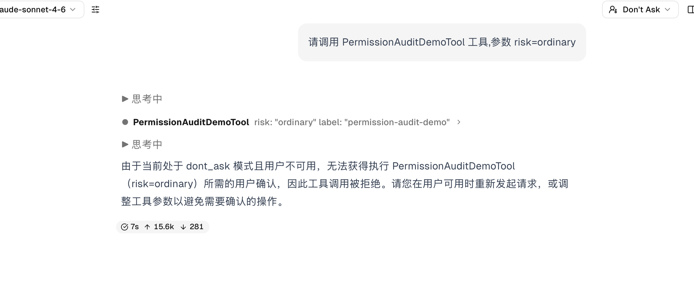
   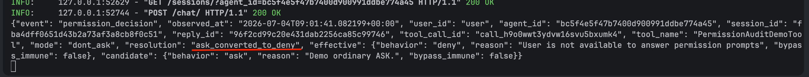

6. **Allow-rule override** — In DEFAULT mode, first approve a pending
   call with "remember rule" to add a tool-name-level allow rule, then
   invoke the demo tool again with `risk=ordinary` (a new tool call).
   The new call's ASK is overridden by the allow rule. The record shows
   `candidate=ASK`, `effective=ALLOW`,
   `resolution=ASK_OVERRIDDEN_BY_ALLOW_RULE`. This differs from
   `USER_CONFIRMED`: here a *new* call is preauthorized by a rule,
   rather than the same call resuming after confirmation.

   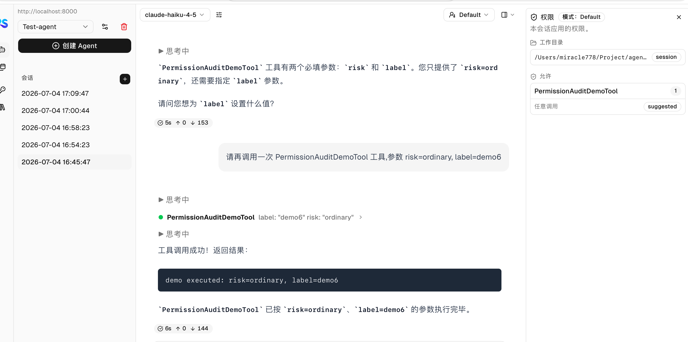
   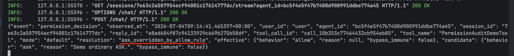

## Privacy

Records deliberately exclude raw `tool_input`, raw model input
(`tool_call.input`), raw permission-rule content, file contents, shell
command text, and credentials. Production consumers may add
schema-aware redaction or allowlisted fields; this example teaches the
safe default.

> **Warning — `reason` field.** The `effective.reason` / `candidate.reason`
> field carries `PermissionDecision.decision_reason` verbatim. When a
> decision is produced by a rule match, the engine sets
> `decision_reason=f"Rule: {rule_content}"`, so `reason` may contain the
> matched rule's content — which for Bash is a command substring pattern
> and for Write/Read is a file-path glob. If your rules match sensitive
> paths or commands, redact or drop the `reason` field in your sink
> before persisting audit records.

## Failure semantics

The middleware does not catch sink exceptions, demonstrating the
framework's fail-closed observer contract: if required audit recording
fails, the tool call does not execute. For best-effort logging, wrap
the sink body in `try/except` and log the transport failure.

## Relationship to examples/agent_service

This service follows the same operational shape (FastAPI via
`create_app`, Redis storage, `InMemoryMessageBus`,
`LocalWorkspaceManager`, CORS, `uvicorn` on port 8000, companion
`examples/web_ui`) but omits RAG and optional MCP so the permission
lifecycle remains the focus. See `examples/agent_service` for the
full-featured setup.
