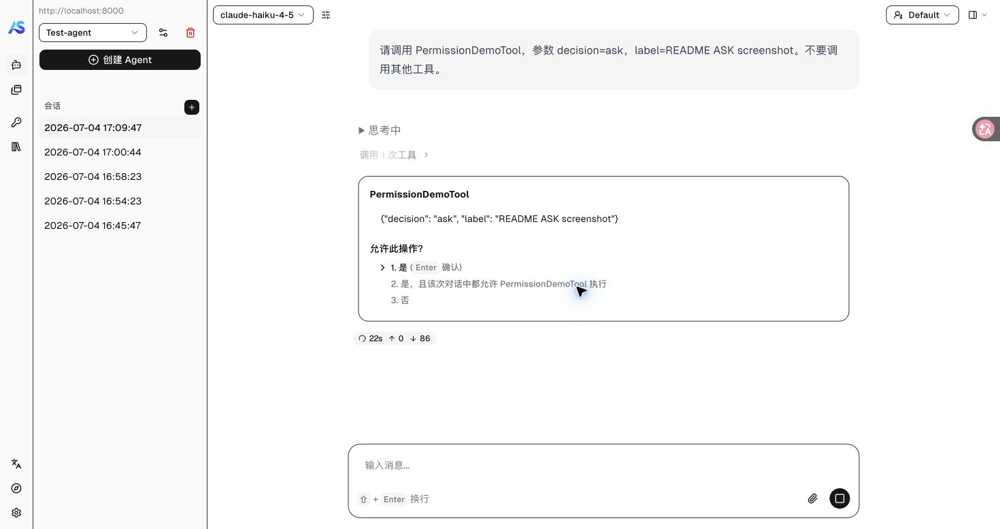
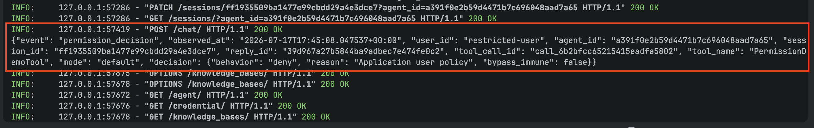
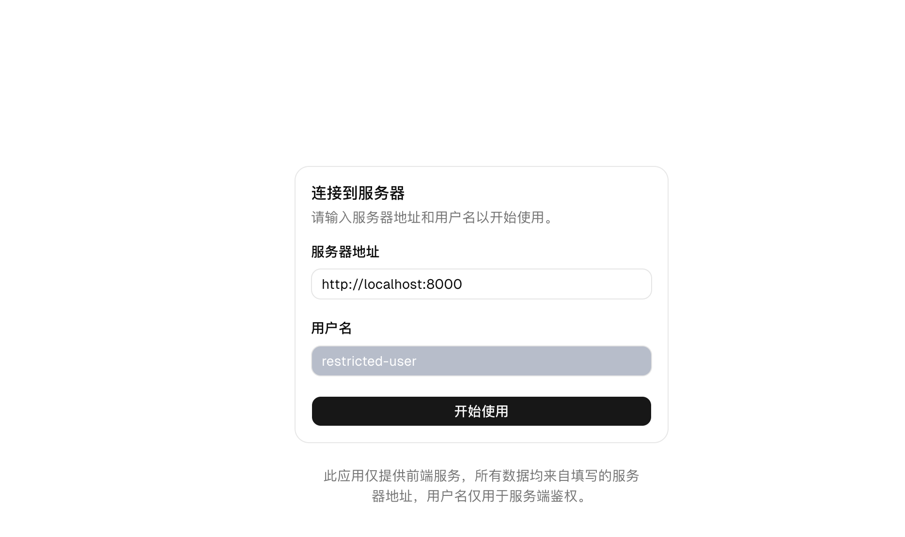
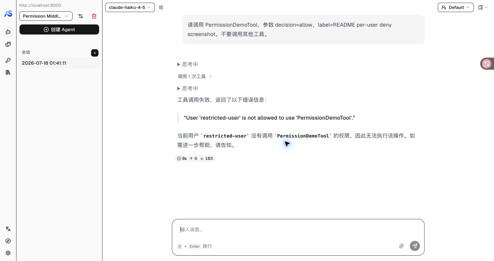

# 权限中间件 Agent Service 示例

[English](README.md) | 中文

一个可运行的 AgentScope 服务，通过审计日志场景演示
`on_check_permission` 中间件 hook。示例复用既有的 `examples/web_ui`
前端，无需修改前端代码。

## 演示内容

- `on_check_permission` 包裹权限检查过程，运行在工具查找和输入校验之后、
  Agent 消费返回的权限决策之前。
- 作为标准洋葱式 hook，中间件可以委托给后续权限链、替换其返回的决策，
  或直接返回应用决策以短路后续链路。
- 审计中间件调用一次 `next_handler(**input_kwargs)`，记录下游权限链返回的
  ASK/DENY/ALLOW 决策，并原样返回同一个决策对象。
- 用户工具策略中间件会拒绝一个指定用户调用 `PermissionDemoTool`，且不会
  进入内置权限引擎。
- 审计记录包含应用身份和关联字段，但不包含原始工具输入。
- 一个无副作用的演示工具可确定性地触发三种最终决策行为。

这个 hook 支持基于用户、角色、租户、环境、预算或外部策略服务的应用级策略。
会改变权限结果的中间件将成为应用可信授权边界的一部分。本示例使用同一个
hook，但只记录后续权限链返回的决策，不改变结果。

## 运行效果

### ASK 用户确认

当 `decision=ask` 时，Agent 会在工具执行前暂停，并展示既有的确认界面：



### 权限审计记录

最外层审计中间件会记录完整权限链返回的决策。下面的控制台日志展示了
`restricted-user` 被应用策略判定为 DENY 的记录：



### 应用级按用户 DENY

先使用 `restricted-user` 连接 Web UI，以触发示例中的应用策略：



此时即使请求 `decision=allow`，应用中间件仍会在内置权限引擎和工具执行前
短路为 DENY：



## 启动服务

安装带 service extras 的 AgentScope，并启动 Redis：

```bash
pip install agentscope[full]
redis-server                 # 或：brew services start redis
```

启动本示例服务：

```bash
cd examples/permission_middleware_service
python main.py
```

默认受限用户为 `restricted-user`，也可以通过环境变量修改：

```bash
PERMISSION_MIDDLEWARE_RESTRICTED_USER_ID=another-user python main.py
```

再启动既有 Web UI：

```bash
cd examples/web_ui
pnpm install
pnpm dev
```

将 UI 指向 `http://localhost:8000`。连接页面填写的用户名会作为
`X-User-ID` 发送给服务。使用 `regular-user` 体验常规权限场景，然后让 Agent 调用
`PermissionDemoTool`，并传入 `decision=allow`、`decision=ask` 或
`decision=deny`。权限交互会照常显示在 UI 中；每次经过权限检查的调用都会在
服务控制台输出一条 JSON 审计记录。

## 审计记录

```json
{
  "event": "permission_decision",
  "observed_at": "2026-07-17T12:34:56.123456+00:00",
  "user_id": "user-1",
  "agent_id": "agent-1",
  "session_id": "session-1",
  "reply_id": "reply-1",
  "tool_call_id": "call-1",
  "tool_name": "PermissionDemoTool",
  "mode": "default",
  "decision": {
    "behavior": "ask",
    "reason": "Mode: default",
    "bypass_immune": false
  }
}
```

本示例将审计中间件注册在列表首位，使其成为包裹用户工具策略和内置引擎的
最外层权限 middleware。因此，记录的就是 Agent 随后会消费的决策。如果应用
希望审计完整链条最终返回的结果，也应保持这个注册顺序。

用户批准后的调用恢复执行时，会跳过内置引擎的重复求值，但仍经过
`on_check_permission`。因此，应用策略检查和决策审计在工具执行前仍然有效。

## 场景

1. **ASK** —— 在 DEFAULT 模式使用 `decision=ask`。Agent 发出用户确认请求
   之前，控制台记录最终 ASK。如果用户批准，恢复执行前还会为确认后的 ALLOW
   输出第二条记录。
2. **DENY** —— 使用 `decision=deny`。Agent 写入被拒绝的工具结果之前，记录
   最终 DENY；演示工具主体不会执行。
3. **ALLOW** —— 使用 `decision=allow`。Agent 执行无副作用的演示工具之前，
   记录最终 ALLOW。
4. **按用户 DENY** —— 使用 `restricted-user` 连接 UI，并请求
   `decision=allow`。`UserToolPolicyMiddleware` 会在内置权限引擎之前短路为
   DENY；最外层审计中间件记录该 DENY，演示工具主体不会执行。

对于尚未确认的请求，`next_handler(**input_kwargs)` 会继续经过剩余权限
中间件，最后到达内置权限引擎。内置结果由当前 permission mode、已配置规则和
工具自身的权限检查共同决定。后续中间件也可以替换结果，或在到达内置引擎前
短路；审计中间件记录后续链条实际返回的决策。

## 隐私与失败行为

记录刻意排除 `tool_input` 和 `tool_call.input`。`reason` 字段来自
`PermissionDecision.decision_reason`，可能包含匹配到的规则内容。如果规则中
包含敏感命令或路径模式，生产环境的 sink 应脱敏或丢弃该字段。

Web UI 当前使用调用者提供的 `X-User-ID` 请求头作为临时身份机制，便于运行
按用户授权示例，但它不是生产级身份认证。实际应用应从经过认证、由服务端信任的
用户或租户上下文构造身份感知的权限 middleware。

本示例不捕获 sink 异常，因此必需审计写入失败会在 Agent 消费决策前向上传播。
如果应用需要 best-effort 日志，可在 sink 内部捕获传输异常。

## 与 `examples/agent_service` 的关系

本服务沿用 `examples/agent_service` 的 FastAPI、Redis 和 Web UI 运行形态，
但省略 RAG 与可选 MCP 集成，使示例聚焦于权限 hook。
