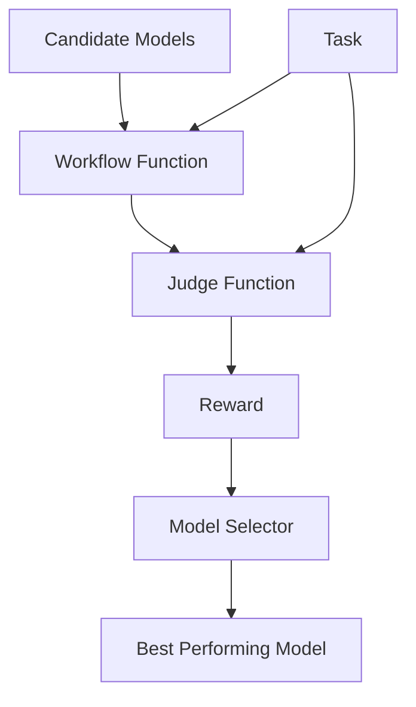

# Model Selection Guide

AgentScope provides a `model_selection` sub-module in tuner module to automatically select the best performing model from a set of candidates based on evaluation metrics. This guide walks you through the steps to evaluate and select the optimal model for your agent workflow.

## Overview

Model selection is the process of choosing the best performing model from a set of candidate models based on their performance on a dataset. To use model selection, you need to understand three components:

1. **Workflow function**: An async function that takes a task and model, executes the task with the model, and returns a workflow output.
2. **Judge function**: A function that evaluates the workflow's output and returns a reward indicating performance.
3. **Task dataset**: A dataset containing samples for evaluation.

The following diagram illustrates the relationship between these components:



## How to implement

Here we use a translation task scenario as an example to illustrate how to implement the above three components.

Suppose you have an agent workflow that performs translation using the `ReActAgent`.

```python
from agentscope.agent import ReActAgent
from agentscope.model import ChatModelBase

async def run_translation_agent(text: str, model: ChatModelBase):
    agent = ReActAgent(
        name="translator",
        sys_prompt="You are a helpful translation agent. Translate the given text accurately, and only output the translated text.",
        model=model,
        formatter=OpenAIChatFormatter(),
    )

    response = await agent.reply(
        msg=Msg("user", f"Translate the following text between English and Chinese: {text}", role="user"),
    )

    print(response)
```

### Step 1: Prepare task dataset

To evaluate models for translation tasks, you need a dataset that contains samples of source texts and their corresponding reference translations.

The dataset should be organized in a format that can be loaded using the `datasets.load_dataset` function (e.g., JSONL, Parquet, CSV) or from huggingface online datasets. For translation tasks, your data file (like `translate_data/test.json`) might contain samples like:

```json
  {
    "question": "量子退相干是限制量子计算机可扩展性的主要障碍之一。",
    "answer": "Quantum decoherence is one of the primary obstacles limiting the scalability of quantum computers."
  }
```


### Step 2: Define a workflow function

The workflow function takes a task dictionary and model as input, and returns a `WorkflowOutput`. The model selector will call this function with different models during evaluation.

```python
async def translation_workflow(
    task: Dict,
    model: ChatModelBase,
) -> WorkflowOutput:
    """Run the translation workflow on a single task with the given model."""
    ...
```

- Inputs:
    - `task`: A dictionary representing a single training task from the dataset.
    - `model`: The model to be used in the workflow. This will be evaluated by the selector.

- Returns:
    - `WorkflowOutput`: An object containing the agent's response.

Below is a refactored version of the original `run_translation_agent` function to fit the workflow function pattern.

**Key changes from the original function**:

1. Add `model` as a parameter to the workflow function.
2. Use the input `model` to initialize the agent.
3. Use the `question` field from the `task` dictionary as the source text for translation.
4. Return a `WorkflowOutput` object containing the agent's response.

```python
from agentscope.agent import ReActAgent
from agentscope.formatter import OpenAIChatFormatter
from agentscope.tuner import WorkflowOutput
from agentscope.message import Msg

async def translation_workflow(
    task: Dict,
    model: ChatModelBase,
) -> WorkflowOutput:
    agent = ReActAgent(
        name="translator",
        sys_prompt="You are a helpful translation agent. Translate the given text accurately, and only output the translated text.",
        model=model,
        formatter=OpenAIChatFormatter(),
    )

    # Extract source text from task
    source_text = task.get("question", "") if isinstance(task, dict) else str(task)
    
    # Create a message with the translation request
    prompt = f"Translate the following text between English and Chinese: {source_text}"
    msg = Msg(name="user", content=prompt, role="user")

    # Get response from the agent
    response = await agent.reply(msg=msg)

    return WorkflowOutput(
        response=response,
    )
```

### Step 3: Implement the judge function

The judge function evaluates the workflow's response and returns a reward. Higher reward values indicate better performance.

```python
async def judge_function(
    task: Dict,
    response: WorkflowOutput,
) -> JudgeOutput:
    """Calculate reward based on the input task and workflow's response."""
```

- Inputs:
    - `task`: A dictionary representing a single training task.
    - `response`: The output from the workflow function.

- Outputs:
    - `JudgeOutput`: An object containing:
        - `reward`: A scalar float representing the reward (higher is better).
        - `metrics`: Optional dictionary of additional metrics.

Here is an example implementation for translation tasks using BLEU score:

```python
from agentscope.tuner import JudgeOutput

async def bleu_judge(
    task: Dict, 
    response: WorkflowOutput,
) -> JudgeOutput:
    """Calculate BLEU score for translation quality."""
    # Lazy import to follow the requirement
    import sacrebleu
    
    # Extract response text
    response_str = response.response.get_text_content()
    
    # Extract reference translation
    reference_translation = task.get("answer", "") if isinstance(task, dict) else ""
    
    # Calculate BLEU score
    ref = reference_translation.strip()
    pred = response_str.strip()
    bleu_score = sacrebleu.sentence_bleu(pred, [ref])
    
    return JudgeOutput(
        reward=bleu_score.score,
        metrics={
            "bleu": bleu_score.score/100,
            "brevity_penalty": bleu_score.bp,
            "ratio": bleu_score.ratio
        }
    )
```

AgentScope.tuner also provides built-in judge functions for common workflow conducting efficiency metrics, such as execution time and token usage in example_token_usage.py:

```python
from agentscope.tuner.model_selection import avg_time_judge, avg_token_consumption_judge

# For selecting based on fastest execution time
judge_function = avg_time_judge

# For selecting based on lowest token consumption  
judge_function = avg_token_consumption_judge
```

### Step 4: Start model selection

Use the `select_model` interface to find the best performing model.

```python
from agentscope.tuner import DatasetConfig
from agentscope.tuner.model_selection import select_model
from agentscope.model import DashScopeChatModel
import os

# your workflow / judge function and candidate models here...

if __name__ == "__main__":
    # Define your candidate models
    model1 = DashScopeChatModel(
        "qwen3-max-2025-09-23", 
        api_key=os.environ.get("DASHSCOPE_API_KEY", ""),
        max_tokens=1024,
    )
    model2 = DashScopeChatModel(
        "deepseek-r1", 
        api_key=os.environ.get("DASHSCOPE_API_KEY", ""),
        max_tokens=1024,
    )
    
    best_model, metrics = select_model(
        workflow_func=translation_workflow,
        judge_func=bleu_judge,
        train_dataset=DatasetConfig(path="examples/tuner/model_selection/translate_data.json"),
        candidate_models=[model1, model2],
    )

    print(f"Best model: {best_model.model_name}")
    print(f"Performance metrics: {metrics}")
```

---

> **Note**: Besides the BLEU score judge function shown in this example, you can also implement custom judge functions for your specific use case. Alternatively, you can use built-in functions for optimizing workflow efficiency such as time and token usage judges, which can be referenced in `example_token_usage.py`.

---

## How to run

After implementing the workflow and judge function, follow these steps to run model selection:

1. Prerequisites

    - Set up your API key as an environment variable:

      ```bash
      export DASHSCOPE_API_KEY="your_api_key_here"
      ```

    - Prepare your dataset in a supported format (JSONL, Parquet, CSV, etc.).

    - Install required dependencies if not already installed:

      ```bash
      pip install datasets
      ```

2. Run the selection script

    ```bash
    python example_token_usage.py  # or other example files in this directory
    ```

3. The best performing model will be returned along with performance metrics.

## Output

```
Evaluating 3 candidate models: ['qwen3-max', 'deepseek-r1', 'glm-4.7']

INFO:agentscope.tuner.model_selection._model_selection:Model evaluation results:
INFO:agentscope.tuner.model_selection._model_selection:  qwen3-max: 61.8407
INFO:agentscope.tuner.model_selection._model_selection:  deepseek-r1: 43.5547
INFO:agentscope.tuner.model_selection._model_selection:  glm-4.7: 48.8801

Selected best model: qwen3-max-2025-09-23
Metrics: {'bleu_avg': 0.6184069765855449, 'brevity_penalty_avg': 0.9900344064325004, 'ratio_avg': 1.070816065067906}
```

---

## Use Cases

Model selection is particularly useful for:

| Scenario | Benefit |
|----------|---------|
| **Performance optimization** | Identify the model that achieves the highest accuracy/reward on your specific task |
| **Cost efficiency** | Select models that achieve desired performance with lower computational costs |
| **Latency requirements** | Choose models that meet your speed/latency constraints |
| **Resource constraints** | Find the best model that fits within your hardware limitations |

> [!TIP]
> Model selection is ideal when you have multiple models available and want to systematically identify which performs best for your specific use case.