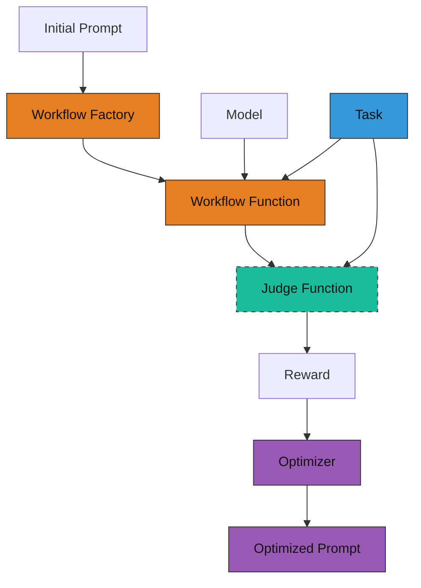

# Prompt Tuning Guide

AgentScope provides a `prompt_tune` sub-module to automatically optimize system prompts.
This guide walks you through the steps to optimize your agent's system prompt without modifying model weights.

## Overview

Prompt tuning is a lightweight alternative to model fine-tuning that optimizes the system prompt to improve agent performance. To use prompt tuning, you need to understand three components:

1. **Workflow function factory**: A factory function that takes a system prompt and returns a workflow function.
2. **Judge function**: A function that evaluates the agent's response and returns a reward.
3. **Task dataset**: A dataset containing training samples for optimization.

The following diagram illustrates the relationship between these components:



## How to implement

Here we use a math problem solving scenario as an example to illustrate how to implement the above three components.

Suppose you have an agent workflow that solves math problems using the `ReActAgent`.

```python
from agentscope.agent import ReActAgent

async def run_react_agent(query: str):
    # model = ...  # Initialize your ChatModel here

    agent = ReActAgent(
        name="react_agent",
        sys_prompt="You are a helpful math problem solving agent.",
        model=model,
        formatter=OpenAIChatFormatter(),
    )

    response = await agent.reply(
        msg=Msg("user", query, role="user"),
    )

    print(response)
```

### Step 1: Prepare task dataset

To optimize the prompt for solving math problems, you need a dataset that contains samples of math problems and their corresponding ground truth answers.

The dataset should be organized in a format that can be loaded using the `datasets.load_dataset` function (e.g., JSONL, Parquet, CSV). For example:

```
my_dataset/
    ├── train.parquet  # samples for training/optimization
    └── test.parquet   # samples for evaluation
```

Suppose your `train.parquet` contains samples like:

```json
{"question": "What is 2 + 2?", "answer": "4"}
{"question": "What is 4 + 4?", "answer": "8"}
```

You can preview your dataset using the following code:

```python
from agentscope.tuner import DatasetConfig

DatasetConfig(path="train.parquet").preview()

# Output:
# [
#   {
#     "question": "What is 2 + 2?",
#     "answer": "4"
#   },
#   {
#     "question": "What is 4 + 4?",
#     "answer": "8"
#   }
# ]
```

### Step 2: Define a workflow function factory

Unlike RL-based tuning, prompt tuning requires a **workflow function factory** that takes a system prompt as input and returns a workflow function. This allows the optimizer to test different prompts during optimization.

```python
def workflow_factory(sys_prompt: str) -> WorkflowType:
    """Factory function that creates a workflow with the given system prompt."""

    async def workflow_function(
        task: Dict,
        model: ChatModelBase,
        auxiliary_models: Optional[Dict[str, ChatModelBase]]=None,
    ) -> WorkflowOutput:
        """Run the agent workflow on a single task."""
        ...

    return workflow_function
```

- Inputs:
    - `sys_prompt`: The system prompt to be used in the workflow. This will be optimized by the tuner.

- Returns:
    - A workflow function with the same signature as in RL-based tuning.

Below is a refactored version of the original `run_react_agent` function to fit the workflow factory pattern.

**Key changes from the original function**:

1. Wrap the workflow function inside a factory function that accepts `sys_prompt`.
2. Use the input `sys_prompt` to initialize the agent.
3. Use the `question` field from the `task` dictionary as the user query.
4. Return a `WorkflowOutput` object containing the agent's response.

```python
from agentscope.agent import ReActAgent
from agentscope.formatter import OpenAIChatFormatter
from agentscope.tuner import WorkflowOutput
from agentscope.message import Msg

def workflow(sys_prompt: str):
    async def run_react_agent(
        task: Dict,
        model: ChatModelBase,
        auxiliary_models: Optional[Dict[str, ChatModelBase]]=None,
    ) -> WorkflowOutput:
        agent = ReActAgent(
            name="react_agent",
            sys_prompt=sys_prompt,  # use the optimizable system prompt
            model=model,
            formatter=OpenAIChatFormatter(),
        )

        response = await agent.reply(
            msg=Msg("user", task["question"], role="user"),
        )

        return WorkflowOutput(
            response=response,
        )

    return run_react_agent
```

### Step 3: Implement the judge function

The judge function evaluates the agent's response and returns a reward. It has the same signature as in RL-based tuning.

```python
async def judge_function(
    task: Dict,
    response: Any,
    auxiliary_models: Dict[str, ChatModelBase],
) -> JudgeOutput:
    """Calculate reward based on the input task and agent's response."""
```

- Inputs:
    - `task`: A dictionary representing a single training task.
    - `response`: The output from the workflow function.
    - `auxiliary_models`: A dictionary of auxiliary models (can be empty).

- Outputs:
    - `JudgeOutput`: An object containing:
        - `reward`: A scalar float representing the reward.
        - `metrics`: Optional dictionary of additional metrics.

Here is an example implementation:

```python
from agentscope.tuner import JudgeOutput

async def judge_function(
    task: Dict, response: Msg, auxiliary_models: Dict[str, ChatModelBase]
) -> JudgeOutput:
    """Simple reward: 1.0 for exact match, else 0.0."""
    ground_truth = task["answer"]
    reward = 1.0 if ground_truth in response.get_text_content() else 0.0
    return JudgeOutput(reward=reward)
```

### Step 4: Start prompt tuning

Use the `tune_prompt` interface to optimize your system prompt.

```python
from agentscope.tuner import DatasetConfig
from agentscope.tuner.prompt_tune import tune_prompt, PromptTuneConfig
from agentscope.model import DashScopeChatModel

# your workflow factory / judge function here...

if __name__ == "__main__":
    init_prompt = "You are an agent. Please solve the math problem given to you."

    optimized_prompt = tune_prompt(
        workflow_func=workflow,
        init_system_prompt=init_prompt,
        judge_func=judge_function,
        train_dataset=DatasetConfig(path="train.parquet"),
        eval_dataset=DatasetConfig(path="test.parquet"),
        model=DashScopeChatModel("qwen-turbo", api_key="YOUR_API_KEY"),
        config=PromptTuneConfig(
            lm_model_name="dashscope/qwen-plus",
            optimization_level="light",
        ),
    )

    print(f"Optimized prompt: {optimized_prompt}")
```

Here, we use:
- `DatasetConfig` to specify the training and evaluation datasets.
- `DashScopeChatModel` as the model used in the workflow.
- `PromptTuneConfig` to configure the optimization process.

#### PromptTuneConfig Options

| Parameter | Default | Description |
|-----------|---------|-------------|
| `lm_model_name` | `"dashscope/qwen-plus"` | The model name for the prompt proposer (teacher model). |
| `optimization_level` | `"light"` | Optimization intensity: `"light"`, `"medium"`, or `"heavy"`. |
| `eval_display_progress` | `True` | Whether to display progress during evaluation. |
| `eval_display_table` | `5` | Number of table rows to display during evaluation. |
| `eval_num_threads` | `16` | Number of threads for parallel evaluation. |
| `compare_performance` | `True` | Whether to compare baseline vs optimized performance. |

---

### Complete example

```python
import os
from typing import Dict, Optional

from agentscope.tuner import DatasetConfig, WorkflowOutput, JudgeOutput
from agentscope.tuner.prompt_tune import tune_prompt, PromptTuneConfig
from agentscope.agent import ReActAgent
from agentscope.model import ChatModelBase, DashScopeChatModel
from agentscope.formatter import OpenAIChatFormatter
from agentscope.message import Msg


def workflow(sys_prompt: str):
    async def run_react_agent(
        task: Dict,
        model: ChatModelBase,
        auxiliary_models: Optional[Dict[str, ChatModelBase]] = None,
    ) -> WorkflowOutput:
        agent = ReActAgent(
            name="react_agent",
            sys_prompt=sys_prompt,
            model=model,
            formatter=OpenAIChatFormatter(),
        )

        response = await agent.reply(
            msg=Msg("user", task["question"], role="user"),
        )

        return WorkflowOutput(
            response=response,
        )

    return run_react_agent


async def judge_function(
    task: Dict, response: Msg, auxiliary_models: Dict[str, ChatModelBase]
) -> JudgeOutput:
    """Simple reward: 1.0 for exact match, else 0.0."""
    ground_truth = task["answer"]
    reward = 1.0 if ground_truth in response.get_text_content() else 0.0
    return JudgeOutput(reward=reward)


if __name__ == "__main__":
    init_prompt = (
        "You are an agent."
        "Please solve the math problem given to you."
        "You should provide your output within \\boxed{{}}."
    )

    optimized_prompt = tune_prompt(
        workflow_func=workflow,
        init_system_prompt=init_prompt,
        judge_func=judge_function,
        train_dataset=DatasetConfig(path="train.parquet"),
        eval_dataset=DatasetConfig(path="test.parquet"),
        model=DashScopeChatModel(
            "qwen-turbo",
            api_key=os.environ["DASHSCOPE_API_KEY"],
        ),
    )

    print(f"Optimized prompt: {optimized_prompt}")
```

> Note:
> Above code is a simplified example for illustration purposes only.
> For a complete implementation, please refer to [example.py](./example.py), which tunes a ReAct agent to solve math problems on the GSM8K dataset.

---

## How to run

After implementing the workflow factory and judge function, follow these steps to run prompt tuning:

1. Prerequisites

    - Set up your API key as an environment variable:

      ```bash
      export DASHSCOPE_API_KEY="your_api_key_here"
      ```

    - Prepare your dataset in a supported format (JSONL, Parquet, CSV, etc.).

2. Run the tuning script

    ```bash
    python example.py
    ```

3. The optimized prompt will be printed to the console and can be used directly in your agent.

---

## Comparison with RL-based Tuning

| Aspect | Prompt Tuning | RL-based Tuning |
|--------|---------------|-----------------|
| **What is optimized** | System prompt text | Model weights |
| **Computational cost** | Low (API calls only) | High (GPU training) |
| **Hardware requirements** | No GPU required | Multiple GPUs required |
| **Use case** | Quick iteration, limited resources | Maximum performance |

> [!TIP]
> Prompt tuning is ideal for rapid prototyping and scenarios where you want to improve agent performance without the overhead of model training.
