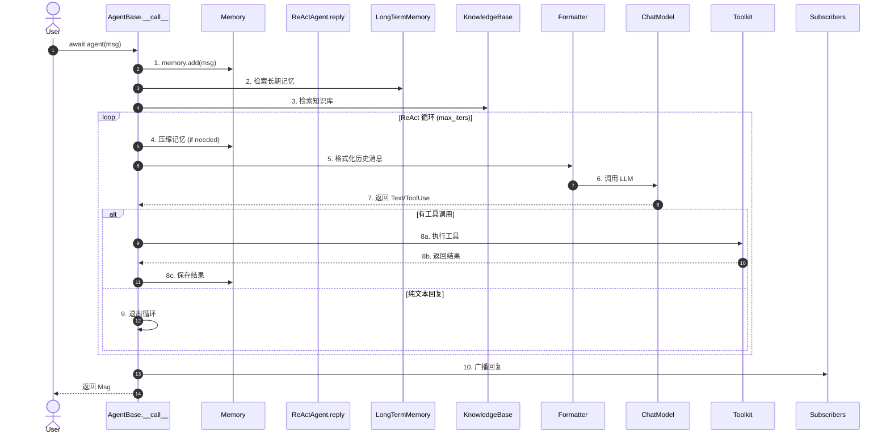

# 核心数据流：一次 `await agent(msg)` 的完整旅程

> **Level 4**: 理解核心数据流  
> **前置要求**: [AgentScope 概述](./00-overview.md), [源码地图](./00-source-map.md)  
> **后续章节**: [Agent 架构](../04-agent-architecture/04-agent-base.md)

---

## 学习目标

学完本章后，你能：

- 说出一次 `await agent(msg)` 调用经历的 10 个关键步骤
- 画出 AgentScope 的完整数据流图
- 理解 Msg 在 Agent → Model → Formatter → Toolkit → Memory 之间的流转
- 找到任意一个步骤对应的源码位置

---

## 背景问题

当你写下这行代码时：

```python
result = await agent(Msg(name="user", content="北京今天天气怎么样", role="user"))
```

AgentScope 内部发生了什么？一个字符串 `"北京今天天气怎么样"` 如何变成 Agent 的最终回复？

本章就是**追踪这行代码的完整执行路径**，从入口到出口，每一步都对应到具体的源码文件和行号。

---

## 总体流程概览（10 步）



---

## 逐步源码分析

### 步骤 0：`__call__` 入口

**文件**: `src/agentscope/agent/_agent_base.py:448-467`

```python
async def __call__(self, *args: Any, **kwargs: Any) -> Msg:
    self._reply_id = shortuuid.uuid()     # 生成这次调用的唯一 ID
    reply_msg: Msg | None = None
    try:
        self._reply_task = asyncio.current_task()
        reply_msg = await self.reply(*args, **kwargs)  # → 进入 reply
    except asyncio.CancelledError:
        reply_msg = await self.handle_interrupt(*args, **kwargs)
    finally:
        if reply_msg:
            await self._broadcast_to_subscribers(reply_msg)  # 广播给订阅者
        self._reply_task = None
    return reply_msg
```

**关键设计**:
- `__call__` 是一个**包装层**，不是业务逻辑。它负责生成调用 ID、中断处理、广播回复
- `self._reply_task` 保存当前 asyncio Task 的引用，`interrupt()` 方法可以通过它取消正在进行的调用
- `_broadcast_to_subscribers` 在 `finally` 中执行，确保无论正常还是异常退出，回复都会广播

### 步骤 1：记忆存储

**文件**: `src/agentscope/agent/_react_agent.py:396`

```python
# Record the input message(s) in the memory
await self.memory.add(msg)
```

`msg` 被存储到工作记忆（MemoryBase 的某个实现，如 `InMemoryMemory`）。

**注意**: 这里 `msg` 可能是 `None`（Agent 首次运行时不需要用户输入）。Memory 的 `add(None)` 是 no-op。

### 步骤 2：长期记忆检索

**文件**: `src/agentscope/agent/_react_agent.py:400`

```python
await self._retrieve_from_long_term_memory(msg)
```

如果 Agent 配置了 `LongTermMemoryBase`（如 Mem0 或 ReMe），框架会从过去的对话中检索相关记忆，注入当前对话上下文。

### 步骤 3：知识库检索

**文件**: `src/agentscope/agent/_react_agent.py:402`

```python
await self._retrieve_from_knowledge(msg)
```

如果 Agent 配置了 `KnowledgeBase`（如 `SimpleKnowledge`），框架会根据用户消息检索相关文档，将结果以系统消息的形式注入记忆。

**这是 AgentScope 实现 RAG 的方式** — 不是手动拼接 prompt，而是在推理前自动检索和注入。

### 步骤 4-9：ReAct 推理-行动循环

**文件**: `src/agentscope/agent/_react_agent.py:428-536`

```python
for _ in range(self.max_iters):          # 最多循环 max_iters 次
    await self._compress_memory_if_needed()    # 步骤 4

    msg_reasoning = await self._reasoning(tool_choice)  # 步骤 5-7

    futures = [self._acting(tool_call) for tool_call in
               msg_reasoning.get_content_blocks("tool_use")]
    if self.parallel_tool_calls:
        structured_outputs = await asyncio.gather(*futures)
    else:
        structured_outputs = [await _ for _ in futures]  # 步骤 8

    # 步骤 9: 检查退出条件
    if not msg_reasoning.has_content_blocks("tool_use"):
        reply_msg = msg_reasoning  # 纯文本回复，退出
        break
```

**关键设计决策**:
1. **工具调用可以并行**: `self.parallel_tool_calls` 控制调用是并行还是串行
2. **退出条件是"没有 tool_use block"**: ReAct 循环只在 LLM 生成了纯文本（不再调用工具）时退出
3. **达到 max_iters 时的兜底**: 调用 `_summarizing()` 生成一个总结

### 步骤 5-7 详解：推理过程 `_reasoning()`

**文件**: `src/agentscope/agent/_react_agent.py:540-655`

#### 步骤 5：格式化

```python
prompt = await self.formatter.format(
    msgs=[
        Msg("system", self.sys_prompt, "system"),        # 系统提示词
        *await self.memory.get_memory(),                  # 对话历史
    ],
)
```

`formatter.format()` 将 AgentScope 的 `Msg` 对象列表转换为目标模型 API 的 dict 格式。

例如，`OpenAIChatFormatter` 会生成:
```python
[{"role": "system", "content": "..."}, {"role": "user", "content": "..."}]
```

#### 步骤 6：调用模型

```python
res = await self.model(
    prompt,
    tools=self.toolkit.get_json_schemas(),  # 可用工具的 JSON Schema
    tool_choice=tool_choice,                # "auto" | "none" | "required"
)
```

`self.model` 是 `ChatModelBase` 的子类实例。如果 `stream=True`，返回的是 `AsyncGenerator`；否则返回 `ChatResponse`。

#### 步骤 7：处理响应

**流式输出**（第 586-602 行）:
```python
if self.model.stream:
    async for content_chunk in res:
        msg.content = content_chunk.content   # 累积内容
        await self.print(msg, False)           # 逐字打印
```

**非流式输出**（第 604-606 行）:
```python
else:
    msg.content = list(res.content)  # 一次性获取全部内容
```

### 步骤 8 详解：行动过程 `_acting()`

**文件**: `src/agentscope/agent/_react_agent.py:657-697`

```python
async def _acting(self, tool_call: ToolUseBlock) -> dict | None:
    # 执行工具
    tool_res = await self.toolkit.call_tool_function(tool_call)

    # 处理异步生成器返回
    async for chunk in tool_res:
        tool_res_msg.content[0]["output"] = chunk.content
        await self.print(tool_res_msg, chunk.is_last)
```

`toolkit.call_tool_function()` (位于 `src/agentscope/tool/_toolkit.py:853`) 负责：
1. 根据 `tool_call["name"]` 找到注册的函数
2. 注入 `preset_kwargs`（预设参数）
3. 调用函数，获取返回值
4. 将返回值包装为 `ToolResponse`

### 步骤 10：广播回复

**文件**: `src/agentscope/agent/_agent_base.py:469-485`

```python
async def _broadcast_to_subscribers(self, msg):
    broadcast_msg = self._strip_thinking_blocks(msg)  # 剥离 thinking block
    for subscribers in self._subscribers.values():
        for subscriber in subscribers:
            await subscriber.observe(broadcast_msg)
```

**两个关键行为**:
1. **剥离 ThinkingBlock**: Agent 的内部思考过程在广播前被移除（`_strip_thinking_blocks`），下游 Agent 看不到
2. **通过 `observe()` 投递**: 不是调用 `reply()`，而是 `observe()`。这意味着订阅者**被动接收**消息，不会生成新的回复

---

## 完整调用链

```
agent(msg)                                         # 用户代码
└── AgentBase.__call__(*args, **kwargs)            # _agent_base.py:448
    └── ReActAgent.reply(msg)                       # _react_agent.py:376
        ├── memory.add(msg)                         # 步骤 1
        ├── _retrieve_from_long_term_memory(msg)    # 步骤 2
        ├── _retrieve_from_knowledge(msg)           # 步骤 3
        └── for _ in range(max_iters):             # ReAct 循环
            ├── _compress_memory_if_needed()        # 步骤 4
            ├── _reasoning(tool_choice)              # 步骤 5-7
            │   ├── formatter.format(msgs)          # 步骤 5
            │   │   └── Msg → [dict for API]
            │   ├── model(prompt, tools)            # 步骤 6
            │   │   └── [dict] → LLM API → ChatResponse
            │   └── 处理流式/非流式响应              # 步骤 7
            │       ├── await self.print(msg, ...)
            │       └── await self.memory.add(msg)
            └── _acting(tool_call)                  # 步骤 8
                └── toolkit.call_tool_function(tool_call)
                    ├── 查找注册的函数
                    ├── 注入 preset_kwargs
                    ├── 调用函数
                    └── 返回 ToolResponse
        └── _broadcast_to_subscribers(reply_msg)   # 步骤 10
            └── subscriber.observe(msg)
```

---

## 数据转换全景

Msg 在系统中的形态变化：

```
用户输入: "北京天气怎么样"
    │
    ▼ Msg(name="user", content="北京天气怎么样", role="user")
    │
    ▼ [记忆存储] → memory.add(msg)
    │
    ▼ [格式化] → formatter.format(msgs)
    │   输出: [{"role": "system", "content": "..."},
    │          {"role": "user",   "content": "北京天气怎么样"}]
    │
    ▼ [模型调用] → model(prompt, tools=[...])
    │   输出: ChatResponse(content=[
    │            ToolUseBlock(name="get_weather", input={"city": "北京"})
    │          ])
    │
    ▼ [包装为 Msg] → Msg(name="assistant", content=[ToolUseBlock(...)])
    │
    ▼ [工具执行] → toolkit.call_tool_function(tool_call)
    │   输出: ToolResponse(content="北京今天 25°C，晴")
    │
    ▼ [再次推理] → model(之前的消息 + 工具结果)
    │   输出: ChatResponse(content=[TextBlock(text="北京今天25度，晴天")])
    │
    ▼ [最终 Msg] → Msg(name="assistant", content=[TextBlock(...)])
    │
    ▼ [广播] → _broadcast_to_subscribers(final_msg)
    │
    ▼ 返回给用户
```

---

## 工程经验

### 为什么 thinking block 要被剥离？

在 `_broadcast_to_subscribers` 中（`_agent_base.py:487-514`），ThinkingBlock 被显式移除后才广播给其他 Agent。

**设计原因**: Thinking 是 Agent 的**内部推理过程**，不应该暴露给其他 Agent。这模拟了人际协作中"思考过程不共享，只共享结论"的模式。

**你可能踩的坑**: 如果你自定义了 Agent 间通信逻辑，需要记得自行剥离 ThinkingBlock，否则其他 Agent 会收到"不干净"的消息。

### 为什么工具调用在 `_acting` 而非 `_reasoning` 中？

`_reasoning` 只负责调用 LLM 并获取其输出，`_acting` 负责执行工具。这是**关注点分离**：

1. `_reasoning` 出错 → 不影响系统状态
2. `_acting` 出错 → 工具调用失败，可以被框架捕获和重试
3. Hook 可以分别在推理前后和行动前后插入

### 为什么使用 `contextvars.ContextVar` 而非全局变量？

在 `__init__.py:22-41` 中，全局配置使用 `ContextVar` 而非普通全局变量。原因：

1. **asyncio 安全**: 多个协程可以在不同 Context 中运行
2. **无需显式传递**: 不像 Flask 的 `g` 对象需要 request context
3. **隔离性**: 一个 Agent 的配置变更不影响其他 Agent

---

## Contributor 指南

### 如何追踪调用链（调试方法）

```python
# 1. 开启 DEBUG 日志，观察每个步骤
import agentscope
agentscope.init(logging_level="DEBUG")

# 2. 在关键位置添加 print
# 在 _react_agent.py:432 后添加:
# logger.info(f"Iteration {_}: msg_reasoning has tool_use: {...}")

# 3. 使用 tracing 查看完整的调用树
agentscope.init(
    studio_url="http://localhost:8080",  # AgentScope Studio
)
```

### 常见断点位置

| 想调试的问题 | 断点位置 |
|-------------|---------|
| 消息格式不对 | `formatter.format()` 的输入和输出 |
| LLM 返回异常 | `_reasoning()` 中 `await self.model()` 的返回值 |
| 工具没有被调用 | `_acting()` 中 `toolkit.call_tool_function()` |
| 记忆泄漏 | `memory.add()` 和 `memory.get_memory()` |
| 广播消息丢失 | `_broadcast_to_subscribers()` |
| 流式输出中断 | `_reasoning()` 中的 `async for content_chunk` |

### 最小可运行测试

```python
# 测试 ReAct 循环不需要真实的 LLM
# 可以 mock Model 返回固定内容
from unittest.mock import AsyncMock

agent.model = AsyncMock()
agent.model.return_value = ChatResponse(
    content=[TextBlock(type="text", text="测试回复")]
)
result = await agent(Msg("user", "测试", "user"))
# 验证 result.get_content_blocks("text")[0]["text"] == "测试回复"
```

---

## 下一步

现在你理解了数据如何在 AgentScope 中流动。接下来深入学习：
1. [消息系统](../02-message-system/02-msg-basics.md) — 理解 Msg 和 ContentBlock 的全部细节
2. [Agent 架构](../04-agent-architecture/04-agent-base.md) — 深入 AgentBase 和 Hook 系统
3. [ReActAgent 深度](../04-agent-architecture/04-react-agent.md) — 完整的 ReAct 循环源码分析


---

## 工程现实与架构问题

### 技术债 (数据流级)

| 位置 | 问题 | 影响 | 优先级 |
|------|------|------|--------|
| `_broadcast_to_subscribers` | 广播失败无重试机制 | 订阅者可能丢失消息 | 中 |
| `_strip_thinking_blocks` | 硬编码剥离逻辑 | 难以配置是否保留思考过程 | 低 |
| 流式输出 | 多个 print 输出可能交错 | 日志可读性差 | 低 |
| 工具调用 | 结果直接加入记忆 | 大量工具输出撑爆记忆 | 中 |

**[HISTORICAL INFERENCE]**: 广播机制设计简单，假设下游能处理失败。思考过程剥离是因为早期发现 LLM 看到自己思考过程会产生递归问题。

### 性能考量

```python
# 数据流各阶段延迟估算
memory.add():                 ~0.1-0.5ms
formatter.format():           ~1-5ms (取决于历史消息数量)
model() LLM 调用:            ~200-2000ms (取决于模型和网络)
toolkit.call_tool_function(): ~10-1000ms (取决于工具复杂度)
流式输出 token:              ~10-50ms/token

# 端到端延迟 (无工具调用): ~300-3000ms
# 端到端延迟 (单工具调用): ~500-5000ms
```

### 渐进式重构方案

```python
# 方案 1: 广播重试机制
class RobustBroadcast:
    async def broadcast_with_retry(self, msg, subscribers, max_retries=3):
        for subscriber in subscribers:
            for attempt in range(max_retries):
                try:
                    await subscriber.observe(msg)
                    break
                except Exception as e:
                    if attempt == max_retries - 1:
                        logger.error(f"Failed to deliver to {subscriber}")
                    await asyncio.sleep(0.1 * (attempt + 1))

# 方案 2: 可配置的思考过程保留
class ReActAgent:
    def __init__(self, *args, strip_thinking=True, **kwargs):
        super().__init__(*args, **kwargs)
        self._strip_thinking = strip_thinking
```

