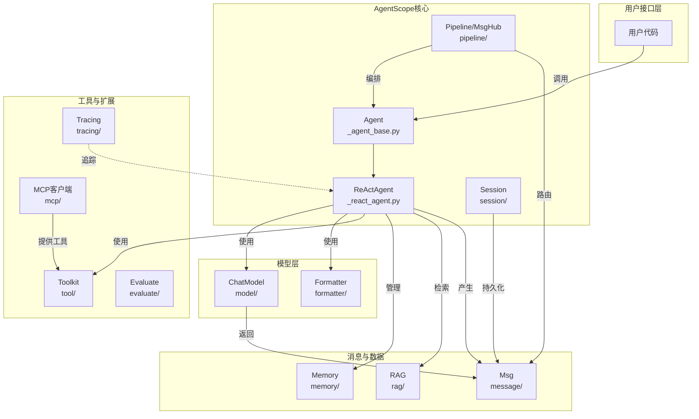

# AgentScope 是什么，解决什么问题

> **Level 1**: 知道项目是干什么的  
> **前置要求**: 无  
> **后续章节**: [源码地图](./00-source-map.md) → [核心数据流](./00-data-flow.md)

---

## 学习目标

学完本章后，你能：

- 用一句话说出 AgentScope 是什么
- 理解为什么要用 AgentScope 而非直接调用 LLM API
- 画出 AgentScope 的高层架构图
- 知道 AgentScope 与 LangChain、AutoGen 等框架的本质区别

---

## 背景问题

### 直接调用 LLM API 够吗？

如果你只是写一个简单的 ChatGPT 应用，确实够：

```python
response = openai.chat.completions.create(
    model="gpt-4",
    messages=[{"role": "user", "content": "你好"}],
)
print(response.choices[0].message.content)
```

但当你需要：

1. **让 LLM 调用工具** — 查数据库、发邮件、执行代码
2. **让多个 Agent 协作** — 一个查资料，一个写报告，另一个审校
3. **管理对话记忆** — 长期记忆、上下文压缩、知识库检索
4. **追踪和调试** — 理解 Agent 的每一次推理和行动
5. **切换不同模型** — 同一套代码跑 OpenAI、Gemini、DashScope

你会发现自己在反复写：消息格式化、工具注册、错误重试、上下文管理、流式输出...  

这些是所有 Agent 应用的**共性基础设施**。AgentScope 就是把这些基础设施抽象出来，让你专注在业务逻辑上。

### AgentScope 的"一句话定义"

> **AgentScope 是一个多模型、多 Agent 的 LLM 应用开发框架，它提供统一的 Agent 抽象、消息协议、工具系统和记忆管理，让开发者能快速构建从简单对话到复杂多 Agent 协作的系统。**

---

## 架构定位

### AgentScope 在整个技术栈中的位置

```
┌──────────────────────────────────────────────────────┐
│              你的应用代码                              │
│  (天气 Agent、客服系统、辩论平台...)                     │
├──────────────────────────────────────────────────────┤
│               AgentScope                              │
│  ┌────────┐ ┌──────┐ ┌──────┐ ┌──────┐ ┌────────┐  │
│  │ Agent  │ │ Msg  │ │Tool  │ │Memory│ │Pipeline│  │
│  └────────┘ └──────┘ └──────┘ └──────┘ └────────┘  │
├──────────────────────────────────────────────────────┤
│               LLM 模型层                               │
│  OpenAI │ Anthropic │ Gemini │ DashScope │ Ollama    │
└──────────────────────────────────────────────────────┘
```

AgentScope **不重新发明模型调用** — 它封装和统一了不同模型 API 的差异，在此之上提供了 Agent 开发所需的高层抽象。

### 核心模块一览

| 模块 | 源码位置 | 一句话职责 |
|------|----------|-----------|
| **Msg** | `src/agentscope/message/` | 统一消息协议，Agent 间通信的基础 |
| **Agent** | `src/agentscope/agent/` | Agent 抽象层，核心是 ReActAgent |
| **Model** | `src/agentscope/model/` | 封装不同 LLM API 的调用 |
| **Formatter** | `src/agentscope/formatter/` | 将 Msg 转换为各模型 API 要求的格式 |
| **Toolkit** | `src/agentscope/tool/` | 工具注册、Schema 生成、调用执行 |
| **Memory** | `src/agentscope/memory/` | 工作记忆 + 长期记忆管理 |
| **Pipeline** | `src/agentscope/pipeline/` | 多 Agent 编排（管道、发布-订阅） |
| **Session** | `src/agentscope/session/` | 跨运行的状态持久化 |
| **RAG** | `src/agentscope/rag/` | 知识库检索增强生成 |
| **Tracing** | `src/agentscope/tracing/` | OpenTelemetry 追踪 |
| **A2A** | `src/agentscope/a2a/` | Agent-to-Agent 协议 |

### 模块间依赖关系（Mermaid）



---

## 核心设计哲学

### 1. Agent 是"会思考的管道"

Agent 接收 `Msg`，内部经过推理-行动循环，产出新的 `Msg`。框架不关心 Agent 内部怎么想，只关心输入和输出都是标准化的消息。

```python
# Agent 的最小使用模型
agent = ReActAgent(name="assistant", model=model, sys_prompt="...")
result = await agent(Msg(name="user", content="你好", role="user"))
# result 是 Msg 对象
```

### 2. 消息是唯一接口

Agent 之间、Agent 与 Model 之间、Agent 与 Tool 之间 — 全部通过 `Msg` 通信。这是 AgentScope 最重要的设计决策。

```
Agent A --Msg--> Pipeline --Msg--> Agent B
Agent   --Msg--> Model   --Msg--> Agent
Toolkit --Msg--> Agent
```

### 3. 工具是可插拔的

工具函数只需一个 Python 函数签名，框架自动生成 JSON Schema，对接到各个 LLM 的 function calling / tool use 接口。

### 4. 模型是透明的（通过 Formatter）

不同模型 API 的差异被封闭在 Formatter 中。Agent 代码不需要知道底层是 OpenAI 还是 Gemni。

---

## 与同类框架对比

| 特性 | AgentScope | LangChain | AutoGen | CrewAI |
|------|-----------|-----------|---------|--------|
| **多模型支持** | ✅ 统一接口 | ⚠️ 需各自适配 | ⚠️ 主要 OpenAI | ⚠️ 主要 OpenAI |
| **Agent 模式** | ReAct + 自定义 | 多种 Chain | ConversableAgent | Role-based |
| **消息协议** | 强类型 Msg + ContentBlock | 松散 dict | 内部消息 | 内部消息 |
| **工具系统** | 函数即工具，自动 Schema | 需装饰器 | 需装饰器 | 需装饰器 |
| **多 Agent 通信** | Pipeline + MsgHub | LCEL | GroupChat | Crew 模式 |
| **A2A 协议** | ✅ 原生支持 | ❌ | ❌ | ❌ |
| **Realtime 语音** | ✅ 原生支持 | ❌ | ❌ | ❌ |
| **Tracing** | ✅ OpenTelemetry | 第三方 | ❌ | ❌ |
| **学习曲线** | 中等 | 高 | 中 | 低 |
| **国内模型支持** | ✅ DashScope 优先 | ❌ | ❌ | ❌ |

### 为什么选 AgentScope？

- **如果你需要对接阿里云 DashScope** → AgentScope 是 DashScope 的一等公民
- **如果你需要 A2A 标准协议** → AgentScope 原生实现了 Google A2A 协议
- **如果你需要生产级 Tracing** → 内置 OpenTelemetry
- **如果你需要语音实时交互** → 原生 Realtime Agent

---

## 工程经验

### 为什么用 ContextVar 而不是全局变量？

打开 `src/agentscope/__init__.py:22-41`：

```python
_config = _ConfigCls(
    run_id=ContextVar("run_id", default=shortuuid.uuid()),
    project=ContextVar("project", default="UnnamedProject_..." ...),
    ...
)
```

**设计原因**: AgentScope 的全部组件都通过 `_config` 访问运行上下文。使用 `ContextVar`（Python 3.7+ 的 contextvars 模块）而非全局变量，是因为：

1. **异步安全**: 多个协程可以同时运行不同的 Agent，每个都有自己的上下文
2. **线程安全**: 不需要加锁，ContextVar 自动隔离
3. **无需传递**: 不需要把 config 对象一层层传下去

**替代方案**: 可以用 threading.local（不支持 async）、全局单例（不安全）。ContextVar 是唯一同时支持线程和异步的方案。

### 为什么不用装饰器注册工具？

AgentScope 的工具注册用的是**显式方法调用**而不是装饰器：

```python
# AgentScope 方式：显式调用
toolkit.register_tool_function(my_weather_func)
```

而非 LangChain 方式：

```python
@tool  # 装饰器方式
def my_weather_func(city: str) -> str: ...
```

**设计原因**: 
1. 装饰器把元数据和函数绑定在一起，不便于运行时动态修改
2. AgentScope 允许同一个函数注册多次（不同名称、不同预设参数），装饰器做不到
3. 显式调用让工具注册的时机可控，不会在 import 时自动注册

---

## Contributor 指南

### 新手适合修改的文件

| 文件 | 难度 | 原因 |
|------|------|------|
| `src/agentscope/message/_message_block.py` | ⭐ | TypedDict 定义，纯数据结构 |
| `src/agentscope/tool/_response.py` | ⭐ | ToolResponse 数据类 |
| `src/agentscope/formatter/_openai_formatter.py` | ⭐⭐ | 如果熟悉 OpenAI API |
| `src/agentscope/memory/_working_memory/_in_memory_memory.py` | ⭐⭐ | 内存数据结构 |

### 危险区域

| 文件 | 风险 |
|------|------|
| `src/agentscope/agent/_react_agent.py` (1137行) | 核心循环，任何改动影响全局 |
| `src/agentscope/pipeline/_msghub.py` | 并发订阅，改错会导致消息丢失 |
| `src/agentscope/model/_openai_model.py` | 流式输出逻辑复杂 |

### 如何调试

```python
# 开启详细日志
import agentscope
agentscope.init(logging_level="DEBUG")

# 或设置环境变量
# export AGENTSCOPE_LOG_LEVEL=DEBUG
```

---

## 下一步

阅读 [源码地图](./00-source-map.md) 了解每个目录的具体内容，然后阅读 [核心数据流](./00-data-flow.md) 追踪一次完整的 Agent 调用过程。


---

## 工程现实与架构问题

### 技术债 (系统级)

| 位置 | 问题 | 影响 | 优先级 |
|------|------|------|--------|
| 整体架构 | 多模态支持不完整 | 音频、视频处理依赖外部组件 | 中 |
| Model 层 | 不同模型能力不一致 | API 统一但行为不一致 | 高 |
| Formatter | 新模型需要自定义 Formatter | 接入新模型工作量较大 | 中 |
| 文档 | 缺少架构决策记录 (ADR) | 新开发者难以理解设计原因 | 低 |

**[HISTORICAL INFERENCE]**: AgentScope 最初专注于文本 Agent，多模态支持是后期需求，架构未预留扩展接口。模型能力不一致是因为各模型 API 设计理念不同，统一接口只能做到"最小公约数"。

### 性能考量

```python
# AgentScope 组件加载时间估算
import agentscope:           ~100-200ms
ReActAgent(...):             ~50ms
toolkit.register_tool_function(): ~1-5ms

# Msg 序列化开销
Msg.to_dict():               ~0.01-0.05ms
Msg.from_dict():             ~0.01-0.05ms

# 框架总体开销
相比直接调用 LLM API: 额外 ~5-10ms/请求 (可接受)
```

### 渐进式重构方案

```python
# 方案 1: 添加架构决策记录 (ADR)
# docs/adr/ADR-001-contextvar-vs-global-state.md
"""
# ADR-001: 使用 ContextVar 管理配置

## 状态: 已采纳

## 背景: 需要在异步环境中安全传递配置

## 决策: 使用 ContextVar

## 后果: 异步安全，但调试时需要理解 ContextVar 行为
"""

# 方案 2: 标准化新模型接入
class ModelAdapter(Protocol):
    """所有模型适配器必须实现的接口"""
    async def __call__(self, prompt: Prompt, tools: list[Tool]) -> Response: ...
    @property
    def supports_streaming(self) -> bool: ...

# 强制检查
def register_model(model: ChatModelBase) -> None:
    assert hasattr(model, "supports_streaming"), "Model must implement supports_streaming"
```

