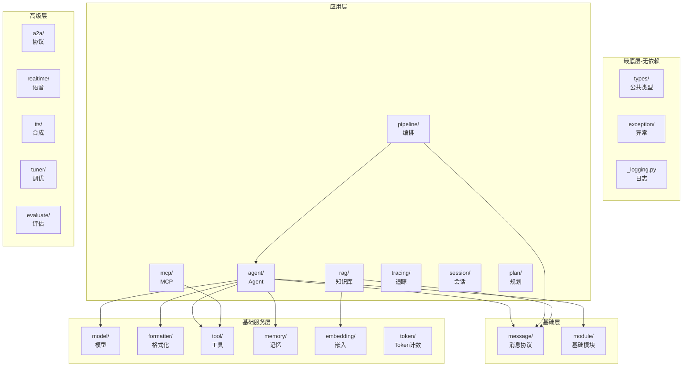

# 源码地图：每个模块的职责和关键文件

> **Level 3**: 理解模块边界  
> **前置要求**: [AgentScope 概述](./00-overview.md)  
> **后续章节**: [核心数据流](./00-data-flow.md)

---

## 学习目标

学完本章后，你能：

- 说出 AgentScope 源码树的每个目录的职责
- 找到任意一个功能的入口文件
- 理解模块间的依赖方向
- 为新功能找到正确的代码位置

---

## 背景问题

当你打开 AgentScope 的源码仓库，会看到 `src/agentscope/` 下有 20+ 个子目录。新手的第一反应往往是："从哪开始读？"

本章就是 AgentScope 的**源码导航地图** — 告诉你每个目录是干什么的，以及应该按什么顺序阅读。

---

## 源码树全景

```
src/agentscope/
├── __init__.py          # 库入口、init() 函数、全局配置
├── _logging.py          # 日志系统
├── _run_config.py       # 运行时配置（ContextVar 封装）
├── _version.py          # 版本号
│
├── agent/               # ★ Agent 抽象层
├── model/               # ★ LLM 模型适配层
├── message/             # ★ 消息协议
├── formatter/           # ★ 消息格式化（Msg → LLM API 格式）
├── tool/                # ★ 工具系统
├── memory/              # ★ 记忆系统
├── pipeline/            # ★ 多 Agent 编排
│
├── rag/                 # 知识库检索
├── mcp/                 # MCP 协议客户端
├── a2a/                 # Agent-to-Agent 协议
├── realtime/            # 实时语音交互
├── plan/                # 规划模块
├── session/             # 会话持久化
├── tracing/             # OpenTelemetry 追踪
├── embedding/           # 嵌入模型
├── token/               # Token 计数
├── evaluate/            # 评估与基准测试
├── tuner/               # 模型调优
├── tts/                 # 语音合成
├── module/              # 状态模块基类
├── types/               # 公共类型定义
├── exception/           # 异常类型
├── _utils/              # 内部工具函数
└── hooks/               # AgentScope Studio 钩子
```

---

## 核心模块详解

### agent/ — Agent 抽象层（★ 最核心）

**职责**: 定义 Agent 的抽象层次，从最基础的 `AgentBase` 到完整的 `ReActAgent`。

**继承层次**:

```
AgentBase (_agent_base.py:30)
├── ReActAgentBase (_react_agent_base.py:12)
│   └── ReActAgent (_react_agent.py)
├── UserAgent (_user_agent.py)
├── A2AAgent (_a2a_agent.py)
└── RealtimeAgent (_realtime_agent.py)
```

| 文件 | 行数 | 关键类/函数 | 说明 |
|------|------|-----------|------|
| `_agent_base.py` | 774 | `AgentBase` | 所有 Agent 的基类：reply/observe/hook/订阅 |
| `_react_agent_base.py` | 116 | `ReActAgentBase` | 添加 _reasoning/_acting 抽象方法 |
| `_react_agent.py` | 1137 | `ReActAgent` | ★ 最核心：完整的 ReAct 推理-行动循环 |
| `_user_agent.py` | - | `UserAgent` | 等待人工输入的 Agent |
| `_a2a_agent.py` | - | `A2AAgent` | A2A 协议的 Agent 实现 |
| `_realtime_agent.py` | - | `RealtimeAgent` | 实时语音 Agent |
| `_agent_meta.py` | - | `_AgentMeta` | Agent 元类（控制 hook 触发） |
| `_user_input.py` | - | `StudioUserInput` | AgentScope Studio 的 Web 输入 |

**阅读顺序建议**: `_agent_base.py` → `_react_agent_base.py` → `_react_agent.py`

### model/ — LLM 模型适配层

**职责**: 封装各 LLM 提供商的 API 调用差异，提供统一的 `ChatModelBase` 接口。

| 文件 | 关键类 | 适配的模型 |
|------|--------|-----------|
| `_model_base.py` | `ChatModelBase` | 抽象基类 (77行) |
| `_openai_model.py` | `OpenAIChatModel` | OpenAI GPT-4, GPT-4o 等 |
| `_anthropic_model.py` | `AnthropicChatModel` | Anthropic Claude |
| `_gemini_model.py` | `GeminiChatModel` | Google Gemini |
| `_dashscope_model.py` | `DashScopeChatModel` | 阿里云 DashScope (通义千问) |
| `_ollama_model.py` | `OllamaChatModel` | 本地 Ollama 模型 |
| `_trinity_model.py` | `TrinityChatModel` | Trinity 模型 |
| `_model_response.py` | `ChatResponse` | 模型返回的响应对象 |
| `_model_usage.py` | `Usage` | Token 用量统计 |

### message/ — 消息协议

**职责**: 定义 AgentScope 的统一消息格式。只有 2 个文件，但被所有模块依赖。

| 文件 | 行数 | 内容 |
|------|------|------|
| `_message_base.py` | 241 | `Msg` 类：name/content/role/metadata |
| `_message_block.py` | - | ContentBlock 类型：TextBlock, ThinkingBlock, ToolUseBlock, ToolResultBlock, ImageBlock, AudioBlock, VideoBlock |

**关键设计**: `ContentBlock` 都是 `TypedDict`（不是类），轻量且序列化友好。

### formatter/ — 消息格式化

**职责**: 将 `Msg` 对象转换为各模型 API 要求的 dict 格式。

```
FormatterBase (_formatter_base.py)
├── OpenAIChatFormatter (_openai_formatter.py)
├── AnthropicChatFormatter (_anthropic_formatter.py)
├── DashScopeChatFormatter (_dashscope_formatter.py)
├── GeminiChatFormatter (_gemini_formatter.py)
├── OllamaChatFormatter (_ollama_formatter.py)
├── DeepSeekChatFormatter (_deepseek_formatter.py)
├── A2AChatFormatter (_a2a_formatter.py)
└── TruncatedFormatterBase (_truncated_formatter_base.py)
```

### tool/ — 工具系统

**职责**: 工具注册、JSON Schema 自动生成、工具调用执行。

| 文件 | 行数 | 关键内容 |
|------|------|---------|
| `_toolkit.py` | 1684 | ★ 最大单文件：`Toolkit` 类，包含注册、Schema生成、调用 |
| `_response.py` | - | `ToolResponse` 工具执行结果 |
| `_types.py` | - | `ToolFunction` 类型定义 |
| `_async_wrapper.py` | - | 异步工具包装器 |
| `_coding/` | - | 代码执行工具（Python, Shell） |
| `_multi_modality/` | - | 多模态工具（DashScope, OpenAI） |
| `_text_file/` | - | 文本文件操作工具 |

### memory/ — 记忆系统

**职责**: 管理 Agent 的对话历史和知识记忆。

```
memory/
├── _working_memory/        # 工作记忆（当前对话）
│   ├── _base.py            # MemoryBase 抽象
│   ├── _in_memory_memory.py # 内存实现
│   ├── _redis_memory.py     # Redis 实现
│   ├── _sqlalchemy_memory.py # SQLAlchemy 异步实现
│   └── _tablestore_memory.py # 阿里云 TableStore
└── _long_term_memory/      # 长期记忆
    ├── _long_term_memory_base.py
    ├── _mem0/              # Mem0 集成
    └── _reme/              # ReMe 集成
```

### pipeline/ — 多 Agent 编排

**职责**: 控制 Agent 间的消息路由和协作模式。

| 文件 | 行数 | 关键内容 |
|------|------|---------|
| `_class.py` | 90 | `SequentialPipeline`, `FanoutPipeline`, `IfElsePipeline` |
| `_msghub.py` | 156 | `MsgHub` 发布-订阅上下文管理器 |
| `_functional.py` | - | 函数式 Pipeline（`sequential_pipeline` 等） |
| `_chat_room.py` | - | `ChatRoom` 多 Agent 聊天室 |

---

## 扩展模块详解

### rag/ — 知识库检索增强生成

```
rag/
├── _document.py           # Document 文档对象
├── _knowledge_base.py     # KnowledgeBase 抽象基类
├── _simple_knowledge.py   # 简单内存知识库
├── _reader/               # 文档读取器
│   ├── _reader_base.py
│   ├── _text_reader.py
│   ├── _pdf_reader.py
│   ├── _excel_reader.py
│   ├── _word_reader.py
│   ├── _ppt_reader.py
│   ├── _image_reader.py
│   └── _utils.py
└── _store/                # 向量存储
    ├── _store_base.py
    ├── _milvuslite_store.py
    ├── _qdrant_store.py
    ├── _mongodb_store.py
    ├── _oceanbase_store.py
    └── _alibabacloud_mysql_store.py
```

### a2a/ — Agent-to-Agent 协议

实现了 Google 的 Agent-to-Agent 协议。

| 文件 | 说明 |
|------|------|
| `_base.py` | A2A 协议的核心实现 |
| `_file_resolver.py` | 基于配置文件的 Agent 发现 |
| `_nacos_resolver.py` | 基于 Nacos 注册中心的发现 |
| `_well_known_resolver.py` | 基于 .well-known URL 的发现 |

### realtime/ — 实时语音交互

```
realtime/
├── _base.py                      # RealtimeModelBase
├── _dashscope_realtime_model.py  # DashScope 实时模型
├── _gemini_realtime_model.py     # Gemini 实时模型
├── _openai_realtime_model.py     # OpenAI 实时模型
└── _events/                      # WebSocket 事件类型
    ├── _client_event.py
    ├── _model_event.py
    ├── _server_event.py
    └── _utils.py
```

### session/ — 会话持久化

| 文件 | 说明 |
|------|------|
| `_session_base.py` | Session 抽象 |
| `_json_session.py` | JSON 文件存储 |
| `_redis_session.py` | Redis 存储 |
| `_tablestore_session.py` | TableStore 存储 |

### tracing/ — 追踪系统

| 文件 | 说明 |
|------|------|
| `_setup.py` | OpenTelemetry 初始化配置 |
| `_trace.py` | `@trace_reply` 等追踪装饰器 |
| `_attributes.py` | Span 属性定义 |
| `_converter.py` | 数据格式转换 |
| `_extractor.py` | 可从 Msg 中提取追踪信息 |
| `_utils.py` | 追踪工具函数 |

### 其他模块

| 模块 | 文件数 | 职责 |
|------|--------|------|
| `embedding/` | 10 | 嵌入模型封装（OpenAI/DashScope/Gemini/Ollama） |
| `token/` | 6 | Token 计数（支持多种模型的 tokenizer） |
| `evaluate/` | 15+ | 基准测试框架 + ACEDiamond 基准 |
| `tuner/` | 14+ | 模型调优（超参搜索/提示词优化） |
| `tts/` | 8 | TTS 语音合成（DashScope/Gemini/OpenAI） |
| `plan/` | 4 | 规划模块（PlanNotebook + 存储） |
| `mcp/` | 6 | MCP 协议客户端（stdio/HTTP） |
| `types/` | 4 | 公共类型（对象/JSON/工具/Hook） |
| `exception/` | 2 | 自定义异常类型 |
| `module/` | 1 | `StateModule` 基类 |
| `hooks/` | 1 | AgentScope Studio 集成钩子 |
| `_utils/` | 2 | 内部工具函数 |

---

## 模块依赖层次



**核心依赖方向**: 上层依赖下层，下层不知道上层存在。

---

## 工程经验

### 文件命名规范：`_` 前缀的含义

源码中大量文件以 `_` 开头（如 `_react_agent.py`、`_toolkit.py`）。这不是 Python 的私有约定（Python 中 `_` 前缀方法表示 protected）。

在 AgentScope 中，`_` 前缀的文件是**内部实现模块**，不对外暴露。对外暴露的类/函数通过在 `__init__.py` 中显式 import 来公开。

```
src/agentscope/tool/
├── __init__.py          # from ._toolkit import Toolkit
├── _toolkit.py          # 内部实现
├── _response.py         # 内部实现
└── _types.py            # 内部实现
```

这意味着：
- 你可以 `from agentscope.tool import Toolkit`（通过 `__init__.py`）
- 不建议直接 `from agentscope.tool._toolkit import Toolkit`（绕过公开 API）
- `__init__.py` 是模块的"公开契约"

### 为什么 _toolkit.py 有 1684 行？

这是 AgentScope 中最大的单文件。它包含了工具注册、Schema 生成、调用执行的全套逻辑。没有拆分成多个文件的主要原因是：这些逻辑之间有大量共享的内部状态（如 `_RegisteredToolFunction` 内部类）。

**工程权衡**：单体文件方便了内部逻辑的协同修改，但给新人阅读带来了困难。建议的阅读策略是按方法分组阅读，而非从上到下。

---

## Contributor 指南

### 为新模块找位置

当你想添加新功能时，按以下规则决定文件位置：

| 功能类型 | 放在哪里 |
|----------|---------|
| 新的模型提供商 | `model/` 下新增 `_xxx_model.py` |
| 新的消息格式化 | `formatter/` 下新增 `_xxx_formatter.py` |
| 新的记忆后端 | `memory/_working_memory/` 或 `memory/_long_term_memory/` |
| 新的工具函数 | 注册到已有 `Toolkit`，无需新增文件 |
| 新的 Pipeline 模式 | `pipeline/` 下新增 |
| 新的 Agent 类型 | `agent/` 下新增 |
| 新的知识库后端 | `rag/_store/` 下新增 |

### 不破坏架构的原则

1. **不要在下层模块中 import 上层模块**（如不要在 `message/` 中 import `agent/`）
2. **不要绕过 `__init__.py` 的公开 API**（不要直接 import `_` 前缀的文件）
3. **新增 Model 必须实现 `ChatModelBase` 的全部抽象方法**
4. **新增 Formatter 必须实现 `FormatterBase.format()`**

---

## 工程现实与架构问题

### 技术债 (源码级)

| 位置 | 问题 | 影响 | 优先级 |
|------|------|------|--------|
| `agent/` | 核心 Agent 集中在少数文件 | 单文件过大，维护困难 | 高 |
| `rag/_store/` | 多存储后端但无统一接口抽象 | 新增后端需要复制大量模板代码 | 中 |
| `model/` | 不同模型返回格式不统一 | Formatter 需要大量条件判断 | 中 |
| `service/` | 服务模块分散在多个目录 | 难以确定服务边界 | 低 |

**[HISTORICAL INFERENCE]**: 早期开发优先功能实现，模块化在后。某些目录（如 service/）是功能堆砌而非设计，反映了快速迭代的技术债。

### 性能考量

```bash
# 模块加载延迟
agent/          ~50ms (AgentBase + ReActAgent)
model/          ~100ms (模型加载，包含 API 初始化)
tool/           ~30ms (工具注册)
memory/         ~20ms (记忆系统)
rag/            ~50ms (向量存储初始化)

# 整体: 导入 agentscope 约 200-400ms
```

### 渐进式重构方案

```python
# 方案: 提取 store 基类
# rag/_store/_base.py
from abc import ABC, abstractmethod

class VectorStoreBase(ABC):
    @abstractmethod
    async def add_texts(self, texts: list[str]) -> list[str]: ...

    @abstractmethod
    async def similarity_search(self, query: str, k: int) -> list[str]: ...

# 新增后端只需继承基类，实现抽象方法
class MyVectorStore(VectorStoreBase):
    async def add_texts(self, texts: list[str]) -> list[str]:
        # 实现具体逻辑
        ...

    async def similarity_search(self, query: str, k: int) -> list[str]:
        # 实现具体逻辑
        ...
```


