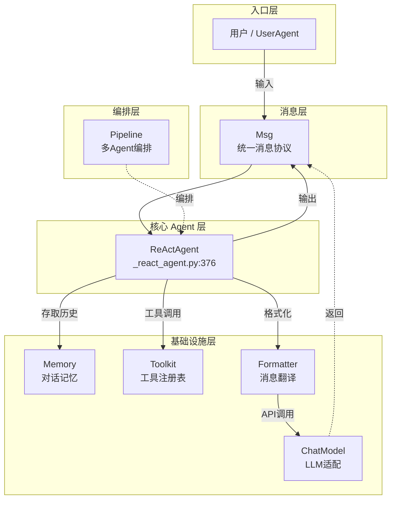

# 核心概念速览

> **Level 3**: 理解模块边界  
> **前置要求**: [运行第一个 Agent](./01-first-agent.md)  
> **后续章节**: [消息系统](../02-message-system/02-msg-basics.md)

---

## 学习目标

学完之后，你能：
- 说出 AgentScope 的 7 个核心概念及其关系
- 画出概念之间的依赖图
- 知道每个概念对应的源码目录
- 理解为什么每个概念以当前方式设计

---

## 背景问题

当你阅读 AgentScope 源码或文档时，会不断遇到这些词：**Msg, Agent, Model, Formatter, Toolkit, Memory, Pipeline**。

本章用**一句话 + 一段代码**让你理解每个概念是什么、为什么这么设计、和别的概念怎么协作。

---

## 7 个核心概念

### 1. Msg — 消息

> **Msg 是 AgentScope 的"通用语言"。Agent 之间、Agent 与 Model 之间、Agent 与 Tool 之间——全部通过 Msg 通信。**

```python
from agentscope.message import Msg

# 创建一条用户消息
msg = Msg(
    name="user",
    content="北京今天天气怎么样",
    role="user",
)
```

**源码入口**: `src/agentscope/message/_message_base.py:21` (`Msg.__init__`)

**为什么 Msg 是核心**: AgentScope 的所有组件通过 Msg 解耦。Agent 不关心 Model 的实现，Model 不关心 Agent 的逻辑，它们只约定 Msg 的格式。

### 2. Agent — 智能体

> **Agent 是"会思考的消息处理器"。它接收 Msg，内部执行推理-行动循环，产出新的 Msg。**

```python
from agentscope.agent import ReActAgent

agent = ReActAgent(
    name="assistant",
    sys_prompt="You are a helpful assistant.",
    model=...,
    formatter=...,
    toolkit=...,
    memory=...,
)
result = await agent(Msg("user", "你好", "user"))
```

**源码入口**: `src/agentscope/agent/_agent_base.py:30` (`AgentBase`), `src/agentscope/agent/_react_agent.py:376` (`ReActAgent.reply`)

**Agent 的层次结构**:
```
AgentBase                # 所有 Agent 的抽象基类
├── ReActAgentBase       # 增加 _reasoning / _acting 抽象
│   └── ReActAgent       # ★ 最常用：完整的 ReAct 实现
├── UserAgent            # 代表人类用户
├── A2AAgent             # A2A 协议的远端 Agent
└── RealtimeAgent        # 实时语音 Agent
```

### 3. Model — LLM 适配器

> **Model 封装了调用 LLM API 的全部细节——认证、请求格式、流式输出、错误重试。**

```python
from agentscope.model import DashScopeChatModel

model = DashScopeChatModel(
    api_key="your-key",
    model_name="qwen-max",
    stream=True,
)
response = await model(prompt, tools=[...])
```

**源码入口**: `src/agentscope/model/_model_base.py:13` (`ChatModelBase`)

**支持的模型**:
| 类 | 文件 | 模型 |
|----|------|------|
| `OpenAIChatModel` | `_openai_model.py` | GPT-4, GPT-4o 等 |
| `DashScopeChatModel` | `_dashscope_model.py` | 通义千问系列 |
| `AnthropicChatModel` | `_anthropic_model.py` | Claude 系列 |
| `GeminiChatModel` | `_gemini_model.py` | Gemini 系列 |
| `OllamaChatModel` | `_ollama_model.py` | 本地开源模型 |
| `TrinityChatModel` | `_trinity_model.py` | Trinity 模型 |

### 4. Formatter — 消息格式化器

> **Formatter 将 AgentScope 的 Msg 对象翻译成各个 LLM API 要求的格式。它是 Model 的"翻译官"。**

```python
from agentscope.formatter import DashScopeChatFormatter

formatter = DashScopeChatFormatter()
api_format = await formatter.format(
    msgs=[Msg("system", "你是助手", "system"),
          Msg("user", "你好", "user")],
)
# api_format 是 DashScope API 要求的 dict 列表
```

**源码入口**: `src/agentscope/formatter/_formatter_base.py:16` (`FormatterBase.format`)

**Formatter 和 Model 是一一配对的**: 使用 `OpenAIChatModel` 就必须用 `OpenAIChatFormatter`，否则 API 调用会失败。

### 5. Toolkit — 工具注册表

> **Toolkit 管理 Agent 可以使用的工具函数。你只需注册一个 Python 函数，框架自动生成 LLM 能理解的 JSON Schema。**

```python
from agentscope.tool import Toolkit

toolkit = Toolkit()

# 注册工具 — 只需一个函数
def get_weather(city: str) -> str:
    """查询指定城市的天气"""
    return f"{city}: 25°C, 晴"

toolkit.register_tool_function(get_weather)

# 框架自动生成 JSON Schema:
# {"name": "get_weather", "parameters": {"city": {"type": "string"}}, ...}
```

**源码入口**: `src/agentscope/tool/_toolkit.py:274` (`Toolkit.register_tool_function`)

### 6. Memory — 对话记忆

> **Memory 存储 Agent 的对话历史，提供统一的增删查接口。不同的后端实现（内存/Redis/SQL）对 Agent 透明。**

```python
from agentscope.memory import InMemoryMemory

memory = InMemoryMemory()
await memory.add(Msg("user", "你好", "user"))
history = await memory.get_memory()
# history 包含所有对话记录
```

**源码入口**: `src/agentscope/memory/_working_memory/_base.py` (`MemoryBase`)

**记忆层次**:
```
MemoryBase (工作记忆)
├── InMemoryMemory      # 内存（重启丢失）
├── RedisMemory         # Redis（持久化，分布式）
├── SQLAlchemyMemory    # 数据库（持久化，异步）
└── TableStoreMemory    # 阿里云 TableStore

LongTermMemoryBase (长期记忆)
├── Mem0LongTermMemory  # Mem0 长期记忆
└── ReMeLongTermMemory  # ReMe 长期记忆
```

### 7. Pipeline — 多 Agent 编排

> **Pipeline 控制多个 Agent 之间的消息路由和协作模式——管道、发布-订阅、条件分支。**

```python
from agentscope.pipeline import MsgHub, SequentialPipeline

# 方式 1: MsgHub 发布-订阅（Agent 自动收到彼此的消息）
async with MsgHub(participants=[agent1, agent2, agent3]):
    await agent1(msg)
    # agent2 和 agent3 自动收到 agent1 的回复

# 方式 2: SequentialPipeline 管道（A → B → C 串行）
pipeline = SequentialPipeline([agent1, agent2, agent3])
result = await pipeline(msg)
```

**源码入口**: `src/agentscope/pipeline/_msghub.py:14` (`MsgHub`), `src/agentscope/pipeline/_class.py` (`SequentialPipeline`)

---

## 概念关系全景图



**关键观察**: 
- **Msg 是所有箭头的起点和终点** — 它是最底层的通用协议
- **Agent 是所有箭头的交汇点** — 它是协调中心
- **Pipeline 是 Meta 层** — 它不处理消息内容，只控制消息路由

---

## 调用链一览

一次完整的工具调用过程：

```
await agent(Msg("user", "1+1=?", "user"))

1. Memory.add(msg)                    # 保存用户消息
2. Formatter.format(messages)         # Msg → LLM API 格式
3. Model(prompt, tools=schemas)       # 调用 LLM
   LLM 返回: ToolUseBlock("execute_python_code", {"code": "print(1+1)"})
4. Toolkit.call_tool_function(...)    # 执行 Python 代码
   工具返回: ToolResponse("2")
5. Memory.add(工具结果)               # 保存工具结果
6. Formatter.format(全部历史)          # 再次格式化
7. Model(prompt, tools=schemas)       # 再次调用 LLM
   LLM 返回: TextBlock("1+1=2")
8. return Msg("assistant", "1+1=2")  # 返回最终结果
```

---

## 工程经验

### 为什么不用 LangChain 的 Chain 抽象？

LangChain 使用 `Chain` 抽象来串联操作（`LLMChain`, `SequentialChain` 等）。AgentScope 选择不引入 Chain 概念。

**原因**:
1. Chain 的抽象层级过多，LLMChain → SimpleSequentialChain → RouterChain...，学习成本高
2. AgentScope 用 Pipeline（`SequentialPipeline`, `MsgHub`）解决同样的问题，但概念更少
3. MsgHub 的发布-订阅模型比 Chain 的串行模型更灵活

### 为什么 Formatter 和 Model 不合并为一个类？

很多框架把"格式化"和"调用"封装在同一个 Model 类里。AgentScope 选择分离。

**原因**:
1. **单一职责**: Formatter 只管格式，Model 只管调用
2. **可复用**: 同一个 Formatter 可以被多个 Agent 使用
3. **可测试**: 可以单独测试 Formatter 的输出格式，不需要实际的 API Key
4. **可替换**: 未来如果想支持新的 API 格式，只需换 Formatter，Model 不动

### 为什么不用 Pydantic 定义 ContentBlock？

`ContentBlock`（如 `TextBlock`, `ToolUseBlock`）都是用 `TypedDict` 定义的，不是 Pydantic：

```python
# _message_block.py
class TextBlock(TypedDict, total=False):
    type: Required[Literal["text"]]
    text: str
```

**原因**:
1. `TypedDict` 序列化成 JSON 更自然（就是 dict）
2. 性能更好（不需要 Pydantic 的验证开销）
3. 与 LLM API 的 JSON 格式直接对应

---

## Contributor 指南

### 新手学习顺序

按以下顺序阅读源码，每天 30 分钟，一周入门：

| 天数 | 文件 | 时间 | 内容 |
|------|------|------|------|
| Day 1 | `message/_message_base.py` | 30min | Msg 类的完整结构 |
| Day 2 | `message/_message_block.py` | 20min | ContentBlock 类型定义 |
| Day 3 | `agent/_agent_base.py` | 45min | Agent 基类 + hook 系统 |
| Day 4 | `agent/_react_agent.py:376-536` | 30min | reply() 主循环 |
| Day 5 | `tool/_toolkit.py:274-350` | 20min | 工具注册机制 |
| Day 6 | `model/_model_base.py` | 15min | Model 抽象基类 |
| Day 7 | `pipeline/_msghub.py` | 20min | 发布-订阅实现 |

### 容易混淆的术语

| 概念 | 不是 | 是 |
|------|------|-----|
| `Msg` | 不是 Model 的输入格式 | 是 AgentScope 的内部消息标准 |
| `Formatter` | 不是字符串格式化 | 是 Msg → LLM API 格式的转换器 |
| `Toolkit` | 不是单个工具 | 是工具的**注册表**（可以注册多个） |
| `Pipeline` | 不是数据处理管道 | 是 Agent 间的消息路由 |
| `Hook` | 不是 Webhook | 是 Agent 生命周期的拦截器 |

---

## 下一步

现在你对 AgentScope 有了全局认识。接下来按模块深入学习：

1. [消息系统](../02-message-system/02-msg-basics.md) — 深入 Msg 和 ContentBlock
2. [Pipeline 编排](../03-pipeline/03-pipeline-basics.md) — 理解 Agent 协作
3. [Agent 架构](../04-agent-architecture/04-agent-base.md) — 深入 Agent 内部


---

## 工程现实与架构问题

### 技术债 (概念层)

| 位置 | 问题 | 影响 | 优先级 |
|------|------|------|--------|
| 概念命名 | `Pipeline` 与传统 data pipeline 混淆 | 初学者理解偏差 | 低 |
| `Hook` vs `Listener` | 两种回调机制并存 | 难以选择何时用哪个 | 中 |
| Msg.role | 与 OpenAI API 不完全一致 | 从 OpenAI 迁移时需要转换 | 中 |

**[HISTORICAL INFERENCE]**: Hook 和 Listener 是不同阶段引入的机制，未能统一。Msg.role 与 OpenAI 的差异是早期设计决策，修正需要破坏兼容性。

### 性能考量

```python
# 概念层的性能影响
Hook 调用开销:        ~0.1-0.5ms (轻量)
Listener 通知开销:    ~1-5ms (取决于监听者数量)
```

### 渐进式重构方案

```python
# 方案: 统一回调机制
class UnifiedCallback:
    """替代 Hook + Listener 的统一回调系统"""
    BEFORE_REASONING = "before_reasoning"
    AFTER_REASONING = "after_reasoning"
    ON_TOOL_CALL = "on_tool_call"
    ON_ERROR = "on_error"
```

