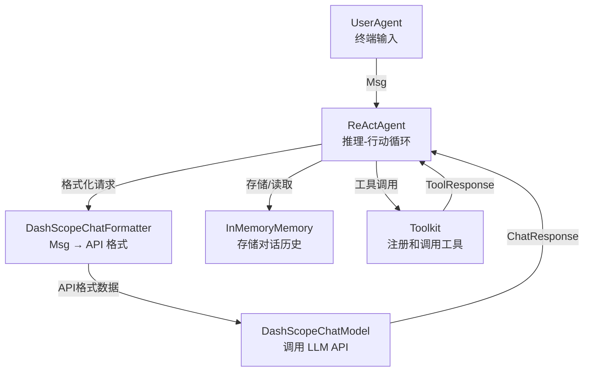

# 5 分钟运行第一个 Agent

> **Level 2**: 能运行项目  
> **前置要求**: [环境搭建](./01-installation.md)  
> **后续章节**: [核心概念速览](./01-concepts.md)

---

## 学习目标

学完之后，你能：
- 用不到 30 行代码创建一个能调用工具的 ReAct Agent
- 理解代码中每个组件的职责
- 修改 Agent 的系统提示词和行为
- 运行官方的 ReActAgent 示例

---

## 背景问题

新手面对 AgentScope 的第一个问题总是："最小可运行的 Agent 需要多少行代码？"

答案是：**约 25 行**。你需要准备 5 个核心组件：

1. **Model** — 要用哪个 LLM（模型名 + API Key）
2. **Formatter** — 如何把消息翻译给这个 LLM
3. **Memory** — 对话历史存在哪里
4. **Toolkit** — Agent 可以使用哪些工具
5. **Agent** — 把以上 4 个组件组装起来

---

## 源码入口

本教程基于官方示例：

| 项目 | 值 |
|------|-----|
| **示例文件** | `examples/agent/react_agent/main.py` |
| **核心类** | `ReActAgent`, `DashScopeChatModel`, `DashScopeChatFormatter`, `Toolkit`, `InMemoryMemory` |

---

## 先跑起来

### 完整可运行代码

以下代码直接来自 `examples/agent/react_agent/main.py`（精简版）：

```python
import asyncio
import os

from agentscope.agent import ReActAgent, UserAgent
from agentscope.formatter import DashScopeChatFormatter
from agentscope.memory import InMemoryMemory
from agentscope.model import DashScopeChatModel
from agentscope.tool import Toolkit, execute_shell_command, execute_python_code

async def main() -> None:
    # 步骤 1: 准备工具
    toolkit = Toolkit()
    toolkit.register_tool_function(execute_shell_command)
    toolkit.register_tool_function(execute_python_code)

    # 步骤 2: 创建 Agent（组装所有组件）
    agent = ReActAgent(
        name="Friday",
        sys_prompt="You are a helpful assistant named Friday.",
        model=DashScopeChatModel(
            api_key=os.environ.get("DASHSCOPE_API_KEY"),
            model_name="qwen-max",
            stream=True,
        ),
        formatter=DashScopeChatFormatter(),
        toolkit=toolkit,
        memory=InMemoryMemory(),
    )

    # 步骤 3: 创建用户 Agent
    user = UserAgent("User")

    # 步骤 4: 对话循环
    msg = None
    while True:
        msg = await user(msg)          # 用户输入
        if msg.get_text_content() == "exit":
            break
        msg = await agent(msg)         # Agent 回复

asyncio.run(main())
```

### 换用 OpenAI

如果你想用 OpenAI 而不是 DashScope：

```python
from agentscope.model import OpenAIChatModel
from agentscope.formatter import OpenAIChatFormatter

agent = ReActAgent(
    name="assistant",
    sys_prompt="You are a helpful assistant.",
    model=OpenAIChatModel(
        api_key=os.environ.get("OPENAI_API_KEY"),
        model_name="gpt-4o",
        stream=True,
    ),
    formatter=OpenAIChatFormatter(),
    toolkit=Toolkit(),
    memory=InMemoryMemory(),
)
```

---

## 代码逐段分析

### 1. Toolkit 初始化

```python
toolkit = Toolkit()
toolkit.register_tool_function(execute_shell_command)
toolkit.register_tool_function(execute_python_code)
```

`Toolkit` 是工具的**注册表**。你通过 `register_tool_function()` 告诉 AgentScope："我的 Agent 可以使用这些函数"。

`execute_shell_command` 和 `execute_python_code` 是 AgentScope 内置的工具函数，分别用于执行 Shell 命令和 Python 代码。

**源码中的注册过程** (`src/agentscope/tool/_toolkit.py:274`):
- 解析函数的类型签名
- 从 docstring 提取参数描述
- 生成 JSON Schema（给 LLM 看的工具说明书）
- 存储到 `toolkit.tools` 字典中

### 2. ReActAgent 创建

```python
agent = ReActAgent(
    name="Friday",             # Agent 的名字，会显示在日志中
    sys_prompt="...",          # 系统提示词
    model=DashScopeChatModel(  # 要调用的 LLM
        model_name="qwen-max",
        stream=True,
    ),
    formatter=DashScopeChatFormatter(),  # Msg → LLM API 格式
    toolkit=toolkit,           # 可用工具
    memory=InMemoryMemory(),   # 对话记忆
)
```

每个参数的含义：

| 参数 | 类型 | 对应源码文件 | 说明 |
|------|------|-----------|------|
| `name` | `str` | `_agent_base.py:144` | Agent 唯一标识 |
| `sys_prompt` | `str` | `_react_agent.py` | 系统提示词 |
| `model` | `ChatModelBase` | `model/_model_base.py` | LLM 适配器 |
| `formatter` | `FormatterBase` | `formatter/_formatter_base.py` | 格式转换器 |
| `toolkit` | `Toolkit` | `tool/_toolkit.py` | 工具注册表 |
| `memory` | `MemoryBase` | `memory/_working_memory/_base.py` | 对话记忆 |

### 3. `await agent(msg)` 发生了什么？

当你执行 `msg = await agent(msg)` 时，完整调用链：

```
AgentBase.__call__()                        # _agent_base.py:448
└── ReActAgent.reply(msg)                  # _react_agent.py:376
    ├── memory.add(msg)                    # 保存用户消息
    ├── _reasoning()                       # 格式化 → 调 LLM → 获取响应
    │   ├── formatter.format(messages)     # Msg → OpenAI/DashScope 格式
    │   └── model(prompt, tools=...)       # 调用 LLM API
    └── _acting(tool_call)                 # 如果 LLM 要求调工具
        └── toolkit.call_tool_function()   # 执行工具
```

详见 [核心数据流](../00-architecture-overview/00-data-flow.md)。

### 4. UserAgent 的作用

```python
user = UserAgent("User")
msg = await user(msg)  # 等待用户在终端输入
```

`UserAgent` 是 AgentScope 中**代表人类用户**的 Agent。它不调用 LLM，而是等待终端输入（或 Studio Web 界面的输入）。

---

## 架构定位

### 5 个核心组件的协作关系



### 消息流动

```
用户输入 "1+1等于几？"
  │
  ▼ Msg(name="User", content="1+1等于几？", role="user")
  │
  ▼ ReActAgent.reply()
  │   ├── memory.add(msg)           # 保存消息
  │   ├── formatter.format(...)     # 转为 DashScope API 格式
  │   ├── model(prompt, tools=...)  # 调用 qwen-max
  │   │   返回: TextBlock("1+1等于2")
  │   └── 返回 Msg("Friday", "1+1等于2", "assistant")
  │
  ▼ 控制台输出: "Friday: 1+1等于2"
```

---

## 工程经验

### 为什么 Agent 的调用是 `await agent(msg)` 而不是 `agent.run(msg)`？

AgentScope 选择让 Agent 实例本身可被 `await` 调用，通过实现 `__call__` 方法（`_agent_base.py:448`）：

```python
result = await agent(msg)  # 等同于 await agent.__call__(msg)
```

**设计原因**:
1. **简洁**: 不需要 `agent.run()` / `agent.invoke()` 之类的方法名
2. **Python 惯例**: `obj()` 是"对这个对象执行其主要操作"的 Pythonic 表达
3. **与 LangChain 对比**: LangChain 使用 `chain.invoke()`，AgentScope 更简洁

### 为什么必须用 `asyncio.run()`？

AgentScope 的 Agent 全部是**异步**的。`asyncio.run()` 是 Python 提供的同步入口，将异步代码桥接到同步世界：

```python
asyncio.run(main())  # 创建事件循环，运行 main()，等待完成
```

在已有的异步应用中（如 FastAPI），你可以直接 `await agent(msg)`，不需要 `asyncio.run()`。

### 为什么 Model 和 Formatter 必须配对？

`DashScopeChatModel` 必须配合 `DashScopeChatFormatter`，`OpenAIChatModel` 配合 `OpenAIChatFormatter`。如果混用，会导致 API 调用失败。

这是因为不同 LLM 的 API 格式不同：
- OpenAI 用 `{"role": "user", "content": "..."}`
- DashScope 用 `{"role": "user", "content": "..."}`（类似但不完全相同）
- Anthropic 用 `{"role": "user", "content": [{"type": "text", "text": "..."}]}`

Formatter 的职责就是屏蔽这些差异。

---

## Contributor 指南

### 你的第一个修改：换一个系统提示词

最简单的修改是改系统提示词（`sys_prompt`）：

```python
# 原来
sys_prompt="You are a helpful assistant named Friday."

# 改后 — 观察 Agent 行为变化
sys_prompt="你是一个中文助手，用中文回答所有问题。你的名字是小五。"
```

**验证方法**: 运行后和 Agent 对话，确认它使用了中文和你设定的名字。

### 添加一个新工具

```python
# 定义你的工具函数
def get_current_time() -> str:
    """获取当前时间"""
    from datetime import datetime
    return datetime.now().strftime("%Y-%m-%d %H:%M:%S")

# 注册到 toolkit
toolkit.register_tool_function(get_current_time)

# 现在 Agent 可以回答 "现在几点" 了
```

### 调试技巧

```python
import agentscope
agentscope.init(logging_level="DEBUG")  # 开启详细日志

# 现在运行 Agent，你可以看到每一步的详细信息：
# - formatter.format() 的输入和输出
# - model() 的请求和响应
# - toolkit.call_tool_function() 的执行过程
```

---

## 下一步

现在你有了一个能运行的基础 Agent。接下来阅读 [核心概念速览](./01-concepts.md) 建立完整的知识地图。


---

## 工程现实与架构问题

### 技术债 (入门示例)

| 位置 | 问题 | 影响 | 优先级 |
|------|------|------|--------|
| 示例代码 | 使用硬编码 API Key | 安全风险，初学者可能直接提交到 GitHub | 高 |
| `agentscope.init()` | 缺少 API Key 验证 | 运行时错误信息不明确 | 中 |
| 示例 | 无错误处理 | 网络波动时示例会直接崩溃 | 中 |

**[HISTORICAL INFERENCE]**: 示例代码优先简单性而非安全性。硬编码 API Key 是为了降低入门门槛，但埋下了安全隐患。

### 性能考量

```python
# 首次运行延迟
agentscope.init():             ~100-200ms
model 首次调用:               ~500-2000ms (包含连接建立)

# 后续调用延迟
model 调用:                   ~200-1000ms (取决于模型)
```

### 渐进式重构方案

```python
# 方案: 添加 API Key 验证
def validate_api_key():
    api_key = os.environ.get("DASHSCOPE_API_KEY")
    if not api_key:
        raise EnvironmentError(
            "DASHSCOPE_API_KEY is not set. "
            "Please set it before running: export DASHSCOPE_API_KEY=your-key"
        )
    return api_key

async def main():
    validate_api_key()  # 提前失败
    # ... rest of code
```

